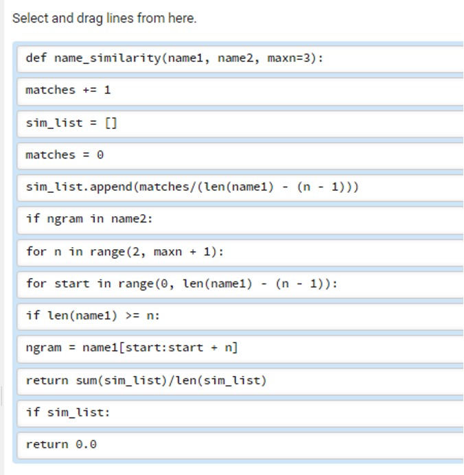
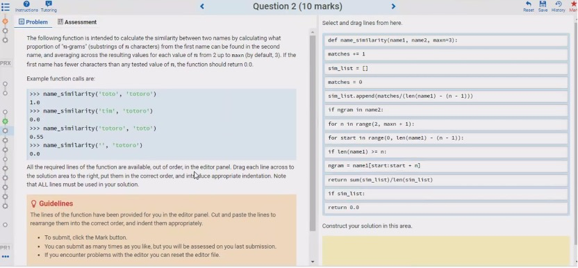

## Question1

Construct a **single** Python expression which evaluates to the following values, and incorporates the specified operations in each case (executed in any order).

> 构造一个 Python 表达式，求值为以下值，并在每种情况下合并指定的操作(以任何顺序执行)。

**(a) Output value: 'grin'**

Required operations:

> 要求操作:

1. string slicing

> 字符串分割

2. string indexing

> 字符串索引

**(b) Output value: True**

Required operations:

1. range() function

2. in

**(c) Output value: 2**

Required operations:

1. (float) division

2. integer division

**(d) Output value: 0**

Required operations:

1. dictionary lookup

> 字典查找

2. .pop() method

3. list indexing

**(e) Output value:  'ace'**

Required operations:

1. items method

2. list indexing

3. tuple indexing

## Question 2

The following function is intended to calculate the similarity between two names by calculating what proportion of "n-grams" (substrings of n characters) from the first name can be found in the second name, and averaging across the resulting values for each value of n from 2 up to maxn (by default, 3). If the first name has fewer characters than any tested value of n, the function should return 0.0.

> 下面的函数旨在计算两个名称之间的相似度，方法是计算第一个名称的“n-grams”(n个字符的子字符串)在第二个名称中所占的比例，并对n从2到maxn(默认为3)的每个值的结果值进行平均。如果第一个名称的字符数少于n的任何测试值，函数应该返回0.0。

Example function calls are:

```python
>>> name_similarity('toto', 'totoro')
1.0
>>> name_similarity('tim', 'totoro')
0.0
>>> name_similarity('totoro', 'toto')
0.55
>>> name_similarity('', 'totoro')
0.0
```

All the required lines of the function are available, out of order, in the editor panel. Drag each line across to the solution area to the right, put them in the correct order, and introduce appropriate indentation. Note that ALL lines must be used in your solution.

> 在编辑器面板中，函数所需的所有行都是可用的，但顺序不同。将每一行拖到解决方案区域的右侧，将它们按正确的顺序排列，并引入适当的缩进。注意，解决方案中必须使用ALL行。






## Question3

变成 while loop

```python
SUIT = 1
BLACK = 0
RED = 1

SUIT_COLOURS = {'S': BLACK,
                'H': RED,
                'D': RED,
                'C': BLACK}


def same_colour(cards):
    for i in range(len(cards)):
        if i == 0:
            colour = SUIT_COLOURS[cards[i][SUIT]]
        elif SUIT_COLOURS[cards[i][SUIT]] != colour:
            return False
    return True
```


## Question 4

Sandy has enrolled in a Bachelor of Magical Arts. In order to graduate, they must complete the subject WIZ90001 Advanced Wizardry. However, this subject has a number of prerequisites, each of which must be completed before they can take WIZ90001. Each of those subjects in turn may have its own prerequisites, and so on.

> 桑迪已经注册了魔法艺术学士学位。为了毕业，他们必须完成 WIZ90001 高级魔法课程。但是，本主题有许多先决条件，在学习WIZ90001之前必须完成每一个先决条件。这些学科中的每一门都可能有自己的先决条件，以此类推。

Given a particular list of prerequisite requirements, the function `wiz_study_length(prereq_list, final='WIZ90001')` is intended to calculate the minimum number of semesters it will take Sandy to graduate. The arguments are:

> 给定一个特定的先决条件要求列表，函数 `wiz_study_length(prereq_list, final='WIZ90001')` 用于计算 Sandy 毕业所需的最小学期数。的参数是:

- `prereq_list` , a list of `(subject, prerequisite)` tuples specifying that prerequisite must be completed before     enrolling in subject. Note that a subject may have more than one     prerequisite.

> Prereq_list，一个(subject，prerequisite)元组列表，指定在注册 subject 之前必须完成先决条件。注意，一个主题可能有多个先决条件。

- final, the target subject to     complete, with a default value of 'WIZ90001'.

> final 是要完成的目标主题，默认值为'WIZ90001'。

Any subject that appears as a prerequisite in a prereq_list tuple but does not appear as a subject can be assumed to have no prerequisites. Furthermore, we assume that Sandy has capacity to take as many subjects as required each semester, as long as they have completed their prerequisites.

> 在 prereq_list 元组中作为先决条件出现但不作为主题出现的任何主题都可以假定为没有先决条件。此外，我们假设Sandy有能力每学期选修要求的课程，只要他们完成了他们的先决条件。

For example:

```python
>>> wiz_study_length([('WIZ90001', 'WIZ40027'), ('WIZ90001', 'WIZ20003')])
2
```

Here, both WIZ40027 and WIZ20003 are prerequisites of WIZ90001, and so must be completed before studying WIZ90001. Neither of these two subjects have any prerequisites. Therefore it will take two semesters of study for Sandy to graduate

> 在这里，WIZ40027 和 WIZ20003 都是 WIZ90001 的先决条件，因此在学习 WIZ90001 之前必须完成。这两个科目都没有任何先决条件。因此，桑迪需要两个学期的学习才能毕业

```python
>>> wiz_study_length([('WIZ90001', 'WIZ40027'), ('WIZ90001', 'WIZ20003'), 
                      ('WIZ40027', 'WIZ30015'), ('WIZ20003', 'WIZ20001'), 
                      ('WIZ20003', 'WIZ10015'), ('WIZ20001', 'WIZ10001')])
4
```

In this case, it will take 4 semesters for Sandy graduate, due to the prerequisite chain: WIZ10001 -> WIZ20001 -> WIZ20003 -> WIZ90001.

> 在这种情况下，Sandy毕业需要4个学期，因为先决条件链:WIZ10001 -&gt;WIZ20001→WIZ20003→WIZ90001。

```python
•	from collections import defaultdict
•	semesters = 0; cur_prereqs = [final]
•	prereqs = defaultdict(list)
•	for subject in prereq_list:
•	cur_prereqs = new_prereqs; semesters += 1
•	prereqs[subject[0]].append(subject[1])
•	def wiz_study_length(prereq_list, final='WIZ90001'):
•	for subject in cur_prereqs:
•	new_prereqs += prereqs[subject]
•	if subject in prereqs:
•	while cur_prereqs:
•	new_prereqs = []
•	return semesters
```


## Question 5

A school of minnows swims in the sea. Sharks eat minnows, according to the following strict rules. Sharks swim, one at a time, from left to right and eat each minnow they encounter, starting at the height of the first minnow that remains uneaten. Each time a shark eats a minnow it gets heavier and sinks one metre lower in the water. Once a shark reaches the sea floor, it is no longer able to eat minnows.

> 一群小鱼在海里游泳。鲨鱼吃鲦鱼，要遵守以下严格的规则。鲨鱼一次游一条，从左到右，吃掉它们遇到的每一条鲦鱼，从第一条没有被吃掉的鱼的高度开始。鲨鱼每吃一条鲦鱼就会变重，沉入水下一米。一旦鲨鱼到达海底，它就不能再吃鲦鱼了。

For example, minnows are located at the following heights (in metres) above the sea floor (e.g. a height of 3 indicates that the minnow is 3m above the sea floor) in sequence, left to right:

> 例如，米诺鱼位于以下高度(以米为单位)(例如，高度为3表示米诺鱼位于海平面以上3米)，从左到右依次为:

`[4, 3, 1, 2, 4]`

The first shark will start at height 4 and eat the minnow at that height (element 0), then sink to height 3 where it will eat the second minnow (element 1), and sink to height 2. It will pass above the third minnow (because it is at a lower height), before eating the fourth minnow (element 3) at height 2, and passing under the final minnow (element 4). At this point, the following minnows will remain:

> 第一条鲨鱼从高度4开始，吃掉这个高度的米诺鱼(元素0)，然后沉到高度3，再吃第二条米诺鱼(元素1)，沉到高度2。它会从第三条米诺鱼的上方经过(因为它的高度较低)，然后在高度为2的地方吃掉第4条米诺鱼(元素3)，并从最后一条米诺鱼(元素4)的下方经过。此时，以下几条米诺鱼将继续存在:

`[None, None, 1, None, 4]`

The second shark will start at height 1 and eat the minnow at that height (element 2), then sink to the sea floor (height 0) and eat no further minnows. This will result in the following minnows:

> 第二条鲨鱼从1的高度开始吃米诺鱼(元素2)，然后沉到海底(高度0)，不再吃米诺鱼。这将导致以下小鱼:

`[None, None, None, None, 4]`

The third shark will start at height 4 and eat the minnow at that height (element 4), after which no minnows will remain.

> 第三条鲨鱼会从高度4开始，吃掉这个高度的米诺鱼(元素4)，之后就没有米诺鱼了。

The function sharks_minnows(minnows, sharks) is intended to determine whether a given number of sharks will be sufficient to eat all of the minnows in the sea, positioned based on minnows. The function takes the following parameters:

> 函数sharks_minnows(minnows，鲨鱼)的目的是确定给定数量的鲨鱼是否足以吃掉海里所有的minnows，根据minnows定位。该函数接受以下参数:

- minnows, a list of positive integers indicating the height of each minnow, as in the example above.

> Minnows，一个正整数列表，表示每条鲦鱼的高度，如上例所示。

- sharks, a positive integer number of sharks.

> 鲨鱼的数量是正整数。

The function should return True if the specified number of sharks is sufficient to eat all the minnows, and False otherwise.

> 如果指定的鲨鱼数量足够吃掉所有的鲦鱼，函数应该返回True，否则返回False。

```python
def sharks_minnows(minnows, sharks):
    shark_count = 0
    minnow_count = len(minnows)
    for i in range(minnow_count):
        curr_shark_height = minnows[i]
        if curr_shark_height is not None:
            minnows[i] = None
            for j in range(i + 1, minnow_count):
                if minnows[j] == curr_shark_height:
                    minnows[j] = None
                    curr_shark_height -= 1
            shark_count += 1
    return shark_count <= sharks
```

The provided code is imperfect, in that it sometimes returns `True` when it should return `False`, and sometimes returns `False` when it should return `True`.

> 所提供的代码是不完美的，因为它有时在应该返回' False '时返回' True '，有时在应该返回' True '时返回' False '。

(a) Provide an example of a function call where the provided code will correctly return `True` (i.e. a True Positive)

> 提供一个函数调用的例子，其中所提供的代码将正确返回' True '(即True Positive)

(b) Provide an example of a function call where the provided code will correctly return `False` (i.e. a True Negative)

> 提供一个函数调用的例子，其中所提供的代码将正确返回' False '(即True Negative)

(c) Provide an example of a function call where the provided code will *incorrectly* return `True` (i.e. a False Positive)

> 提供一个函数调用的例子，其中提供的代码将*错误地*返回' True '(即假阳性)

(d) Provide an example of a function call where the provided code will *incorrectly* return `False` (i.e. a False Negative)

> 提供一个函数调用的例子，其中提供的代码将*错误地*返回' False '(即假阴性)


## Question 6

Construct a **single** Python expression which evaluates to the following values, and incorporates the specified operations in each case (executed in any order).

> 构造一个 Python 表达式，求值为以下值，并在每种情况下合并指定的操作(以任何顺序执行)。

**(a) Output value: 'eeezy'**

Required operations:

1. string indexing

2. `*`

**(b) Output value: True**

Required operations:

1. in

2. `range()`

**(c) Output value: '100% pythonic'**

Required operations:

1. `f-string`

2. `/`

**(d) Output value: 'comp10001'**

Required operations:

1. tuple indexing

2. dictionary lookup

3. `.lower()`

**(e) Output value: '42'**

Required operations:

1. list indexing

2. `.keys()`

3. string slicing

## Question 7

The following function is meant to take a lowercase string as input and return a reordered version of that string in which all of the vowels appear first (in the order in which they appear in the original string), followed by all of the consonants (again, in the order in which they appear in the original string), discarding any non-alphabetic characters in the process.

> 下面的函数将接受一个小写字符串作为输入，并返回该字符串的重新排序版本，其中所有元音都在前面出现(按照它们在原始字符串中出现的顺序)，然后是所有辅音(同样，按照它们在原始字符串中出现的顺序)，在此过程中丢弃所有非字母字符。

For example:

```python
>>> reorder('stay at home')
'aaoestythm'
>>> reorder('the cat in the hat')
'eaieathctnthht'
>>> reorder('rhythm')
'rhythm'
```

However, there are several errors in the given function definition.

> 然而，在给定的函数定义中有几个错误。

Identify **exactly** three (3) errors and specify: (a) the line number where the error occurs; (b) the type of error, as *syntax*, *run-time*, or logic; and (c) how you would fix each error, in the form of the corrected (single) line of code.

> 准确识别 三(3)个错误，并指定:(a)错误发生的行号;(b)错误类型，如*语法*、*运行时*或逻辑;和(c)你将如何修复每个错误，以纠正的(单行)代码的形式。

```python
def reorder(my_string):               #  1
    v_list = list(aeiou)              #  2
    vowels = []                       #  3
    consonants = []                   #  4
    for c in my_string:               #  5
        if c not in v_list:           #  6
            vowels.append(c)          #  7
        else c:isalpha():             #  8
            consonants.append(c)      #  9
    return join(vowels + consonants)  # 10
```

找出三个错误并说出是那种错误（as syntax, run-time, or logic）并且改正


欢迎关注我公众号：AI悦创，有更多更好玩的等你发现！

::: details 公众号：AI悦创【二维码】


:::

::: info AI悦创·编程一对一

AI悦创·推出辅导班啦，包括「Python 语言辅导班、C++ 辅导班、java 辅导班、算法/数据结构辅导班、少儿编程、pygame 游戏开发」，全部都是一对一教学：一对一辅导 + 一对一答疑 + 布置作业 + 项目实践等。当然，还有线下线上摄影课程、Photoshop、Premiere 一对一教学、QQ、微信在线，随时响应！微信：Jiabcdefh

C++ 信息奥赛题解，长期更新！长期招收一对一中小学信息奥赛集训，莆田、厦门地区有机会线下上门，其他地区线上。微信：Jiabcdefh

方法一：[QQ](http://wpa.qq.com/msgrd?v=3&uin=1432803776&site=qq&menu=yes)

方法二：微信：Jiabcdefh

:::


