<audio id="audio" controls="" preload="none">
      <source id="mp3" src="/零基础实战机器学习/02.mp3">
</audio>

你好，我是黄佳。

欢迎来到零基础实战机器学习。工欲善其事，必先利其器，好的环境让我们事半功倍。今天我要讲的就是怎么来搭建机器学习运行的环境。

你也许听说过机器学习项目对配置要求高，硬件上需要带 GPU 的显卡，软件上面需要在 Server 中搭建 PyTorch 和 TensorFlow 2.0 什么的。这些东西是不是听起来就挺麻烦的。

其实没有那么复杂。我觉得对于初学者来说，你不必过于纠结上面的工具。我们只是要进行一些简单的实战项目。而这些简单的项目，在本机上完全可以跑通。所以我建议你就用你手头上的笔记本电脑，装个 Jupyter Notebook 就足够了。

你听到这可能会想问什么是 Jupyter Notebook 呀？你可以把它想象成一个类似于网页的多媒体文档，但是，比普通网页更高一筹的是，它还能直接通过浏览器运行代码块，在代码块下方展示运行结果，就像下图中这样：

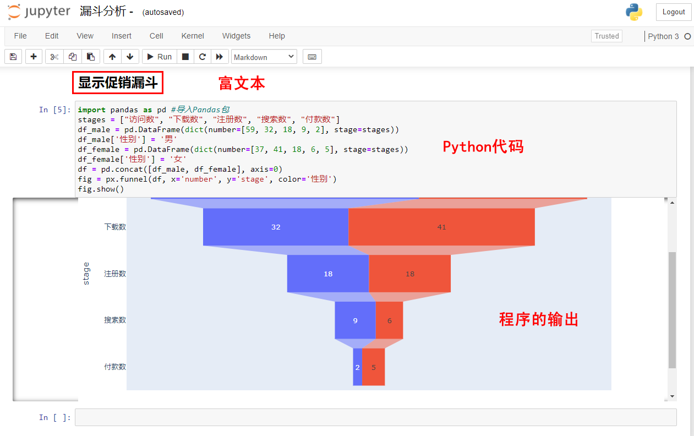

Jupyter Notebook 可以交互式开发，再加上拥有富文本格式，可以显示图文，非常直观，所以它能迅速地展现数据分析师的想法，是我们上手机器学习的最佳工具。

选好了工具之后，我们还得确定要用什么语言。我们课程选的是 Python，所有源代码都是用 Python 实现的。之所以选 Python 是因为 Python 在 AI 开发中是最常用的语言了，而且 Python 非常简单，只要你稍微有些编程方面的基础知识，就能看懂我们的代码。而我们推荐使用的工具 Jupyter Notebook 可以支持多种语言，其中就包括 Python。

在这一讲，我会带着你把 Jupyter Notebook 安装好，并把其中的 Python 程序跑起来。这个 Python 程序，我不会带着你跑 Hello World，那个太过于简单了，我会带着你画个图，让你了解一下 Jupyter Notebook 的运行过程，方便你之后上手用它。


## 安装和启动 Jupyter Notebook

要在本机搭建 Jupyter Notebook 平台进行机器学习项目，有一种最简单的方法，就是下载并安装 Anaconda。Anaconda 是一个免费的开发环境，能帮你管理众多的 Python 库，并支持 Jupyter Notebook、JupyterLab、Spyder 等工具。

Python + Anaconda + Jupyter Notebook 这三样东西加在一起，基本上就是机器学习工程师的标配。如果你还是对这哥仨的关系不太明白，可以看看下面的图：


虽然我说了我们需要的是这哥仨，但是别紧张，其实你只需要安装 Anaconda 就行啦，剩下的两样是 Anaconda 打包自带的。

Anaconda 的安装其实非常简单。首先，我们到 [Anaconda](https://www.anaconda.com/products/distribution) 官网下载最新的个人版本。对于我们初学者来说，个人版本就够用了。选择好适合本机电脑系统的版本下载后，我们直接选择所有的默认选项就行了。Anaconda 是跨平台的，Windows，Linux，Mac OS 上都可以装。

成功安装之后，我们就可以在 Anaconda 中启动 Jupyter Notebook 了。启动 Jupyter Notebook 有两种方法：你可以直接 Anaconda 初始界面里启动它；也可以在开始菜单栏的 Anaconda3 目录中找到 Jupyter Notebook 来启动它。这两种启动如下图所示：

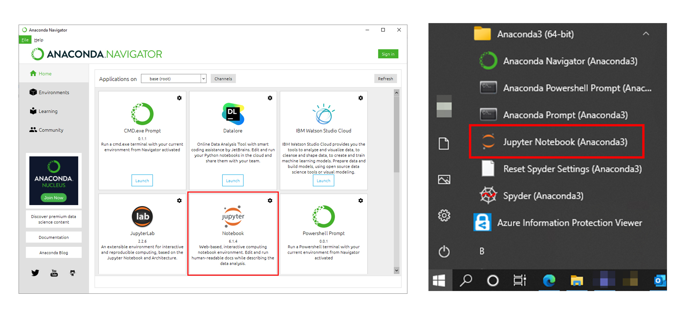

在上面这两种启动方式中，我推荐第二种方法。因为直接启动 Jupyter Notebook 可以占用较少系统资源，因此启动起来也比较快。

Jupyter Notebook 是我们课程的主要编辑工具。你初次接触它，可能对它还比较陌生。没关系，接下来，我会通过画一个图，来给你讲讲 Jupyter Notebook 是怎么运行的。其中涉及的一些操作和工具，我们会在后续的项目中频繁使用。


## 实战 Jupyter Notebook

我想带你画的图是这样一个漏斗图：


“漏斗图”听起来好像有点专业，但它其实就是一个呈现用户流失情况的图。上面这个图的最上面一层，展现的是有多少人浏览这个网页，接下来的几层分别展示的是有多少人下载这个 App、注册 App、搜索商品、下单购买鲜花。每层的人数是我们早就统计好的。

如果你没听懂漏斗图是做什么的，其实没关系。我们是想通过画这个图来学习怎么使用 Jupyter Notebook 的，所以你只要知道我们是要通过一些已知数据来画这个图的就行了。

**那么怎么画出这个漏斗？**

你可能会觉得我们需要写很复杂的代码，去定义这个漏斗绘图的规则。其实是不用的。因为我们用的是 Python，而 Python 的一大特点就是可以通过 import 语句导入各种各样的包和模块，来帮助我们用他人已经整理好的函数、方法和算法解决问题。Python 里已经有画图的包了，我们直接调用就好了。

所以画漏斗图听起来很复杂，但总结起来就三步：先安装一个可以画漏斗图的包，然后导入它，最后把数据放到这个包里运行就行啦。而在这个过程中，我想教你的是怎么安装包，调用包。这些都是我们未来会常常用到的操作。

当然了，在做任何项目之前，你都需要新建一个 Notebook（这里我们就把 Jupyter Notebook 文件简称为 Notebook 吧）。所以我们先来看看怎么新建 Notebook。

新建 Notebook 很简单，启动 Jupyter Notebook 后，在你的默认浏览器（我用的是 Chrome）中就会显示本机默认目录页面，就像下图中这样，选择任意一个你想放 Notebook 的目录，就可以新建了。


除了新建自己的 Notebook，你也可以把我在创建的 [Notebook](/零基础实战机器学习/data/漏斗分析.ipynb)，也就是后缀名为 ipynb 的文件下载下来，直接修改它。

接下来，我们正式开始画图，我们的第一步就是安装可以画漏斗的包。这里我们选择的包是 plotly，它是一个数据可视化工具包，里面含有漏斗图的绘制工具。在 Anaconda 中，很多机器学习相关的工具包都是预装好了的，但是 Plotly 不在其中，所以需要我们手动安装下。那具体怎么安装呢？pip install 是我们会经常使用的包安装语句：

```python
pip install plotly # 安装 Plotly 包
```

在 Jupyter Notebook 中，代码是以一个个单元格的形式组织的，所以在 Notebook 的第一个单元格中写好这个 pip install 语句后，我们选择红框中所示的 Run 按钮，就能执行这段代码了。

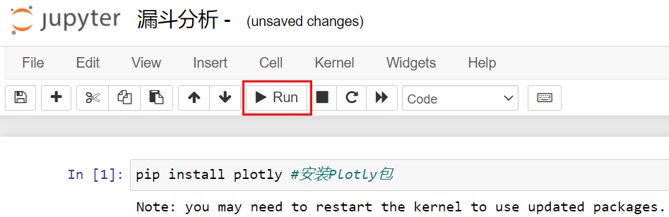

我们知道，Python 代码和输出都是一段段的，我们随时能查看每段代码的运行结果。运行这句之后，从上图的运行结果中可以看到，在我的安装语句后，输出显示这个包已经装过了，不需要重复安装。如果你是第一次用，就需要安装。那么在后续课程中，不是 Anaconda 默认预装的工具包，我都会提醒你先用 pip install 来安装。

如果你是第一次安装，下图如下：

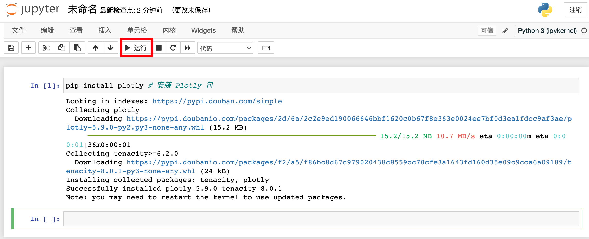

因为我们只需要安装一次，所以这个语句跑完之后，就可以在前面加一个“`#`”把它注释掉。

```python
# pip install plotly # 安装 Plotly 包
```

安装好了以后，第二步就该导入 Plotly 包了。这时候你要注意，Plotly 包里有很多模块，全部导入的话，会占用更多的内存，所以我们直接导入这里要用的模块 express。express 是个简易的绘图模块，导入它要通过 Import 语句来实现。在下面的语句中，我把 express 命名为 px：

```python
import plotly.express as px # 导入 Plotly.express 工具，命名为 px
```

再次选择 Run 按钮运行这段代码后，就会看到下图所示的情况：

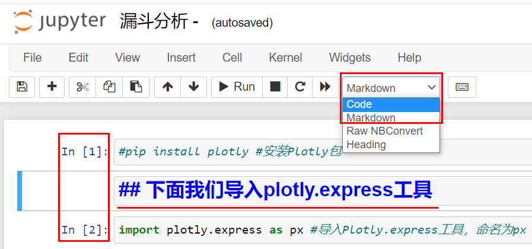

你会发现，这段代码并没有输出结果。其实只要没有报错，就说明我们成功导入了 `plotly.express` 工具。不过，你可能会问我，除了刚才的两段代码之外，Notebook 中标下划线的那一段字是怎么回事呢？

其实，这段文字是我在 Notebook 的代码之间添加的一段笔记。Jupyter Notebook 有两种主要类型单元格，选中当前单元格之后，就可以通过上图红框中的选项进行单元格类型的切换：

- Code 类型的单元格里是可执行的程序代码，它的输出会显示在本单元格下方。
- Markdown 类型的单元格里是富文本格式的内容，你可以在这随时选择添加代码的说明文字或者学习心得。

你可能会想说，那我为什么要了解它的单元格类型呢？这是因为，如果不了解单元格的类型，把一段代码不小心弄成了富文本格式，那就跑不出来结果了。这两种单元格类型你可以看看下图：

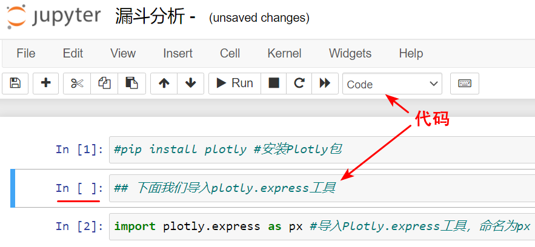

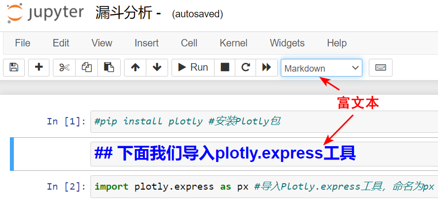

那如果你刚用 Jupyter Notebook，还是有点搞不明白你编辑的单元格是程序还是富文本的话，你看看单元格左边，**如果没有 In 字，那就是富文本了。**

如果选择命令行中的双箭头图标从头执行代码，代码会按照单元格的顺序由上至下执行。不过，我们也可以单独执行某一个单元格中的代码，因为单元格是可以反复运行的。所以，Code 类型的单元格左侧 `[ ]` 中的编号，才表示真正的执行顺序。假如我现在选择单箭头 Run 重新执行 `In [1]` 的单元格，那么这个单元格的执行顺序编号就会变为 `[3]` ，如下图所示：

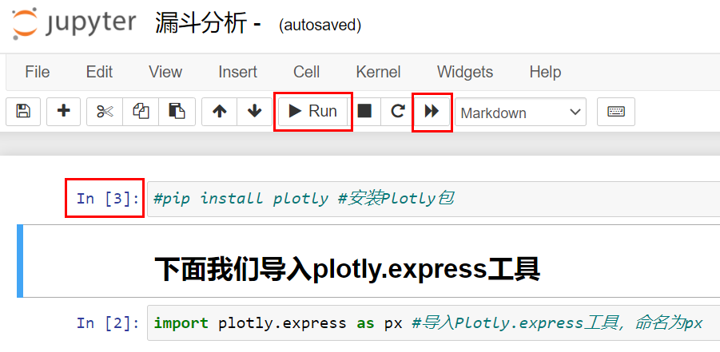

好，下面再回到我们刚才的项目。

在完成了 express 模块的导入之后，第三步，我们要开始使用刚才导入的 `plotly.express` 绘制漏斗了，就是要把我们的数据放进去运行起来。这个过程分为 3 个小步骤：建立数据、调用漏斗和显示漏斗。

下面的代码里，我创建了一个字典格式的 Python 数据对象，并且把我统计好的“访问数”、“下载数”、“注册数”、“搜索数”、“付款数”都放进了这个字典之中；然后，我用 `px.funnel` 调用漏斗工具，并把这些数据传入漏斗；最后，又用了 `fig.show` 显示漏斗。

```python
data = dict(  # 准备漏斗数据
    number=[59, 32, 18, 9, 2],
    stage=["访问数", "下载数", "注册数", "搜索数", "付款数"])
fig = px.funnel(data, x='number', y='stage')  # 把数据传进漏斗图
fig.show()  # 显示漏斗图
```

运行后输出如下：

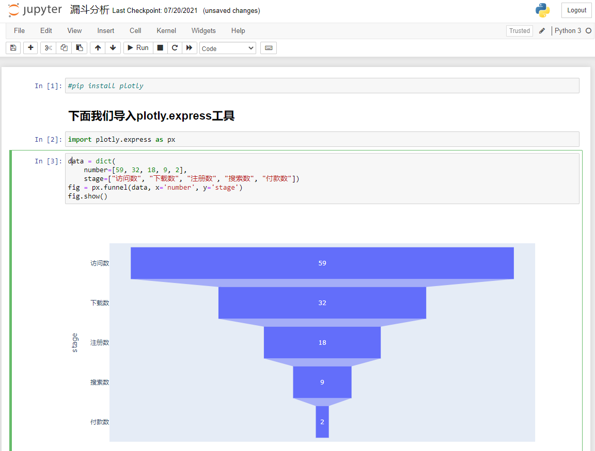

就这么简单的几行代码，就成功地把我们的数据进行了非常漂亮的可视化！别小看这个漏斗，它能够让我们看出每个环节，客户流失的多少。

比如说，你可以分析一下，为什么 18 个用户注册了 App，只有 9 个人进行了鲜花的搜索，是不是 App 的搜索页设计的不好呢？这就是漏斗图的意义，**它能启发你聚焦于某个具体的运营环节去思考。**

上面的整个过程，完全没有任何难于理解的地方。不过，如果你细心地观察上面的图片，你可能还会想问，为什么执行顺序为 `[3]` 的单元格有一个绿框呢？

这是一个很好的问题，你会看到选中一个单元格时，不仅有时边框是绿色，还有时是蓝色呢。其实这里的绿色和蓝色，代表 Jupyter Notebook 的两种输入模式。

那么为什么要有两种模式呢？简单地说，绿色编辑模式是为了写代码，而蓝色的命令模式是为了使用单元格键盘操作快捷键。你了解这两种模式后就能在之后的编程中方便地用键盘快捷键了。

比如说，在命令模式里，你可以用 M 键，把单元格就变成了 Markdown 单元格，也可以用 Y 键把它变成代码单元格。还有下面这些常用的快捷键，也只能在命令模式下使用：

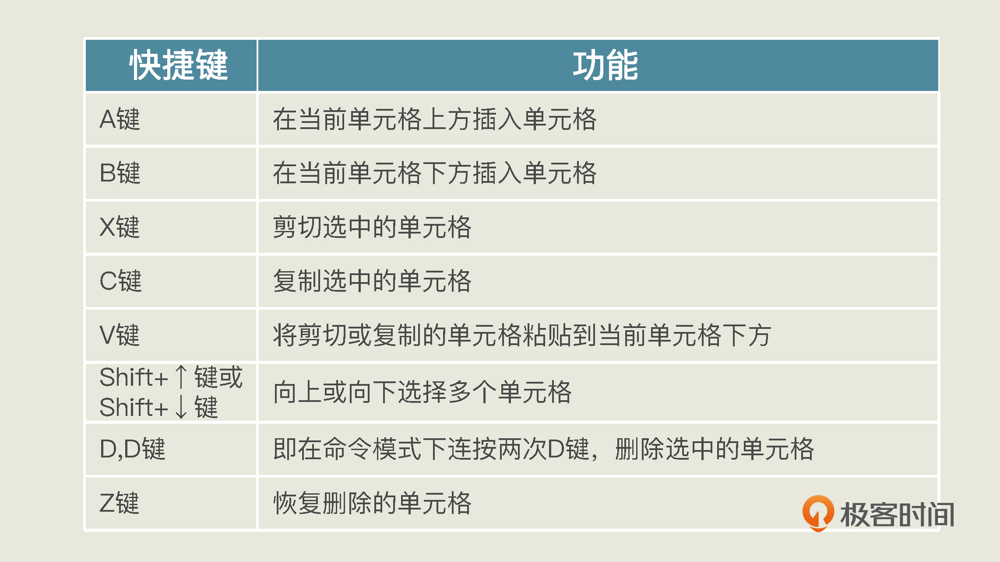

但是，也有一些在命令模式或编辑模式下都可以直接使用的快捷键：

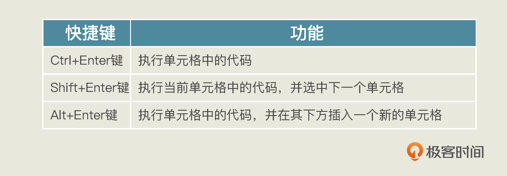

这些快捷键，你不用刻意去背，点击运行界面上的键盘图标就可以随时查询它们。这里面写着“command mode ”的快捷键就是专门在命令模式下使用的。

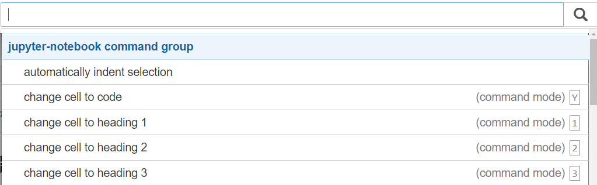

除此之外，在编辑模式下，你如果在对象后面输入点号，再按下 Tab 键，还会出现这个对象的所有 API，也就是方法和函数的列表供你选择。就像下图这样：

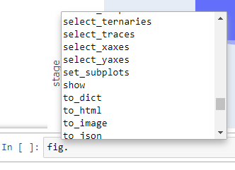

单击单元格的内部输入区域，你就可以进入编辑模式，也可以通过 Enter 键进入编辑模式。而单击单元格外侧区域或者按 Esc 键，你就可以进入命令模式了。有了这些键盘快捷键，你编辑 Notebook 的速度就会更快。


## 总结一下

好了，关于 Jupyter Notebook 的知识我就介绍到这里。今天我给你讲了 Python + Anaconda + Jupyter Notebook 这三样工具，你可以通过 Anaconda 同时安装它们。然后我带着你创建并运行了第一个 Jupyter Notebook，我带着你用 pip install 安装了 Plotly 包，import 了包中的模块，并画了个简单的漏斗图。

在使用 Jupyter Notebook 时，需要你注意单元格的类型是代码还是 Markdown 文档。运行代码时，Jupyter Notebook 会给出每个单元格的执行顺序，而且各单元格都可以反复执行。最后我还给你介绍了 Jupyter Notebook 的输入模式以及几个重要的键盘快捷键。

因为 Jupyter Notebook 很容易用，掌握了上面的内容，你就应该算得上是半个专家了，而轻量级的机器学习实战，Jupyter Notebook 完全搞得定。

当然，如果你真的接触到比较复杂的深度学习，要构建深度网络处理大量的数据的时候，你确实会需要配置要求更高的环境。不过针对这个情况，我也有个简单的解决方案。

事实上，有很多平台会给你提供这方面的工具。比如说 Kaggle 在线 Jupyter Notebook 平台，还有 Google Colaboratory，以及国内的阿里云天池实验室，就都提供 GPU 甚至 TPU 给你免费使用。所以你现在不用担心，以后学到深度学习的时候，我会带着你去撸一撸这些网站的羊毛的。


## 思考题

今天的内容超级简单，但是需要动动手，我这里给你一个小项目。我在前面画的漏斗，没有显示出性别，也就是文章开始是有男生，女生信息的那种组合型漏斗：

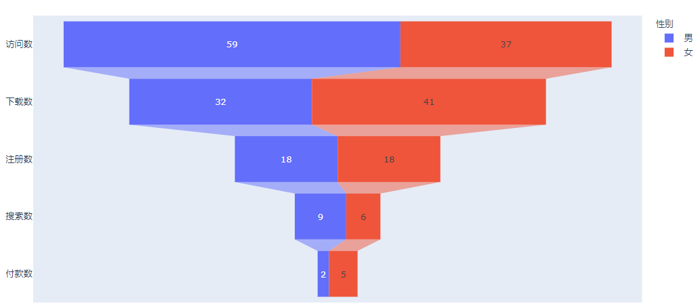

我给你准备了数据，你能不能想想怎么画出这种细分漏斗呢？

**数据：**

男生：“访问数 -30”, “下载数 -15”, “注册数 -10”, “搜索数 -6”, “付款数 -1”

女生：“访问数 -29”, “下载数 -17”, “注册数 -8”, “搜索数 -3”, “付款数 -1”

**部分提示代码：**

```python
import pandas as pd # 导入Pandas
stages = ["访问数", "下载数", "注册数", "搜索数", "付款数"] # 漏斗的阶段
# 漏斗的数据
df_male = pd.DataFrame(dict(number=[30, 15, 10, 6, 1], stage=stages))
df_male['性别'] = '男'
...省略部分代码...
df = pd.concat([df_male, df_female], axis=0) # 把男生女生的数据连接至一个新的 Dataframe 对象 df
fig = px.funnel(df, x='number', y='stage', color='性别') # 把df中的数据传进漏斗
...省略部分代码...
```

我这个提示已经太给力了，其中的重点是两个 DataFrame 对象通过 `pd.concat()` 的连接部分，下面看你的了！

欢迎你在留言区里分享你画这个细分图时的收获和遇到的问题，我在留言区等你。如果这节课帮到了你的话，也欢迎你把这节课分享给自己的朋友。

## 答案

```python
import pandas as pd
import plotly.express as px  # 导入 Plotly.express 工具，命名为 px

stages = ["访问数", "下载数", "注册数", "搜索数", "付款数"]

df_male = pd.DataFrame(dict(number=[30, 15, 10, 6, 1], stage=stages))
df_male['性别'] = '男'

df_female = pd.DataFrame(dict(number=[29, 17, 8, 3, 1], stage=stages))
df_female['性别'] = '女'

df = pd.concat([df_male, df_female], axis=0)
fig = px.funnel(df, x='number', y='stage', color='性别')

fig.show()
```

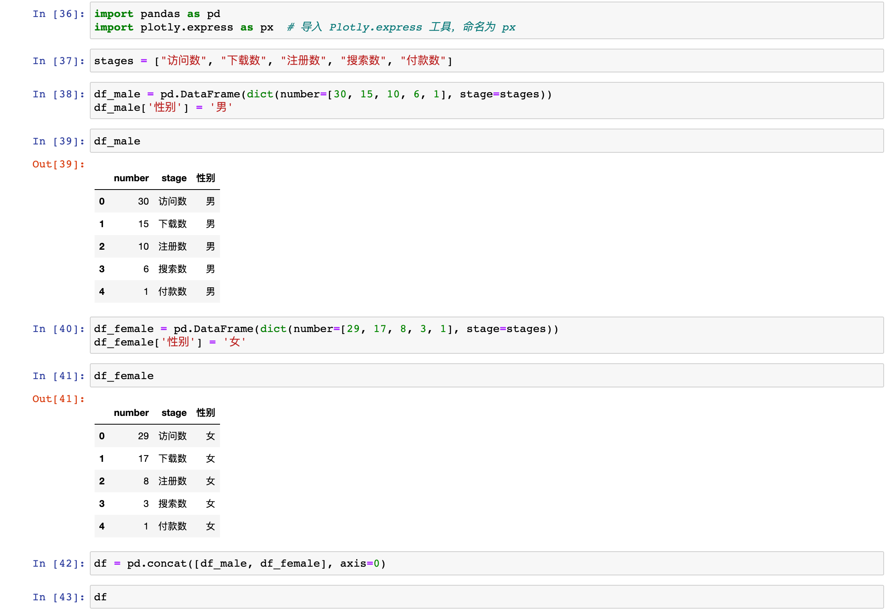

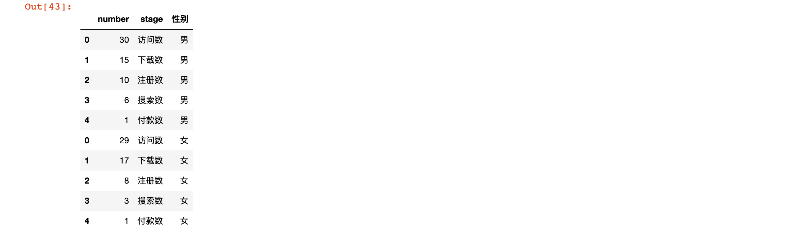

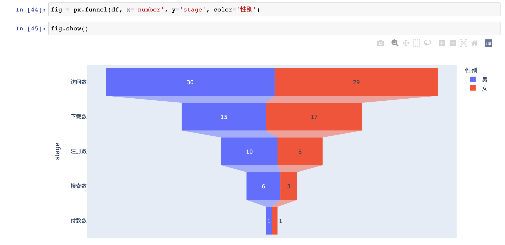

## 学员评论

> 1、 plotlPlotly工具是基于浏览器的交互工具，其绘图结果html网页文件，因此与jupter notebook更匹配； 
>
> 2、若是在spyder下运行的时候，console运行时是空白； 
>
> 3、若要解决spyder运行问题，需要以下步骤 import plotly.io as pio #如果您想在浏览器中显示您的图形作为完全交互式版本 pio.renderers.default='browser' #要切换回在 Spyder 中生成图形 pio.renderers.default='svg' 
>
> 在脱机模式下，通过浏览器显示图形或者运行结果 详细解释需要看：https://stackoverflow.com/questions/35315726/plotly-how-to-display-charts-in-spyder

欢迎关注我公众号：AI悦创，有更多更好玩的等你发现！

::: details 公众号：AI悦创【二维码】


:::

::: info AI悦创·编程一对一

AI悦创·推出辅导班啦，包括「Python 语言辅导班、C++ 辅导班、java 辅导班、算法/数据结构辅导班、少儿编程、pygame 游戏开发」，全部都是一对一教学：一对一辅导 + 一对一答疑 + 布置作业 + 项目实践等。当然，还有线下线上摄影课程、Photoshop、Premiere 一对一教学、QQ、微信在线，随时响应！微信：Jiabcdefh

C++ 信息奥赛题解，长期更新！长期招收一对一中小学信息奥赛集训，莆田、厦门地区有机会线下上门，其他地区线上。微信：Jiabcdefh

方法一：[QQ](http://wpa.qq.com/msgrd?v=3&uin=1432803776&site=qq&menu=yes)

方法二：微信：Jiabcdefh

:::


