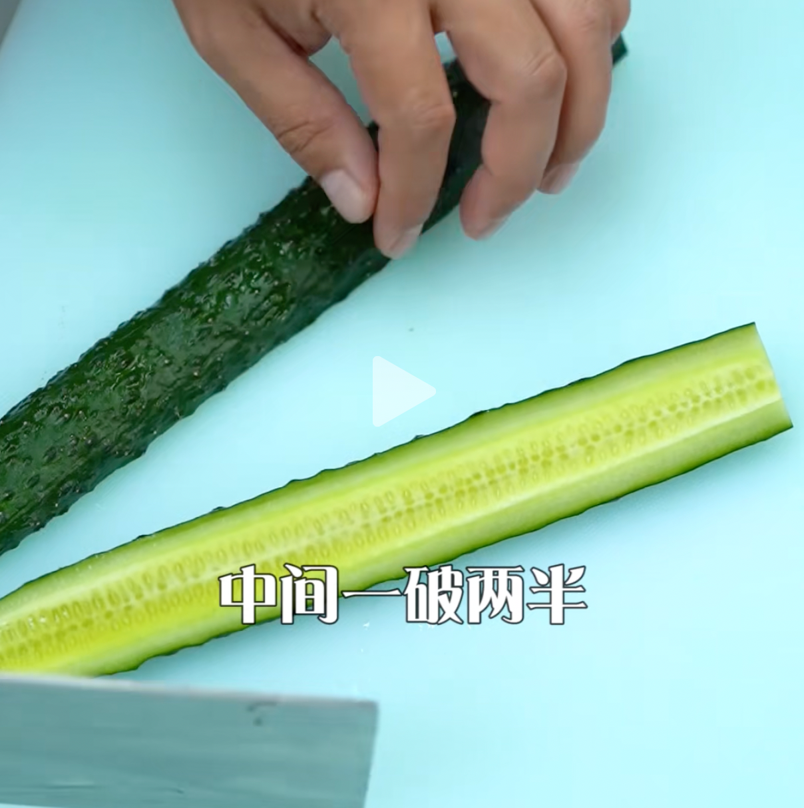
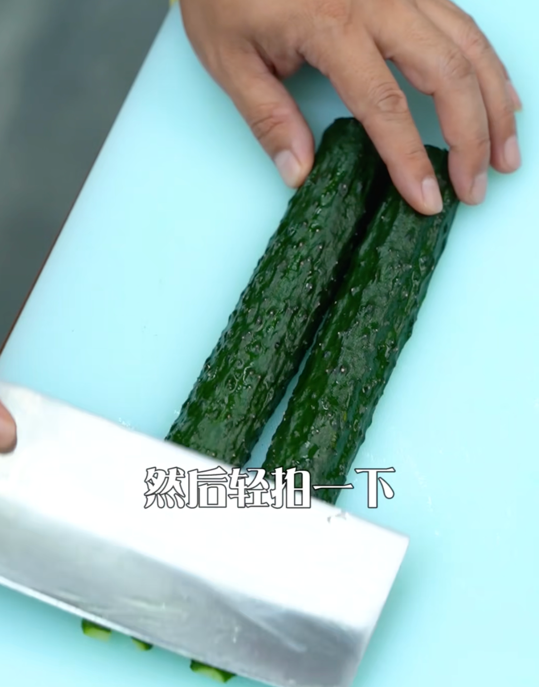

拍黄瓜是一道家常凉菜，主料是黄瓜，用各种调料拌制而成。清凉爽口，适合夏季食用。黄瓜属于凉性，夏季食用能够清热去火，排除体内毒素的效果，还具有*的效果，并且味道鲜美的拍黄瓜夏季食用还能帮助消化。

## 用料

1. 黄瓜
2. 大蒜
3. 小米椒
4. 盐
5. 糖
6. 香油
7. 生抽
8. 醋
9. 辣椒油

### 

## 步骤

1. 黄瓜掐头去尾
2. 中间一破两半

3. 轻拍一下「一轻二重」

4. 两瓣 **蒜** 拍碎，直接放入黄瓜碗中
5. 小米椒拍烂，稍微切一下，直接放入碗中
6. 接下来是调味了。
7. 加盐、加糖、生抽、醋、香油、辣椒油
8. 最后加入香菜「随意」
9. 拌匀即可

欢迎关注我公众号：AI悦创，有更多更好玩的等你发现！

::: details 公众号：AI悦创【二维码】

:::

::: info AI悦创·编程一对一

AI悦创·推出辅导班啦，包括「Python 语言辅导班、C++ 辅导班、java 辅导班、算法/数据结构辅导班、少儿编程、pygame 游戏开发」，全部都是一对一教学：一对一辅导 + 一对一答疑 + 布置作业 + 项目实践等。当然，还有线下线上摄影课程、Photoshop、Premiere 一对一教学、QQ、微信在线，随时响应！微信：Jiabcdefh

C++ 信息奥赛题解，长期更新！长期招收一对一中小学信息奥赛集训，莆田、厦门地区有机会线下上门，其他地区线上。微信：Jiabcdefh

方法一：[QQ](http://wpa.qq.com/msgrd?v=3&uin=1432803776&site=qq&menu=yes)

方法二：微信：Jiabcdefh

:::

