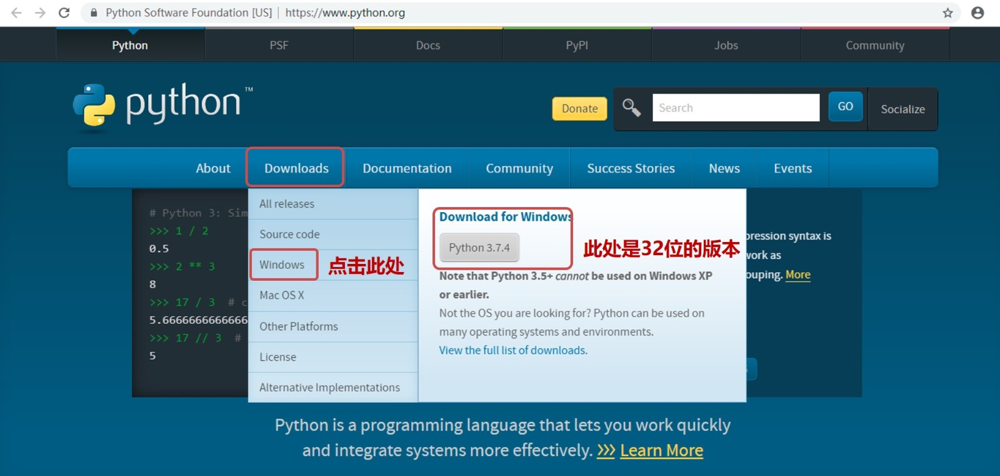
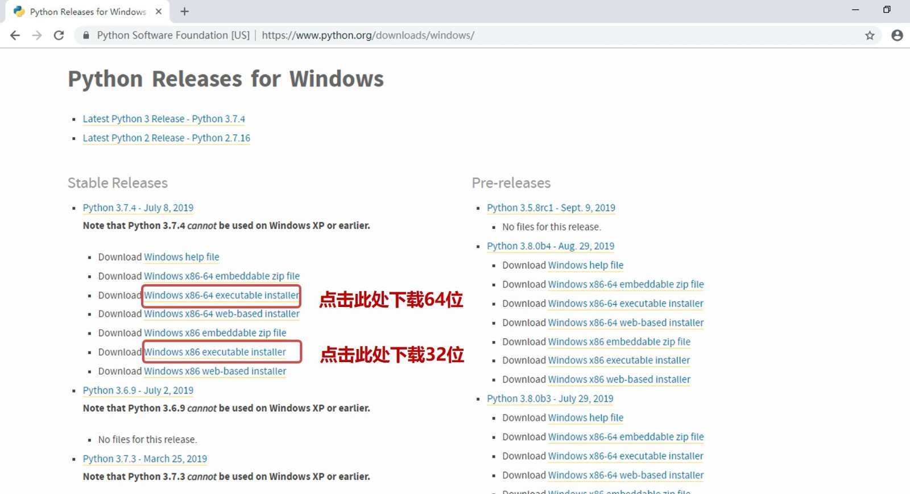
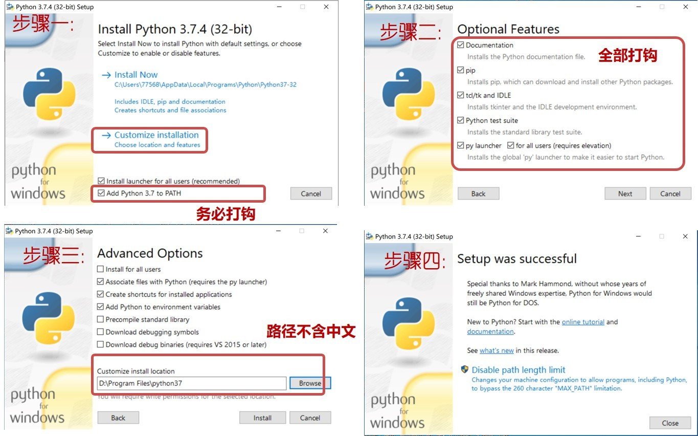
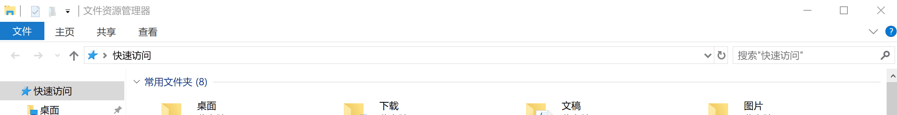
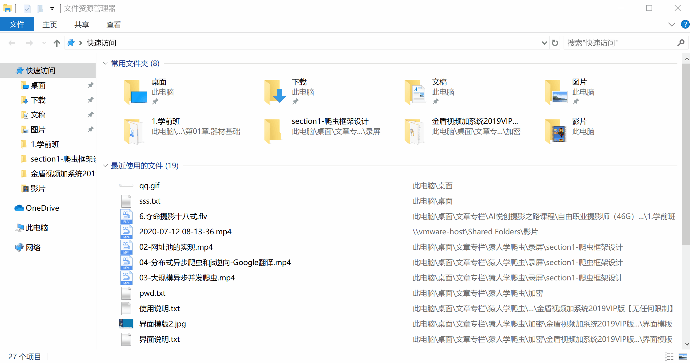
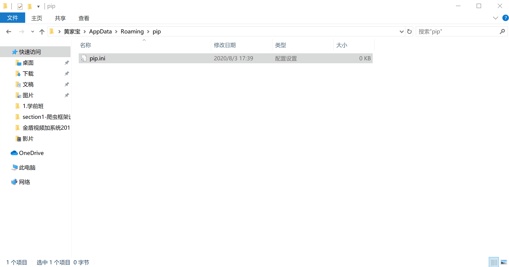
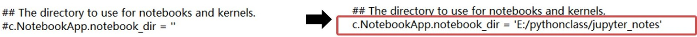
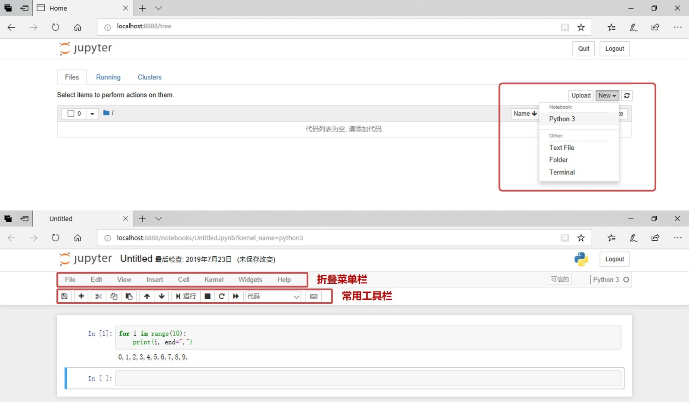

> 没有智慧的头脑，就象没有腊烛的灯笼。		——列夫·托尔斯泰


你好，我是悦创。

自学一门编程语言着实不易。从我自己的经历看，你需要翻越好几个障碍，从心态，到体力，再到思维，最终才能成为一名优秀的程序员。所以说掌握一门语言，需要你用心去感悟，去认真体会你和“她”的那一丝默契。

但是遗憾的是，太多的朋友们，并不是倒在了中途，而是他们并没有开始，是的，他们连 `Python` 公主的纤纤玉手都没有摸到。

**Python 应该下载哪个版本？**

**Python 环境如何配置？**

推荐几款最好用的 `Python` `IDE` 等等。我们的挑战在于选择太多，在丰收的农场门口，我们望着满眼的西瓜和葡萄，踌躇满志却不敢前进。

如果你现在还没有配置好 `Python` 环境，那么恭喜你，跟着本文走，你将能够收获基于 `Python3.7` 搭建的编程平台，以及以 `Jupyter` 为主要工具的编程环境，本文还将带你安装常用的数据分析工具以及可视化工具，一站式购齐，无后顾之忧。

如果你已经安装了 `Python3.7` 的环境，或者 `anaconda` 环境，你也可以顺着本文的思路往下走，工具不是重点，配置环境的能力才是。

:::info 提示

千万别给我使用 anaconda 安装 Python 环境！！！其他不多说。

:::

但是如果你的 `Python` 环境来历不明（不明论坛下载），我强烈建议你卸载后重新安装官网版本（ `Python` 的卸载方式同普通软件，在控制面板中卸载即可）。毕竟 **"磨刀不误砍柴工”** ，有的版本残缺不全，谁也无法预测你会出现什么 bug。

**本文以windows 10 X64系统为例，演示本地 Python 数据分析环境的搭建过程。**

::: details 视频播放

<iframe src="//player.bilibili.com/player.html?aid=668871436&bvid=BV1sa4y1a7kN&cid=211502373&page=1" scrolling="no" border="0" frameborder="no" framespacing="0" allowfullscreen="true" style="width: 100%; height: 500px; max-width: 100%; align:center; padding:20px 0;"> </iframe>

:::

## 1. 安装 Python 环境

### 1.1 Python 软件下载

作为 21世纪的大好青年，从来都是要玩最正宗的，盗版？！那是上一代人玩剩下的。特别是在正版还免费的情况下。推荐去 Python 官网[https://www.python.org/](https://www.python.org/) 下载。部分朋友可能加载会比较慢，稍安勿躁，除非网络问题，网站都是能够访问的。



进入官网后，你可以直接按照上图的提示，选择 `Windows` 标签，进入 `Windows` 平台的 `Python` 版本详单页面（ `Releases Page` ），建议选择 3.7或以上的版本。`Python2.7` 将在 2020年停止所有更新，就像曾经辉煌的 `Windows XP` 一样，最终慢慢成为历史的尘埃，所以本专栏不推荐安装 `Python2.7`。

在选择 `Python` 版本要注意根据自己 PC 的版本一致，如果自己的版本是 64位，建议选择 `x86-64` 版本下载，否则直接选择普通版本。切记电脑位数和 `Python` 版本保持一致，否则以后流的泪都是当初挖的坑啊。



对于使用 mac OS 的朋友，请选择 mac OS X 标签，进行下载，步骤基本一致。

### 1.2 Python 软件安装

Python 的安装过程非常人性化，你只要双击安装程序，设置好安装路径，「记得勾选：Add Python 3.7 to PATH」然后不断点击下一步，直至完成安装。



**上图 `add python3.7 to Path` ，是指安装过程中程序默认把安装路径添加到系统环境变量中，此项务必打勾！**

至此我们已经初步完成了 `Python3.7` 的安装。在 `cmd` 命令行中输入 `python` ，可以直接进入 `python` 环境中：

```cmd
C:\Users\Administrator>python
Python 3.7.4 (v3.6.5:f59c0932b4, Mar 28 2018, 17:00:18) [MSC v.1900 64 bit (AMD64)] on win32
Type "help", "copyright", "credits" or "license" for more information.
```

继续输入我们的第一行 `Python` 语句，开启我们的数据分析之旅吧：

```python
>> print("Life is short, I do data analysis in python!")
"Life is short, I do data analysis in python!"
```

如果把 `Python` 比作公主的话，那么怎么也得配个丫鬟才对，是吧？我们常说 `Python` 广泛应用与数据分析、爬虫、网络编程、人工智能、运维等领域，其实是因为基于 `Python` 有非常多的第三方库，这些库极大地丰富了 `Python` 的生态，使得 `Python` 近乎无所不能。那我们该怎么安装这些第三方库呢？

没错，`PIP` 工具应该说是这块的小能手了。`PIP` 直观上理解，就是为 `Python` 量身定做的管理第三方库的小工具，扮演了丫鬟的角色。让我们先来撩一下 `PIP` ，在 `cmd` 窗口中输入命令查看 PIP 的版本和安装路径：

```cmd
C:\Users\Administrator>pip --version
pip 19.1 from d:\users\lemeng\appdata\local\programs\python\python37\lib\site-packages\pip-19.1-py3.7.4.egg\pip (python 3.7)
```

如果系统提示 PIP 不是最新版本，请继续执行如下命令：

```cmd
C:\Users\Administrator>python -m pip install --upgrade pip
```

PIP 是不是就这么简单呢？我们稍后揭晓。

# 2. Jupyter Notebook，最适合做数据分析的编程工具「也可以写爬虫（当然推荐 Pycharm 这里我就懒得写了）」

虽然，Pycharm 的安装懒得写，我却录了一个完整的环境安装视频：[https://www.bilibili.com/video/BV1sa4y1a7kN/](https://www.bilibili.com/video/BV1sa4y1a7kN/)

准确来讲，`Jupyter Notebook` 不仅仅适合做数据分析，而且它非常适合新入门的朋友练习 `Python`。

`Jupyter Notebook` 是一种以 “问答式” 为重要特征的 `Python` 编辑器，就像排版精良的笔记，你的程序、执行结果，井然有序。

本专栏重点介绍在 `Python` 数据分析过程中的 `Jupyter Notebook` 的使用。在实际案例中，你输入一句，它便返回程序执行的结果。并且执行后程序的内存会被锁定，直到程序关闭，变量才会被销毁、内存被释放。

这种特征，在数据分析领域尤为重要。在数据分析的过程中，一切套路都是围绕着数据本身的特点来的。特别是对于中大型的数据表格，只有熟悉了数据的特点，才能对数据进行下一步的分析。这也正是数据编程与网络编程最大的差别。

我们先安装 `Jupyter Notebook`，然后通过一个实例来感受它的便捷。

我们推荐通过 PIP 工具进行一键式安装，在 `cmd` 窗口输入如下命令：

```python
C:\Users\Administrator>pip install jupyter
```

> 这里推荐给你的 pip 换源，这里以 Windows10 为例：
> 1. 先打开查看文件后缀：查看 -> 勾选文件扩展名
> 
> 1. 首先在 Windows 的文件夹「快捷键：Win 图标+ E 」窗口输入 ： %APPDATA%
> 
> 1. 然后在底下新建 pip 文件夹，然后到 pip 文件夹里面去新建个 pip.ini ,然后再里面输入内容
> 
> 1. 输入一下内容：

```ini
[global]
index-url = http://mirrors.aliyun.com/pypi/simple/
[install]
trusted-host=mirrors.aliyun.com
```
> 4. 
> 4. 自此就换源结束
> 4. 补充：
> 从 pip10.0.0 开始，有个 config 子命令可用来改配置，无需关心不同操作系统下配置文件路径。
> 详见讨论：[Create a command to make it easy to access the configuration file · Issue #1736 · pypa/pip](https://link.zhihu.com/?target=https%3A//github.com/pypa/pip/issues/1736)
> 实际使用例子：

```cmd
# 阿里源
pip config set global.index-url http://mirrors.aliyun.com/pypi/simple/

# 豆瓣源
pip config set global.index-url https://pypi.douban.com/simple

# 阿里云 http://mirrors.aliyun.com/pypi/simple/
# 科技大学 https://pypi.mirrors.ustc.edu.cn/simple/
# 豆瓣(douban) http://pypi.douban.com/simple/
# 清华大学 https://pypi.tuna.tsinghua.edu.cn/simple/
# 中国科学技术大学 http://pypi.mirrors.ustc.edu.cn/simple/
```

提示安装成功后，推荐设置一下我们常用的 Python 学习路径，这样新建和保存文件均会默认放置到该路径下。在 `cmd` 窗口中继续输入：

```python
C:\Users\Administrator>jupyter notebook --generate-config
Writing default config to C:\Users\Administrator\.jupyter\jupyter_notebook_config.py
```

编辑上一步提示的 `jupyter_notebool_config.py` 文件，找到 `c.Notebook.notebok_dir` ，放开前面的注释，并按照下图修改完成（路径根据自己的实际情况填写，注意避免放置中文路径，给自己挖坑），保存并关闭。



到此为止，Python 环境就完成配置了，下面我们就来撩一下吧。

在 `cmd` 窗口中输入 `jupyter notebook` ，启动环境：

```python
C:\Users\Administrator>jupyter notebook
```

通过 `New` 菜单，新建一个 `Python 3` 的程序后，在新的页面继续输入：

```python
for i in range(10):
    print(i, end=",")
```

`jupyter notebook` 界面及效果如下：



在 `Jupyter` 的常用工具栏上，有保存、剪切、复制、粘贴、运行、停止等按钮，鼠标移动到按钮上会有提示，总体来说，还是很人性化的，相信上手应该没有难度的。

这里请朋友们注意了，在本专栏的后续章节中，除特殊说明外，`Python` 程序的演示都是在 `Jupyter Notebook` 中进行的。

## 5. 总结

到这里，整个基于 Python 的析环境就搭建完成了。总的来说，搭建这套环境的意义就在于：提供了一套爬虫学习的平台，你可以方便地观察数据的规律，并完成对应课程内容学习；所以朋友们还等什么，赶紧加入学习吧。

::: details 公众号：AI悦创【二维码】


:::

::: info AI悦创·编程一对一

AI悦创·推出辅导班啦，包括「Python 语言辅导班、C++ 辅导班、java 辅导班、算法/数据结构辅导班、少儿编程、pygame 游戏开发」，全部都是一对一教学：一对一辅导 + 一对一答疑 + 布置作业 + 项目实践等。当然，还有线下线上摄影课程、Photoshop、Premiere 一对一教学、QQ、微信在线，随时响应！微信：Jiabcdefh

C++ 信息奥赛题解，长期更新！长期招收一对一中小学信息奥赛集训，莆田、厦门地区有机会线下上门，其他地区线上。微信：Jiabcdefh

方法一：[QQ](http://wpa.qq.com/msgrd?v=3&uin=1432803776&site=qq&menu=yes)

方法二：微信：Jiabcdefh

:::


