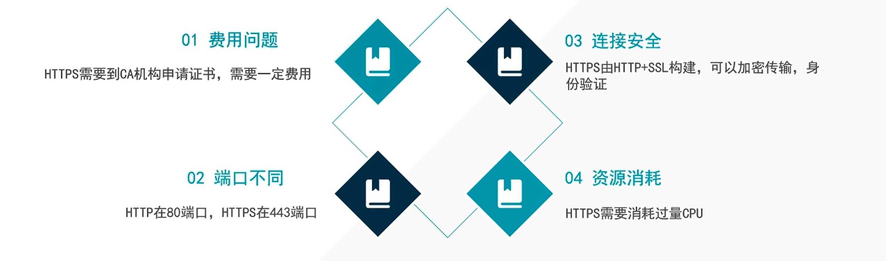
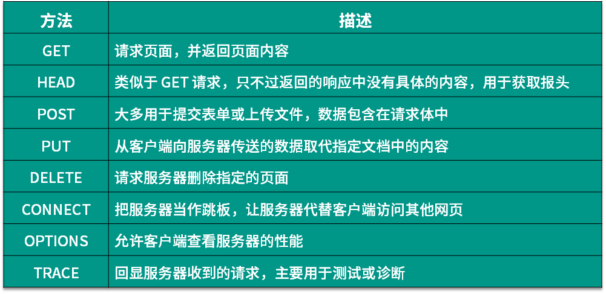

你好，我是悦创。

本课时我们会详细讲解 HTTP 的基本原理，以及了解在浏览器中输入 URL 到获取网页内容之间发生了什么。了解了这些内容，有助于我们进一步掌握爬虫的基本原理。

# 1. URI 和 URL

首先，我们来了解一下 URI 和 URL，URI 的全称为 Uniform Resource Identifier，即统一资源标志符，URL 的全称为 Universal Resource Locator，即统一资源定位符。

举例来说，[https://github.com/favicon.ico](https://github.com/favicon.ico)，它是一个 URL，也是一个 URI。即有这样的一个图标资源，我们用 `URL/URI` 来唯一指定了它的访问方式，这其中包括了访问协议 HTTPS、访问路径（即根目录）和资源名称 `favicon.ico`。通过这样一个链接，我们便可以从互联网上找到这个资源，这就是 URL/URI。

URL 是 URI 的子集，也就是说每个 URL 都是 URI，但不是每个 URI 都是 URL。那么，什么样的 URI 不是 URL 呢？URI 还包括一个子类叫作 URN，它的全称为 Universal Resource Name，即统一资源名称。

URN 只命名资源而不指定如何定位资源，比如 `urn:isbn:0451450523` 指定了一本书的 ISBN，可以唯一标识这本书，但是没有指定到哪里定位这本书，这就是 URN。URL、URN 和 URI 的关系可以用图表示。

但是在目前的互联网，URN 的使用非常少，几乎所有的 URI 都是 URL，所以一般的网页链接我们可以称之为 URL，也可以称之为 URI，我个人习惯称之为 URL。

# 2. 超文本

接下来，我们再了解一个概念 —— 超文本，其英文名称叫作 `Hypertext`，我们在浏览器里看到的网页就是超文本解析而成的，其网页源代码是一系列 HTML 代码，里面包含了一系列标签，比如 img 显示图片，p 指定显示段落等。浏览器解析这些标签后，便形成了我们平常看到的网页，而网页的源代码 HTML 就可以称作超文本。

例如，我们在 Chrome 浏览器里面打开任意一个页面，如淘宝首页，右击任一地方并选择 “检查” 项（或者直接按快捷键 F12），即可打开浏览器的开发者工具，这时在 Elements 选项卡即可看到当前网页的源代码，这些源代码都是超文本，如图所示。

# 3. HTTP 和 HTTPS

也就是在 **TCP/IP** 四层模型中添加了一层 **SSL 层（或者叫 TLS）** ，并且，根据加密程度不同，所需要的费用不同。

**04 资源消耗：**如果大家访问HTTPS网站呢，对我们的CPU来说需要更高程度的计算。上面我们讲到了，对于HTTPS来说，连接安全的同时它需要 **加密传输和身份验证** ，其实这是基于CPU的运算，需要我们电脑的CPU不断进行加密解密的运算，这样就会对我们电脑的CPU和占用一些资源。大家访问 HTTP、HTTPS，访问不同的网站，对我们电脑的CPU的消耗是不一样的，HTTPS需要很多很多的计算，才能进行加密验证。这些都是在我们电脑本地完成的。

## 3.1 HTTP

> HTTP 是一个客户端（用户）和服务器端（网站）之间请求和应答的标准，通常使用 [TCP协议](https://baike.baidu.com/item/TCP/33012?fromtitle=TCP协议&fromid=8988699&fr=aladdin)。通过使用[网页浏览器](https://baike.baidu.com/item/网页浏览器/8309940?fr=aladdin)、[网络爬虫](https://baike.baidu.com/item/网络爬虫)或者其他的工具，客户端发起一个 HTTP 请求到服务器上指定端口（默认[端口](https://baike.baidu.com/item/端口)为80）。我们称这个客户端为用户代理程序（user agent）。应答的服务器上存储着一些资源，比如 **HTML** 文件和图像。我们称这个应答服务器为源服务器（origin server）。在用户代理和源服务器中间可能存在多个”中见层“，比如：[代理服务器](https://baike.baidu.com/item/代理服务器/97996?fr=aladdin)、[网关](https://baike.baidu.com/item/网关)或者[隧道](https://baike.baidu.com/item/网络隧道/3993106?fr=aladdin)（tunnel）

我们平时写爬虫的时候就直接一个 **requestes** 过去，我们的电脑扮演的是 **客户端的角色**，我们 **requests 请求的网址**我们称之为：**服务器**。

大家即使是一个简单的 **get** 在网络就要经历许多层。这个模式我们叫做 **C/S 模式**服务器客户端模式。

上面我们说在请求网络的过程中会经过许多层，那这个 **层** 指的是什么呢？**有那几层呢？我们继续往下看！**

| 名称         | 对应的意思                                                   |
| ------------ | ------------------------------------------------------------ |
| 应用层       | 应用程序是指人们用于网络通信的软件程序。有些终端用户应用程序是网络感知程序， |
|              | 即这些程序实现应用层协议，并可直接与协议栈的较低层通信。     |
|              | 电子邮件客户程序和 Web 浏览器就属于这种类型的应用程序。      |
| 网络层（IP） | cmd >>> ipconfig                                             |
|              | 到网络层，就会进行 **IP** 的封装，（也就是把你电脑的本地 IP 封装，放在你的数据上，前面 |
|              | 就加个头说：我是来自192.168.0.1 的电脑，发往百度的 IP 一个是百度的 IP 一个是你自己的 |
|              | IP ）之后就会携带着发起请求的目标服务器。（也就是是封装在你的 Get 请求上） |
| 隧道         | VPN                                                          |
| 网关         | 加码解码（类似于，把一个英文网站翻译成中文网站）             |
| 课下         | 自行看 TCP／UDP                                              |
| TCP          | 有连接的流形式，就类似我们打电话，也就类似我们的全双工，我可以和你说话，你也可以 |
|              | 和我说话。并且，我知道你能接起电话，你一定能听到我说话。     |
| UDP          | 面向无连接，不在乎你是否收到了我的信息。就类似于：发邮件的时候，你知道你的邮件发 |
|              | 出去了，但不确定对方能不能收到。                             |
| 对比         | 相对来说，UDP 回比 TCP 简单的多了。（我们的 HTPP 是使用 TCP的。） |

网络层就类似于我们的　**IP**

### 3.1.1 HTTP  请求头详解

**HTTP 头部**

举个例子：

上图中的 **Request Header** 有个

**Accept:text/html,application/xhtml+xml,application/xml;q=0.9,image/webp,image/apng,*****/*****;q=0.8,application/signed-exchange;v=b3**

这个如果加在你的请求头里面，就只会返回你要求的数据。

## 3.2 HTTPS

超文本传输安全协议（英语：HyperText Transfer Protocol Secure，缩写：HTTPS；常常称为：HTTP over TLS

## 3.3 实例讲解

在淘宝的首页 https://www.taobao.com/ 中，URL 的开头会有 http 或 https，这个就是访问资源需要的协议类型，有时我们还会看到 ftp、sftp、smb 开头的 URL，那么这里的 ftp、sftp、smb 都是指的协议类型。在爬虫中，我们抓取的页面通常就是 http 或 https 协议的，我们在这里首先来了解一下这两个协议的含义。

HTTP 的全称是 Hyper Text Transfer Protocol，中文名叫作超文本传输协议，HTTP 协议是用于从网络传输超文本数据到本地浏览器的传送协议，它能保证高效而准确地传送超文本文档。HTTP 由万维网协会（World Wide Web Consortium）和 Internet 工作小组 IETF（Internet Engineering Task Force）共同合作制定的规范，目前广泛使用的是 HTTP 1.1 版本。

HTTPS 的全称是 Hyper Text Transfer Protocol over Secure Socket Layer，是以安全为目标的 HTTP 通道，简单讲是 HTTP 的安全版，即 HTTP 下加入 SSL 层，简称为 HTTPS。

HTTPS 的安全基础是 SSL，因此通过它传输的内容都是经过 SSL 加密的，它的主要作用可以分为两种：

- 建立一个信息安全通道，来保证数据传输的安全。
- 确认网站的真实性，凡是使用了 HTTPS 的网站，都可以通过点击浏览器地址栏的锁头标志来查看网站认证之后的真实信息，也可以通过 CA 机构颁发的安全签章来查询。

现在越来越多的网站和 App 都已经向 HTTPS 方向发展。例如：

- 苹果公司强制所有 iOS App 在 2017 年 1 月 1 日 前全部改为使用 HTTPS 加密，否则 App 就无法在应用商店上架。

- 谷歌从 2017 年 1 月推出的 Chrome 56 开始，对未进行 HTTPS 加密的网址链接亮出风险提示，即在地址栏的显著位置提醒用户 “此网页不安全”。

- 腾讯微信小程序的官方需求文档要求后台使用 HTTPS 请求进行网络通信，不满足条件的域名和协议无法请求。

因此，HTTPS 已经已经是大势所趋。

# 4. HTTP 请求过程

我们在浏览器中输入一个 URL，回车之后便可以在浏览器中观察到页面内容。实际上，这个过程是浏览器向网站所在的服务器发送了一个请求，网站服务器接收到这个请求后进行处理和解析，然后返回对应的响应，接着传回给浏览器。响应里包含了页面的源代码等内容，浏览器再对其进行解析，便将网页呈现了出来，传输模型如图所示。

此处客户端即代表我们自己的 PC 或手机浏览器，服务器即要访问的网站所在的服务器。

为了更直观地说明这个过程，这里用 Chrome 浏览器的开发者模式下的 Network 监听组件来做下演示，它可以显示访问当前请求网页时发生的所有网络请求和响应。

打开 Chrome 浏览器，右击并选择 “检查” 项，即可打开浏览器的开发者工具。这里访问百度 [https://www.baidu.com/](https://www.baidu.com/)，输入该 URL 后回车，观察这个过程中发生了怎样的网络请求。可以看到，在 Network 页面下方出现了一个个的条目，其中一个条目就代表一次发送请求和接收响应的过程，如图所示。

我们先观察第一个网络请求，即 [www.baidu.com](www.baidu.com)，其中各列的含义如下。

- 第一列 Name：请求的名称，一般会将 URL 的最后一部分内容当作名称。
- 第二列 Status：响应的状态码，这里显示为 200，代表响应是正常的。通过状态码，我们可以判断发送了请求之后是否得到了正常的响应。
- 第三列 Type：请求的文档类型。这里为 document，代表我们这次请求的是一个 HTML 文档，内容就是一些 HTML 代码。
- 第四列 Initiator：请求源。用来标记请求是由哪个对象或进程发起的。
- 第五列 Size：从服务器下载的文件和请求的资源大小。如果是从缓存中取得的资源，则该列会显示 from cache。
- 第六列 Time：发起请求到获取响应所用的总时间。
- 第七列 Waterfall：网络请求的可视化瀑布流。

我们点击这个条目即可看到其更详细的信息，如图所示。

首先是 General 部分，Request URL 为请求的 URL，Request Method 为请求的方法，Status Code 为响应状态码，Remote Address 为远程服务器的地址和端口，Referrer Policy 为 Referrer 判别策略。

再继续往下，可以看到，有 Response Headers 和 Request Headers，这分别代表响应头和请求头。请求头里带有许多请求信息，例如浏览器标识、Cookies、Host 等信息，这是请求的一部分，服务器会根据请求头内的信息判断请求是否合法，进而作出对应的响应。图中看到的 Response Headers 就是响应的一部分，例如其中包含了服务器的类型、文档类型、日期等信息，浏览器接受到响应后，会解析响应内容，进而呈现网页内容。

下面我们分别来介绍一下请求和响应都包含哪些内容。

## 4.1 请求

请求，由客户端向服务端发出，可以分为 4 部分内容：请求方法（Request Method）、请求的网址（Request URL）、请求头（Request Headers）、请求体（Request Body）。

## 4.2 请求方法

常见的请求方法有两种：GET 和 POST。

在浏览器中直接输入 URL 并回车，这便发起了一个 GET 请求，请求的参数会直接包含到 URL 里。例如，在百度中搜索 Python，这就是一个 GET 请求，链接为 [https://www.baidu.com/s?wd=Python](https://www.baidu.com/s?wd=Python) ，其中 URL 中包含了请求的参数信息，这里参数 wd 表示要搜寻的关键字。POST 请求大多在表单提交时发起。比如，对于一个登录表单，输入用户名和密码后，点击 “登录” 按钮，这通常会发起一个 POST 请求，其数据通常以表单的形式传输，而不会体现在 URL 中。

GET 和 POST 请求方法有如下区别。

- GET 请求中的参数包含在 URL 里面，数据可以在 URL 中看到，而 POST 请求的 URL 不会包含这些数据，数据都是通过表单形式传输的，会包含在请求体中。
- GET 请求提交的数据最多只有 1024 字节，而 POST 请求没有限制。

一般来说，登录时，需要提交用户名和密码，其中包含了敏感信息，使用 GET 方式请求的话，密码就会暴露在 URL 里面，造成密码泄露，所以这里最好以 POST 方式发送。上传文件时，由于文件内容比较大，也会选用 POST 方式。

我们平常遇到的绝大部分请求都是 GET 或 POST 请求，另外还有一些请求方法，如 HEAD、PUT、DELETE、OPTIONS、CONNECT、TRACE 等，我们简单将其总结为下表。

| 方法 | 描述                                                         |
| ---- | ------------------------------------------------------------ |
| GET  | 请求页面，并返回页面内容                                     |
| HEAD | 类似于 GET 请求，只不过返回的响应中没有具体的内容，用于获取报头 |
| POST | 大多用于提交表单或上传文件，数据包含在请求体中               |
|      |                                                              |

