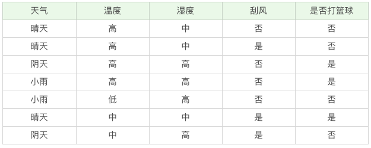
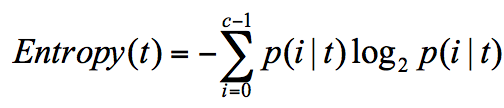
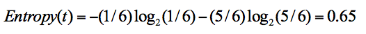
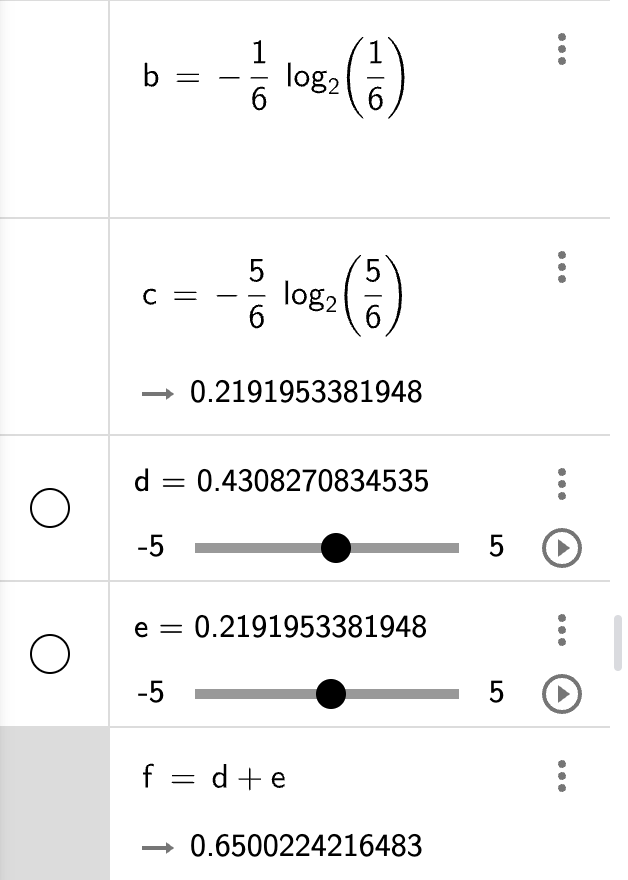

你好，我是悦创。

想象一下一个女孩的妈妈给她介绍男朋友的场景：

女儿：长的帅不帅？

妈妈：挺帅的。

女儿：有没有房子？

妈妈：在老家有一个。

女儿：收入高不高？

妈妈：还不错，年薪百万。

女儿：做什么工作的？

妈妈：IT 男，互联网公司做数据挖掘的。

女儿：好，那我见见。

在现实生活中，我们会遇到各种选择，不论是选择男女朋友，还是挑选水果，都是基于以往的经验来做判断。如果把判断背后的逻辑整理成一个结构图，你会发现它实际上是一个树状图，这就是我们今天要讲的**决策树**。

## 决策树的工作原理

决策树基本上就是把我们以前的经验总结出来。我给你准备了一个打篮球的训练集。如果我们要出门打篮球，一般会根据“天气”、“温度”、“湿度”、“刮风”这几个条件来判断，最后得到结果：去打篮球？还是不去？

上面这个图就是一棵典型的决策树。我们在做决策树的时候，会经历两个阶段：**构造和剪枝。**

### 构造

什么是构造呢？构造就是生成一棵完整的决策树。简单来说，**构造的过程就是选择什么属性作为节点的过程**，那么在构造过程中，会存在三种节点：

1.   根节点：就是树的最顶端，最开始的那个节点。在上图中，“天气”就是一个根节点；
2.   内部节点：就是树中间的那些节点，比如说“温度”、“湿度”、“刮风”；
3.   叶节点：就是树最底部的节点，也就是决策结果。

节点之间存在父子关系。比如根节点会有子节点，子节点会有子子节点，但是到了叶节点就停止了，叶节点不存在子节点。那么在构造过程中，你要解决三个重要的问题：

1.   选择哪个属性作为根节点；
2.   选择哪些属性作为子节点；
3.   什么时候停止并得到目标状态，即叶节点。

### 剪枝

**决策树构造出来之后是不是就万事大吉了呢？**

也不尽然，我们可能还需要对决策树进行剪枝。剪枝就是给决策树瘦身，这一步想实现的目标就是，不需要太多的判断，同样可以得到不错的结果。之所以这么做，是为了防止“过拟合”（Overfitting）现象的发生。

**“过拟合”这个概念你一定要理解，它指的就是模型的训练结果“太好了”，以至于在实际应用的过程中，会存在“死板”的情况，导致分类错误。**

**欠拟合，和过拟合就好比是下面这张图中的第一个和第三个情况一样，训练的结果“太好“，反而在实际应用过程中会导致分类错误。**

**欠拟合会是分类不够准确。**

欠拟合是指**模型拟合程度不高，数据距离拟合曲线较远，或指模型没有很好地捕捉到数据特征，不能够很好地拟合数据**。

**造成过拟合的原因之一就是因为训练集中样本量较小。**

如果决策树选择的属性过多，构造出来的决策树一定能够“完美”地把训练集中的样本分类，但是这样就会把训练集中一些数据的特点当成所有数据的特点，但这个特点不一定是全部数据的特点，这就使得这个决策树在真实的数据分类中出现错误，也就是模型的“泛化能力”差。[考虑自身](https://bornforthis.cn/column/Machine-learning/informal-essay/02-%E5%86%B3%E7%AD%96%E6%A0%91%E7%AE%97%E6%B3%95.html#_4-1-id3-%E4%BF%A1%E6%81%AF%E5%A2%9E%E7%9B%8A-%E6%9C%89%E4%BB%80%E4%B9%88%E9%97%AE%E9%A2%98%E5%91%A2)

泛化能力指的分类器是通过训练集抽象出来的分类能力，你也可以理解是举一反三的能力。如果我们太依赖于训练集的数据，那么得到的决策树容错率就会比较低，泛化能力差。因为训练集只是全部数据的抽样，并不能体现全部数据的特点。

既然要对决策树进行剪枝，具体有哪些方法呢？一般来说，剪枝可以分为“预剪枝”（Pre-Pruning）和“后剪枝”（Post-Pruning）。

预剪枝是在决策树构造时就进行剪枝。方法是在构造的过程中对节点进行评估，如果对某个节点进行划分，在验证集中不能带来准确性的提升，那么对这个节点进行划分就没有意义，这时就会把当前节点作为叶节点，不对其进行划分。

后剪枝就是在生成决策树之后再进行剪枝，通常会从决策树的叶节点开始，逐层向上对每个节点进行评估。如果剪掉这个节点子树，与保留该节点子树在分类准确性上差别不大，或者剪掉该节点子树，能在验证集中带来准确性的提升，那么就可以把该节点子树进行剪枝。方法是：用这个节点子树的叶子节点来替代该节点，类标记为这个节点子树中最频繁的那个类。

## 如何判断要不要去打篮球？

我们该如何构造一个判断是否去打篮球的决策树呢？再回顾一下决策树的构造原理，在决策过程中有三个重要的问题：将哪个属性作为根节点？选择哪些属性作为后继节点？什么时候停止并得到目标值？

显然将哪个属性（天气、温度、湿度、刮风）作为根节点是个关键问题，在这里我们先介绍两个指标：**纯度**和**信息熵**。

先来说一下纯度。你可以把决策树的构造过程理解成为寻找纯净划分的过程。数学上，我们可以用纯度来表示，纯度换一种方式来解释就是让目标变量的分歧最小。「各回各家」

我在这里举个例子，假设有 3 个集合：

-   集合 1：6 次都去打篮球；
-   集合 2：4 次去打篮球，2 次不去打篮球；
-   集合 3：3 次去打篮球，3 次不去打篮球。

**按照纯度指标来说，集合 1> 集合 2> 集合 3。因为集合 1 的分歧最小，集合 3 的分歧最大。**

然后我们再来介绍信息熵（entropy）的概念，**它表示了信息的不确定度。**

在信息论中，随机离散事件出现的概率存在着不确定性。为了衡量这种信息的不确定性，信息学之父香农引入了信息熵的概念，并给出了计算信息熵的数学公式：

p(i|t) 代表了节点 t 为分类 i 的概率，其中 log2 为取以 2 为底的对数。这里我们不是来介绍公式的，而是说存在一种度量，它能帮我们反映出来这个信息的不确定度。**当不确定性越大时，它所包含的信息量也就越大，信息熵也就越高。**

我举个简单的例子，假设有 2 个集合

-   集合 1：5 次去打篮球，1 次不去打篮球；
-   集合 2：3 次去打篮球，3 次不去打篮球。

在集合 1 中，有 6 次决策，其中打篮球是 5 次，不打篮球是 1 次。

那么假设：类别 1 为“打篮球”，即次数为 5；类别 2 为“不打篮球”，即次数为 1。

那么节点划分为类别 1 的概率是 5/6，为类别 2 的概率是 1/6，带入上述信息熵公式可以计算得出：

欢迎关注我公众号：AI悦创，有更多更好玩的等你发现！

::: details 公众号：AI悦创【二维码】

:::

::: info AI悦创·编程一对一

AI悦创·推出辅导班啦，包括「Python 语言辅导班、C++ 辅导班、java 辅导班、算法/数据结构辅导班、少儿编程、pygame 游戏开发」，全部都是一对一教学：一对一辅导 + 一对一答疑 + 布置作业 + 项目实践等。当然，还有线下线上摄影课程、Photoshop、Premiere 一对一教学、QQ、微信在线，随时响应！微信：Jiabcdefh

C++ 信息奥赛题解，长期更新！长期招收一对一中小学信息奥赛集训，莆田、厦门地区有机会线下上门，其他地区线上。微信：Jiabcdefh

方法一：[QQ](http://wpa.qq.com/msgrd?v=3&uin=1432803776&site=qq&menu=yes)

方法二：微信：Jiabcdefh

:::

