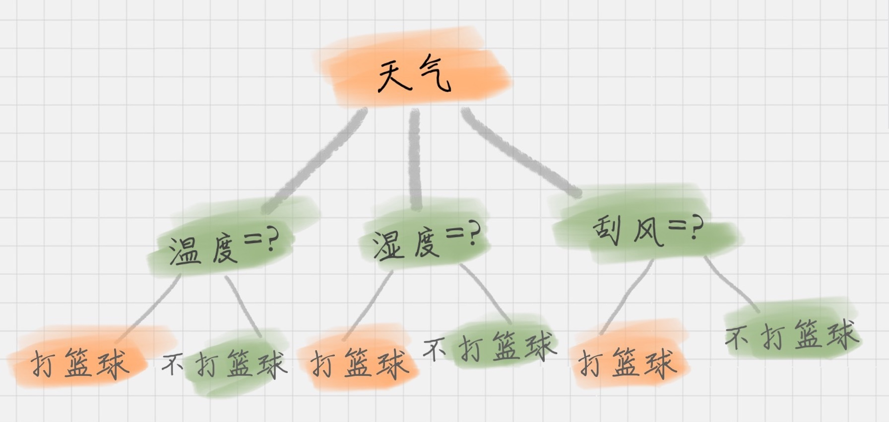
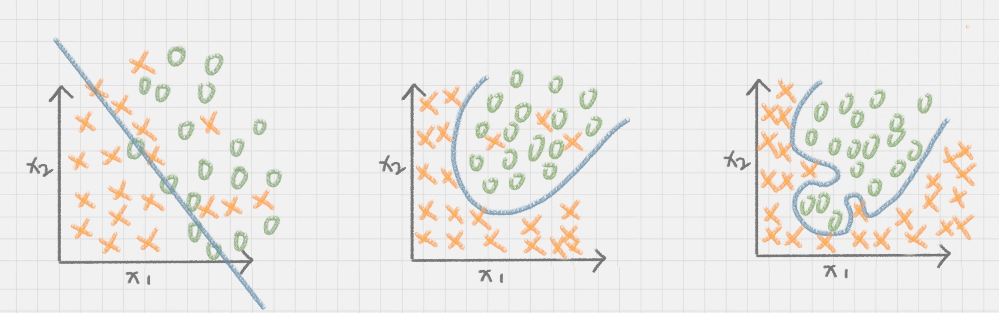

你好，我是悦创。

想象一下一个女孩的妈妈给她介绍男朋友的场景：

女儿：长的帅不帅？

妈妈：挺帅的。

女儿：有没有房子？

妈妈：在老家有一个。

女儿：收入高不高？

妈妈：还不错，年薪百万。

女儿：做什么工作的？

妈妈：IT 男，互联网公司做数据挖掘的。

女儿：好，那我见见。

在现实生活中，我们会遇到各种选择，不论是选择男女朋友，还是挑选水果，都是基于以往的经验来做判断。如果把判断背后的逻辑整理成一个结构图，你会发现它实际上是一个树状图，这就是我们今天要讲的**决策树**。

## 决策树的工作原理

决策树基本上就是把我们以前的经验总结出来。我给你准备了一个打篮球的训练集。如果我们要出门打篮球，一般会根据“天气”、“温度”、“湿度”、“刮风”这几个条件来判断，最后得到结果：去打篮球？还是不去？

上面这个图就是一棵典型的决策树。我们在做决策树的时候，会经历两个阶段：**构造和剪枝。**

### 构造

什么是构造呢？构造就是生成一棵完整的决策树。简单来说，**构造的过程就是选择什么属性作为节点的过程**，那么在构造过程中，会存在三种节点：

1.   根节点：就是树的最顶端，最开始的那个节点。在上图中，“天气”就是一个根节点；
2.   内部节点：就是树中间的那些节点，比如说“温度”、“湿度”、“刮风”；
3.   叶节点：就是树最底部的节点，也就是决策结果。

节点之间存在父子关系。比如根节点会有子节点，子节点会有子子节点，但是到了叶节点就停止了，叶节点不存在子节点。那么在构造过程中，你要解决三个重要的问题：

1.   选择哪个属性作为根节点；
2.   选择哪些属性作为子节点；
3.   什么时候停止并得到目标状态，即叶节点。

### 剪枝

决策树构造出来之后是不是就万事大吉了呢？也不尽然，我们可能还需要对决策树进行剪枝。剪枝就是给决策树瘦身，这一步想实现的目标就是，不需要太多的判断，同样可以得到不错的结果。之所以这么做，是为了防止“过拟合”（Overfitting）现象的发生。

**“过拟合”这个概念你一定要理解，它指的就是模型的训练结果“太好了”，以至于在实际应用的过程中，会存在“死板”的情况，导致分类错误。**

**欠拟合，和过拟合就好比是下面这张图中的第一个和第三个情况一样，训练的结果“太好“，反而在实际应用过程中会导致分类错误。**

**欠拟合会是分类不够准确。**

欢迎关注我公众号：AI悦创，有更多更好玩的等你发现！

::: details 公众号：AI悦创【二维码】

:::

::: info AI悦创·编程一对一

AI悦创·推出辅导班啦，包括「Python 语言辅导班、C++ 辅导班、java 辅导班、算法/数据结构辅导班、少儿编程、pygame 游戏开发」，全部都是一对一教学：一对一辅导 + 一对一答疑 + 布置作业 + 项目实践等。当然，还有线下线上摄影课程、Photoshop、Premiere 一对一教学、QQ、微信在线，随时响应！微信：Jiabcdefh

C++ 信息奥赛题解，长期更新！长期招收一对一中小学信息奥赛集训，莆田、厦门地区有机会线下上门，其他地区线上。微信：Jiabcdefh

方法一：[QQ](http://wpa.qq.com/msgrd?v=3&uin=1432803776&site=qq&menu=yes)

方法二：微信：Jiabcdefh

:::

