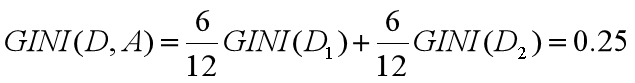
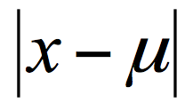
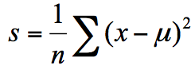
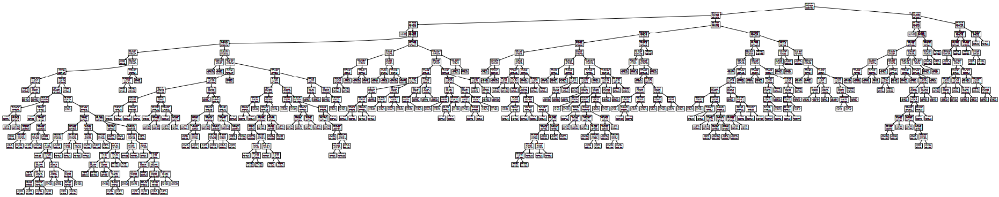

你好，我是悦创。

上节课我们讲了决策树，基于信息度量的不同方式，我们可以把决策树分为 ID3 算法、C4.5 算法和 CART 算法。今天我来带你学习 CART 算法。CART 算法，英文全称叫做 Classification And Regression Tree，中文叫做分类回归树。ID3 和 C4.5 算法可以生成二叉树或多叉树，而 CART 只支持二叉树。同时 CART 决策树比较特殊，既可以作分类树，又可以作回归树。

那么你首先需要了解的是，什么是分类树，什么是回归树呢？

我用下面的训练数据举个例子，你能看到不同职业的人，他们的年龄不同，学习时间也不同。如果我构造了一棵决策树，想要基于数据判断这个人的职业身份，这个就属于分类树，因为是从几个分类中来做选择。如果是给定了数据，想要预测这个人的年龄，那就属于回归树。


分类树可以处理离散数据，也就是数据种类有限的数据，它输出的是样本的类别，而回归树可以对连续型的数值进行预测，也就是数据在某个区间内都有取值的可能，它输出的是一个数值。

## CART 分类树的工作流程

通过上一讲，我们知道决策树的核心就是寻找纯净的划分，因此引入了纯度的概念。

在属性选择上，我们是通过统计“不纯度”来做判断的，ID3 是基于信息增益做判断，C4.5 在 ID3 的基础上做了改进，提出了信息增益率的概念。实际上 CART 分类树与 C4.5 算法类似，只是属性选择的指标采用的是基尼系数。

你可能在经济学中听过说基尼系数，它是用来衡量一个国家收入差距的常用指标。当基尼系数大于 0.4 的时候，说明财富差异悬殊。基尼系数在 0.2-0.4 之间说明分配合理，财富差距不大。

基尼系数本身反应了样本的不确定度。当基尼系数越小的时候，说明样本之间的差异性小，不确定程度低。分类的过程本身是一个不确定度降低的过程，即纯度的提升过程。所以 CART 算法在构造分类树的时候，会选择基尼系数最小的属性作为属性的划分。

我们接下来详解了解一下基尼系数。基尼系数不好懂，你最好跟着例子一起手动计算下。

假设 t 为节点，那么该节点的 GINI 系数的计算公式为：


这里 p(Ck|t) 表示节点 t 属于类别 Ck 的概率，节点 t 的基尼系数为 1 减去各类别 Ck 概率平方和。

通过下面这个例子，我们计算一下两个集合的基尼系数分别为多少：

集合 1：6 个都去打篮球；

集合 2：3 个去打篮球，3 个不去打篮球。

针对集合 1，所有人都去打篮球，所以 p(Ck|t)=1，因此 GINI(t)=1-1=0。

针对集合 2，有一半人去打篮球，而另一半不去打篮球，所以，`p(C1|t)=0.5`，`p(C2|t)=0.5`，`GINI(t)=1-（0.5*0.5+0.5*0.5）=0.5`。

通过两个基尼系数你可以看出，集合 1 的基尼系数最小，也证明样本最稳定，而集合 2 的样本不稳定性更大。

在 CART 算法中，基于基尼系数对特征属性进行二元分裂，假设属性 A 将节点 D 划分成了 D1 和 D2，如下图所示：


节点 D 的基尼系数等于子节点 D1 和 D2 的归一化基尼系数之和，用公式表示为：


归一化基尼系数代表的是每个子节点的基尼系数乘以该节点占整体父亲节点 D 中的比例。

上面我们已经计算了集合 D1 和集合 D2 的 GINI 系数，得到：


所以在属性 A 的划分下，节点 D 的基尼系数为：



节点 D 被属性 A 划分后的基尼系数越大，样本集合的不确定性越大，也就是不纯度越高。

## 如何使用 CART 算法来创建分类树

通过上面的讲解你可以知道，CART 分类树实际上是基于基尼系数来做属性划分的。在 Python 的 sklearn 中，如果我们想要创建 CART 分类树，可以直接使用 DecisionTreeClassifier 这个类。创建这个类的时候，默认情况下 criterion 这个参数等于 gini，也就是按照基尼系数来选择属性划分，即默认采用的是 CART 分类树。

下面，我们来用 CART 分类树，给 iris 数据集构造一棵分类决策树。iris 这个数据集，我在 Python 可视化中讲到过，实际上在 sklearn 中也自带了这个数据集。基于 iris 数据集，构造 CART 分类树的代码如下：

```python
# -*- coding: utf-8 -*-
# @Time    : 2022/10/27 16:20
# @Author  : AI悦创
# @Software: PyCharm
# @Blog    ：https://bornforthis.cn/
from sklearn.model_selection import train_test_split
from sklearn.metrics import accuracy_score
from sklearn.tree import DecisionTreeClassifier
from sklearn.datasets import load_iris

# 准备数据集
iris = load_iris()
# 获取特征集和分类标识
features = iris.data
labels = iris.target
# 随机抽取33%的数据作为测试集，其余为训练集
train_features, test_features, train_labels, test_labels = train_test_split(features, labels, test_size=0.33,
                                                                            random_state=0)
# 创建CART分类树
clf = DecisionTreeClassifier(criterion='gini')
# 拟合构造CART分类树
clf = clf.fit(train_features, train_labels)
# 用CART分类树做预测
test_predict = clf.predict(test_features)
# 预测结果与测试集结果作比对
score = accuracy_score(test_labels, test_predict)
print("CART分类树准确率 %.4lf" % score)
```

运行结果：

```python
CART分类树准确率 0.9600
```

如果我们把决策树画出来，可以得到下面的图示：


首先 train_test_split 可以帮助我们把数据集抽取一部分作为测试集，这样我们就可以得到训练集和测试集。

使用 `clf = DecisionTreeClassifier(criterion='gini')` 初始化一棵 CART 分类树。这样你就可以对 CART 分类树进行训练。

使用 `clf.fit(train_features, train_labels)` 函数，将训练集的特征值和分类标识作为参数进行拟合，得到 CART 分类树。

使用 `clf.predict(test_features)` 函数进行预测，传入测试集的特征值，可以得到测试结果 test_predict。

最后使用 `accuracy_score(test_labels, test_predict)` 函数，传入测试集的预测结果与实际的结果作为参数，得到准确率 score。

我们能看到 sklearn 帮我们做了 CART 分类树的使用封装，使用起来还是很方便的。

## CART 回归树的工作流程

CART 回归树划分数据集的过程和分类树的过程是一样的，只是回归树得到的预测结果是连续值，而且评判“不纯度”的指标不同。在 CART 分类树中采用的是基尼系数作为标准，那么在 CART 回归树中，如何评价“不纯度”呢？实际上我们要根据样本的混乱程度，也就是样本的离散程度来评价“不纯度”。

样本的离散程度具体的计算方式是，先计算所有样本的均值，然后计算每个样本值到均值的差值。我们假设 x 为样本的个体，均值为 u。为了统计样本的离散程度，我们可以取差值的绝对值，或者方差。

其中差值的绝对值为样本值减去样本均值的绝对值：



方差为每个样本值减去样本均值的平方和除以样本个数：



所以这两种节点划分的标准，分别对应着两种目标函数最优化的标准，即用最小绝对偏差（LAD），或者使用最小二乘偏差（LSD）。这两种方式都可以让我们找到节点划分的方法，通常使用最小二乘偏差的情况更常见一些。

我们可以通过一个例子来看下如何创建一棵 CART 回归树来做预测。

## 如何使用 CART 回归树做预测

这里我们使用到 sklearn 自带的波士顿房价数据集，该数据集给出了影响房价的一些指标，比如犯罪率，房产税等，最后给出了房价。

根据这些指标，我们使用 CART 回归树对波士顿房价进行预测，代码如下：

```python
# -*- coding: utf-8 -*-
# @Time    : 2022/10/27 16:38
# @Author  : AI悦创
# @Software: PyCharm
# @Blog    ：https://bornforthis.cn/
from sklearn.metrics import mean_squared_error
from sklearn.model_selection import train_test_split
from sklearn.datasets import load_boston
from sklearn.metrics import r2_score, mean_absolute_error, mean_squared_error
from sklearn.tree import DecisionTreeRegressor

# 准备数据集
boston = load_boston()
# 探索数据
print(boston.feature_names)
# 获取特征集和房价
features = boston.data
prices = boston.target
# 随机抽取33%的数据作为测试集，其余为训练集
train_features, test_features, train_price, test_price = train_test_split(features, prices, test_size=0.33)
# 创建CART回归树
dtr = DecisionTreeRegressor()
# 拟合构造CART回归树
dtr.fit(train_features, train_price)
# 预测测试集中的房价
predict_price = dtr.predict(test_features)
# 测试集的结果评价
print('回归树二乘偏差均值:', mean_squared_error(test_price, predict_price))
print('回归树绝对值偏差均值:', mean_absolute_error(test_price, predict_price))

```

运行结果（每次运行结果可能会有不同）：

```python
['CRIM' 'ZN' 'INDUS' 'CHAS' 'NOX' 'RM' 'AGE' 'DIS' 'RAD' 'TAX' 'PTRATIO' 'B' 'LSTAT']
回归树二乘偏差均值: 23.80784431137724
回归树绝对值偏差均值: 3.040119760479042
```

如果把回归树画出来，可以得到下面的图示（波士顿房价数据集的指标有些多，所以树比较大）：




欢迎关注我公众号：AI悦创，有更多更好玩的等你发现！

::: details 公众号：AI悦创【二维码】


:::

::: info AI悦创·编程一对一

AI悦创·推出辅导班啦，包括「Python 语言辅导班、C++ 辅导班、java 辅导班、算法/数据结构辅导班、少儿编程、pygame 游戏开发」，全部都是一对一教学：一对一辅导 + 一对一答疑 + 布置作业 + 项目实践等。当然，还有线下线上摄影课程、Photoshop、Premiere 一对一教学、QQ、微信在线，随时响应！微信：Jiabcdefh

C++ 信息奥赛题解，长期更新！长期招收一对一中小学信息奥赛集训，莆田、厦门地区有机会线下上门，其他地区线上。微信：Jiabcdefh

方法一：[QQ](http://wpa.qq.com/msgrd?v=3&uin=1432803776&site=qq&menu=yes)

方法二：微信：Jiabcdefh

:::


