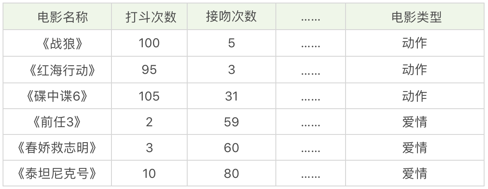
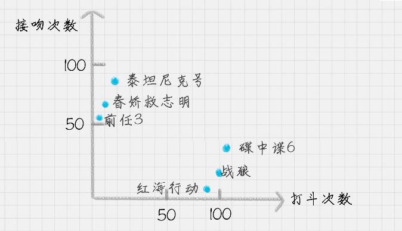

你好，我是悦创。

今天我来带你进行 KNN 的学习，KNN 的英文叫 K-Nearest Neighbor，应该算是数据挖掘算法中最简单的一种。

我们先用一个例子体会下。

假设，我们想对电影的类型进行分类，统计了电影中打斗次数、接吻次数，当然还有其他的指标也可以被统计到，如下表所示。

我们很容易理解《战狼》《红海行动》《碟中谍 6》是动作片，《前任 3》《春娇救志明》《泰坦尼克号》是爱情片，但是有没有一种方法让机器也可以掌握这个分类的规则，当有一部新电影的时候，也可以对它的类型自动分类呢？

我们可以把打斗次数看成 X 轴，接吻次数看成 Y 轴，然后在二维的坐标轴上，对这几部电影进行标记，如下图所示。

对于未知的电影 A，坐标为 (x,y)，我们需要看下离电影 A 最近的都有哪些电影，这些电影中的大多数属于哪个分类，那么电影 A 就属于哪个分类。实际操作中，我们还需要确定一个 K 值，也就是我们要观察离电影 A 最近的电影有多少个。

欢迎关注我公众号：AI悦创，有更多更好玩的等你发现！

::: details 公众号：AI悦创【二维码】

:::

::: info AI悦创·编程一对一

AI悦创·推出辅导班啦，包括「Python 语言辅导班、C++ 辅导班、java 辅导班、算法/数据结构辅导班、少儿编程、pygame 游戏开发」，全部都是一对一教学：一对一辅导 + 一对一答疑 + 布置作业 + 项目实践等。当然，还有线下线上摄影课程、Photoshop、Premiere 一对一教学、QQ、微信在线，随时响应！微信：Jiabcdefh

C++ 信息奥赛题解，长期更新！长期招收一对一中小学信息奥赛集训，莆田、厦门地区有机会线下上门，其他地区线上。微信：Jiabcdefh

方法一：[QQ](http://wpa.qq.com/msgrd?v=3&uin=1432803776&site=qq&menu=yes)

方法二：微信：Jiabcdefh

:::

