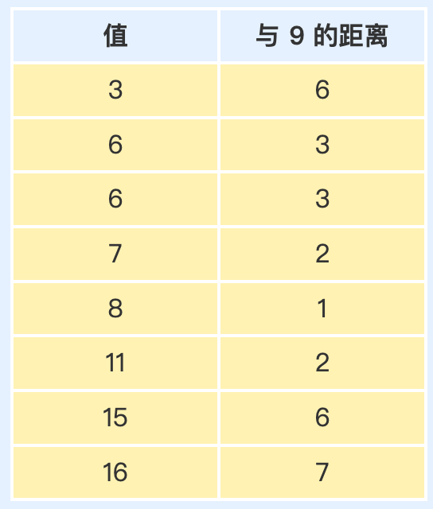
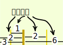
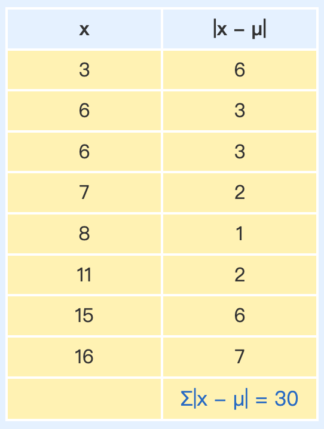
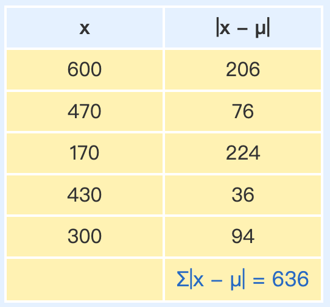
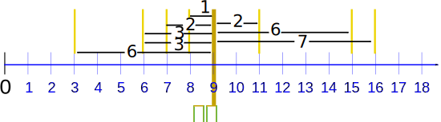

::: center

## 各个数据值离平均值平均有多远

:::

## 怎样计算

先求数据的平均值……接着求距离……最后求距离的平均！

三部曲：

- 一、求所有数据值的[平均值](https://www.shuxuele.com/mean.html)
- 二、求每个数据与平均值的距离（用数据值减去平均值，不理正负号）
- 三、求**这些距离的平均**

像这样：

## 例子：3、6、6、7、8、11、15、16 的 平均差

### 一、求平均：

::: center

平均=$\huge\frac{3 + 6 + 6 + 7 + 8 + 11 + 15 + 16}{8}=\frac{72}{8}=9$ 

:::

### 二、求每个数据只与平均值的距离：

::: center

:::

| 值   | 与 9 的距离 |
| ---- | ----------- |
| 3    | 6           |
| 6    | 3           |
| 6    | 3           |
| 7    | 2           |
| 8    | 1           |
| 11   | 2           |
| 15   | 6           |
| 16   | 7           |

像这样：

::: center

*（没有正负号！）*

:::

### 三、求**这些距离的平均**：

:::center

平均差=$\huge\frac{6 + 3 + 3 + 2 + 1 + 2 + 6 + 7}{8}=\frac{30}{8}=3.75$

:::

所以，**平均值 = 9**，**平均差 = 3.75**

**平均差告诉我们，每个数据值平均离中心有多远。**

**在上面的例子里，数据值平均离中心 3.75 远。**

在这里，**差**就是**距离**

## 公式

公式是：

::: center

平均差 = $\huge\frac{\sum|x−μ|}{N}$

:::

- **Σ** 是 [总和符号](https://www.shuxuele.com/algebra/sigma-notation.html)，意思是加起来
- || （垂直线）的意思是 [绝对值](https://www.shuxuele.com/numbers/absolute-value.html)，就是不要正负号
- **x** 是每个数据值（例如 3 或 16）
- **μ** 是平均（在这例子里，**μ = 9**）
- **N** 是数据点的个数（在这例子里，**N = 8**）

我们详细看看：

## 绝对偏差

在公式里求的每个距离是叫**绝对偏差**，因为它是偏差的[绝对值](https://www.shuxuele.com/numbers/absolute-value.html)（离平均值的距离）

::: center

:::

我们把 "|" 放在项的两变来代表 "绝对值"：

**|-3| = 3**

为每一个 **x**：

**绝对偏差 = |x - μ|**

在这个例子里，**16** 的 **绝对偏差 = |x - μ| = |16 - 9| = |7| = 7**

现在把它们加起来……

## 总和符号

"加起来" 的符号是 **Σ**（叫[总和符号](https://www.shuxuele.com/algebra/sigma-notation.html))，所以：

::: center

绝对偏差的总和 = Σ|x - μ|

:::

除以数据的个数 **N**，得到：

::: center

平均差 =$\huge\frac{\sum|x−μ|}{N}$

:::

我们再用正确的符号做一次：

## 例子： 3、6、6、7、8、11、15、16 的 平均差

### 一、求平均：

::: center

$\hugeμ=\frac{3+6+6+7+8+11+15+16}{8}=\frac{72}{8}=9$

:::

### 二、求绝对偏差：

::: center

:::

### 三、求平均差：

::: center

平均差 = $\huge\frac{\sum|x-μ|}{N}=\frac{30}{8}=3.75$

:::

> *注意：平均差有时也叫平均绝对偏差（英语 Mean Absolute Deviation (MAD)），因为它是绝对偏差的平均。*

## 平均差的意思是什么？

平均差告诉我们，每个数据值平均离中心有多远。

以下是个例子（用 [标准差](https://www.shuxuele.com/data/standard-deviation.html) 网页里的数据）：

### 例子：你和你的朋友测量了你们的狗的身高（毫米）：

身高（到肩膀）是：600mm、470mm、170mm、430mm 和 300mm。

### 一、求平均：

::: center

$\hugeμ=\frac{600+470+170+430+300}{5}=\frac{1970}{5}=394$

:::

### 二、求绝对偏差：

::: center

:::

| x    | \|x - μ\|        |
| ---- | ---------------- |
| 600  | 206              |
| 470  | 76               |
| 170  | 224              |
| 430  | 36               |
| 300  | 94               |
|      | Σ\|x - μ\| = 636 |

### 三、求平均差：

平均差=$\huge\frac{\sum|x-μ|}{N}=\frac{636}{5}=127.2$

所以，狗的身高**与平均值的平均距离是 127.2 mm**。

（可以和 **147 mm** 的[标准差](https://www.shuxuele.com/data/standard-deviation.html)比较一下）

## 检测

在平均值**一边**的偏差应该和**另一边**的偏差是相等的。

上面的例子：

### 例子：3、6、6、7、8、11、15、16

偏差是：

::: center

6 + 3 + 3 + 2 + 1 = 2 + 6 + 7

15 = 15

:::

同样：

### 例子：狗

平均左边的偏差：224 + 94 = **318**

平均右边的偏差：206 + 76 + 36 = **318**

如果它们不相同……你便是做错了！

## Question

### Question 1

Calculate the mean deviation for the numbers: 75, 83, 96, 100, 121 and 125

A. 14.33

B. 15

C. 15.33

D. 16

#### Q1 Answer

**Step 1** Find the mean:

μ = (75 + 83 + 96 + 100 + 121 + 125) ÷ 6 = 600 ÷ 6 = 100

**Step 2** Find the Absolute Deviations:

![[cached] 0.02598762512207 ms](./01-mean-deviation.assets/e3b9af69c9090e4f5177796659130b1.svg)

**Step 3** Find the Mean Deviation:

![[cached] 0.0061988830566406 ms](./01-mean-deviation.assets/b53955615c31ec62a4aaec98d455611.svg)

### Question 2

Ten friends scored the following marks in their end-of-year math exam: 23%, 37%, 45%, 49%, 56%, 63%, 63%, 70%, 72% and 82%

What was the mean deviation of their marks?

A. 14%

B. 15%

C. 16%

D. 17%

#### Q2 Answer

**Step 1** Find the mean:

μ = (23 + 37 + 45 + 49 + 56 + 63 + 63 + 70 + 72 + 82) ÷ 10 = 560 ÷ 10 = 56%

**Step 2** Find the Absolute Deviations:

![[cached] 0.043869018554688 ms](./01-mean-deviation.assets/ca0f7327677905480eb796749535a61.svg)

**Step 3** Find the Mean Deviation:

![[cached] 0.030040740966797 ms](./01-mean-deviation.assets/2b1da78d23f8c2fa45005cfd1bd1741.svg)

### Question 3

A booklet has 12 pages with the following numbers of words: 271, 354, 296, 301, 333, 326, 285, 298, 327, 316, 287 and 314

What is the mean deviation of the number of words per page?

A. 18.5

B. 19.33

C. 20

D. 20.17

#### Q3 Answer

**Step 1** Find the mean:

μ = (271 + 354 + 296 + 301 + 333 + 326 + 285 + 298 + 327 + 316 + 287 + 314) ÷ 12
= 3,708 ÷ 12
= 309

**Step 2** Find the Absolute Deviations:

![[cached] 0.045061111450195 ms](./01-mean-deviation.assets/6d6c38de7991ec959100d72e0c29031.svg)

**Step 3** Find the Mean Deviation:

![[cached] 0.010013580322266 ms](./01-mean-deviation.assets/7b62c597cbc37118b59fc653c9dfdc1.svg)

### Question 4

What is the mean deviation of the first 10 numbers of the Fibonacci sequence?

A. 8.8

B. 8.5

C. 8.42

D. 8.32

#### Q4 Answer

The first 10 numbers of the Fibonacci sequence are: 0, 1, 1, 2, 3, 5, 8, 13, 21, 34

**Step 1** Find the mean:

μ = (0 + 1 + 1 + 2 + 3 + 5 + 8 + 13 + 21 + 34) ÷ 10 = 88 ÷ 10 = 8.8

**Step 2** Find the Absolute Deviations:

![[cached] 0.060796737670898 ms](./01-mean-deviation.assets/8fb366ba99d9abd412ec917554aca11.svg)

**Step 3** Find the Mean Deviation:

![[cached] 0.016927719116211 ms](./01-mean-deviation.assets/78005233858f7b438f02208bce4e811.svg)

### Question 5

The Lakers scored the following numbers of goals in their last twenty matches: 3, 0, 1, 5, 4, 3, 2, 6, 4, 2, 3, 3, 0, 7, 1, 1, 2, 3, 4, 6

Calculate the Mean Deviation.

A. 1.5

B. 2

C. 2.5

D. 3

#### Q5 Answer

**Method 1**

**Step 1** Find the mean:

μ = (3 + 0 + 1 + 5 + 4 + 3 + 2 + 6 + 4 + 2 + 3 + 3 + 0 + 7 + 1 + 1 + 2 + 3 + 4 + 6) ÷ 20
= 60 ÷ 20
= 3

**Step 2** Find the Absolute Deviations:

![[cached] 0.056028366088867 ms](./01-mean-deviation.assets/e216c65a7dbfc6ade5e9a2a66da8ee1.svg)

**Step 3** Find the Mean Deviation:

![[cached] 0.011920928955078 ms](./01-mean-deviation.assets/328a4896378b19be392361747b9d2d1.svg)

**Method 2**
This can be done much more neatly using tables, as follows:

First complete a frequency table:

![[cached] 0.010967254638672 ms](./01-mean-deviation.assets/cf91c7659ed48babca1b5e911627c91.svg)

Then calculate the mean and mean deviation from the following table:

![[cached] 0.010967254638672 ms](./01-mean-deviation.assets/1b76aa877ddf88fbb5c47b816ab59a1.svg)

### Question 6

## 期待你和我一起，用数据解析世界

欢迎关注我公众号：AI悦创，有更多更好玩的等你发现！

::: details 公众号：AI悦创【二维码】

:::

::: info AI悦创·编程一对一

AI悦创·推出辅导班啦，包括「Python 语言辅导班、C++ 辅导班、java 辅导班、算法/数据结构辅导班、少儿编程、pygame 游戏开发、小学数学一对一教学」，全部都是一对一教学：一对一辅导 + 一对一答疑 + 布置作业 + 项目实践等。当然，还有线下线上摄影课程、Photoshop、Premiere 一对一教学、QQ、微信在线，随时响应！微信：Jiabcdefh

C++ 信息奥赛题解，长期更新！长期招收一对一中小学信息奥赛集训，莆田、厦门地区有机会线下上门，其他地区线上。微信：Jiabcdefh

方法一：[QQ](http://wpa.qq.com/msgrd?v=3&uin=1432803776&site=qq&menu=yes)

方法二：微信：Jiabcdefh

:::

