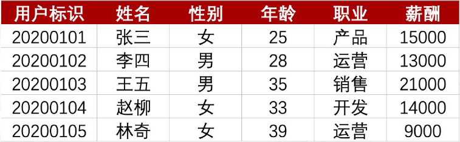

基于下面这个二维的数据表，根据第一列的列字段，也就是我们的数据属性和数据维度，告诉我对应的是什么数据类型？

> 1. 定性：姓名、性别、职业
> 2. 定量：用户标识、年龄、薪酬

1、定⽐：主要是数值或数字类型，可以做加减运算，⽬的是得到更加精确的值，⽐如⾝⾼或者体重之类的
2、定距：主要是数值或数字类型，有单位，可以做加减运算，但是不能做乘除运算，⽐如温度之类的

<button name="button" style="color: black"><a href="/sjfx/Homework/2-2什么是数据.pdf" target="_blank">答案</a></button>

## 问答

> 学员：用户标识不是定序数据，属于定性数据吗？为什么会是定量数据呢
>
> 答：其实看情况的，比如 id 形式是乱码的就是定性，如果是一二三四有序的可以是定序 or 定量，因为可以通过加减获取用户量等等

---

> 学员：数据类型的转换
>
> 将姓名等定类数据按照拼音首字母进行排序这种是什么方法呢？将性别中的男和女定义为 0和1 这种又是什么方法呢？
>
> 答：
>
> 第一个，正常排序就是按照汉字的首字母进行顺序排序的
>
> 第二个，可以使用替换的方式，值为男性的替换为1，植性的替换为0

---

> 用户标识：为定距数据；
>
> 姓名、性别、职业：为定类数据；
>
> 年龄、薪酬：为定比数据；
>
> 没有定序数据；
>
> 定性数据：姓名、性别、职业。
>
> 定量数据：用户标识、年龄、薪酬。

## 期待你和我一起，用数据解析世界

欢迎关注我公众号：AI悦创，有更多更好玩的等你发现！

::: details 公众号：AI悦创【二维码】

:::

::: info AI悦创·编程一对一

AI悦创·推出辅导班啦，包括「Python 语言辅导班、C++ 辅导班、java 辅导班、算法/数据结构辅导班、少儿编程、pygame 游戏开发」，全部都是一对一教学：一对一辅导 + 一对一答疑 + 布置作业 + 项目实践等。当然，还有线下线上摄影课程、Photoshop、Premiere 一对一教学、QQ、微信在线，随时响应！微信：Jiabcdefh

C++ 信息奥赛题解，长期更新！长期招收一对一中小学信息奥赛集训，莆田、厦门地区有机会线下上门，其他地区线上。微信：Jiabcdefh

方法一：[QQ](http://wpa.qq.com/msgrd?v=3&uin=1432803776&site=qq&menu=yes)

方法二：微信：Jiabcdefh

:::

