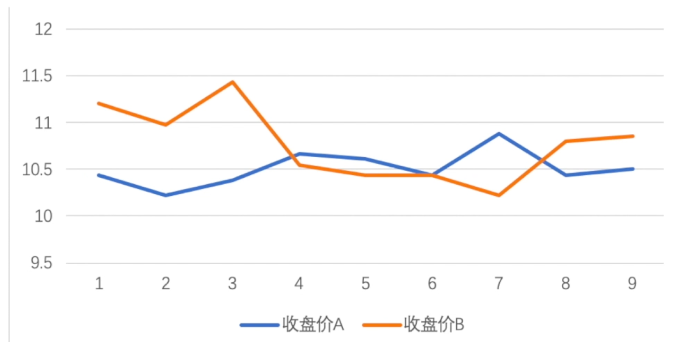
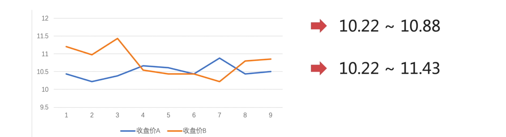
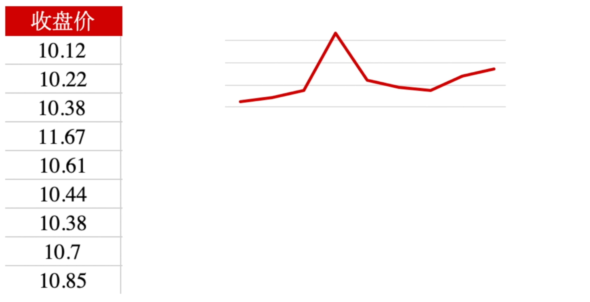
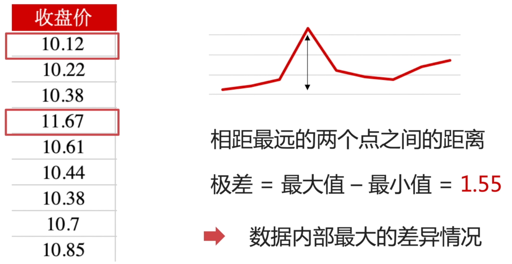
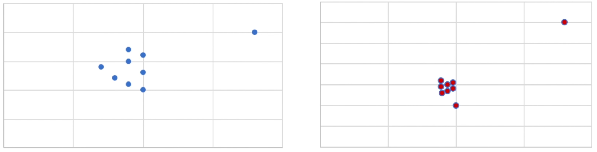
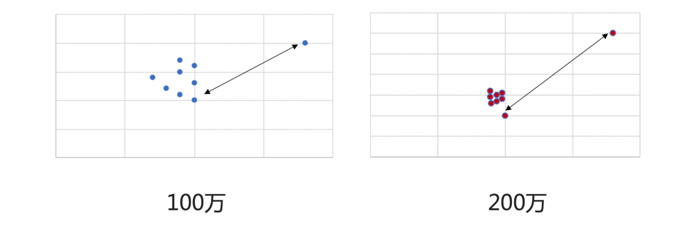
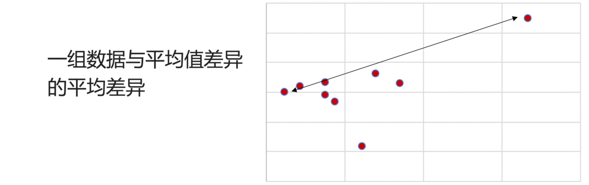
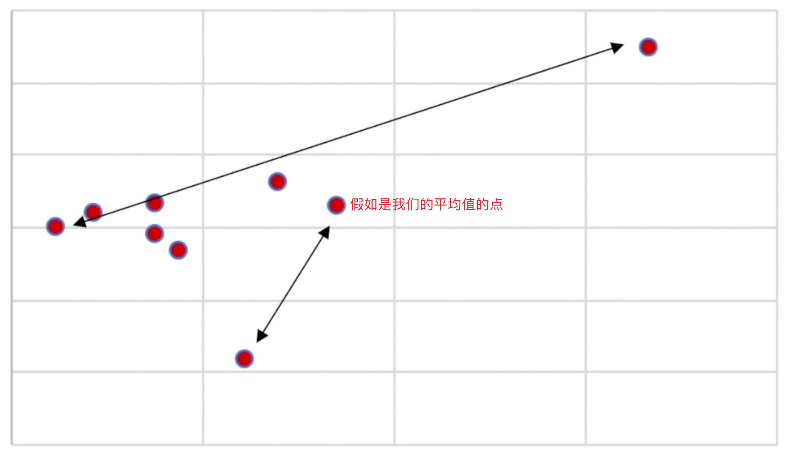
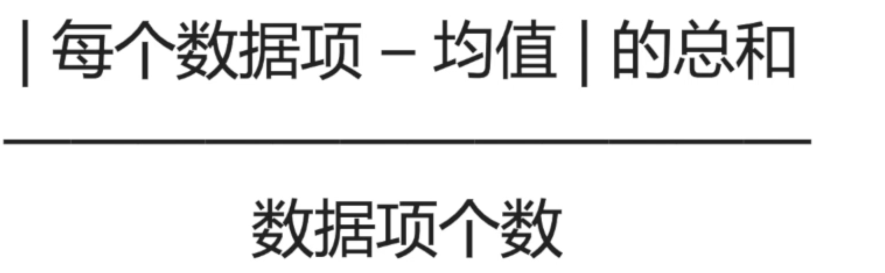

你好，我是悦创。

上节课我们学习了，集中趋势指标，并通过计算平均值、中位数、众数，了解了数据样本的一般水平。这节课，我们学习离散趋势指标，来了解一个数据的内部差异有多大。

## 什么是离散趋势指标

我以两支股票价格波动数据为例：

可以看到，股票 A，也就是蓝色这条线，它的波动比较平缓。股票 B 也就是橘色的那条，波动比较大。

那用数值化来表示，股票 A 的波动幅度是在：10.22～10.88 之间；

股票 B 的波动幅度是在 10.22～11.43 之间。

通过图示，我们可以得出一个很简单的结论：股票 A 相对于股票 B——波动的幅度是更小的。「股票 B 比股票 A 更离散」

**离散趋势指标，作为体现样本数据内部差异度的指标。** 主要有三类指标可以表示：

- 极差
- 平均差
- 标准差

接下来，我们来看看这几个指标的具体概念和区别。

## 极差

我们将收盘价的数据，以折线图的形式进行表示：

**极差就是求：两个相差最远点的之间的距离。**

那在上面的收盘价中，最小的值是 10.12，最大的值是 11.67。那通过计算：**极差=最大值-最小值=1.55** ，它体现的就是数据内部最大的差异情况。

**那么极差大样本的数据，内部一定离散程度高吗？**

我们来观察两组数据：

可以试想一下，上图左边是公司项目组 A 的业绩情况，右边是公司项目组 B 的业绩情况。

在项目组 A 中，表现最好与表现最差的，它们相差额度是 100万。

在项目组 B 中，表现最好与表现最差的，它们相差额度是 200万。

那么，通过观察我们的图表，项目组 A 相差 100 万，它们内部的离散程度，一定比项目组 B 相差 200 万极差的数据，离散程度要更小吗？——其实不一定的，也就是说： **极差不能体现，数据内部真正的离散程度** 。那么想要知道一组数据内部真正的差异情况，我们可以使用平均差。

## 平均差

平均差，就是指：每一个点，每一个数据，它相对于我们的平均值，与平均值之间的平均距离——也就是点与点之间的平均差异程度，就是我们的平均差。

公式：

## 期待你和我一起，用数据解析世界

欢迎关注我公众号：AI悦创，有更多更好玩的等你发现！

::: details 公众号：AI悦创【二维码】

:::

::: info AI悦创·编程一对一

AI悦创·推出辅导班啦，包括「Python 语言辅导班、C++ 辅导班、java 辅导班、算法/数据结构辅导班、少儿编程、pygame 游戏开发」，全部都是一对一教学：一对一辅导 + 一对一答疑 + 布置作业 + 项目实践等。当然，还有线下线上摄影课程、Photoshop、Premiere 一对一教学、QQ、微信在线，随时响应！微信：Jiabcdefh

C++ 信息奥赛题解，长期更新！长期招收一对一中小学信息奥赛集训，莆田、厦门地区有机会线下上门，其他地区线上。微信：Jiabcdefh

方法一：[QQ](http://wpa.qq.com/msgrd?v=3&uin=1432803776&site=qq&menu=yes)

方法二：微信：Jiabcdefh

:::

