# 视频

播单：[Bornforthis - 播单 - 优酷视频 (youku.com)](https://list.youku.com/albumlist/show/id_68857050)

[https://v.youku.com/v_show/id_XNTg4MjY2MTM2OA==.html](https://v.youku.com/v_show/id_XNTg4MjY2MTM2OA==.html)

如需观看视频，请添加微信：Jiabcdefh，备注来意。一个视频播放密码：5元。整套 699元。

# 笔记

你好，我是悦创。

如果，你已经是买了相机的。有三种情况：

1. 卡片机
2. 微单相机
3. 单反相机

**用好你手中的相机。**

**全画幅相机，尺寸再扩大 4 倍，才是我们的中画幅相机的尺寸。**

## 一、什么时候升级我的器材

首先，在没有十足的必要下，如果不是因为对焦速度实在是不够快或者是在弱光环境下成像实在是不够好，处了这两种情况下，我们一般不会升级我们的机身，我们会花更多的钱升级镜头。而升级镜头有几个原则。

### 1. 镜头不够广

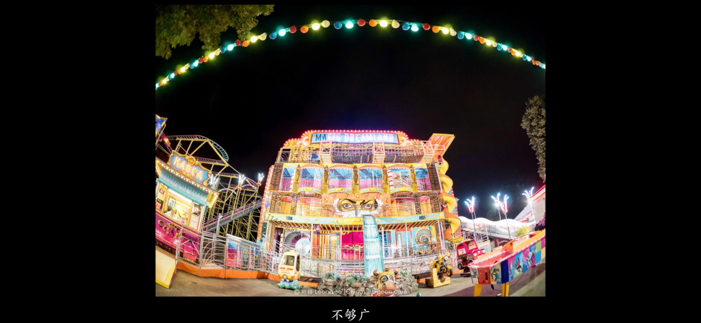

我的镜头不够广了，拍不下我想拍的东西。

### 2. 我拍的东西不够大

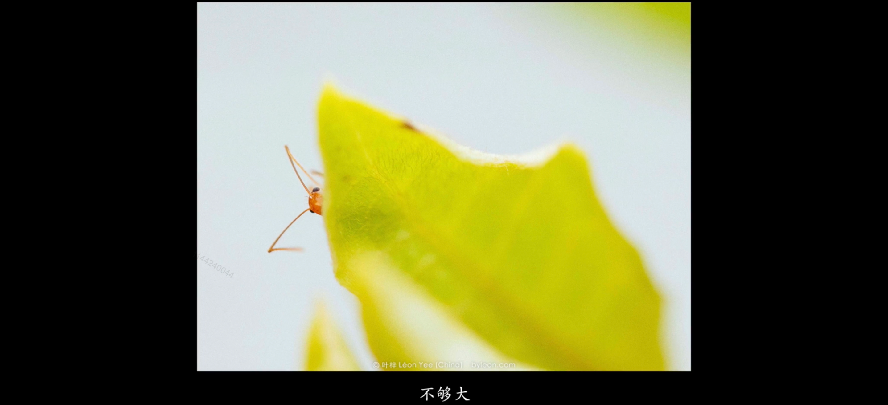

拍的小东西，拍的不够大，微距效果不够强，这个时候，就可能需要增加微距镜头。

### 3. 不够近

就是拍远方的东西，或者想把一些立体的东西拍成平面化，可能你需要添置长焦镜头。

### 4. 客户的相机比你的相机好

## 二、我需要什么类型的相机？

相机的种类千奇百怪，很多摄影初学者都不知道自己到底需要哪种类型的相机，不知道哪种相机是最适合自己的需求的，更不知道该如何选购了。虽然我们提供了叶梓老师的微信帐号做为摄影紧急救援专线，但老师一个人要回答全国摄影爱好者的提问，也很辛苦呢！

现在，[我们](https://www.katoclass.com/about-kato)特意制作了2.0版的相机选购路线图《我需要什么类型的相机呢？》，您只需要根据自己的情况，往下走下去，就会找到答案啦！

<button name="button" style="color: black"><a href="https://www.katoclass.com/wp-content/uploads/2012/12/How-to-choose-camera-A4-Print.jpg" target="_blank">附赠下载：能打印成A4纸张大小的高清大图（请点击下载）</a></button>

### 1. 单反相机

**优点：**

1. 光学取景，反应迅速；
2. 按钮很多，操作方便，功能全面；

**缺点：**

1. 略显专业，太过张扬；
2. 用单反相机去做新闻摄影或者纪实摄影的时候，很容易引起对方情绪上的反弹；
3. 单反相机是单镜头反光相机，这相机里面有一片镜子，每按一下快门就会弹动一下——震动明显，噪音很大，拍出来的照片容易模糊。

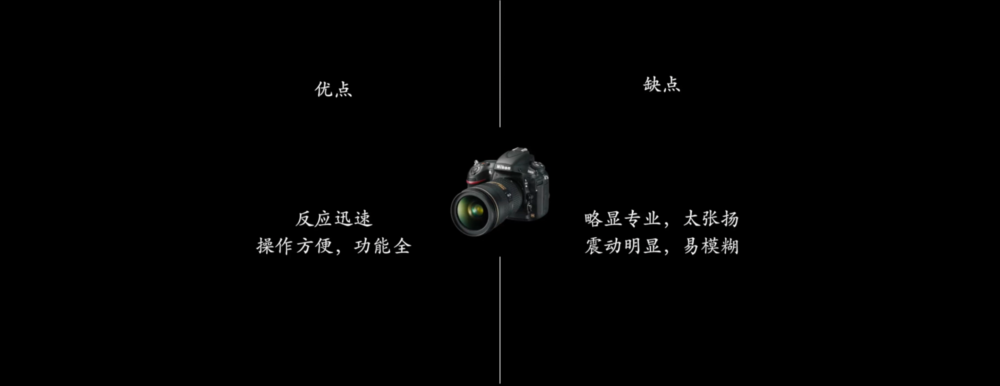

基于单反相机的优缺点 ，我们会用它来拍摄什么样的题材呢？

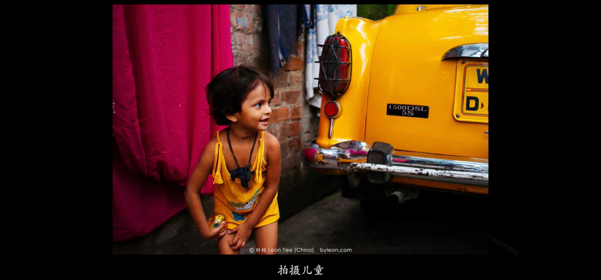

儿童主要是动起来太快，我们抓拍他实在是不容易，所以我们还是愿意使用单反相机来拍摄儿童。

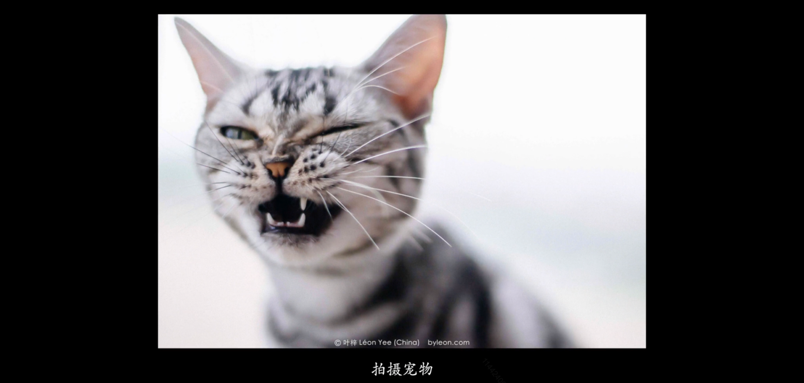

拍摄宠物，或者其它动物的时候，我们也会使用单反相机，原因同上。

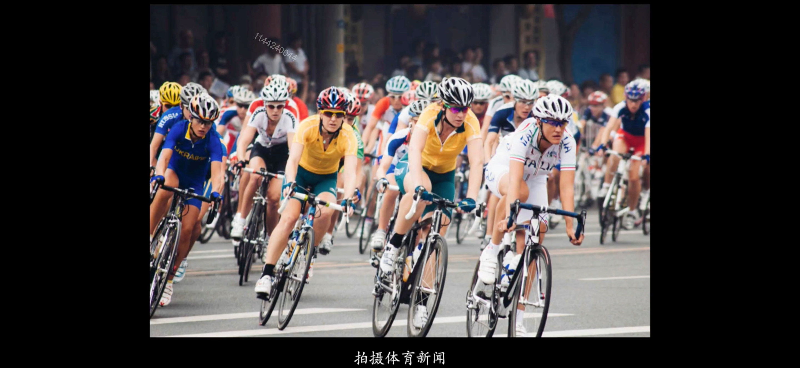

拍摄体育类的时候，我用有可能非用单反相机不可。单反相机是为快而发明的，所以它是为记者发明的相机。

### 2. 旁轴相机

**优点：**

1. 轻便，低调；
2. 噪声小；
3. 对焦精密（旁轴测距仪相机）；
4. 这是目前相机，在对焦上无与伦比的相机；（虽然，它只能用手动对焦模式，这个地方要注意：我不是说手动对焦是最精密的，我说的是旁轴测距仪相机的手动对焦是最精密的）

**缺点：**

1. 对焦缓慢，毕竟要手动对焦嘛；
2. 而且镜头能拍到的效果也是看不见的，你不知道你拍出来的是什么样子——拍摄效果不直观；
3. 构图有偏差，你真正拍到的画面，会在你看到画面的，右下角；

所以，基于旁轴相机画质清晰、相机又低调这个特性，我们经常用它拍摄人文摄影。

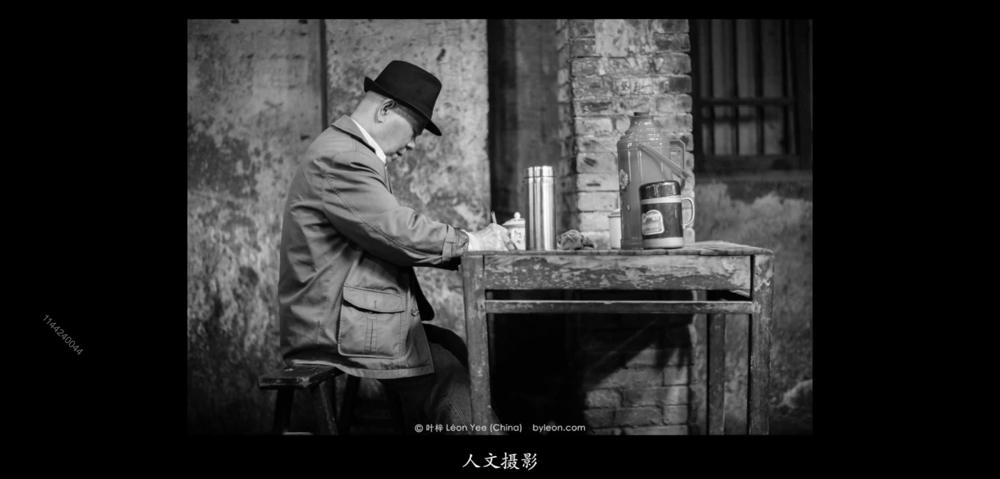

在剧院、法博物馆中，单反相机的噪音又太大不让进入，但是旁轴相机可以进入。

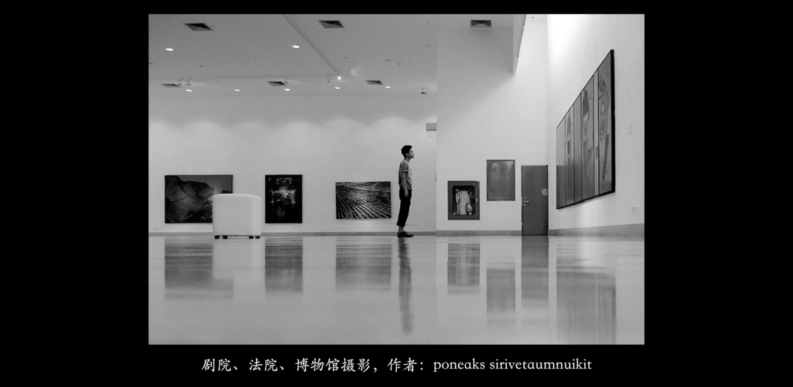

在弱光环境下，旁轴相机有可能会比单反相机来的清晰。

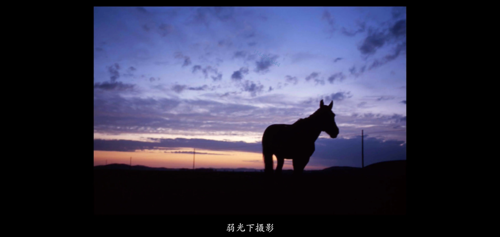

### 3. 微单相机

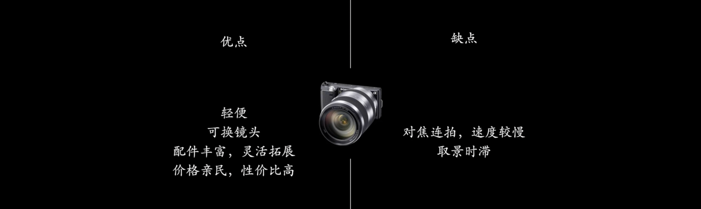

**优点：**

1. 因为，它去掉了单反的反光镜的结构，所以它非常小巧——轻便；
2. 可以更换镜头（单反也可以）；
3. 配件丰富，灵活扩展；
4. 价格亲民，性价比高；

**缺点：**

1. 对焦速度，和连拍速度一般来说会比较慢（高端的微单相机除外）；
2. 取景时滞，因为是电子取景，所以不像光学取景那样快捷；
3. 当然，如果大家使用的这个微单相机的感光元件比较小的话，那么在暗光摄影的画质，可能会不如全画幅单反相机。

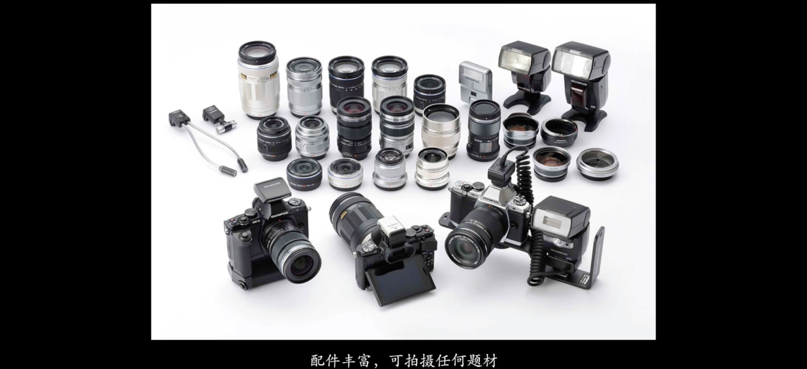

一台单反的价格，可以顶四台微单的奥林巴斯顶级微单的价格。

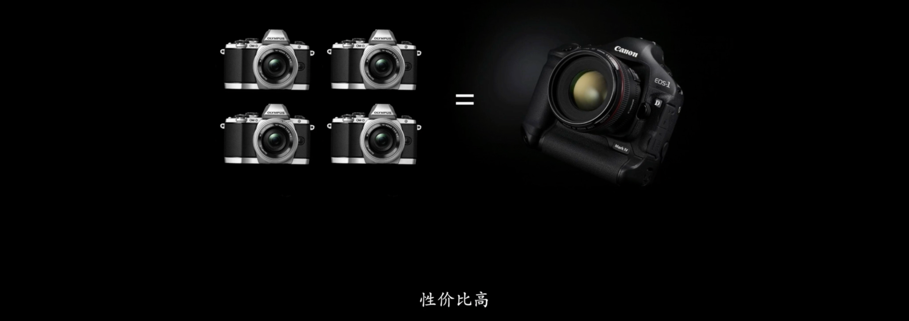

### 4. 便携相机

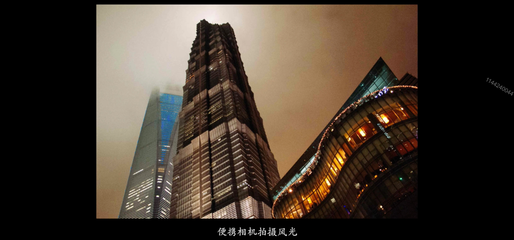

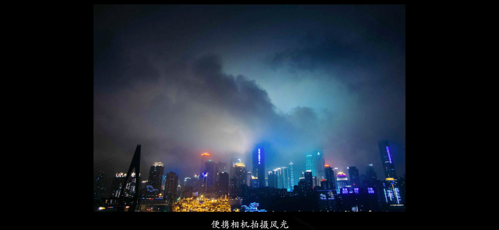

### 5. 中画幅相机

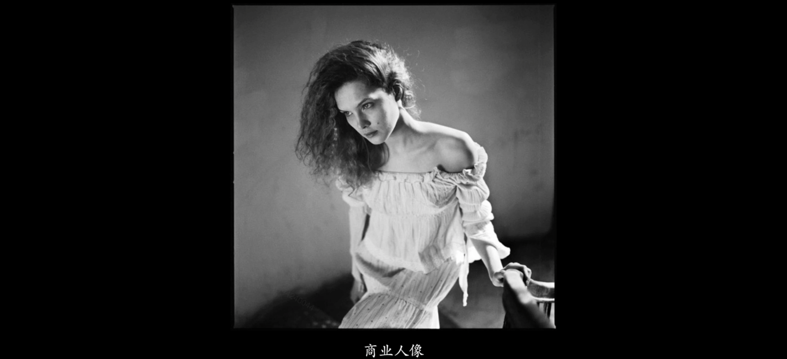

中画幅相机拍出来，一般都是正方形的。

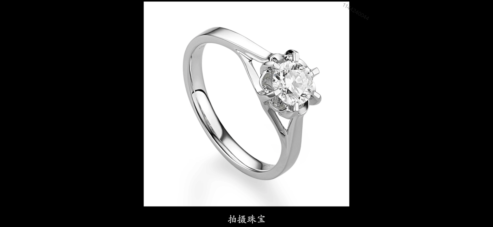

### 6. 大画幅相机

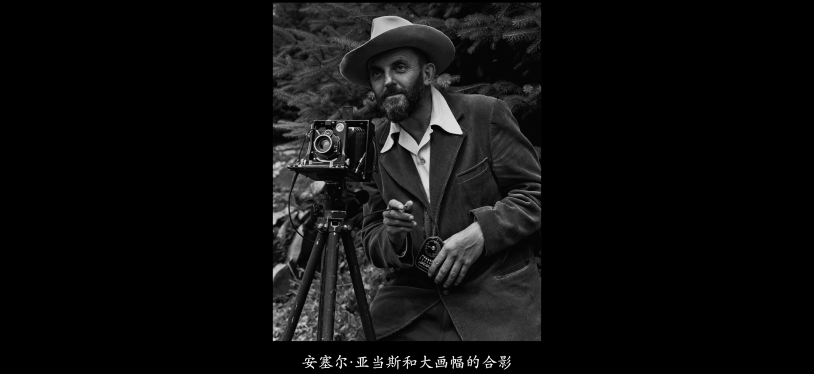

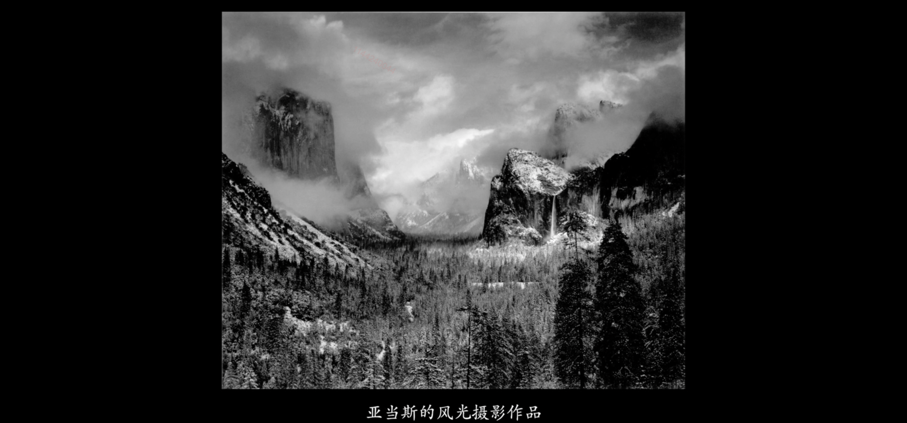

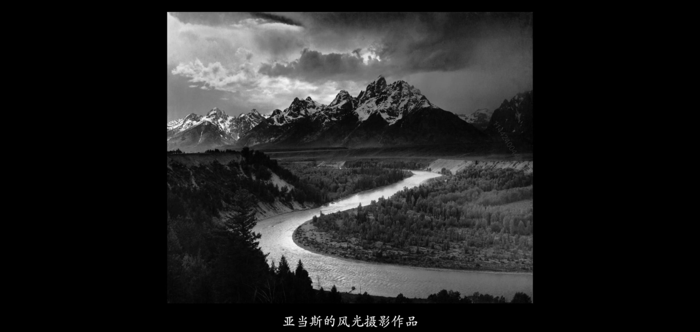

欢迎关注我公众号：AI悦创，有更多更好玩的等你发现！

::: details 公众号：AI悦创【二维码】

:::

::: info AI悦创·编程一对一

AI悦创·推出辅导班啦，包括「Python 语言辅导班、C++ 辅导班、java 辅导班、算法/数据结构辅导班、少儿编程、pygame 游戏开发」，全部都是一对一教学：一对一辅导 + 一对一答疑 + 布置作业 + 项目实践等。当然，还有线下线上摄影课程、Photoshop、Premiere 一对一教学、QQ、微信在线，随时响应！微信：Jiabcdefh

C++ 信息奥赛题解，长期更新！长期招收一对一中小学信息奥赛集训，莆田、厦门地区有机会线下上门，其他地区线上。微信：Jiabcdefh

方法一：[QQ](http://wpa.qq.com/msgrd?v=3&uin=1432803776&site=qq&menu=yes)

方法二：微信：Jiabcdefh

:::

