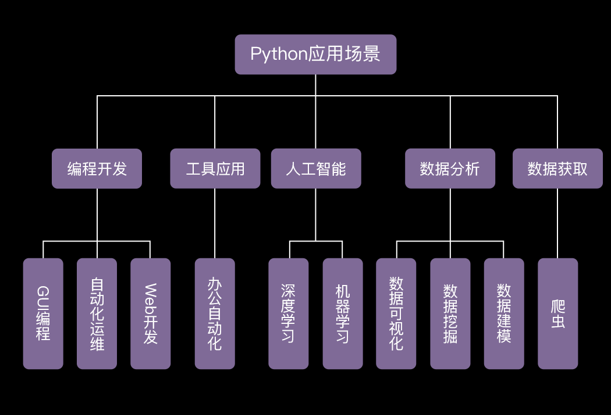
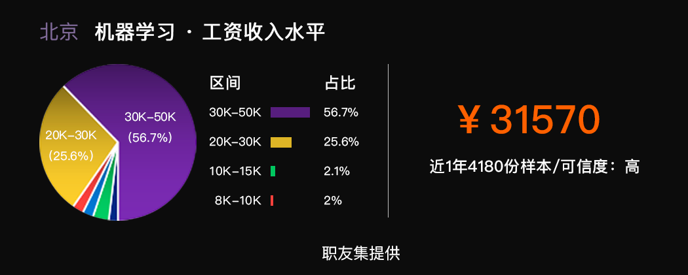
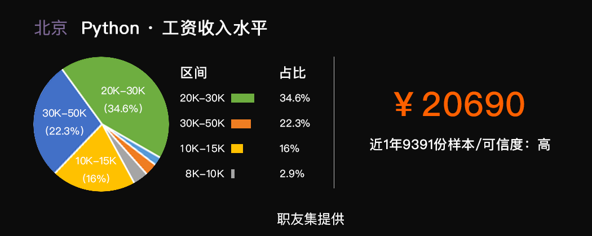
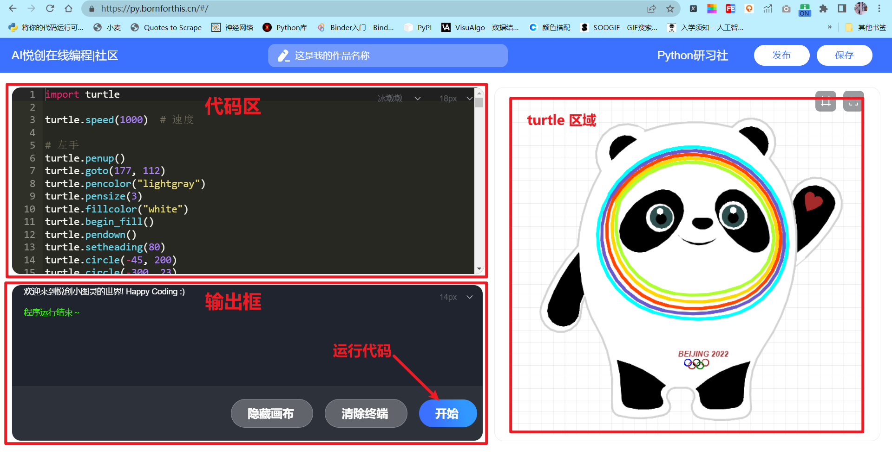

> 机智如你，这样你就可以更加专注的投入到学习中去，准备好我们就可以扬帆远航啦~

## 前言

你好，我是悦创。先带你们认识一下 Python 这个神奇的工具。

一说起 Python，大家总会联想到近来超火爆的人工智能，没错，Python 就是人工智能的入门基础。

废话少说，悦创现在就带你感受一下使用 Python 实现人工智能。

有了 Python，你不光可以和**人类**对话，还可以和**机器人**对话，可别小瞧了机器人的智商~


我们来试着和可爱的机器人，悦创宝宝说说话吧~

首先，现在你电脑的命令行输入如下命令安装我开发的库：

```python
pip install TuringRobots
```

安装之后，如下代码使用：

```python
from TuringRobots import TuringRobots

times = 1
print('你好，我是聊天机器人-小悦。\n有人说我有10岁人类的智商，你想试试吗？\n我可以回答你3个问题，来吧。')
while True:
    userinput = input('第{}个问题：'.format(times))
    print('小悦：' + TuringRobots(userinput, over_print=False)[1])
    if userinput == '再见' or times >= 3:
        print('小悦：我要走了，祝你学得快乐，再见！')
        break
    times += 1
```

输出示例：

```python
你好，我是聊天机器人-小悦。
有人说我有10岁人类的智商，你想试试吗？
我可以回答你3个问题，来吧。
第1个问题：你是谁？
小悦：在下图灵机器人，请多多指教。
第2个问题：你是谁？
小悦：聪明又善解人意的小悦就是我了
第3个问题：再见
小悦：你是要先溜了吗？
小悦：我要走了，祝你学得快乐，再见！

Process finished with exit code 0
```

刚才和你聊天的是一个10岁人类智商的机器人，是不是还蛮有趣的？

区区几行代码就能做出一个机器人？Python就是这么简单易学！

当然，简单易学并不影响 Python 的强大，在信息时代，在人工智能、数据分析、自动化控制、系统开发等各个领域都有 Python 的身影。



这些都是能用 Python 实现的，甚至还不止这些。相信屏幕前的你此刻已经暗暗立下了目标，当然，无论你想选择什么方向，都得先扎扎实实的打好 Python 基础。

那学这个到底赚不赚钱呢？当然！岗位需求量非常大，在这个人才过剩的时代，各大公司还是疯狂的在寻觅懂编程和人工智能的员工，并且给出相当丰厚的工资！





不光技术人员，在如今自动化办公的趋势下，很多非技术人员以及业界大佬，也都开始了 Python 之旅，比如销售、财务、运营、分析师等。

所以，你不用担心自己学不会，无法就业，或者不适合自己，大胆的迈出第一步吧，相信你在小悦的带领下，一定能掌握这个有趣强大的技能。

接下来我们会讲基础知识，比如【print 函数】、【变量】、【数据类型】、【input 函数】等等，起初的知识会比较简单，大家可以很快学会并且上手练习。

等学到后面，你们就可以用各种模块和库，随心所欲实现你的需求啦~

在正式开始课程之前，这里还有非常好用的学 Python 三大武器，一定要非常认真的阅读。

## 第一大武器：[在线编辑器](https://py.bornforthis.cn/#/)：[https://py.bornforthis.cn/#/](https://py.bornforthis.cn/#/)



在基础课阶段，我们统一使用线上编程环境，可以节省掉繁琐的安装步骤~等学好了再安装也不晚。

此处划重点---在程序员的神秘世界，上图被称为【编辑器】，左上框叫【代码编辑区】，可以写代码，左下的框叫【终端】，可以显示代码运行之后的东西。记住以后就可以和程序员 battle 啦o(*￣▽￣*)ブ。右边是为了给小盆友设计的渲染 turtle 库。

在代码框写好代码之后，我们点击 **【开始】** 按钮，如果运行失败，可以留言并自行 debug 一波，当然你也可以选择跳过，继续学习后续内容。

遇到不会的问题，可以点 **【求助】** 按钮，扫码分享到微信群，助教就可以看到你的代码帮你解答。

让我们试着运行另外一个人工智能相关的代码案例熟悉一下，一起感受图像识别的魅力~

据说，学习 Python 的都是善良可爱的宝宝，小悦怎么知道的呢？下图这个戴粉色帽子的小可爱告诉我的：


这是学习 Python 的同学们之间广为流传的一个表情包，虽然学习路上荆棘密布，但是小可爱们还是很善良，而且善良到炸 O(∩_∩)O哈哈~

## 第二大武器：思维提升利器

光学代码可不行，为了提升你的编程思维能力，和更开阔的眼界，我们还为你准备了很多加餐。

我会在学习群分享很多前沿知识，在手机端社群里即可完成。

添加微信：Jiabcdefh，即可进群。

## 第三大武器：课后作业

如果说光学习课程内容，你只能学会本次课程的40%，社群分享占20%，还有一个重头戏，就是课后作业，同样占比40%，它可以更好的帮助你巩固知识。

有一个神奇的现象，当你做课后作业的时候，会发现，课上很多知识并没有真正掌握Σ(っ °Д °;)っ！所以一定要认真完成作业。

三大武器介绍完，现在让我们正式开启 Python 之旅，我们的故事从这里开始……

小悦近来日思夜想，做了一个伟大的决定！


哈哈哈哈，做梦都会甜齁！

不说废话，直接上图，信不信完全 hold 住你的 24k 纯金 eyes！（吃瓜脸0o0)


肿么样，是不是还不错？咳咳……


“小悦奶茶馆今天正式开张了，欢迎喜爱奶茶的你，赏光大驾，小悦将竭诚为您服务！”

随着越来越多的朋友口口相传，奶茶馆生意越来越红火，小悦甚是开心。

但是这也带来了一定的点单压力，于是，奶茶馆门前排起了长长的队伍。


为了缩短大家的购物时间，小象君拿出了自己的老本行，动动手指写了几行代码，开发了一款简易自助点单系统。


它可以实现什么功能呢，好奇的你先一睹为快吧！

```python
print(40 * "*")
print("""欢迎光临小悦奶茶馆！\n小悦奶茶馆售卖宇宙无敌奶茶！\n奶茶虽好，可不要贪杯哦！\n每一次限尝一种口味：\n1. 原味冰奶茶 3元\n2. 香蕉冰奶茶 5元\n3. 草莓冰奶茶 5元\n4. 蒟蒻冰奶茶 7元\n5. 珍珠冰奶茶 7元""")
print(40 * "*")
milk_tea_no = input("请选择购买奶茶的编号 1/2/3/4/5:")
sum_money = 0
if int(milk_tea_no) <= 5 and int(milk_tea_no) >= 1:
    milk_tea_amount = int(input("请输入您要购买的数量(整数哦):"))
    if milk_tea_no == "1":
        sum_money = milk_tea_amount * 3
        print(f"您购买的是{milk_tea_no}号奶茶, 共购买{milk_tea_amount}杯，总计{sum_money}")
    elif milk_tea_no == "2":
        sum_money = milk_tea_amount * 5
        print(f"您购买的是{milk_tea_no}号奶茶, 共购买{milk_tea_amount}杯，总计{sum_money}")
    elif milk_tea_no == "3":
        sum_money = milk_tea_amount * 5
        print(f"您购买的是{milk_tea_no}号奶茶, 共购买{milk_tea_amount}杯，总计{sum_money}")
    elif milk_tea_no == "4":
        sum_money = milk_tea_amount * 7
        print(f"您购买的是{milk_tea_no}号奶茶, 共购买{milk_tea_amount}杯，总计{sum_money}")
    else:
        sum_money = milk_tea_amount * 7
        print(f"您购买的是{milk_tea_no}号奶茶, 共购买{milk_tea_amount}杯，总计{sum_money}")
vip = input("您是小悦奶茶馆的会员吗(y/n)?").lower()
if vip == "y":
    print(f"您可以享受会员价，折后总价: {sum_money * 0.9}元")
else:
    print(f"很抱歉，你只能按原价{sum_money}元，购买。")
print('****************************************')
print('做一枚有态度、有思想的奶茶馆（傲娇脸）！\n\t祝您今日购物愉快！\n\t\t诚挚欢迎您再次光临！')
print('****************************************')
```

点单程序启动之后，顾客就可以根据提示输入想要购买的奶茶编号和购买数量，程序会马上打印顾客的购买信息，会员还可以享受 9 折优惠。


