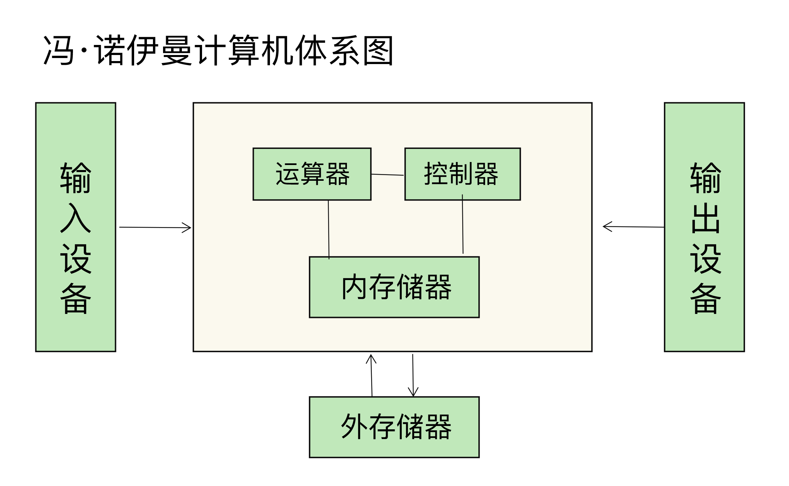
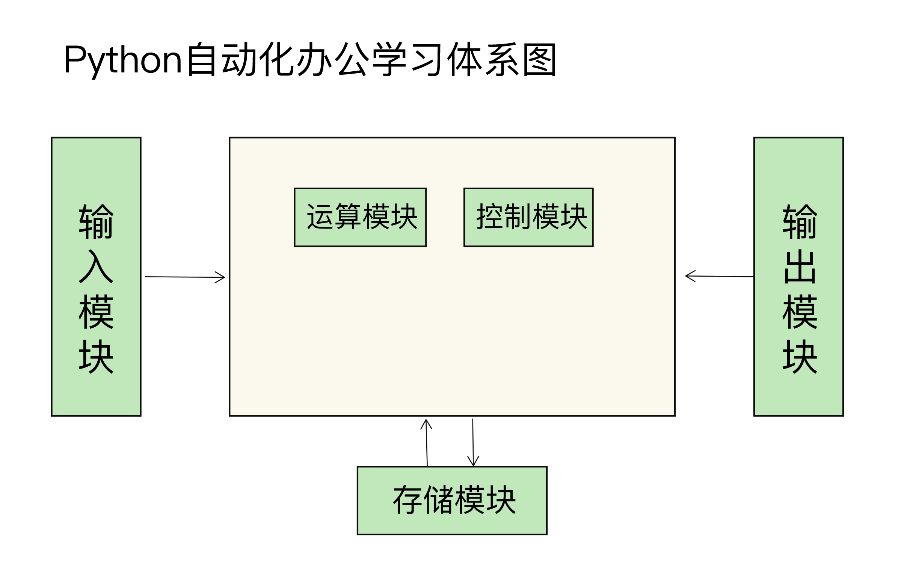

你好，我是悦创。

欢迎你来到《Python 自动化办公实战课》，在接下来的 3 个月时间里，我们一起通过办公自动化来提升工作效率。

工作 15 年来，我在教育公司做过技术总监，也在朋友公司做过技术经理，负责公司运维平台建设和相关工具的开发工作，几乎每天都在和 Linux 打交道。

在这门课之前，我已经在 Bornforthis 开设了两门课程：《零基础学 Python 私教》和《Linux 实战技能 100 讲私教》，为 Python 语言的初学者和运维工程师、开发工程师提供系统化的课程，目的就是解决他们在学习、实践中遇到的 80% 的问题。「目前还未上线，敬请关注公众号：AI悦创，并加入交流群。微信：Jiabcdefh。

所以，这次我又为你带来了《Python 自动化办公实战课》这门专栏课程。我总结了工作这些年来切身经历的、经常被问到的办公效率低下问题，以及对应的解决方案，我会把它们全部分享给你。

希望你学完这门课，能够**告别重复、机械的工作，提高工作效率，同时也能把时间花在刀刃上，去提升自己的核心竞争力。**

说到这里，你脑中是不是回忆起了一幕幕的低效工作场景：

- 需要对 Excel 文件中的内容进行拆分和合并，你要一个个手动拆分再合并；
- 文件夹里有大量图片需要重命名，你不得不挨个儿点击一张张图片，再重新命名；
- 网络中有大量新闻和图片需要下载，你就要手动把每个网页另存为文件；
- 需要把数据快速生成自己想要的图形，一个一个图形参数来设置；
- 需要让计算机在凌晨执行任务，你只能让闹钟在半夜把自己叫醒，人工执行，观察执行结果；
- ……

这些工作其实难度都不大，但它们有一个共同的特点，就是 **重复、机械的手工劳动，非常耗费时间和精力。** 实际上，我们换一种方法，就可以快速完成这些工作，节省数倍的时间。如你所想，这些都是我要通过这门课帮助你解决的问题。

那具体怎么解决呢？

## 解决这些低效问题，我的思路是什么？

其实，我们现在的办公环境，已经基本实现自动化了，Word、Excel、邮件、思维导图等各种各样的工具都非常顺手，表格的合并拆分、使用快捷键进行文件的各种操作等各种技巧也是随手一搜就能得到。但相应的问题也就来了，我们怎么用好这些工具、怎么内化这些技巧呢？

静下心来想一下，现在我们掌握的绝大多数办公工具和技巧，都是基于计算机的。那这个问题，就可以用计算机的思维从根儿上去解决了。所以，我们不妨引入《设计模式》的思路：**代码封装得越“高级”，解决的问题就越具体；越深入计算机底层，解决的问题就越通用。**

如果你暂时不理解这句话的意思也没关系，只需要明白这样一点就可以：**要想快速提高办公效率，解决方法不在各种小技巧和小软件，而在于理解底层逻辑，以及加快人和计算机的交互过程**，能够高效地解决输入（格式转换）、输出（格式统一）、控制（内容处理）、运算（查找、替换）、存储（文件保存和绘图），自然就能解决大部分的效率问题。

只要对计算机的体系结构稍有了解，你就会听说过冯 · 诺依曼结构：计算机由运算器、控制器、存储器、输入设备和输出设备这五部分组成。所以，我们解决用好自动化办公工具和技巧的方法，和经典的冯 · 诺依曼结构是相吻合的，就是**理解计算机的底层逻辑，从而提升我们和计算机交互的效率。**

说到这里，我可以给你分享一段我的工作经历。我曾经维护过日活超过 3 亿用户的私信平台，你可以看看我是怎么用计算机的思维，来提高自己和团队的工作效率的。

我们在一个业务模块中，需要批量替换 200 台服务器中的软件配置，而且每个服务器都有一个文件，需要将第五行内容, 由原有的接口版本 v1 统一替换成 v2。

面对这样的需求，其实有很多挑战在里面。第一个是替换的实效性，如果手动替换接口版本，由于服务器过多，用户就有可能访问到还没来得及替换的接口上，如后就有可能看到自己的消息是已读状态，一刷新页面，又变成了消息未读。第二个就是服务器数量很多，手动替换还没做完，下一个需求就接着来了。第三，手动替换这么多服务，非常容易出现拼写错误，也就是我们常说的手误，导致你要再花更多的时间来排捉 Bug。

这样很低效对不对？如果使用 Python 的话，我们就可以从 3 个方面来提升效率。

欢迎关注我公众号：AI悦创，有更多更好玩的等你发现！

::: details 公众号：AI悦创【二维码】

:::

::: info AI悦创·编程一对一

AI悦创·推出辅导班啦，包括「Python 语言辅导班、C++ 辅导班、java 辅导班、算法/数据结构辅导班、少儿编程、pygame 游戏开发」，全部都是一对一教学：一对一辅导 + 一对一答疑 + 布置作业 + 项目实践等。当然，还有线下线上摄影课程、Photoshop、Premiere 一对一教学、QQ、微信在线，随时响应！微信：Jiabcdefh

C++ 信息奥赛题解，长期更新！长期招收一对一中小学信息奥赛集训，莆田、厦门地区有机会线下上门，其他地区线上。微信：Jiabcdefh

方法一：[QQ](http://wpa.qq.com/msgrd?v=3&uin=1432803776&site=qq&menu=yes)

方法二：微信：Jiabcdefh

:::

