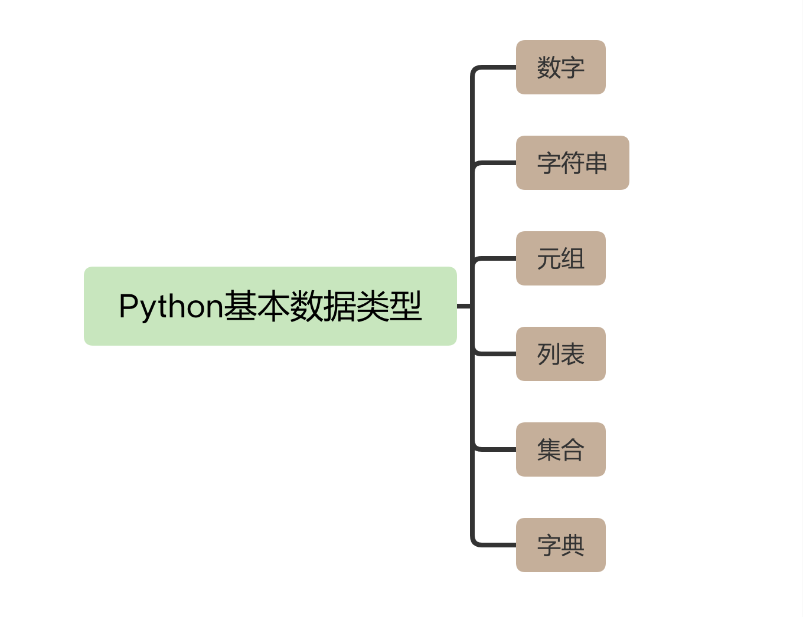

你好，我是悦创。

咱们这个课程是用 Python 解决办公低效问题，但是即使你从来没有用过 Python，甚至没有任何的编程语言基础，也完全可以学会这门课。

为了解决你的语言问题，我特意准备了这节课。我会给你讲解 Python 的五个最基础的语法知识，包括运行环境配置、变量、数据类型、控制语句和使用函数库的方法。

这节课的内容也不需要你马上掌握，其中提到的一些关键知识，我会在后面的课程中详细讲解，包括它们的使用场景和具体用处。 **学完这节课，你只要能对 Python 有一个初步的了解，可以看懂基本的 Python 代码就行了。**

当然，如果你有一定的 Python 语言基础，那么这节课就相当于给你巩固复习了，帮你查漏补缺。

## 运行环境配置

我们先从 Python 的运行环境配置开始说起。初学者面对的最大难题，就是如何让自己的 Python 程序运行起来。

一般情况下，运行的 Python 代码会被保存到一个以.py 作为扩展名的文件中，也就是 Python 脚本文件。要想让 Python 程序运行，我们需要打开终端应用程序（在 Windows 中开始 - 运行 -cmd.exe）：

```python
python3 /py文件所在的路径/xxx.py
或
cd /py文件所在的路径
python3 xxx.py
```

这段代码中，`xxx.py` 就是我们编写好的 Python 脚本文件，Python3 是 Python 脚本文件的解释器，它会把我们编写好的代码翻译给计算机，让计算机去执行。

在运行程序的过程中，有两点需要注意。

第一，Windows 和 macOS 默认是没有安装 Python 解释器的，所以你需要通过 [Python 官方网站](https://www.python.org/downloads/) 下载不同操作系统下的 Python 解释器。关于 Python 的版本，我建议你使用官方建议的最新稳定版本，下载后直接安装就可以使用了。

第二，Python3 解释器需要在字符终端下运行。

以 macOS 系统为例，你需要打开终端来运行python3 -V 命令来验证 Python 解释器是否安装成功，如果显示了 Python 解释器的版本，那说明安装是成功的。如果提示没有找到这个命令，你需要重新安装，并注意安装过程中是否有错误提示信息。

```python
python3 -V # 执行的命令 
Python 3.9.1 # 返回的结果
```

搭建 Python 的开发环境，是运行一切程序的基础。无论你现在手边电脑操作系统是哪一种，我都建议你马上行动，先按照刚刚讲解的步骤，正确地安装和设置 Python 开发环境。这样在之后的课程中，你就能马上跟着我的讲解进行操作了。

## 变量

在正确配置好 Python 的开发环境之后，咱们继续学习一个重要概念：变量。

变量这个词来源于数学，在编程语言中，变量主要是用来存储计算结果或表示值的抽象概念。

计算机中的变量都有一个名字，我们把它称为变量名。这个名字一般是根据变量的英文名进行人为命名的，一般多用简短且易于记忆的名字。比如，我在课程中会使用 `src_path`、`dst_path` 两个变量表示操作源文件路径和目标文件路径。

我们还可以为变量指定一段数据，这段数据称作变量的值。计算机处理的数据很大一部分来源于用户输入的数据和运算的结果数据，如果这部分数据需要跟踪，我们就可以将数据存储在变量中。

对于初学者来说，变量的概念比较抽象，你可能现在有点蒙。别急，我现在给你举一个简单的例子，你一看就明白了。假如我要在 Python 当中计算两个数的和，代码如下：

```python
x = 100
y = 200
z = x + y
print(z)
```

在上面的代码当中， 我们分别定义了 x、y、z 三个变量。 x、y、z 称作变量名，定义变量名必须要遵从以下四个规则：

1.   变量名只能是字母、数字或下划线；
2.   变量名的第 1 个字母不能是数字；
3.   变量名也不能是 Python 的关键字；
4.   变量名是区分大小写的。

上述代码中的 = 和 +，称作运算符。

-   “=” 叫做赋值运算符。它的功能是将右边的表达式赋值给左边的变量。
-   “+” 叫做算术运算符。进行算术运算时还可以使用 -、*、/、% 等常用算术运算符号。

代码的最后一行，为了能让你的计算结果在终端上显示，我们需要使用一个叫做 print 的内置函数。

内置函数是 Python 内置的一种功能。比如代码中的 print 就是用来进行输出的。它的最基本用法就是在 print 函数的括号中写入变量，除了输出最终的结果外，也可以将 print 函数放在程序运行的过程中，方便你输出更丰富的调试信息。

通过上面的讲解，我为你介绍了变量如何进行赋值和如何输出。其实，在 Python 中变量用来存储的数据还会区分类，这些类型也有专门的名称，叫做数据类型。

## 数据类型

Python 支持的数据类型有数字、字符串、元组、列表、集合、字典 6 种，不同的数据类型用于描述不同的类别，比如姓名可以用字符串类型，性别可以用布尔型，身高可以用数字类型。下面的代码，我为你演示一下三种最简单的数据类型：

```python
name = "huang jiabao"
male = True
hight = 180
```

上面的三个变量，我分别为它赋予了字符串、布尔类型和浮点型这三种数据类型。 Python 的变量不需要事先定义变量类型，跟其他语言相比更加简洁。Python 可以直接对变量进行赋值，这样就可以根据变量值自动识别变量的类型了。

不过在上面的例子当中，你还需要注意两点。

一方面，如果你使用字符串类型，就必须给字符串增加引号。这是字符串的语法规定，如果不加引号会被识别为其他类型，在进行操作时就会得到不同的结果。

比如说，我定义 Python 的变量为“123”，加了引号会被识别为字符串，如果一个变量“123”没有加引号，则会被自动识别为数字。如果在 Python 程序中使用“123+123”会得到两个整数的和“246”，如果是“123”+“123”就会得到两个字符串的连接“123123”。

另一方面，使用布尔类型的时候，True 和 False 首字母必须要大写，它们是 Python 的关键字，如果首字母没有大写会被当作变量处理，解释器也会报错。True 在布尔类型表示真（对），False 表示假（错）。比如算式 10>5 是正确的，在 Python 中就会用 True 来表示结果是真，反之为假。

上面提到的整数、浮点数和布尔型都是属于数字类型。除了这些，Python 还支持很多种数据类型，包括数字、字符串、元组、列表、集合、字典等。它们之间的关系，我用下面的思维导图为你进行展示。



我在课程中会逐一为你剖析它们的用处, 让你能够全部掌握。当你学会这些类型的时候, 可以更精确地描述数据，比如，我想用 Python 的数据类型存储“5 个苹果和 10 个橘子”，我们就需要使用字典和字符串来表示这些数据。你可以看一下下面这个记录水果数量的例子：

```python
fruits1 = {"apple":5, "orange":10}
fruits2 = "apple,5,orange,10"
```

我分别用字典和字符串记录了水果的名称和数量，可以看到，字典表达的水果和数量之间的映射关系更明确，而且不同的数据类型还能支持它特有的内置方法。例如上面定义了水果的字典数据类型，我们可以通过 `fruits["apple"]` 直接得到苹果的数量 5 , 有时候，这些便捷的内置方法也是我们选择数据类型的依据。

数据类型是一门编程语言的必要组成部分，学习编程语言主要就是为了掌握它的数据类型。这节课我只要求你能够了解 Python 有哪些基本数据类型就可以了，在之后的课程当中，我会为你重点介绍每一种数据类型的优缺点，以及该怎么使用它们。

## 流程控制

流程控制，就是我们经常说的程序执行的顺序控制。 从上面的几个例子当中，你会发现程序都是从上向下依次执行的。这也是 Python 语言最简单的结构——顺序结构。在 Python 中，除了顺序结构之外，还有分支和循环两种结构。


欢迎关注我公众号：AI悦创，有更多更好玩的等你发现！

::: details 公众号：AI悦创【二维码】


:::

::: info AI悦创·编程一对一

AI悦创·推出辅导班啦，包括「Python 语言辅导班、C++ 辅导班、java 辅导班、算法/数据结构辅导班、少儿编程、pygame 游戏开发」，全部都是一对一教学：一对一辅导 + 一对一答疑 + 布置作业 + 项目实践等。当然，还有线下线上摄影课程、Photoshop、Premiere 一对一教学、QQ、微信在线，随时响应！微信：Jiabcdefh

C++ 信息奥赛题解，长期更新！长期招收一对一中小学信息奥赛集训，莆田、厦门地区有机会线下上门，其他地区线上。微信：Jiabcdefh

方法一：[QQ](http://wpa.qq.com/msgrd?v=3&uin=1432803776&site=qq&menu=yes)

方法二：微信：Jiabcdefh

:::


