## sqlitestudio 介绍

本节内容的目的，是教大家如何在非代码的情况下，创建 sqlite3 数据库文件和表格编辑操作。

既然不写代码，就肯定需要借助软件来操作。本节课对应的源码中，准备好了 windows、macos、linux 三个系统的 sqlitestudio 软件，如下图：

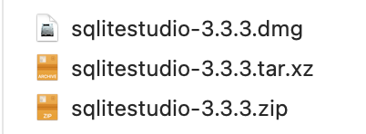

> windows 使用 zip；macos 使用 dmg；linux 使用 tar.xz；

sqlitestudio 是一款绿色软件，安装你的操作系统所对应的 sqlitestudio 软件，然后执行，就可以得到启动界面。

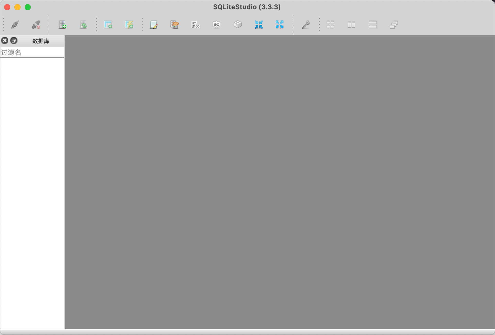

## 新建  sqlite 数据库文件

点击左上角的数据库，选择添加数据库，则会弹框，让你选择某个数据库文件，或者创建一个新的 sqlite 文件

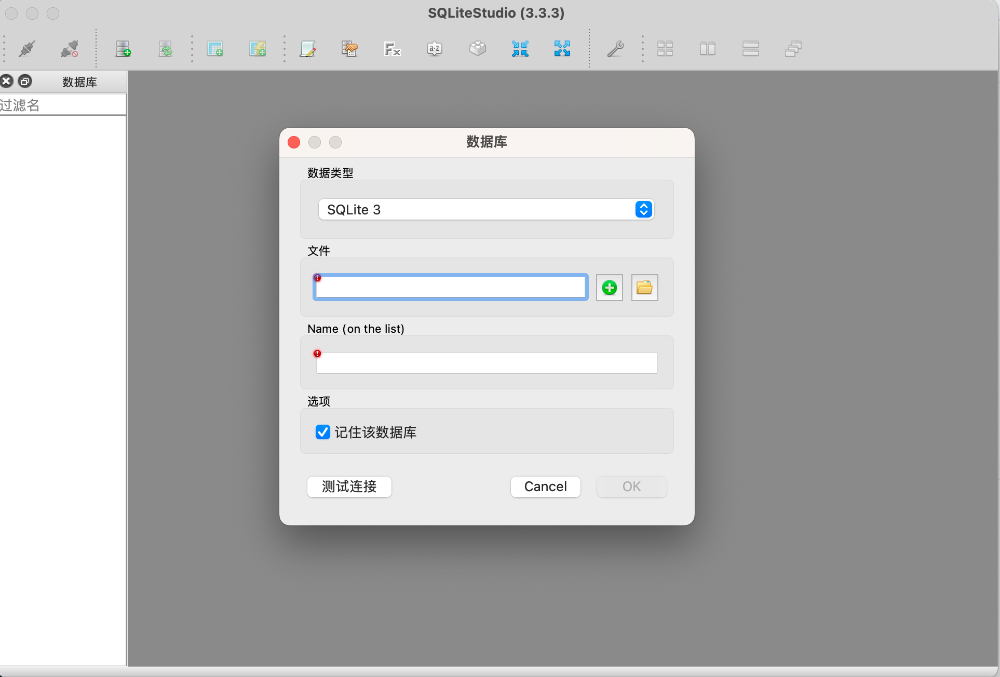

点击黄色的文件夹，是指打开某个存在的 sqlite 文件。

点击 `绿色的+` ，是新建一个 sqlite 文件，并且你也需要指定存储的具体位置。

选择在三个 sqlitestudio 安装包旁边，新建一个名为 `first.db` 的文件，如下截图：

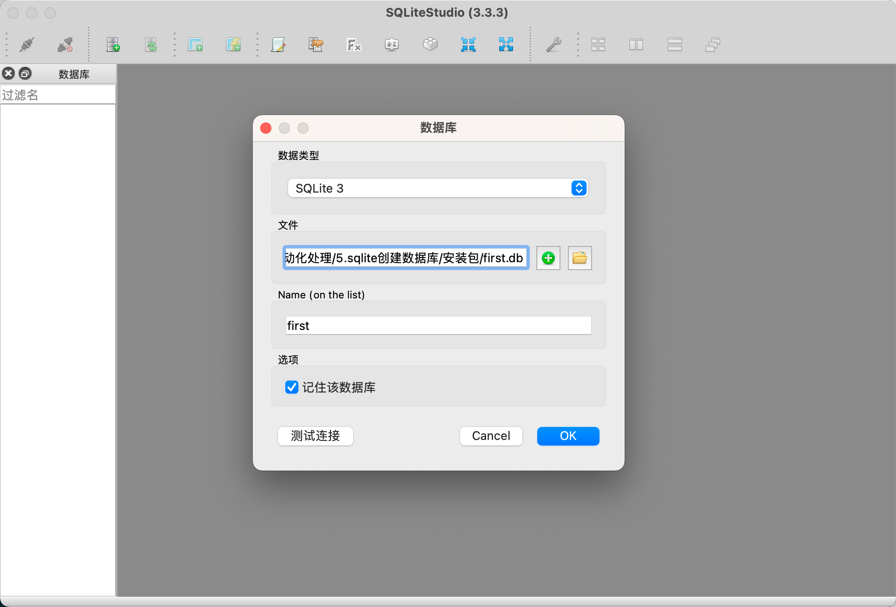

并且，文件也有对应的生成。

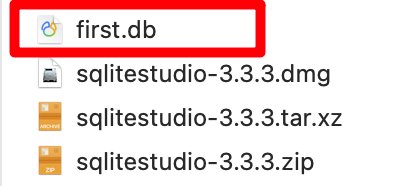

## 新增数据

回到 sqlitestudio 软件界面，打开刚新建的 `first.db` ，里面什么都没有，表格是空的，现在来新建一个表格。

鼠标右键点击 Tables，然后选择新建表格，在新出的界面中，写表格名、字段名和字段类型，如下图：

**方法一：**

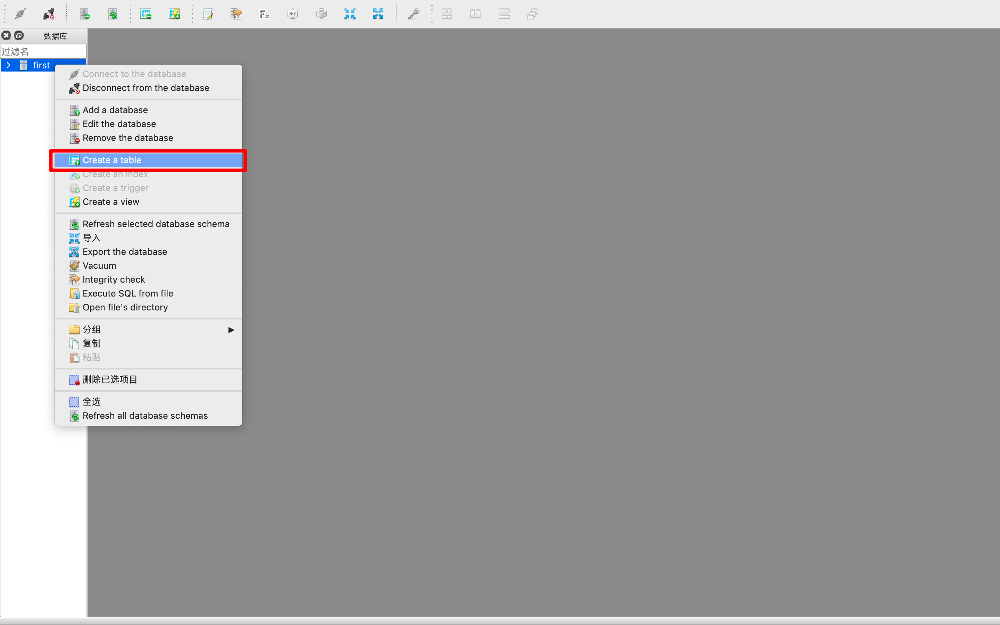

**方法二：**

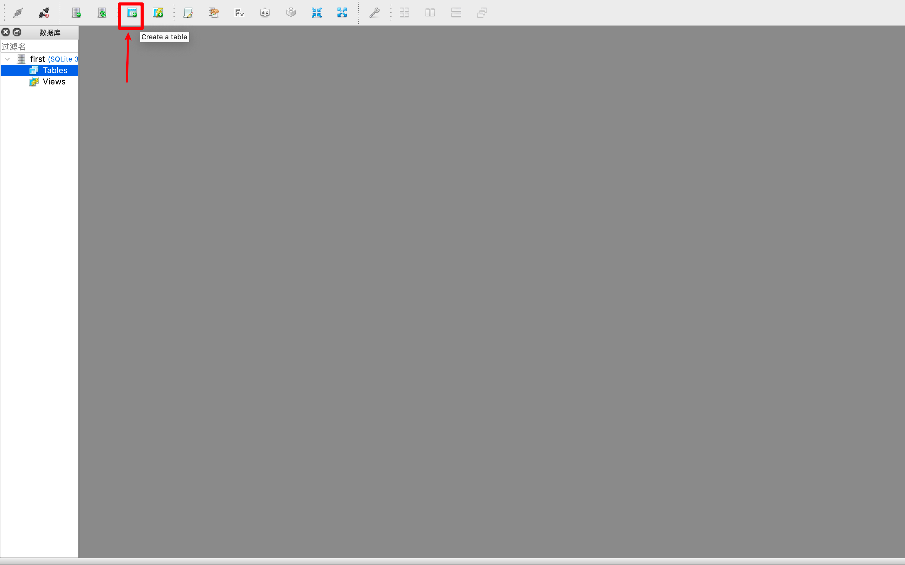

---

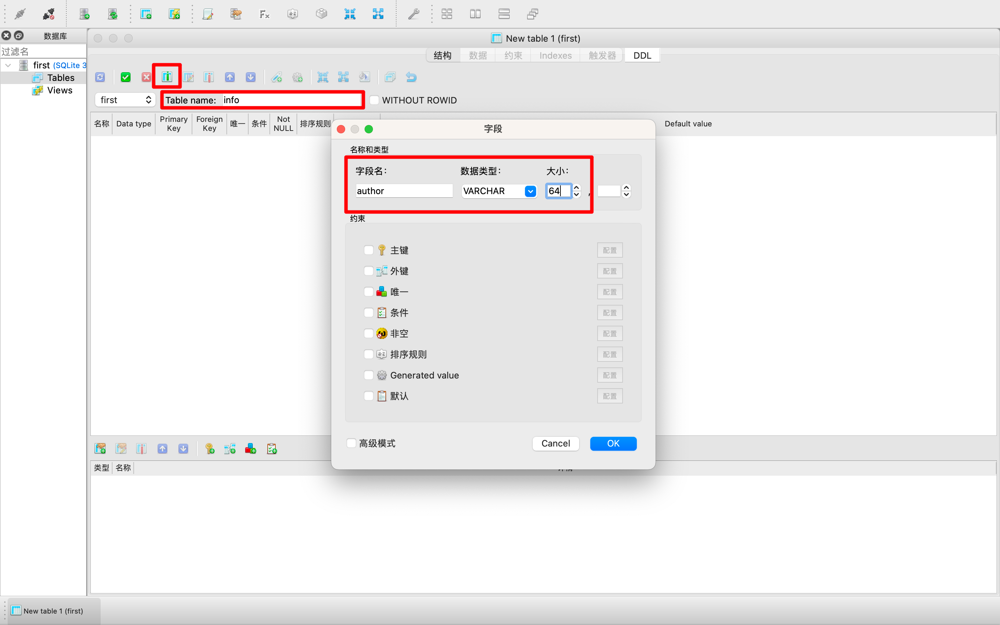

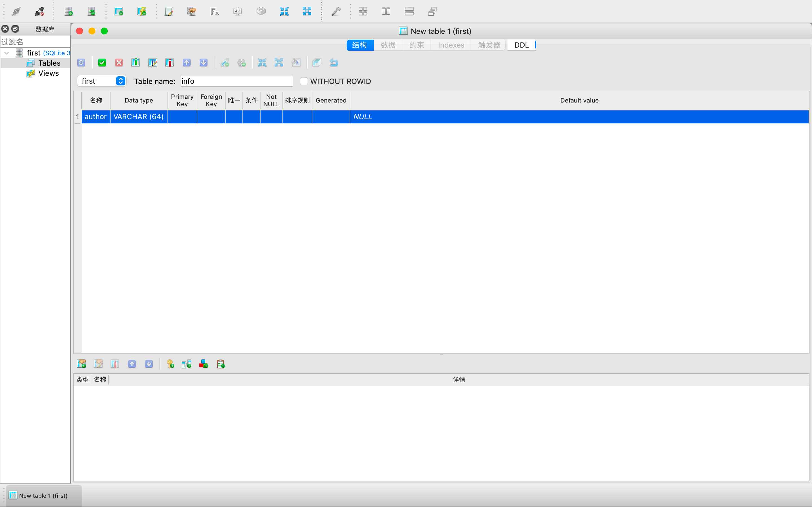

Table Name 表格名，输入具体名称。最上方框中的那个按钮，是增列字段的按钮，点击按钮弹出中间的字段信息，输入字段名、类型、大小等。

这里写了id title content author 四个字段信息，然后点击绿色的勾，保存表格即可。

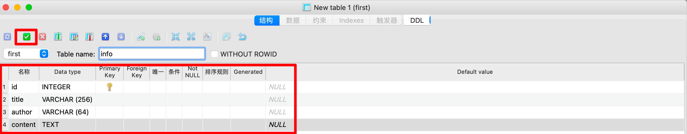

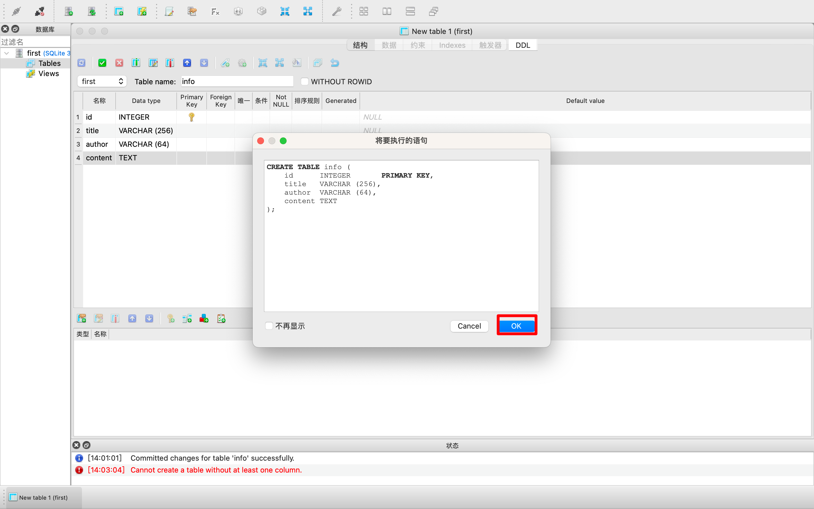

保存了文件，重新刷新页面，就可以查看数据栏，如下：

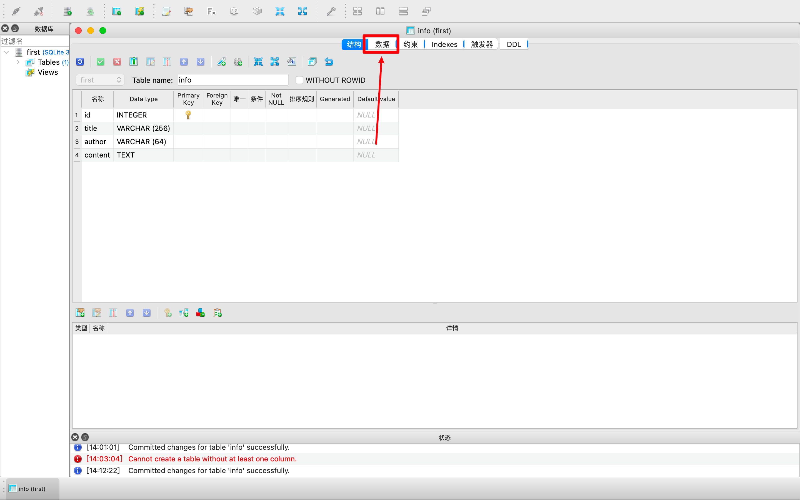

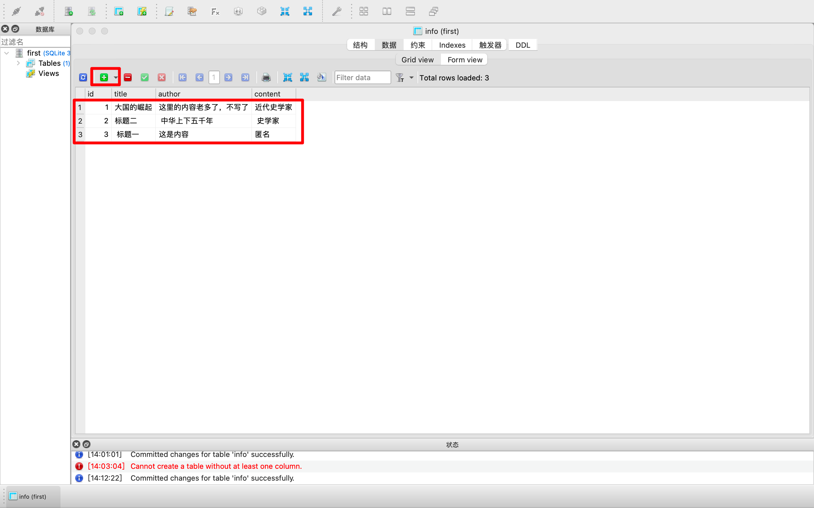

点击`绿色的+`号，然后增加几条数据，方便我们下节课的代码练习。图中有三条。

sqlitestudio 也要保留，方便我们下节课，查看代码练习的数据变化结果。

欢迎关注我公众号：AI悦创，有更多更好玩的等你发现！

::: details 公众号：AI悦创【二维码】

:::

::: info AI悦创·编程一对一

AI悦创·推出辅导班啦，包括「Python 语言辅导班、C++ 辅导班、java 辅导班、算法/数据结构辅导班、少儿编程、pygame 游戏开发」，全部都是一对一教学：一对一辅导 + 一对一答疑 + 布置作业 + 项目实践等。当然，还有线下线上摄影课程、Photoshop、Premiere 一对一教学、QQ、微信在线，随时响应！微信：Jiabcdefh

C++ 信息奥赛题解，长期更新！长期招收一对一中小学信息奥赛集训，莆田、厦门地区有机会线下上门，其他地区线上。微信：Jiabcdefh

方法一：[QQ](http://wpa.qq.com/msgrd?v=3&uin=1432803776&site=qq&menu=yes)

方法二：微信：Jiabcdefh

:::

