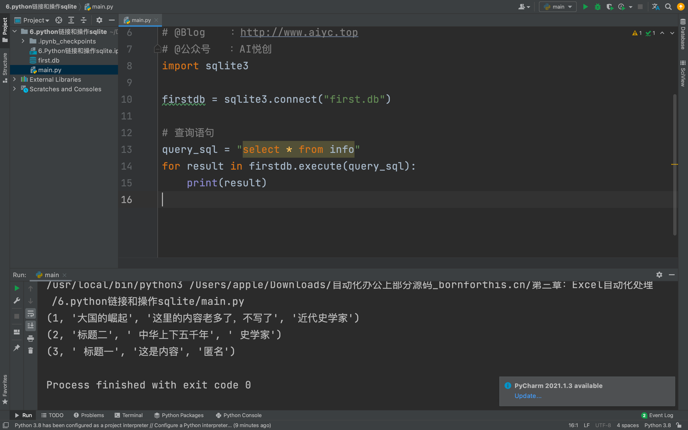
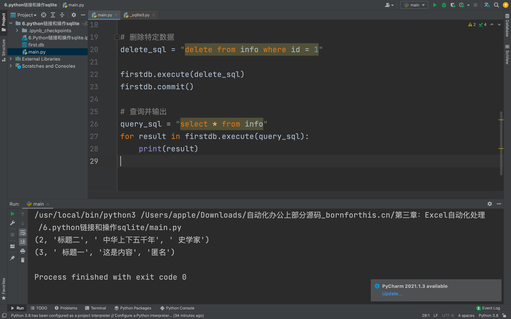
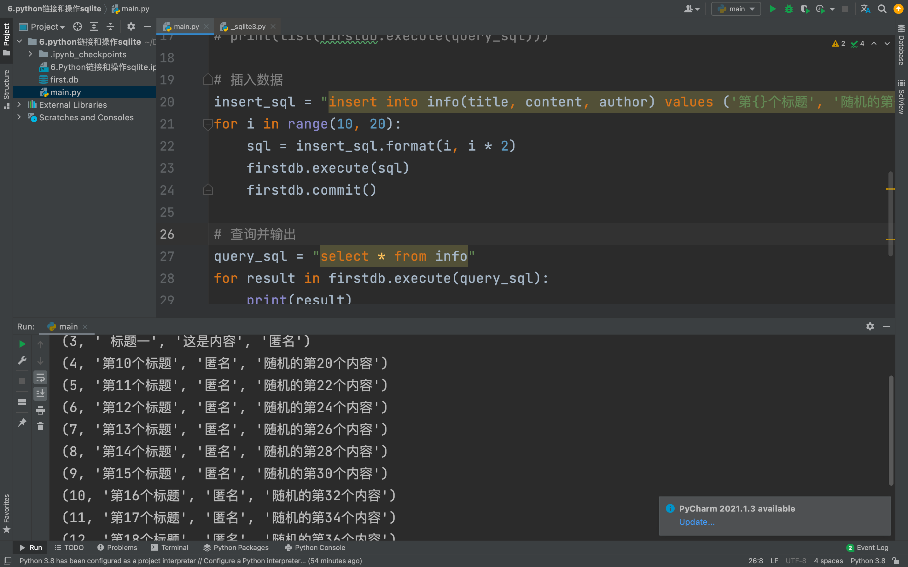
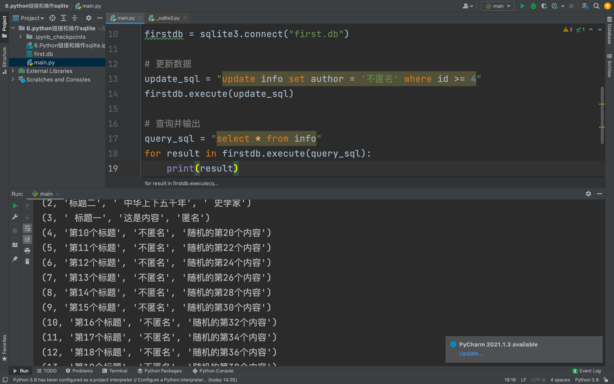

## 链接和查询代码

Python 自身携带 sqlite 库，不需要额外安装，直接使用即可。导入代码：

```python
import sqlite3
```

导入代码之后，将 `first.db` 文件，放到代码文件旁边。这里用的是 py，所以是把 py 和 `first.db` 文件放一起，不放一起就只能使用绝对路径。如下图：


然后使用 sqlite3 库，链接 `first.db` 文件，代码 `firstdb = sqlite3.connect('first.db')`

正常运行后，写查询语句，从数据库中读取全部数据，如下代码：

```python
# 查询语句
query_sql = "select * from info"
for result in firstdb.execute(query_sql):
    print(result)
```

完整代码：

```python
# -*- coding: utf-8 -*-
# @Time    : 2022/7/17 14:36
# @Author  : AI悦创
# @FileName: main.py
# @Software: PyCharm
# @Blog    ：http://www.aiyc.top
# @公众号   ：AI悦创
import sqlite3

firstdb = sqlite3.connect("first.db")

# 查询语句
query_sql = "select * from info"
for result in firstdb.execute(query_sql):
    print(result)
# firstdb.execute(): Executes an SQL statement./执行 SQL 语句。
print(list(firstdb.execute(query_sql)))
```

输出结构效果图：



这是最简单的查询语句。数据库都是支持查询、删除、增加、更新操作的。

## 删除数据操作

删除操作，将数据从数据库中移除，关键词 delete，先删除一条数据，如下代码：

```python
# 删除特定数据
delete_sql = "delete from info where id = 1"

firstdb.execute(delete_sql)
firstdb.commit()

# 查询并输出
query_sql = "select * from info"
for result in firstdb.execute(query_sql):
    print(result)
```

运行结果如下图：



## 插入更多数据

增加的操作，关键词 add，使用 for 循环，先批量的增加一些数据：

```python
# 插入数据
insert_sql = "insert into info(title, content, author) values ('第{}个标题', '随机的第{}个内容', '匿名')"
for i in range(10, 20):
    sql = insert_sql.format(i, i * 2)
    firstdb.execute(sql)
    firstdb.commit()

# 查询并输出
query_sql = "select * from info"
for result in firstdb.execute(query_sql):
    print(result)
```

for 循环，从 10 循环到 20，不含 20，然后全部执行 sql 语句和提交到数据库。最后查询全部数据，看下有没有增多，如下结果图：



## 更新数据操作

数据有增加，最后更新数据，关键词 update，做个条件更新，id 大于等于 4 的数据，设置 author 为“不匿名”，如下代码：

```python
# 更新数据
update_sql = "update info set author = '不匿名' where id >= 4"
firstdb.execute(update_sql)

# 查询并输出
query_sql = "select * from info"
for result in firstdb.execute(query_sql):
    print(result)
```

最后的结果图如下：



以上就是 Python 操作 sqlite 的全部代码了。

**【多选题】小练习**

数据库支持哪些操作？

- [x] 查询数据
- [x] 新增数据
- [x] 更新数据
- [x] 删除数据

> 该数据库是单数据库操作，不要打开多个，这样有可能会锁死。

欢迎关注我公众号：AI悦创，有更多更好玩的等你发现！

::: details 公众号：AI悦创【二维码】


:::

::: info AI悦创·编程一对一

AI悦创·推出辅导班啦，包括「Python 语言辅导班、C++ 辅导班、java 辅导班、算法/数据结构辅导班、少儿编程、pygame 游戏开发」，全部都是一对一教学：一对一辅导 + 一对一答疑 + 布置作业 + 项目实践等。当然，还有线下线上摄影课程、Photoshop、Premiere 一对一教学、QQ、微信在线，随时响应！微信：Jiabcdefh

C++ 信息奥赛题解，长期更新！长期招收一对一中小学信息奥赛集训，莆田、厦门地区有机会线下上门，其他地区线上。微信：Jiabcdefh

方法一：[QQ](http://wpa.qq.com/msgrd?v=3&uin=1432803776&site=qq&menu=yes)

方法二：微信：Jiabcdefh

:::


