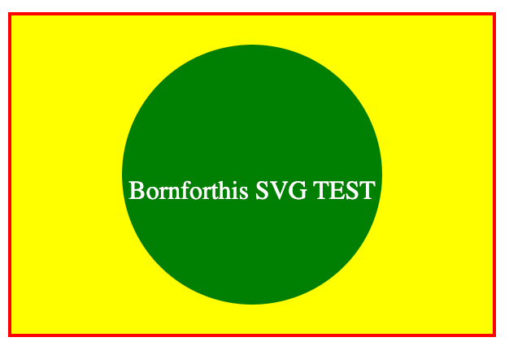

## 简单的 SVG 实例

SVG 文件推荐使用 **.svg**（全部小写）作为此类文件的扩展名。

一个简单的 SVG 图形例子：

```html
<svg version="1.1"
  baseProfile="full"
  width="300" height="200"
  xmlns="http://www.w3.org/2000/svg">

  <rect width="100%" height="100%" stroke="red" stroke-width="4" fill="yellow" />

  <circle cx="150" cy="100" r="80" fill="green" />

  <text x="150" y="115" font-size="16" text-anchor="middle" fill="white">Bornforthis SVG TEST</text>

</svg>
```

<button name="button" style="color: black"><a href="https://bornforthis.cn/web_runing/svg/02/02.html" target="_blank">尝试一下</a></button>

显示结果如下：



**SVG 代码解析：**

SVG 代码以 `<svg>` 元素开始，包括开启标签 `<svg>` 和关闭标签 `</svg>` 。这是根元素。`width` 和 `height` 属性可设置此 SVG 文档的宽度和高度。version 属性可定义所使用的 SVG 版本，xmlns 属性可定义 SVG 命名空间。

SVG 的 `<rect>` 用来创建一个矩形，通过 fill 把背景颜色设为黄色。

SVG 的 `<circle>` 用来创建一个圆。`cx` 和 `cy` 属性定义圆中心的 x 和 y 坐标。如果忽略这两个属性，那么圆点会被设置为 `(0, 0)`，r 属性定义圆的半径。 一个半径 `80px` 的绿色圆圈 `<circle>` 绘制在红色矩形的正中央 （向右偏移 `150px`，向下偏移 `115px` ）。

`stroke` 和` stroke-width` 属性控制如何显示形状的轮廓。我们把圆的轮廓设置为 `4px` 宽，红色边框。

fill 属性设置形状内的颜色。我们把填充颜色设置为红色。

关闭标签 `</svg>` 的作用是关闭 SVG 元素和文档本身。

**注释：**所有的开启标签必须有关闭标签！

欢迎关注我公众号：AI悦创，有更多更好玩的等你发现！

::: details 公众号：AI悦创【二维码】


:::

::: info AI悦创·编程一对一

AI悦创·推出辅导班啦，包括「Python 语言辅导班、C++ 辅导班、java 辅导班、算法/数据结构辅导班、少儿编程、pygame 游戏开发，Web，Linux」，全部都是一对一教学：一对一辅导 + 一对一答疑 + 布置作业 + 项目实践等。当然，还有线下线上摄影课程、Photoshop、Premiere 一对一教学、QQ、微信在线，随时响应！微信：Jiabcdefh

C++ 信息奥赛题解，长期更新！长期招收一对一中小学信息奥赛集训，莆田、厦门地区有机会线下上门，其他地区线上。微信：Jiabcdefh

方法一：[QQ](http://wpa.qq.com/msgrd?v=3&uin=1432803776&site=qq&menu=yes)

方法二：微信：Jiabcdefh

:::

