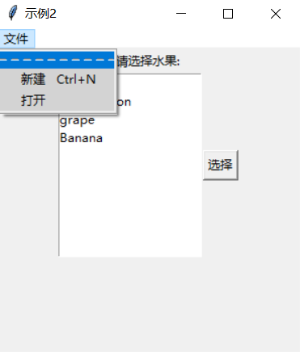

你好，我是悦创。

我想你在学习 tkinter 的时候，会出现这个疑问：程序运行的时候菜单之下出现了一个虚线项。如下图：



点击这个虚线选项后，菜单单独浮于应用之上：


进查询发现了 tearoff 选项，当 `tearoff=1` 的时候该菜单被设置为可以独立出来的菜单，点击虚线就可以将菜单独立出来，当 `tearoff=0` 时就是正常的菜单了，但是默认情况下 `tearoff=1` ，所以在程序中需要设置一下：

## 当设置为 0 的时候

```python
# -*- coding: utf-8 -*-
"""
@Time    : 2022/1/3 11:32
@Author  : AI悦创
@FileName: main.py
@Software: PyCharm
@Blog    ：https://www.aiyc.top
@公众号   ：AI悦创
@description：
"""
#!/usr/bin/python
#coding: utf-8
 
import tkinter as tk
root = tk.Tk()
root.title('菜单练习')
menu = tk.Menu(root)
submenu = tk.Menu(menu, tearoff = 0)
submenu.add_command(label = '打开')
submenu.add_command(label = '保存')
submenu.add_command(label = '关闭')
menu.add_cascade(label = '文件', menu = submenu)
root.config(menu = menu)
root.mainloop()
```

如图：


## 设置为 1 的时候


多了一个虚线，如果点击的话就会发现，这个菜单框可以独立出来显示。


补充示例：

```python
# -*- coding: utf-8 -*-
"""
@Time    : 2022/1/3 11:32
@Author  : AI悦创
@FileName: main.py
@Software: PyCharm
@Blog    ：https://www.aiyc.top
@公众号   ：AI悦创
@description：
"""
from tkinter import Menu, Tk

if __name__ == "__main__":
    root = Tk()
    root.title('主窗体')
    # 在屏幕左上角绘制240&480的主窗体
    root.geometry('240x480+0+0')
    # 自定义菜单
    menu_bar = Menu(root)
    # 创建菜单项目
    # tearoff 如果等于1，该菜单下面会有一个虚线选项（表明该菜单可以独立出来），如果设置成1则没有
    stu_menu = Menu(menu_bar,tearoff=0)
    stu_menu.add_command(label='add', command='')
    stu_menu.add_command(label='query', command='')
    menu_bar.add_cascade(label='学生', menu=stu_menu)

    # create score menu
    score_menu = Menu(menu_bar)
    score_menu.add_command(label='添加', command='')
    score_menu.add_command(label='查询', command='')
    menu_bar.add_cascade(label='成绩', menu=score_menu)

    root.config(menu=menu_bar)
    root.mainloop()
```

欢迎关注我公众号：AI悦创，有更多更好玩的等你发现！

::: details 公众号：AI悦创【二维码】


:::

::: info AI悦创·编程一对一

AI悦创·推出辅导班啦，包括「Python 语言辅导班、C++ 辅导班、java 辅导班、算法/数据结构辅导班、少儿编程、pygame 游戏开发」，全部都是一对一教学：一对一辅导 + 一对一答疑 + 布置作业 + 项目实践等。当然，还有线下线上摄影课程、Photoshop、Premiere 一对一教学、QQ、微信在线，随时响应！微信：Jiabcdefh

C++ 信息奥赛题解，长期更新！长期招收一对一中小学信息奥赛集训，莆田、厦门地区有机会线下上门，其他地区线上。微信：Jiabcdefh

方法一：[QQ](http://wpa.qq.com/msgrd?v=3&uin=1432803776&site=qq&menu=yes)

方法二：微信：Jiabcdefh

:::


