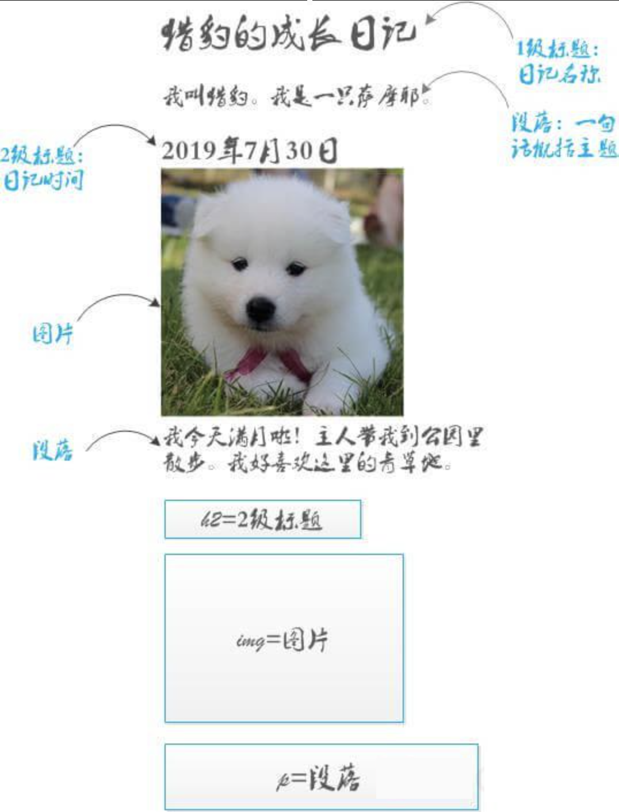

## “猎豹”的成长日记

如果你跟着我们的步骤并动手尝试一下，这只萨摩耶“猎豹”就能拥有它的第一篇成长日记了！


## 第1步 构思

开始实战作业之前，请先做好工具准备。：

- **一个编译器**
- **两款浏览器**


接下来，请思考以下问题：

- **你想通过网页展示什么内容？** 展示你的陶艺作品？还是想展示朋友婚礼的全景？
- **你想用什么类型的资源展示你的网页内容？** 几段话？还是几张图片？
- **你的网页布局是怎么样的？** 图片在上，文字在下？还是相反？

如果你暂时没有好主意，不如帮助萨摩耶“猎豹”制作它的成长日记吧！

1. “猎豹的成长日记”是我们想展示的网页主题。把它设为一级标题，首先展示。

2. 对于很多访问者来说，他们并不知道“猎豹”是谁。我们用一句话介绍一下，如：你好！我是萨摩耶“猎豹”。这句话可以处理成一个段落。
3. 作为日记体网页，时间线索是重点。把日期定为二级标题展示。
4. 放上日记内容和相关图片。

以上是我们的设想，把心中所想落实成草图。

如果你不会使用软件制作草图，不妨拿出纸和笔亲手绘制。以下作为参考：



- **标题：** 在 html 的元素中，标题用 `<h>` 表示。`<h1>` 至 `<h6>` 分别表示 1 级至 6 级标题，1 至 6 级的标题字体逐渐变小。
- **段落：** 在 html 的元素中，段落用 `<p>` 表示。段落是文本。它可以是：词、句子、一段或几段的段落。
- **图片：** 在 html 的元素中，图片用 `` 表示。图片格式可以是 `png` , `jpg`，`svg`等。

以上三个元素的布局可以多种多样，但对于初学者来说，不妨先从简单的布局开始。如上图。

## 第2步 整合资源

通过构思草图，我们确定了标题和段落的内容，也找好了图片。

虽然手中的资源不多，但也要按规范整合。只有这样，网页才能顺利的运行。

**首先，** 在桌面新建一个文件夹并用英文小写字母命名，如：`my_first_page`。它将用来存放你第一张网页所需的所有资源。接下来，在这个文件夹下新建一个文件夹并使用英文小写字母命名，如：img。这个文件夹将专门用于存放网页中的图片。


**下一步，** 为萨摩耶“猎豹”的图片命名。如：`dog.png` 。将其放入 img 文件夹中。


**最后，** 打开编译器。将下列代码块复制到你的编译器中。

> 尽管你还不能理解这些代码，但请从复制它们开始！很多程序员，也常把优秀代码复制下来，然后修改内容，最终做出自己的产品。

创建 `index.html` 文件：

```html
<!DOCTYPE html>
<html lang="en">
<head>
    <meta charset="UTF-8">
    <title>萨摩耶“猎豹”的第一篇成长日记</title>
</head>
<body>
    <h1></h1>
    <p></p>
    <h2></h2><br>
    <br>
<p></p>
</body>
</html>
```

## 第3步 初涉 html 代码（上）

- **`<h1>` 元素：** 在代码中找到 `<h1>` 元素。在 `<h1></h1>` 之间写入1 级标题的内容。如: 猎豹的成长日记。


- **`<p>` 元素：**在 `<h1>` 元素下找到 `<p>` 元素。在 `<p></p>` 元素之间写入段落内容。如：一句话介绍“猎豹”——我叫猎豹。我是一只萨摩耶。


- **`<h2>` 元素：** 在代码中找到 `<h2>` 元素。在 `<h2></h2>` 之间写入2级标题内容。如：将日记的时间作为 2 级标题——2022年7月13日。


目前代码：

```html
<!DOCTYPE html>
<html lang="en">
<head>
    <meta charset="UTF-8">
    <title>萨摩耶“猎豹”的第一篇成长日记</title>
</head>
<body>
    <h1>猎豹的成长日记</h1>
    <p>我叫猎豹。我是一只萨摩耶。</p>
    <h2>2022年7月13日</h2><br>
    <br>
<p></p>
</body>
</html>
```


## 第4步 初涉 html 代码（下）

- **`` 元素：** 在代码中找到 `` 元素。在 `` 中的 `src=""` 的双引号之间写入图片路径。

**图片路径怎么编写呢？**

1. 复制图片文件夹名称：img；
2. 在英文状态下，在 img 后输入符号 “`/`”；

3. 打开 img 文件夹，复制图片名称：`dog.jpg` 。

**注意：别忘了连同图片格式“jpg”一起复制！**

4. 在代码中找到 `` 元素。在 `` 中的 `src=""` 的双引号之间输入图片路径：`img/dog.jpg`


- **`<p>` 元素：** 在 `` 元素下找到 `<p>` 元素，在 `<p>` 和 `</p>` 之间写入你想表达的段落内容。如，为“猎豹”的满月照片添加描述——我今天满月啦！主人带我到公园散步。我好喜欢这里的草地。


现在的代码：

```html
<!DOCTYPE html>
<html lang="en">
<head>
    <meta charset="UTF-8">
    <title>萨摩耶“猎豹”的第一篇成长日记</title>
</head>
<body>
    <h1>猎豹的成长日记</h1>
    <p>我叫猎豹。我是一只萨摩耶。</p>
    <h2>2022年7月13日</h2><br>
    <br>
    <p>我今天满月啦！主人带我到公园散步。我好喜欢这里的草地。</p>
</body>
</html>
```

## 第5步 保存 index 文件

- **保存：** 请在编译器中，点击“文件”菜单，找到“保存”。

把当前文件命名为 `index` ，并选择 `html` 格式，保存在你的项目文件夹中。如：我们之前命名的 "`my_first_page`" 文件夹。

**注：index 即首页。**

保存的路径选择和 img 同路径即可。如下图片：


## 第6步 测试运行

- **运行：** 将 html 文件拖入浏览器。查看效果。

> 也可以直接双击，一般未修改的情况，html 文件默认使用浏览器打开。


如果你一直跟着我们的步骤操作。相信你已：

- **为“猎豹”写了第一篇成长日记。**
- **输出了第一行代码。**
- **在自己的计算机本地运行了第一个网页。**
- **Web 入门了！**

因为你仅初步了解了 HTML，所以第一个网页看起来还很简陋。

但随着进一步了解 `HTML` ,`CSS` ,`JS` 之后，你的网页会更加漂亮！

## 资料下载：

<button name="button" style="color: black"><a href="https://bornforthis.cn/web_runing/data/base_02/my_first_page.zip" target="_blank">资料下载</a></button>

::: details 公众号：AI悦创【二维码】


:::

::: info AI悦创·编程一对一

AI悦创·推出辅导班啦，包括「Python 语言辅导班、C++ 辅导班、java 辅导班、算法/数据结构辅导班、少儿编程、pygame 游戏开发」，全部都是一对一教学：一对一辅导 + 一对一答疑 + 布置作业 + 项目实践等。当然，还有线下线上摄影课程、Photoshop、Premiere 一对一教学、QQ、微信在线，随时响应！微信：Jiabcdefh

C++ 信息奥赛题解，长期更新！长期招收一对一中小学信息奥赛集训，莆田、厦门地区有机会线下上门，其他地区线上。微信：Jiabcdefh

方法一：[QQ](http://wpa.qq.com/msgrd?v=3&uin=1432803776&site=qq&menu=yes)

方法二：微信：Jiabcdefh

:::


