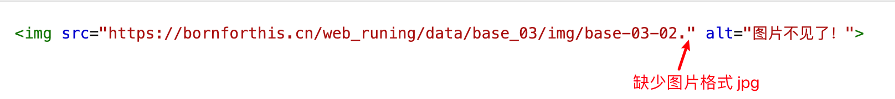
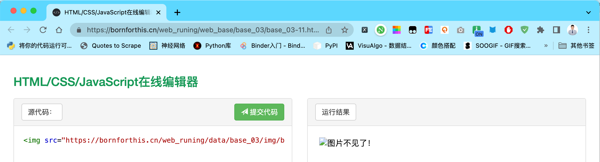
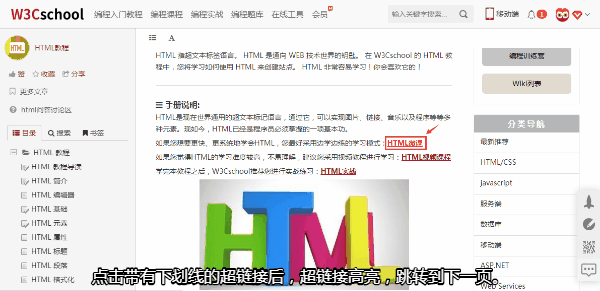
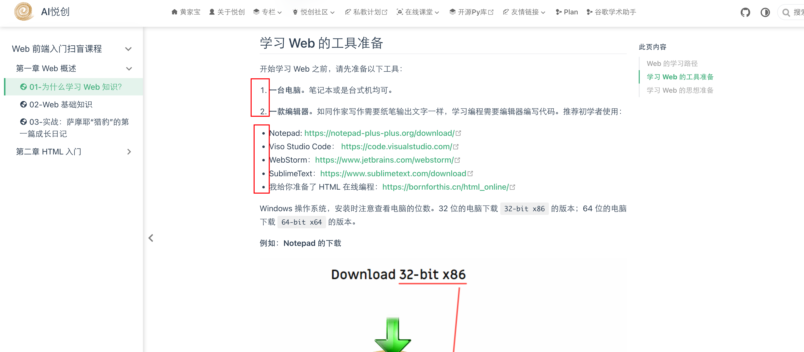

## 重温 `` 元素

```html

```

<button name="button" style="color: black"><a href="https://bornforthis.cn/web_runing/web_base/base_03/base_03-10.html" target="_blank">尝试一下</a></button>

以上是一个 `` 元素，在之前的课程中我们知道它是空元素。

该元素包含属性 src 将图像文件路径的地址包裹其中，可在网页内容中嵌入图像。

该元素还包括一个替换文字属性 alt。该属性是图像的描述内容。当图像不能正常显示时，它负责说明。点击“尝试一下”看看属性 alt 的作用：

```html

```

<button name="button" style="color: black"><a href="https://bornforthis.cn/web_runing/web_base/base_03/base_03-11.html" target="_blank">尝试一下</a></button>

在以上案例中，属性 src 中指向的图片位置因缺少文件格式 jpg，导致图片无法显示。此时，属性 alt 中的文字“ **图片不见了** ”就发挥了说明的作用。





## `<a>` 元素

我们在浏览网页时常遇上超链接：



**网页中的超链接怎么做呢？**

我们可以通过 `<a>` 元素对文本植入超链接。

例如：在文本“`随时随地学编程，请上 bornforthis.cn` ”上添加一个超链接，使用户点击这个文本时转移到 `bornforthis.cn` 的官网首页。步骤如下：

- 用 `<a> </a>` 包围文本： `<a>随时随地学编程，请上 bornforthis.cn </a>`。
- 为此 `<a>` 元素添加一个 href 属性： `<a href="">随时随地学编程，请上 bornforthis.cn </a>`
- 把 bornforthis.cn 官网首页的地址写入的 href 属性的引号当中： `<a href="https://bornforthis.cn"> 随时随地学编程，请上bornforthis.cn </a>`

**点击“尝试一下”，看看你是否能顺利访问 bornforthis.cn 的官网？**

```html
<a href="https://bornforthis.cn/">随时随地学编程，请上 bornforthis.cn</a>
```

<button name="button" style="color: black"><a href="https://bornforthis.cn/web_runing/web_base/base_03/base_03-12.html" target="_blank">尝试一下</a></button>

## 列表

网页内容中有一些是列表。



以上，标有序号的内容是 **有序列表** 的样式。在 HTML 代码中，它用一个 `<ol>` 元素包围。标有黑色小圆点的内容是 **无序列表** 的样式。在 HTML 代码中，它用一个 `<ul>` 元素包围。

两者区别在于“序”：列表有序中的项目顺序很重要。这就像我们用电饭煲煮饭先用量杯量米，再用清水洗米，接着盛适量水把洗净的米放入电饭煲蒸。这个过程中的先后顺序不能变。

列表无序中的项目顺序不重要。就像我们在体育课结束后，收拾散落一地的乒乓球，先从哪个球开始收拾并无讲究，只要收拾干净就行。

两者的相同点是：列表中的每个项目都要用一个 `<li>` 元素包围。

将下面的这串：`自制辣条的原料包括面筋条、干红辣椒、花椒、麻椒等等。` 改成一个无序列表：

```html
<p>自制辣条的原料包括面筋条、干红辣椒、花椒、麻椒等等。</p>
```

我们可以这样改：

```html
<p>自制辣条的原料包括</p>
<ul>
    <li>面筋条</li>
    <li>干红辣椒</li>
    <li>花椒</li>
    <li>麻椒</li>
    <li>辣椒粉等等</li>
</ul>
```

<button name="button" style="color: black"><a href="https://bornforthis.cn/web_runing/web_base/base_03/base_03-13.html" target="_blank">尝试一下</a></button>

点击“尝试一下”，看看制作手工辣条的有序步骤列表（节选）：

```html
<p>年轻的朋友们！品牌辣条吃得爽，可是价格贵。不如自己动手做：</p>
<ol>
    <li>面筋条冷水浸泡4-5小时。</li>
    <li>将浸泡后的面筋条沥干，放入温油中小火慢炸。</li>
    <li>面筋条炸至金黄后捞起沥油。</li>
    <li>锅内留少许油，入花椒，麻椒，干红辣椒小火慢炒至出香。</li>
    <li>倒入沥干油的辣条，将其与配料一起翻炒......</li>
</ol>
```

<button name="button" style="color: black"><a href="https://bornforthis.cn/web_runing/web_base/base_03/base_03-14.html" target="_blank">尝试一下</a></button>

::: details 公众号：AI悦创【二维码】


:::

::: info AI悦创·编程一对一

AI悦创·推出辅导班啦，包括「Python 语言辅导班、C++ 辅导班、java 辅导班、算法/数据结构辅导班、少儿编程、pygame 游戏开发」，全部都是一对一教学：一对一辅导 + 一对一答疑 + 布置作业 + 项目实践等。当然，还有线下线上摄影课程、Photoshop、Premiere 一对一教学、QQ、微信在线，随时响应！微信：Jiabcdefh

C++ 信息奥赛题解，长期更新！长期招收一对一中小学信息奥赛集训，莆田、厦门地区有机会线下上门，其他地区线上。微信：Jiabcdefh

方法一：[QQ](http://wpa.qq.com/msgrd?v=3&uin=1432803776&site=qq&menu=yes)

方法二：微信：Jiabcdefh

:::


