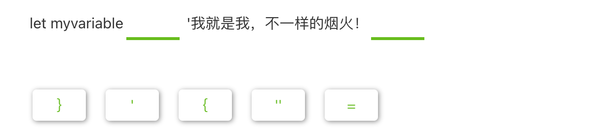
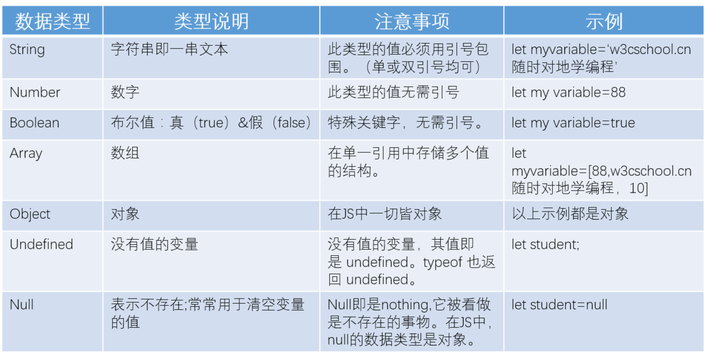
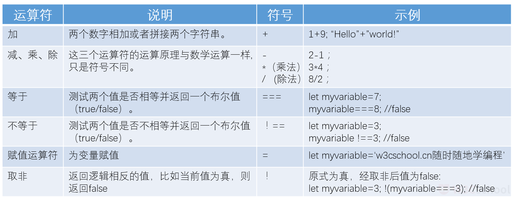

## JavaScript 是谁？它做什么工作？

**JavaScript** (以下采用缩写 JS ) **是一门动态编程语言。**

当它应用于 HTML 文档时，可增加网页的**动态交互特性。**

比如：

- 验证输入表单的正确性；
- 改变网页上的文字；
- 在网页上设置实时时钟等。

JS 基于浏览器运行，可以快速的响应用户动态行为。

JS 脚本可与 HTML 混用，也可 **单独存为 JS 文件然后在 HTML 中引用。** 我们推荐后者。


## 学习 JavaScript 的重点

JS 是一门 **易上手难精通** 的编程语言。

**易学**体现在你能够轻易的获取并使用它。它不需要经过服务器，可被任意人下载并使用；

**难精**则体现在它是一门复杂的编程语言。JS 的交互功能多且其语法复杂，它还关联到 HTML 的 Dom 结构。又由于各厂商（如微软，它出品的浏览器是 edge; 厂商如 Alphabet ,它出品的浏览器是 google）的浏览器对 JS 有差异化的处理，使 JS 难以调试。

因此，相比精通 HTML 和 CSS，想要精通 JS，你得投入更多的时间。

【多选题】以下关于 JavaScript 说法正确的是？

- [ ] JavaScript 与 HTML 和 CSS 一样，不是真正意义上的编程语言。
- [ ] JavaScript 是 Java 的最新版本。
- [ ] JavaScript 是客户端脚本语言，可通过 API 访问、操作 HTML 元素节点
- [ ] JavaScript 能够增加网页的交互性。

> JavaScript 和 Java 仅在字面意义上有关联，但它们之间是区别多于共性的两门不同的编程语言。JavaScript 与 HTML 和 CSS 不同，JavaScript 是真正意义上的编程语言。

【选词填空】在空格内填入适当的答案。


::: details 答案


:::

## JavaScript 的变量

**JS 的变量（变量）是存储值的容器。**

点击“尝试一下”，看看下面的例子：

```javascript
let x = 7
let y = 13
let z = x + y
```

<button name="button" style="color: black"><a href="https://bornforthis.cn/web_runing/web_base/base_10/base_10-1.html" target="_blank">尝试一下</a></button>

如果无法更改 JS 的值，网页就无法响应任何动态。因此，JS 的变量无处不在。

要响应一个动态，先得声明一个变量。首先输入关键字 let，然后输入合适的名称。如下：

```javascript
let variable
```

**注意：**

- **行末的分号表示当前语句结束了。** 此分号只在单行内需要分割多条语句时才是必须的。但也有一些专业人士认为每条语句末尾加分号是好习惯。
- 几乎所有内容都可以作为变量名称。但是有些例外，请在进一步学习 JS 时多加注意。
- 在支持 **ES6语法** （初学阶段的你只要知道它是一种编写代码的新规定就可以了）的 JS 环境中 使用 `let` 声明变量，还可以使用 `var` 声明变量。在入门阶段，你不需要深入了解使用 let 还是使用 var 来声明有何区别。你仅需知道两个都可以使用声明变量，但本例选择使用 let 意味着解。
- **JavaScript 对大小写敏感。** 变量和变量是不同的。如此，虽然它俩的英文拼写和字面意思是一样的，但由于 JS 对大小写的敏感，使它俩被浏览器认为一个是苹果，另一个是香蕉-完全不同的东西。如果你的代码出现问题，请先检查一下大小写。

**定义变量后，随后打算赋值：**

```javascript
let variable = 'bornforthis.cn 随时随地学编程';
```

以上，`bornforthis.cn 随时随地学编程` 即是 variable 的值。

**变量在赋值后是可以更改的：**

```javascript
let variable = 'bornforthis.cn 随时随地学编程';
variable = 'Web入门请上 bornforthis.cn';
```

以上变量的值由“`bornforthis.cn 随时随地学编程`” 更改为“  `Web入门请上 bornforthis.cn`”。

【多选题】JavaScript 常用哪两个关键词声明变量？

- [x] JavaScript
- [ ] let
- [ ] var
- [ ] String

> JavaScript 是一门动态编程语言。字符串是字符串。let 和 var 可用于声明 JS 的变量。

【选词填空】请填入适当的符号，使下列变量和赋值完整



::: details 答案


:::

> `let myvariable='我就是我，不一样的烟火！'`

## 数据类型

JavaScript 的变量具有不同的数据类型：



【多选题】以下哪些是 JS 的数据类型？

- [x] boolean
- [ ] `<head>`
- [ ] `<title>`
- [x] `number`
- [x] `string`

> `<head>` 和 `<title>` 是 HTML 中的元素。string（字符串）,number（数字）和boolean（布尔）是 JS 中常见的数据类型。

## 运算符

**运算符是一类数学符号。**

运算符可以用于计算两个变量，执行此类计算的运算符为“二元运算符”。

除此之外，还有一元运算符和三元运算符。

以下表格罗列出了 JS 中常用的运算符：



注意：

- "取非"是一元运算符。
- 引号能将数字转变为字符串。因此，“35”+“25”不会等于 60。要将引号删掉，35+25 的结果才能是 60。

【单选题】以下的运算结果将是？

```javascript
let variable = "1024"+"520”
```

- [ ] 1540
- [x] 1024520
- [ ] 1544

> 将数字添加上引号后，1024 和 520 的数据类型就由数字变为字符串了。所以其结果不会是 1544。


::: details 公众号：AI悦创【二维码】


:::

::: info AI悦创·编程一对一

AI悦创·推出辅导班啦，包括「Python 语言辅导班、C++ 辅导班、java 辅导班、算法/数据结构辅导班、少儿编程、pygame 游戏开发」，全部都是一对一教学：一对一辅导 + 一对一答疑 + 布置作业 + 项目实践等。当然，还有线下线上摄影课程、Photoshop、Premiere 一对一教学、QQ、微信在线，随时响应！微信：Jiabcdefh

C++ 信息奥赛题解，长期更新！长期招收一对一中小学信息奥赛集训，莆田、厦门地区有机会线下上门，其他地区线上。微信：Jiabcdefh

方法一：[QQ](http://wpa.qq.com/msgrd?v=3&uin=1432803776&site=qq&menu=yes)

方法二：微信：Jiabcdefh

:::


