## 萨摩耶“猎豹”的互动成长日记

大家好! 我是 Lisa 的宠物犬萨摩耶, 猎豹。

我很想和朋友们互动，你能帮我在我的网页日记上添加一些互动效果，使它对用户更加友好吗？


## 第1步 修改标题

我们将使用 JS 修改标题, 使你感性认识 JS 发挥的作用。

首先得为存放 JS 文件新建一个文件夹，它将专门用于存放项目中的 script（脚本）文件：

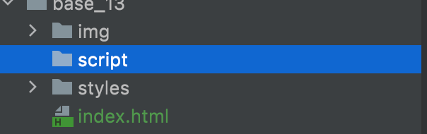

新建一个 js 文件：

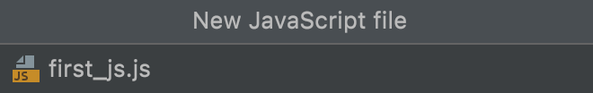


代码如下：

```javascript
window.onload = function () {
    let myHeading = document.querySelector('h1');
    myHeading.textContent = 'Hello, my friends!';
};
```

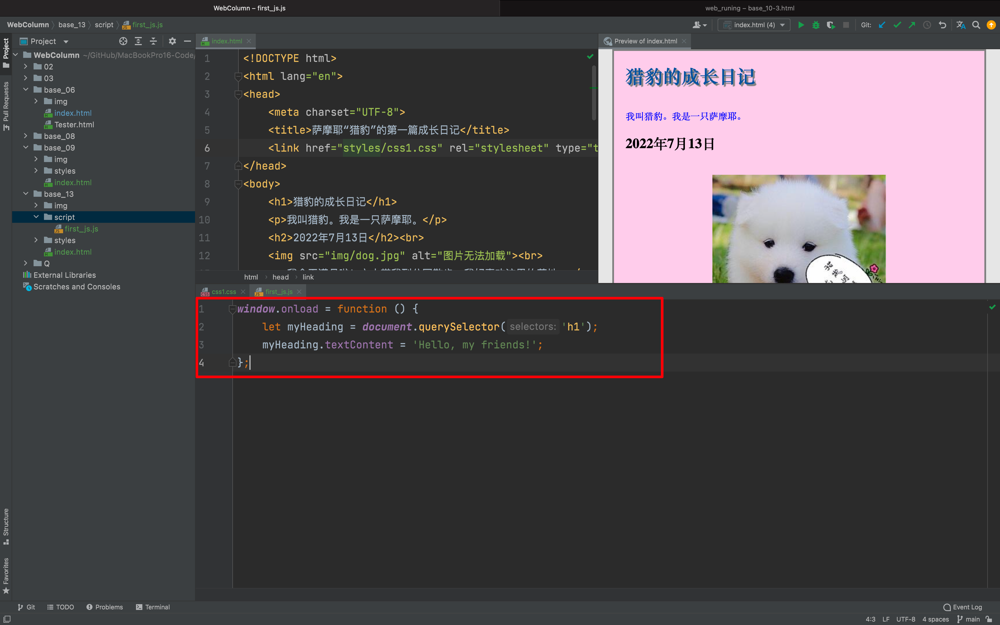

再将以下代码，复制到 `index.html` 文件中的 `<head>` 和 `</head>` 之间：

```html
<script src="script/first_js.js"></script>
```

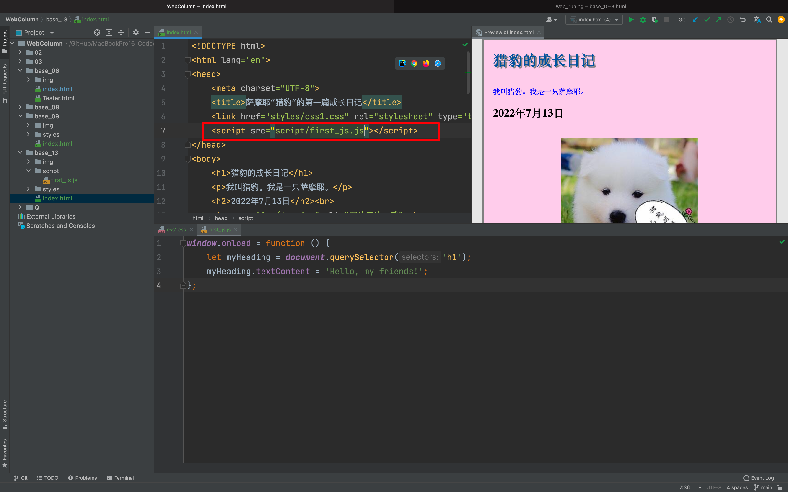

接着，保存 html 文件，将 `index.html` 拖入浏览器，看看变化;

### Before

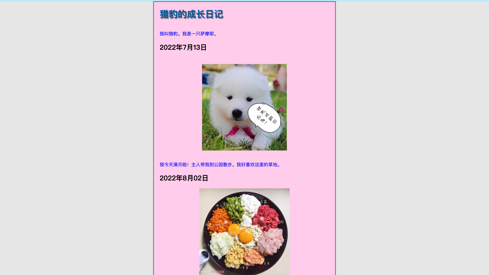

### After


使用 JS 使标题内容发生了改变。

你也可以此为示例，对网页的其它部分进行修改。

## 第2步 添加图像切换器

为了增加网页的互动性，我们将用 JS 为猎豹的成长日记添加一个图片切换器。

它能使用户在点击图片时自动切换到另一张图片。

为此我们向 Lisa 索要了猎豹的新照片，并把这张照片命名为 pic3 保存在 img 文件夹中。

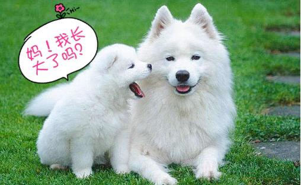

请在你的编译器中，打开 `first_js.js` 文件，首先删除在第 1 步中更改标题所用的"Hello, myfriends!"的那段代码。

将下列代码复制到当前文件中：

```javascript
window.onload = function () {

    let myImage = document.querySelector('img');

    myImage.onclick = function () {
        let mySrc = myImage.getAttribute('src');
        if (mySrc === 'img/dog.jpg') {
            myImage.setAttribute('src', 'img/pic3.JPG');
        } else {
            myImage.setAttribute('src', 'img/dog.jpg');
        }
    }
};
```

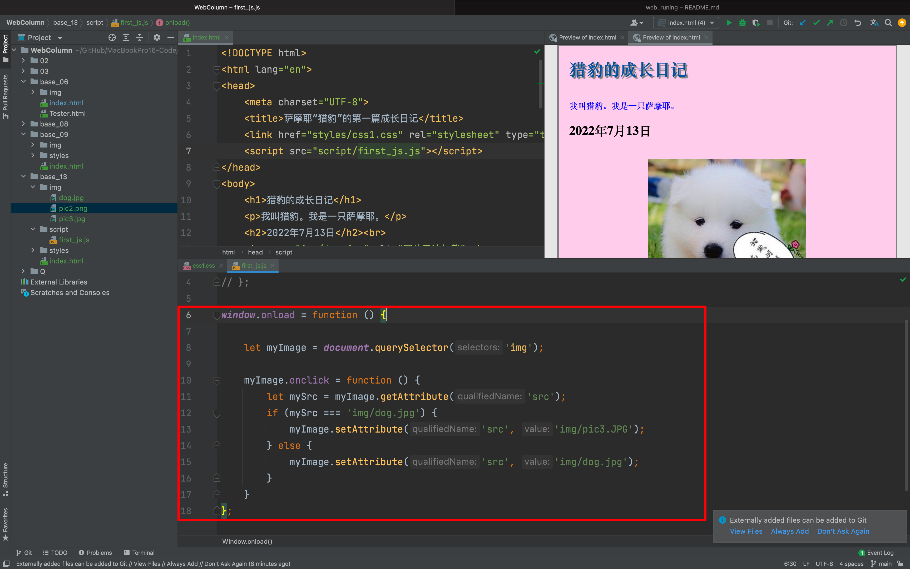

保存当前文件。

将 `index.html` 拖入浏览器中，点击第一张图标，看看是否完成了图片切换效果。

<button name="button" style="color: black"><a href="https://bornforthis.cn/web_runing/web_base/base_13/01/base_13-1.html" target="_blank">尝试一下</a></button>

当你点击图片上图，它能自动切换，你的图像切换器就制作完成啦！

本步骤用到了 `if...else...` 语句，如果你仅仅复制了代码而并不知道原理所在，请复习这个知识点。

这样你就能为猎豹切换出更多图片啦！

## 第3步 添加个性化欢迎界面

接下来，我们要为除此访问猎豹成长日记的用户添加一个欢迎界面。即在标题中添加访问者的名字。

即使用户关闭页面之后再重新打开，仍可获得信息。

还会添加一个选项，根据需要改变用户名字以更新欢迎信息。

请打开 `index.html` 文件，在 `<body></body>` 之间添加以下代码：

```java
<button>切换用户</button>
```

如图操作，我们将其置于 `<h1>` 下面：

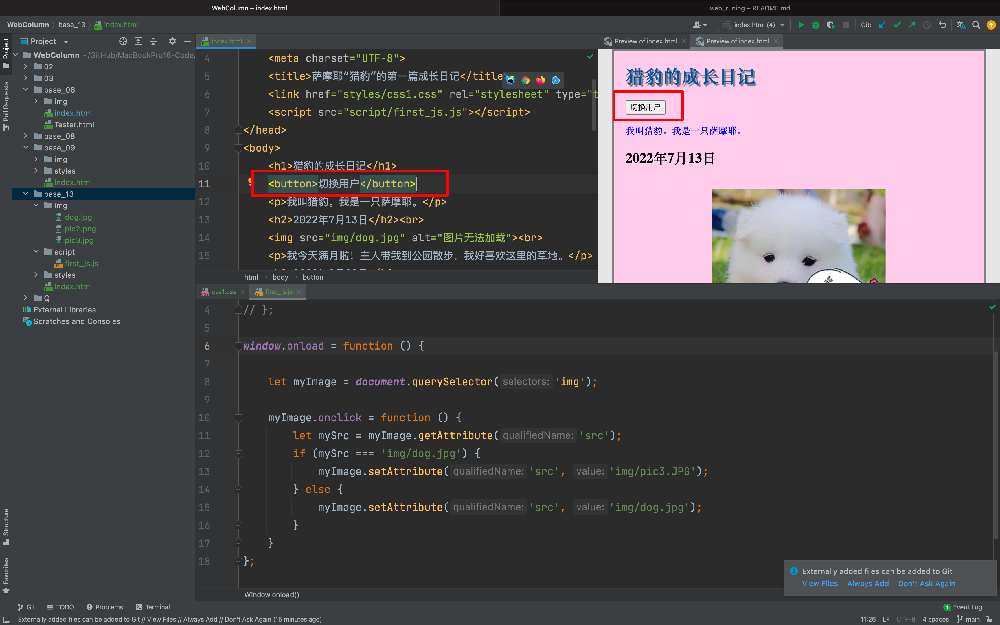

将以下代码复制到 `first_js.js` 的文件中，并保存当前文件及 html 文件。

```javascript
window.onload = function () {
    let myImage = document.querySelector('img');
    myImage.onclick = function () {
        let mySrc = myImage.getAttribute('src');
        if (mySrc === 'img/dog.jpg') {
            myImage.setAttribute('src', 'img/pic3.JPG');
        } else {
            myImage.setAttribute('src', 'img/dog.jpg');
        }
    }

    function setHeading(Lisa) {
        let myHeading = document.querySelector('h1');
        myHeading.textContent = 'Hello!' + Lisa + '!';
    }

    function setUserName() {
        let myName = prompt('请输入你的名字');
        localStorage.setItem('name', myName);
        setHeading(myName);
    }

    let storedName = localStorage.getItem('name');
    if (!storedName) {
        setUserName();
    } else {
        setHeading(storedName);
    }
    let myButton = document.querySelector('button');
    myButton.onclick = setUserName;
};
```

如果你跟着我们的步骤，你会得到一个个性化欢迎界面：

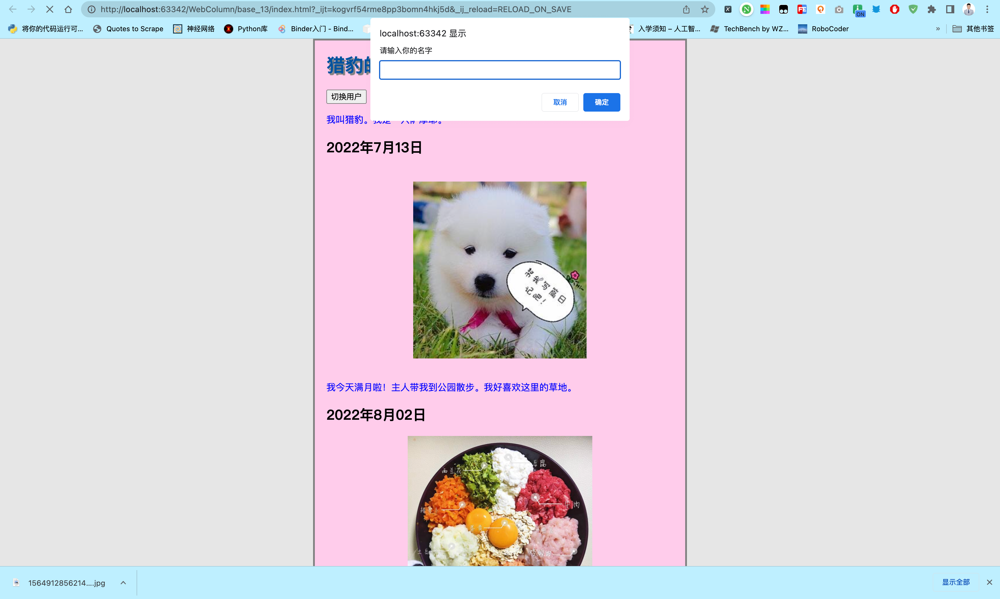

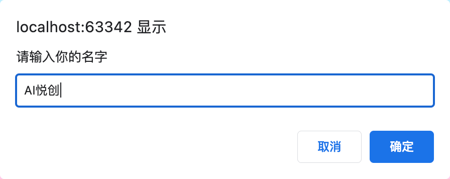

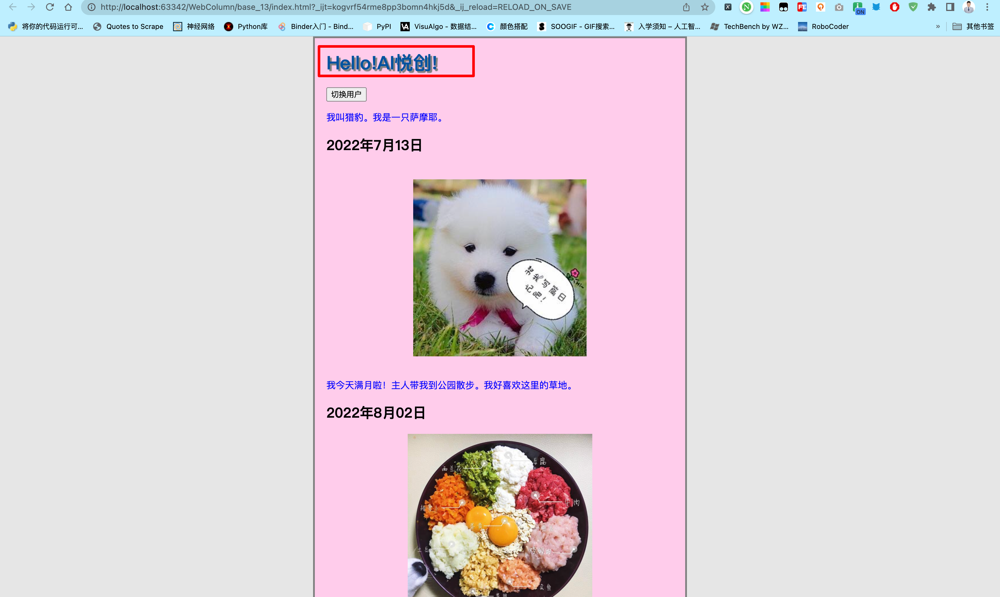

<button name="button" style="color: black"><a href="https://bornforthis.cn/web_runing/web_base/base_13/01/base_13-2.html" target="_blank">尝试一下</a></button>


## 代码下载

<button name="button" style="color: black"><a href="https://bornforthis.cn/web_runing/data/base_13/base_13.zip" target="_blank">尝试一下</a></button>

::: details 公众号：AI悦创【二维码】


:::

::: info AI悦创·编程一对一

AI悦创·推出辅导班啦，包括「Python 语言辅导班、C++ 辅导班、java 辅导班、算法/数据结构辅导班、少儿编程、pygame 游戏开发」，全部都是一对一教学：一对一辅导 + 一对一答疑 + 布置作业 + 项目实践等。当然，还有线下线上摄影课程、Photoshop、Premiere 一对一教学、QQ、微信在线，随时响应！微信：Jiabcdefh

C++ 信息奥赛题解，长期更新！长期招收一对一中小学信息奥赛集训，莆田、厦门地区有机会线下上门，其他地区线上。微信：Jiabcdefh

方法一：[QQ](http://wpa.qq.com/msgrd?v=3&uin=1432803776&site=qq&menu=yes)

方法二：微信：Jiabcdefh

:::


