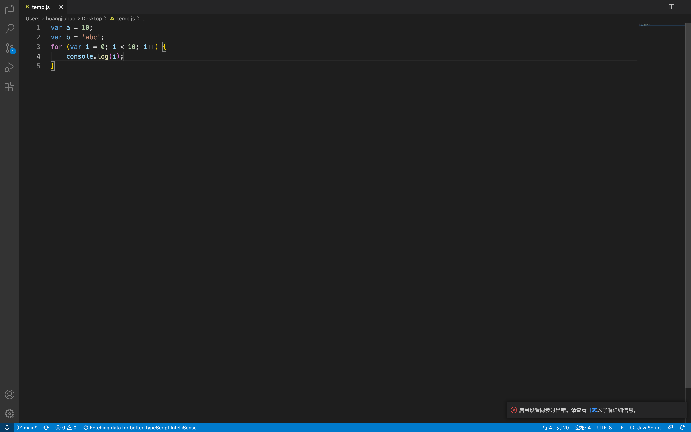
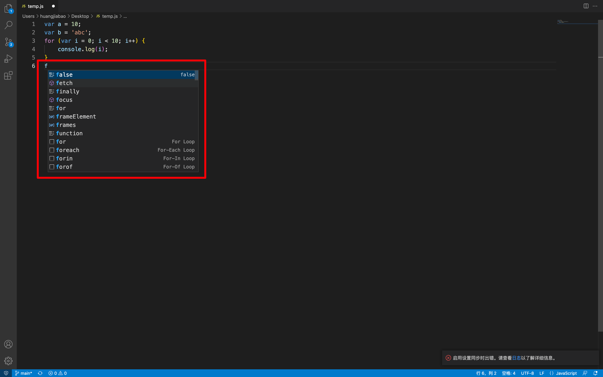

## 什么是 IDE

- IDE (Integrated Development Environment，**集成开发环境**）是含代码编辑、关键词高亮、智能感应、智能纠错
    格式美化、版本管理等功能于一身的 **“高级代码编辑器”**
- 每个 IT 工程师都要有自己趁手的 IDE，它是我们的武器。

## 快速展示 IDE 的功能

- 老师演示关键词高亮、只能感应、智能纠错、格式美化 4 个功能
- 要理解无论使用什么 IDE 编写出来的代码，本质上都是“白底黑字”的，都是“纯文字”的。

### 代码高亮

### 代码提示

### 用记事本也是可以打开我们上面编写的代码

只不过在我们高级的编辑器中，是会有颜色显示出来的。

::: details 公众号：AI悦创【二维码】

:::

::: info AI悦创·编程一对一

AI悦创·推出辅导班啦，包括「Python 语言辅导班、C++ 辅导班、java 辅导班、算法/数据结构辅导班、少儿编程、pygame 游戏开发」，全部都是一对一教学：一对一辅导 + 一对一答疑 + 布置作业 + 项目实践等。当然，还有线下线上摄影课程、Photoshop、Premiere 一对一教学、QQ、微信在线，随时响应！微信：Jiabcdefh

C++ 信息奥赛题解，长期更新！长期招收一对一中小学信息奥赛集训，莆田、厦门地区有机会线下上门，其他地区线上。微信：Jiabcdefh

方法一：[QQ](http://wpa.qq.com/msgrd?v=3&uin=1432803776&site=qq&menu=yes)

方法二：微信：Jiabcdefh

:::

