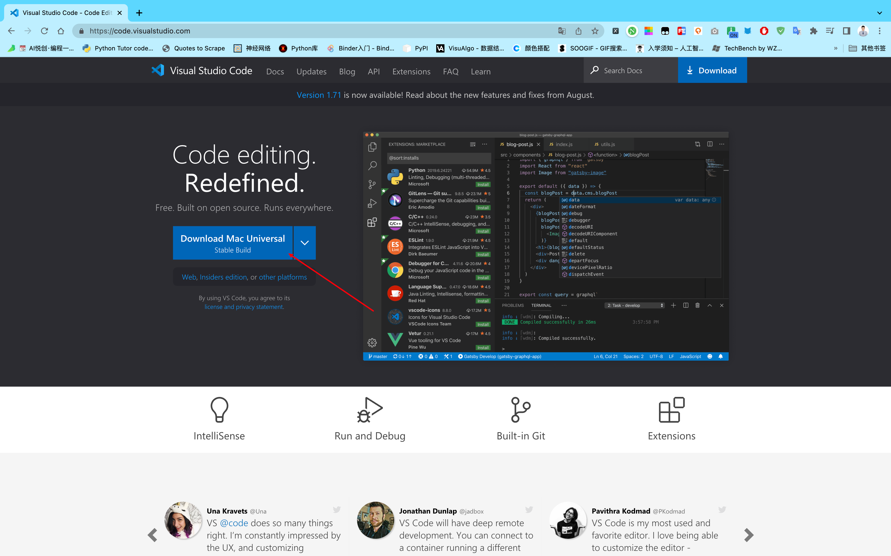
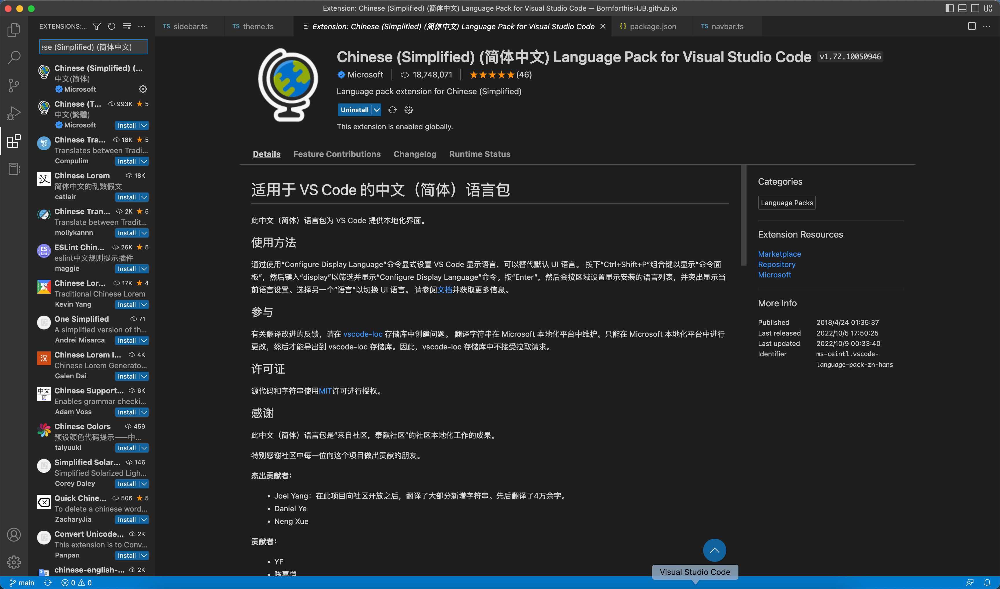

## Visual Studio Code 简介

- Visual Studio Code 简称 VS Code，来自微软

- 优点：内置功能非常丰富、插件全且安装简单、轻量、有 Mac 版本

## VS Code 下载

- 下载地址：[https://code.visualstudio.com/](https://code.visualstudio.com/)

## 直接安装即可

## 修改 VSCode 界面语言

- VS Code 初始为因为界面，如何配置为中文呢？
- 配置中文界面需要安装插件，在插件中心搜索 Chinese，安装插件即可。

## VS Code 颜色主题

- VS Code 提供了不同风格颜色的主题
- 在文件—>首选项—>颜色主题中，将主题改为 Light —— (defaukt light)

::: details 公众号：AI悦创【二维码】

:::

::: info AI悦创·编程一对一

AI悦创·推出辅导班啦，包括「Python 语言辅导班、C++ 辅导班、java 辅导班、算法/数据结构辅导班、少儿编程、pygame 游戏开发」，全部都是一对一教学：一对一辅导 + 一对一答疑 + 布置作业 + 项目实践等。当然，还有线下线上摄影课程、Photoshop、Premiere 一对一教学、QQ、微信在线，随时响应！微信：Jiabcdefh

C++ 信息奥赛题解，长期更新！长期招收一对一中小学信息奥赛集训，莆田、厦门地区有机会线下上门，其他地区线上。微信：Jiabcdefh

方法一：[QQ](http://wpa.qq.com/msgrd?v=3&uin=1432803776&site=qq&menu=yes)

方法二：微信：Jiabcdefh

:::

