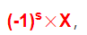

你好，我是悦创。

大学时上计算机组成原理课程的时候，上到计算机如何存储数据的相关知识时，因为计算机世界里面所有的数据归根结底都是由 0 和 1 来存储的，那么如何表达数值的正负呢？

只知道书本上说是有一个符号位，当该符号位为 0 时，表示的是正数，为 1 时表示负数。我那时没搞懂为什么这样规定，我觉得 1 么，代表正数挺合理的，那么 0 就自然表示负数咯，所以不解，只能死记硬背：**0正1负**

我个人对于不知道前因后果而要死记硬背的东西是很难记住的，黑格尔在《法哲学原理》里说过：存在即合理，我也觉得一个东西的存在必然是有它的原因的，只有知道为什么这样、找到根源，我们才能更好地理解它。现在我来揭示在计算机表示数值正负时，为什么 0 为正，1 为负。

当代绝大多数计算机表示浮点数都是采用 IEEE 标准的，这里简化一下，我们只关心符号位，那么对于一个数，计算机其实是以下面的式子来描述它的：

这里的指数 s 就是用来决定数值 X 是正数还是负数，显而易见，当 `s=0`  时，则 X 为正数（因为任何数的 0 次幂都是 1），当 `s=1` 时，则 X 为负数（因为 -1 的 1 次幂为 -1），至此我们就理解了为什么符号位为 0 时表示正数，为 1 时表示负数啦，而且这辈子都不会记错了吧！

欢迎关注我公众号：AI悦创，有更多更好玩的等你发现！

::: details 公众号：AI悦创【二维码】

:::

::: info AI悦创·编程一对一

AI悦创·推出辅导班啦，包括「Python 语言辅导班、C++ 辅导班、java 辅导班、算法/数据结构辅导班、少儿编程、pygame 游戏开发」，全部都是一对一教学：一对一辅导 + 一对一答疑 + 布置作业 + 项目实践等。当然，还有线下线上摄影课程、Photoshop、Premiere 一对一教学、QQ、微信在线，随时响应！微信：Jiabcdefh

C++ 信息奥赛题解，长期更新！长期招收一对一中小学信息奥赛集训，莆田、厦门地区有机会线下上门，其他地区线上。微信：Jiabcdefh

方法一：[QQ](http://wpa.qq.com/msgrd?v=3&uin=1432803776&site=qq&menu=yes)

方法二：微信：Jiabcdefh

:::

