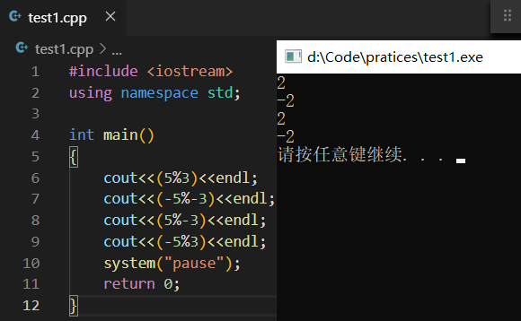

## 前言：

你好，我是悦创。

**对于两个相同符号的数取余大家都很熟悉，但是对于一正一负的数取余呢？**

大家可能觉得会很陌生，今天在刷 leetcode7：整数反转(easy)这道题的时候，想起了这个知识点，遂打算探讨一番。

**自然数取余定义分为两种：**

1. 定义1：如果 a 和 d 是两个自然数，d 非零，可以证明存在两个唯一的整数 q 和 r，满足 `a=qd+r` 且 `0 ≤ r < d`（其中 q 为商，r 为余数）。
2. 定义1一般作为数学中的取余法则，即两个数取余，余数总是为正数。

**举例：**
- 5%3=3x1+2，商为1，余数为 2
- (-5)%(-3)=(-3)x2+1，商为 2，余数为 1
- 5%(-3)=(-3)x(-1)+2，商为 -1，余数为 2
- (-5)%3=3x(-2)+1，商为 -2，余数为 1

1. 定义2：如果 a 与 d 是整数，d 非零，那么余数 r 满足这样的关系：`a = qd + r`  , q 为整数，且 `0 ≤ |r| < |d|` 。定义 2 取余的结果就会导致出现两个余数了，比如 `5%(-3) = (-3)x(-1)+2 = (-3)x(-2)-1` ，所以这里的余数 2 和 -1 都满足定义。
2. 我们把 2 称为正余数，-1 成为负余数。通常，当除以 d  时，如果正余数为 r1，负余数为 r2，那么有 `r1 = r2 + d` 。
3. 所有语言和计算器都遵循了尽量让商尽量靠近 0 的原则，即 `5%(-3)`  的结果为 2 而不是 -1，`(-5)%3` 的结果是 -2 而不是 1。

**测试代码如下：**

```cpp
#include <iostream>
using namespace std;

int main()
{
    cout<<(5%3)<<endl;		//5=3x1+2
    cout<<(-5%-3)<<endl;	//-5=-3x1-2
    cout<<(5%-3)<<endl;		//5=-3x(-1)+2
    cout<<(-5%3)<<endl;		//-5=3x(-1)-2
    system("pause");
    return 0;
}
```

**通俗地解释编译器的运行结果：**
- (-5%-3) 编译器先将 -3 自动转换为正整数 3，然后计算 `-(5%3)` 的结果，所以运算结果为 -2。
- (5%-3) 编译器先将 -3 自动转换为正整数 3，然后计算 `(5%3)` 的结果，所以运算结果为 2。
- (-5%3) 编译器直接计算 `-(5%3)` 的结果，所以运算结果为 -2。

**测试结果如下：**



## 总结：

1. 不管是两个同号数取余还是两个异号数取余，取余结果是正整数才是我们生活中普遍认可的结果。
2. 在编译器中，两个异号的数取余之后的结果取决于分子的符号。负数%负数，编译器会将分母的负数自动转换为正整数，然后再将分子负数的负号提取出来，将两个正整数取余，最后的结果加上负号就好了。负数%正数，编译器先将分子负数的负号提取出来，将两个正整数取余，最后结果加上负号即可。正数%负数，编译器自动将分母负数转换为正整数，然后两个正整数取余得到就是最终结果。

欢迎关注我公众号：AI悦创，有更多更好玩的等你发现！

::: details 公众号：AI悦创【二维码】


:::

::: info AI悦创·编程一对一

AI悦创·推出辅导班啦，包括「Python 语言辅导班、C++ 辅导班、java 辅导班、算法/数据结构辅导班、少儿编程、pygame 游戏开发」，全部都是一对一教学：一对一辅导 + 一对一答疑 + 布置作业 + 项目实践等。当然，还有线下线上摄影课程、Photoshop、Premiere 一对一教学、QQ、微信在线，随时响应！微信：Jiabcdefh

C++ 信息奥赛题解，长期更新！长期招收一对一中小学信息奥赛集训，莆田、厦门地区有机会线下上门，其他地区线上。微信：Jiabcdefh

方法一：[QQ](http://wpa.qq.com/msgrd?v=3&uin=1432803776&site=qq&menu=yes)

方法二：微信：Jiabcdefh

:::


