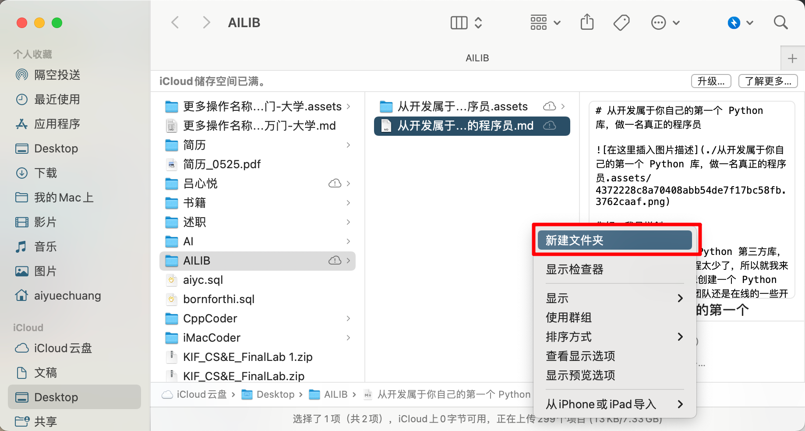
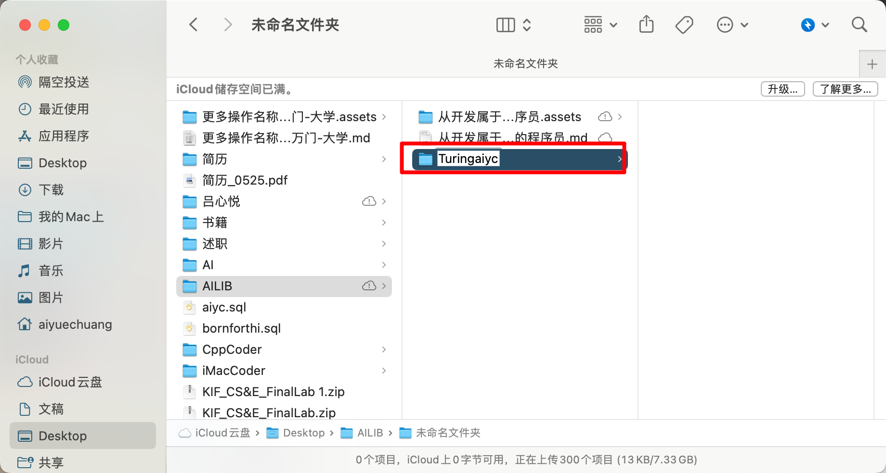
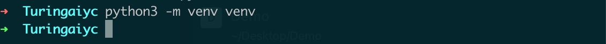
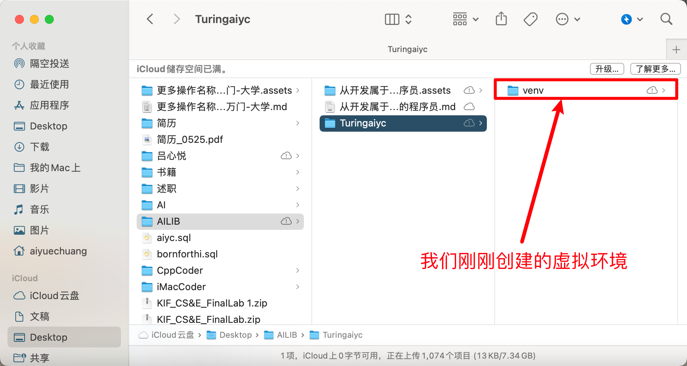
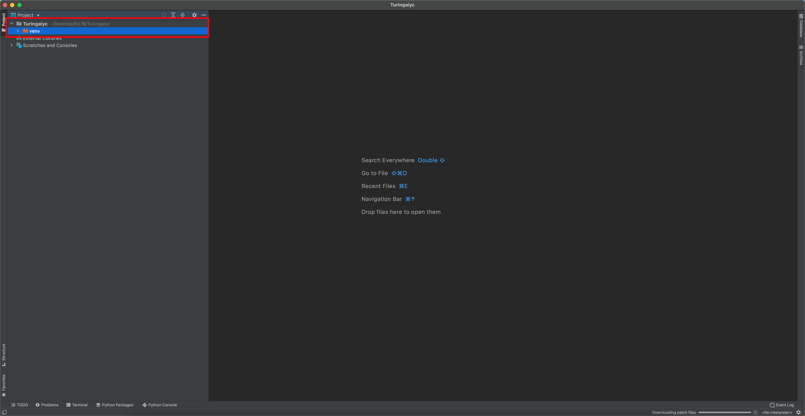
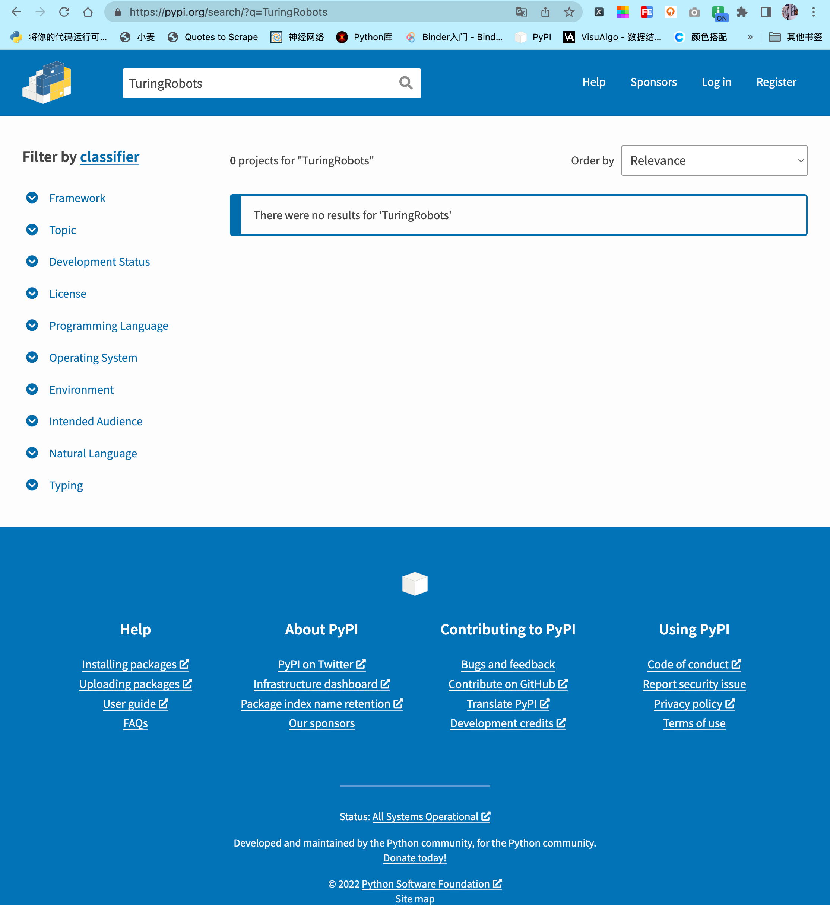
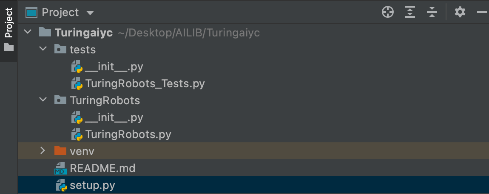

你好，我是悦创。

>   Hello, I'm Yue Chuang.

我最近想要去开始开发 Python 第三方库，但是发现国内这样的教程太少了，所以就我来写吧！ 

>    I recently wanted to start developing Python third-party libraries, but found that there are too few such tutorials in the country, so I will write them instead!

还有就是曾经想创建一个 Python 库，无论是为您的工作团队还是在线的一些开源项目？在此博客中，您将学习如何操作！

>   Ever wanted to create a Python library, albeit for your team at work or for some open source project online? In this blog you will learn how to!

当您使用相同的开发工具 Pycharm ，你会最容易跟上我的教程，当然您也可以使用不同的工具。 

>   The tutorial is easiest to follow when you are using the same tools, however it is also possible for you to use different ones.

本文章使用的是工具有：

>   The tools used in this tutorial are:

-   MacOS「其实，不管你使用何种电脑都可以」MacOS command prompt
-   Pycharm「社区版本足已」


## 第 0 步：MacOS 命令行命令「Step 0: MacOS command line command」

打开命令提示符并创建一个文件夹，您将在其中创建 Python 库。 

>   Open your command prompt and create a folder in which you will create your Python library.

请记住：

>   Remember:

- `pwd` 您可以看到您当前的工作目录。 「With `pwd` you can see your present working directory.」

- `ls` 您可以列出当前目录中的文件夹和文件。 「With `ls` you can list the folders and files in your directory.」

- `cd <path>` 您可以更改当前所在的目录。 「With `cd <path>` you can change the current present directory you are in.」

- `mkdir <folder>` 您可以在当前工作目录中创建一个新文件夹。 「With `mkdir <folder>` you can create a new folder in your working directory.」


## 第 1 步：创建一个要放置库的目录「Step 1: Create a directory in which you want to put your library」

我创建一个文件夹名为：Turingaiyc，这个名称其实也是我后面发布库的名称，注意不要太普遍因为会重复，重复就会导致**发布库失败**。

>   I created a folder called Turingaiyc, which is actually the name of the library I will publish later. Be careful not to make it too common because it will be repetitive, which will cause the library to fail.

「PS：你如果 Win 系统的话，可以使用下面的命令，如果是 MacOS 的话我其实更喜欢命令行创建。」

>   I created a folder called Turingaiyc, which is actually the name of the library I will publish later. Be careful not to make it too common because it will be repetitive, which will cause the library to fail.





就我而言，我将使用的文件夹是 `Turingaiyc`。将当前工作目录更改为您的文件夹。

>   In my case, the folder I will be working with is `Turingaiyc`. Change the present working directory to be your folder.


## 第 2 步：为您的文件夹创建一个虚拟环境「Step 2: Create a virtual environment for your folder」

在启动您的项目时，创建一个虚拟环境来封装您的项目总是一个好主意。虚拟环境由某个 Python 版本和一些库组成。

>   When starting your project, it is always a good idea to create a virtual environment to encapsulate your project. A virtual environment consists of a certain Python version and some libraries.

参考：[这么全的 Python 虚拟环境？不看可惜了！](https://mp.weixin.qq.com/s/-LeK-O6pO5b2SQtB_H83gw) 

>   Reference: [Such a full Python virtual environment? What a pity!](https://mp.weixin.qq.com/s/-LeK-O6pO5b2SQtB_H83gw)

虚拟环境可防止以后遇到依赖性问题。 例如，在较旧的项目中，您可能使用的是较旧版本的 numpy 库。一些曾经运行良好的旧代码可能会在你更新 numpy 版本后不能正常运行了。 创建虚拟环境可以防止这种情况，当你与其他人协作时，虚拟环境也能确保你的程序在其他人的电脑上正常运行。 反之亦然。

>   Virtual environments prevent the issue of running into dependency issues later on. For example, in older projects you might have worked with older versions of the `numpy` library. Some old code, that once worked beautifully, might stop working once you update its version. Perhaps parts of `numpy` are no longer compatible with other parts of your program. Creating virtual environments prevents this. They are also useful in cases when you are collaborating with someone else, and you want to make sure that your application is working on their computer, and vice versa.

接下来，你要确保你当前的工作目录是你刚刚创建的目录，( `cd <path/to/folder>` ) 中创建 Python 库的文件夹。） 

>   (Make sure you changed the present working directory to the folder you are going to create your Python library in (`cd <path/to/folder>`).)

继续并通过键入以下内容创建虚拟环境：

>   Go ahead and create a virtual environment by typing:

```cmd
python3 -m venv venv
```





创建后，你现在必须使用以下命令激活环境：

>   Once it is created, you must now activate the environment by using:

```cmd
source venv/bin/activate
```


激活虚拟环境会修改 PATH 和 shell 的变量，以指向您创建的特定虚拟环境 Python 的设置。PATH 是 MacOS/Linux 和其他类 Unix 操作系统中的环境变量，它告诉 shell 在响应用户发出的命令时，去搜索哪些目录的 Python 执行环境（即准备运行的程序）。命令提示符将更改为通过添加 ( yourenvname) 来指示您当前所在的虚拟环境。 

>   Activating a virtual environment modifies the PATH and shell variables to point to the specific isolated Python set-up you created. PATH is an environmental variable in Linux and other Unix-like operating systems that tells the shell which directories to search for executable files (i.e., ready-to-run programs) in response to commands issued by a user. The command prompt will change to indicate which virtual environment you are currently in by prepending (`yourenvname`).

你要确保你的环境已经安装了 pip、wheel、setuptools、twine。我们稍后将需要它们来构建我们的 Python 库。

>   In your environment, make sure you have pip installed `wheel`, `setuptools` and `twine`. We will need them for later to build our Python library.

```python
pip install wheel
pip install setuptools
pip install twine
```

或者也可以一条命了实现：

>   Or it can be done with one life:

```cmd
sudo pip install wheel setuptools twine
```

我用的是 MacOS 所以，Windows 的话，去掉 sudo。

>   I'm using MacOS so for Windows, get rid of Sudo.


## 第 3 步：创建文件夹结构「Step 3: Create a folder structure」

这一步，也就是创建我们开发库所需要的文件。 在 Pycharm 中，打开您的文件夹 mypythonlibrary（或你自己创建的文件夹名称）。它应该是这样的：

>   In Pycharm, open your folder mypythonlibrary (or any name you have given your folder). It should look something like this:



你现在可以开始向项目添加文件夹和文件。您可以通过命令提示符或在 Pycharm 本身中执行此操作。

>   You now can start adding folders and files to your project. You can do this either through the command prompt or in Pycharm itself.

1.  创建一个名为 `setup.py` 的空文件，这是创建 Python 库时最重要的文件之一！「Create an empty file called `setup.py`. This is one of the most important files when creating a Python library!」
2.  创建一个名为 `README.md` 的空文件，你可以在此处编写 Markdown 以向其他用户描述我们的库内容。「Create an empty file called `README.md`. This is the place where you can write markdown to describe the contents of your library for other users.」
3.  创建一个名为 `TuringRobots` ，或者任何您希望在 pip 安装时调用 Python 库的文件夹。（如果你想稍后发布它，该名称在 pip 上应该是唯一的。）「Create a folder called `TuringRobots`, or whatever you want your Python library to be called when you pip install it. (The name should be unique on pip if you want to publish it later.)」
4.  [https://pypi.org/search/?q=TuringRobots](https://pypi.org/search/?q=TuringRobots) 后面的 TuringRobots 修改成你自己的库名字，之后打开浏览器访问，看是否有这个库。



5.  在 `TuringRobots` 文件夹里面，创建名为 `__init__.py` 的空文件。基本上，任何包含文件的 `__init__.py` 文件夹，在我们构建它时，都将包含在库中。大多数情况下，您可以将 `__init__.py` 文件留空，也就是不用写代码。在导入时，其中的 `__init__.py` 里面的代码将被执行，因此它应该只包含能够运行项目所需的最少量代码。现在，我们将它保持原样。「Create an empty file inside `mypythonlib` that is called `__init__.py`. Basically, any folder that has an `__init__.py` file in it, will be included in the library when we build it. Most of the time, you can leave the `__init__.py` files empty. Upon import, the code within `__init__.py` gets executed, so it should contain only the minimal amount of code that is needed to be able to run your project. For now, we will leave them as is.」
6.  此外，在 `TuringRobots` 文件夹中，创建一个名为 `TuringRobots.py` 「Also, in the same folder, create a file called `TuringRobots.py`.」
7.  最后，在您的根文件夹中创建一个文件夹测试。在里面，创建一个空 `__init__.py` 文件和一个空的 `test_myfunctions.py` 「And, finally, create a folder tests in your root folder. Inside, create an empty `__init__.py` file and an empty `test_myfunctions.py`.」

你所创建的文件夹和代码文件，现在应如下所示：

>   Your set-up should now look something like this:




## 第 4 步：为您的库创建内容「Step 4: Create content for your library」

要将函数放入库中，您可以将它们放入 `TuringRobots.py` 文件中。例如，复制文件中的 TuringRobots 函数：

>   To put functions inside your library, you can place them in the `TuringRobots.py` file. For example, copy the TuringRobots function in your file:

```python
# -*- coding: utf-8 -*-
# @Time    : 2022/6/18 11:34
# @Author  : AI悦创
# @FileName: TuringRobots.py
# @Software: PyCharm
# @Blog    ：https://bornforthis.cn/
import json
import urllib.request
import os
from dotenv import load_dotenv

def TuringRobots(text, over_print=True):
	load_dotenv()
	api_url = "http://openapi.tuling123.com/openapi/api/v2"
	req = {
		"reqType": 0,
		"perception":
			{
				"inputText":
					{
						"text": text
					},
				"selfInfo":
					{
						"location":
							{
								"city": "厦门",
								"province": "厦门",
								"street": "海沧区"
							}
					}
			},
		"userInfo":
			{
				"apiKey": os.getenv("API_KEY"),
				"userId": "OnlyUseAlphabet"
			}
	}
	# print(req)
	# 将字典格式的req编码为utf8
	req = json.dumps(req).encode('utf8')
	# print(req)

	http_post = urllib.request.Request(api_url, data=req, headers={'content-type': 'application/json'})
	response = urllib.request.urlopen(http_post)
	response_str = response.read().decode('utf8')
	# print(response_str)
	response_dic = json.loads(response_str)
	# print(response_dic)

	intent_code = response_dic['intent']['code']
	results_text = response_dic['results'][0]['values']['text']
	if over_print:
		print('Turing的回答：')
		print('code：' + str(intent_code))
		print('text：' + results_text)
	else:
		return (str(intent_code), results_text)


if __name__ == '__main__':
	text = input("请输入你的对话：")
	code, content = TuringRobots(text, over_print=False)
	print(code, content)
```

上面实现了一个简单的机器人对话，对于 Python 测试，可以使用 pytest 和 pytest-runner 库。在虚拟环境中安装库：

>   A simple robot dialogue is implemented above, For testing with Python you can use the libraries `pytest` and `pytest-runner`. Install the library in your virtual environment:

```python
pip install pytest
pip install pytest-runner
pip install python-dotenv
```

让我们为项目创建一个小测试，测试如下：

>   Let's create a small test for the project that looks like this:
>
>   `TuringRobots_Tests.py`

```
from TuringRobots import TuringRobots

def test_TuringRobots():
	assert TuringRobots.TuringRobots("我是天才，那你呢？", over_print=True)
```

最后，让我们创建一个 `setup.py` 文件，它将帮助我们构建库。`setup.py` 的内容如下所示：

>   Finally, let’s create a `setup.py` file, that will help us to build the library. A limited version of `setup.py` will look something like this:

```python
from setuptools import find_packages, setup
setup(
    name='mypythonlib',
    packages=find_packages(),
    version='0.1.0',
    description='My first Python library',
    author='Me',
    license='MIT',
)
```

我的设置：【你们看简洁的配置即可】

```python
# -*- coding: utf-8 -*-
# !/usr/bin/env python
# @Time    : 2022/6/18 11:51
# @Author  : AI悦创
# @FileName: setup.py
# @Software: PyCharm
# @Blog    ：https://bornforthis.cn/
# Note: To use the 'upload' functionality of this file, you must:
#   $ pipenv install twine --dev

import io
import os
import sys
from shutil import rmtree

from setuptools import find_packages, setup, Command

# Package meta-data.
NAME = 'TuringRobots'
DESCRIPTION = 'Simple dialogue test Turing robot.'
URL = 'https://github.com/AndersonHJB/TuringRobots'
EMAIL = 'bornforthis@bornforthis.cn'
AUTHOR = 'Bornforthis'
REQUIRES_PYTHON = '>=3.6.0'
VERSION = '1.2.5'

# What packages are required for this module to be executed?
REQUIRED = [
	# 'dotenv==0.0.5',
]

# What packages are optional?
EXTRAS = {
	# 'fancy feature': ['django'],
}

# The rest you shouldn't have to touch too much :)
# ------------------------------------------------
# Except, perhaps the License and Trove Classifiers!
# If you do change the License, remember to change the Trove Classifier for that!

here = os.path.abspath(os.path.dirname(__file__))

# Import the README and use it as the long-description.
# Note: this will only work if 'README.md' is present in your MANIFEST.in file!
try:
	with io.open(os.path.join(here, 'README.md'), encoding='utf-8') as f:
		long_description = '\n' + f.read()
except FileNotFoundError:
	long_description = DESCRIPTION

# Load the package's __version__.py module as a dictionary.
about = {}
if not VERSION:
	project_slug = NAME.lower().replace("-", "_").replace(" ", "_")
	with open(os.path.join(here, project_slug, '__version__.py')) as f:
		exec(f.read(), about)
else:
	about['__version__'] = VERSION


class UploadCommand(Command):
	"""Support setup.py upload."""

	description = 'Build and publish the package.'
	user_options = []

	@staticmethod
	def status(s):
		"""Prints things in bold."""
		print('\033[1m{0}\033[0m'.format(s))

	def initialize_options(self):
		pass

	def finalize_options(self):
		pass

	def run(self):
		try:
			self.status('Removing previous builds…')
			rmtree(os.path.join(here, 'dist'))
		except OSError:
			pass

		self.status('Building Source and Wheel (universal) distribution…')
		os.system('python3 -m build')
		# os.system('{0} setup.py sdist bdist_wheel --universal'.format(sys.executable))
		# os.system('{0} setup.py sdist build --universal'.format(sys.executable))
		# os.system('{0} setup.py sdist build --universal'.format(sys.executable))

		self.status('Uploading the package to PyPI via Twine…')
		os.system('twine upload dist/*')

		self.status('Pushing git tags…')
		os.system('git tag v{0}'.format(about['__version__']))
		os.system('git push --tags')

		sys.exit()


# Where the magic happens:
setup(
	name=NAME,
	version=about['__version__'],
	description=DESCRIPTION,
	long_description=long_description,
	long_description_content_type='text/markdown',
	author=AUTHOR,
	author_email=EMAIL,
	python_requires=REQUIRES_PYTHON,
	url=URL,
	# packages=find_packages(exclude=["tests", "*.tests", "*.tests.*", "tests.*"]),
	# packages=find_packages(exclude=["TuringRobots", ]),
	packages=find_packages(include=["TuringRobots",]),
	# If your package is a single module, use this instead of 'packages':
	# py_modules=['mypackage'],

	# entry_points={
	#     'console_scripts': ['mycli=mymodule:cli'],
	# },
	install_requires=REQUIRED,
	# setup_requires=['pytest-runner'],
	# tests_require=['pytest'],
	# tests_require=['pytest', 'dotenv'],
	test_suite='tests',
	extras_require=EXTRAS,
	include_package_data=True,
	license='MIT',
	classifiers=[
		# Trove classifiers
		# Full list: https://pypi.python.org/pypi?%3Aaction=list_classifiers
		'License :: OSI Approved :: MIT License',
		'Programming Language :: Python',
		'Programming Language :: Python :: 3',
		'Programming Language :: Python :: 3.6',
		'Programming Language :: Python :: Implementation :: CPython',
		'Programming Language :: Python :: Implementation :: PyPy'
	],
	# $ setup.py publish support.
	cmdclass={
		'upload': UploadCommand,
	},
)
```


## 第 5 步：设置您想要创建的包「Set the packages you would like to create」

setup 中的 name 变量保存您希望包轮文件具有的任何名称。为了方便起见，我们将其命名为与文件夹相同的名称。

>   The name variable in setup holds whatever name you want your package wheel file to have. To make it easy, we will gave it the same name as the folder.

虽然原则上 `find_packages()` 可以不带任何参数使用，但这可能会导致包含不需要的包。 所以，我们可以这么来写：

例如，如果您在 `tests/` 目录中包含 `__init__.py` , 就会发生这种情况。另外，您也可以使用 exclude 参数显式地阻止在包中包含测试，但是这样做稍微不那么健壮。让我们把它改为如下:

```python
from setuptools import find_packages, setup
setup(
    name='mypythonlib',
    packages=find_packages(include=['mypythonlib']),
    version='0.1.0',
    description='My first Python library',
    author='Me',
    license'MIT',
)
```


## 第 6 步：设置库所需的要求「Set the requirements your library needs」

注意，当你的项目被其他人作为依赖项安装时，pip 不会使用`requirements.yml`/ `requirements.txt`。 通常，为此，您必须在 `setup.py` 文件的 `install_requires` 和 `tests_require` 参数中指定依赖项。 

>   Note that pip does not use `requirements.yml` / `requirements.txt` when your project is installed as a dependency by others. Generally, for that, you will have to specify dependencies in the `install_requires` and `tests_require` arguments in your `setup.py` file.

`Install_requires` 应该仅限于绝对需要的软件包列表。这是因为您不想让用户安装不必要的软件包。 **另请注意，你不需要列出属于标准 Python 库的包。** 

>   `Install_requires` should be limited to the list of packages that are absolutely needed. This is because you do not want to make users install unnecessary packages. Also note that you do not need to list packages that are part of the standard Python library.

如果你用的是 Python 自带的库，是可以不用写的，并且保证这个库是一直到现在的 Python 本版的可以使用的。 也许你还记得我们 `pytest` 、`numpy` 之前安装过这个库。当然，你不想在其中添加 `pytest` 依赖项。这个包的用户不需要它。为了仅在运行测试时自动安装它，您可以将以下内容添加到您的 `setup.py`：

```python
from setuptools import find_packages, setup
setup(
    name='mypythonlib',
    packages=find_packages(include=['mypythonlib']),
    version='0.1.0',
    description='My first Python library',
    author='Me',
    license='MIT',
    install_requires=[],
    setup_requires=['pytest-runner'],
    tests_require=['pytest==4.4.1'],
    test_suite='tests',
)
```

运行：将执行存储在 “tests” 文件夹中的所有测试。

```python
python setup.py pytest
```

Running:

`> python setup.py pytest`

will execute all tests stored in the ‘tests’ folder.

>   下面是简单的代码测试输出：
>
>   ```python
>   (venv) aiyc@aiyc:~/Linux_Code/mypythonlibrary$ python setup.py pytest
>   running pytest
>   running egg_info
>   creating mypythonlib.egg-info
>   writing mypythonlib.egg-info/PKG-INFO
>   writing dependency_links to mypythonlib.egg-info/dependency_links.txt
>   writing requirements to mypythonlib.egg-info/requires.txt
>   writing top-level names to mypythonlib.egg-info/top_level.txt
>   writing manifest file 'mypythonlib.egg-info/SOURCES.txt'
>   reading manifest file 'mypythonlib.egg-info/SOURCES.txt'
>   writing manifest file 'mypythonlib.egg-info/SOURCES.txt'
>   running build_ext
>   ================================================================ test session starts =================================================================
>   platform linux -- Python 3.8.10, pytest-6.2.4, py-1.10.0, pluggy-0.13.1
>   rootdir: /home/aiyc/Linux_Code/mypythonlibrary
>   collected 1 item                                                                                                                                     
>   
>   tests/test_myfunctions.py .  
>   ```


## 第 7 步：构建你的库「Step 5: Build your library」

现在所有内容都已准备就绪，我们要构建我们的库。确保您当前的工作目录是 `/path/to/mypythonlibrary`（因此是项目的根文件夹）。在您的命令提示符中，运行：

>   Now that all the content is there, we want to build our library. Make sure your present working directory is `/path/to/mypythonlibrary `(so the root folder of your project). In your command prompt, run:

```python
python setup.py bdist_wheel
```

您的轮文件存储在现在创建的 “dist” 文件夹中。您可以使用以下方法安装您的库：

>   Your wheel file is stored in the “dist” folder that is now created. You can install your library by using:

```python
pip install /path/to/wheelfile.whl
```

请注意，您还可以将您的库发布到您工作场所内联网上的内部文件系统，或发布到官方 PyPI 存储库并从那里安装它。 安装 Python 库后，您可以使用以下命令导入它：

>   Note that you could also publish your library to an internal file system on intranet at your workplace, or to the official PyPI repository and install it from there.Once you have installed your Python library, you can import it using:

```python
import mypythonlib
from mypythonlib import myfunctions
```

---

我自己使用如下官方构建：

```python
python3 -m pip install --upgrade build
```

```python
python3 -m build
```

---

```cmd
# 测试代码
python setup.py pytest
# 提交代码
python setup.py upload
```


## 参考文章：

-   [如何创建 Python 库](https://bornforthis.cn/posts/17.html)
-   [https://packaging.python.org/en/latest/tutorials/packaging-projects/](https://packaging.python.org/en/latest/tutorials/packaging-projects/)
-   [https://packaging.python.org/en/latest/specifications/pypirc/](https://packaging.python.org/en/latest/specifications/pypirc/)
-   [https://medium.com/analytics-vidhya/how-to-create-a-python-library-7d5aea80cc3f](https://medium.com/analytics-vidhya/how-to-create-a-python-library-7d5aea80cc3f)
-   [https://medium.com/@alexbebereche/how-to-hide-you-api-key-with-python-5cc63d2a6c45](https://medium.com/@alexbebereche/how-to-hide-you-api-key-with-python-5cc63d2a6c45)

欢迎关注我公众号：AI悦创，有更多更好玩的等你发现！

::: details 公众号：AI悦创【二维码】


:::

::: info AI悦创·编程一对一

AI悦创·推出辅导班啦，包括「Python 语言辅导班、C++ 辅导班、java 辅导班、算法/数据结构辅导班、少儿编程、pygame 游戏开发」，全部都是一对一教学：一对一辅导 + 一对一答疑 + 布置作业 + 项目实践等。当然，还有线下线上摄影课程、Photoshop、Premiere 一对一教学、QQ、微信在线，随时响应！微信：Jiabcdefh

C++ 信息奥赛题解，长期更新！长期招收一对一中小学信息奥赛集训，莆田、厦门地区有机会线下上门，其他地区线上。微信：Jiabcdefh

方法一：[QQ](http://wpa.qq.com/msgrd?v=3&uin=1432803776&site=qq&menu=yes)

方法二：微信：Jiabcdefh

:::


