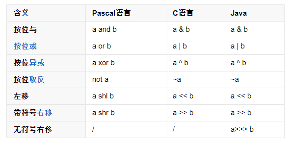
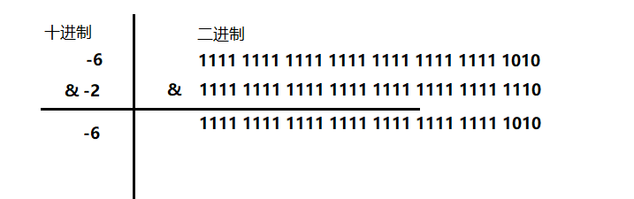
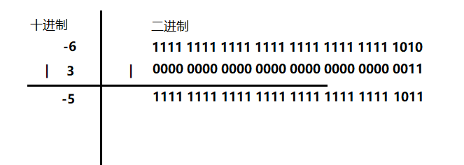
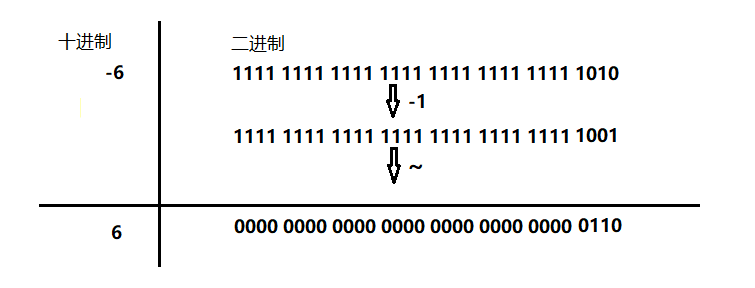
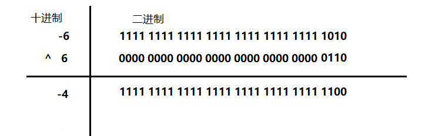
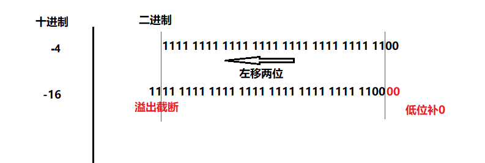
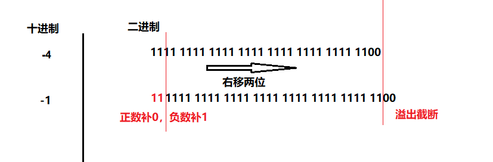
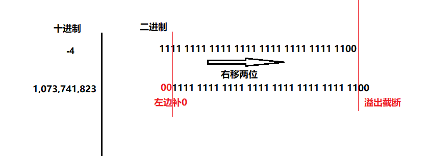

你好，我是悦创。推荐你先阅读此篇：[一文讲清楚补码的本质](https://bornforthis.cn/posts/22.html)

## 概述

程序中的所有数在计算机内存中都是以二进制的形式储存的。位运算就是直接对整数在内存中的二进制位进行操作。巧妙的使用位运算可以大量减少运行开销，优化算法。

## 运算符号

## 按位与（&）

**规则：** 两个操作数对应位同为 1 时，结果为 1，其余全为 0。

## 按位或（|）

**规则：** 两个操作数对应位同为 0 时，结果为 0，其余全为 1。

## 按位非（~）

**规则：** 每个操作数对应位取反即可。

## 按位异或（^）

**规则：** 两个操作数对应位相同时，结果为 0，不同时，结果为 1。

## 左位移（<<）

**规则：** 将一个操作数的各二进制位全部左移若干位（左边的二进制位丢弃，右边补 0）。

## 右位移（>>）

**规则：** 将一个操作数的各二进制位全部右移若干位（右边的二进制位丢弃，正数左补 0，负数左补 1）。

## 无符号右移（>>>）

**规则：** 将一个操作数的各二进制位全部右移若干位（右边的二进制位丢弃，右边补 0）。

- 判断一个数 n 的奇偶性:
    n & 1 == 1 ? "奇数" : "偶数";
- 取绝对值:
    (a^(a>>31))-(a>>31)；
    a>>31 取得 a 的符号，若 a 为正数，a>>31 等于0，a^0=a，不变；若 a 为负数, a>>31 等于-1 ，a^-1 翻转每一位。

欢迎关注我公众号：AI悦创，有更多更好玩的等你发现！

::: details 公众号：AI悦创【二维码】

:::

::: info AI悦创·编程一对一

AI悦创·推出辅导班啦，包括「Python 语言辅导班、C++ 辅导班、java 辅导班、算法/数据结构辅导班、少儿编程、pygame 游戏开发」，全部都是一对一教学：一对一辅导 + 一对一答疑 + 布置作业 + 项目实践等。当然，还有线下线上摄影课程、Photoshop、Premiere 一对一教学、QQ、微信在线，随时响应！微信：Jiabcdefh

C++ 信息奥赛题解，长期更新！长期招收一对一中小学信息奥赛集训，莆田、厦门地区有机会线下上门，其他地区线上。微信：Jiabcdefh

方法一：[QQ](http://wpa.qq.com/msgrd?v=3&uin=1432803776&site=qq&menu=yes)

方法二：微信：Jiabcdefh

:::

