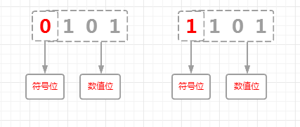

你好，我是悦创。

在计算机中，所有的数字都是以二进制的形式表示的，即均为 0 和 1 组成的各种编码，数字的表示形式可以划分成原码，反码和补码

## 如何表示 原码、反码、补码

如果没有特殊说明，下面的介绍都是以 4 位二进制为例的。

###  原码

为了区分正数和负数，计算机中将二进制的最高位( bit ) 规定为符号位，**它等于 0 时表示正数，等于 1 时表示负数，剩下的所有低位( bit )用来表示数值** 。

下面的图片从左到右分别表示 `+5`和 `-5`的原码。



### 反码

正数的反码和其原码相同，负数的反码在原码基础上，符号位不变，数值位取反。

下面的图片从左到右分别表示 `+5`和 `-5`的反码。


### 补码

正数的补码和其原码相同，负数的补码在反码基础上加 1。

下面的图片从左到右分别表示 `+5`和 `-5`的补码。


## 为什么用补码

在计算机中，数字是以补码的形式进行存储和参与运算的。

这看起来比较奇怪，为什么要采用补码这么麻烦的方式表示数字( 特别是对于负数 )，直观一点儿不好吗？

为了讲明白这个问题，下面我们分别以原码，反码和补码的形式来模拟二进制的加法和减法运算，以 4 位二进制为例来说明：

### 原码

下图列出了 4 位二进制所有正数和负数的二进制表示。

对于 4 位二进制来说，最高位是符号位，也就是图中黄色二进制的 0 和 1 的位置。


用原码模拟 `3 + 2` 、`6 + (-2)`  、`(-1) + (-3)`  运算，具体的运算过程如下：


上图中，圆圈中的二进制位是做加法运算的时候向前进位的结果，由于有效二进制位数是 4 位，所以圆圈中的二进制位因溢出而自动丢弃（在计算过程中仍然用到了溢出的二进制位，结果会丢弃溢出的二进制）

由计算过程可知，`3 + 2 = 5` 是正确的，但是 `6 + (-2) = 0` 以及 `(-1) + (-3) = 4` 结果都是错误的。

所以，原码虽然直观易懂，也易于转换，但是在运算上，正数之间的加法是没问题，负数之间以及正数和负数之间都存在问题，因此计算机中不能用原码表示数字。

### 反码

下面列出了 4 位二进制所有正数和负数的二进制表示，请看下图。

正数的反码是其自身，负数的反码是符号位不变，其他位取反，图中黄色二进制位表示符号位：


用反码模拟 `3 + 2`、`6 + (-2)` 、`(-1) + (-3)` 运算，具体的运算过程如下：


和原码一样，上图中圆圈中的二进制位由于溢出而被自动丢弃，在反码的运算中，只有 `3 + 2 = 5` 是正确的，其他的结果都不正确

**注意：**  `(-1) + (-3)` 的结果是 1010，符号位为 1，表示结果是负数，根据上面负数十进制对应二进制的反码表可知，它对应的十进制是 -5。

由反码运算结果来看，正数的加法结果是正确的，负数和负数以及正数和负数加法的结果是错误的，所以，计算机中也不能用反码表示数字。

### 补码

说完了原码和反码，现在来看下补码，下图是正数和负数补码的二进制表示：


用补码模拟 `3 + 2` 、`6 + (-2)` 、`(-1) + (-3)`  运算，具体的运算过程如下：


由上述计算过程可知，除去溢出的二进制位后，`3 + 2`、`6 + (-2)`、`(-1) + (-3)` 计算的结果全都正确。

**用原码和反码的表示方式，都不能解决加法运算，但是用补码表示，不管是正数之间、负数之间还是正数和负数之间的加法，都可以解决。**

所以，计算机选择用补码来表示数字以及用补码进行运算。

## 补码的好处

### 简化减法计算

补码在加法或减法处理中，不需因为数字的正负而使用不同的计算方式。只要一种加法电路就可以处理各种有符号数和无符号数加法。

而且减法可以用一个数加上另一个数的补码来表示，因此只要有加法电路及补码电路即可完成各种有符号数和无符号数加法及减法，在电路设计上相当方便。

### 统一表示数字 0

另外，根据上一小节中，`+0` 和 `-0` 的补码都是 0000，对应的十进制是 0

也就是说 0 的补码就只有一种表示方式，在计算机中也就有唯一的表示，这和反码不同（在反码中，0有二种二进制表示方式），因此在判断数字是否为 0 时，只要比较一次即可

由于 `+0` 和 `-0` 的补码只有一种表示方式，即 0000，但是原码和反码都有两种表示方式，所以补码会多出一种二进制表示方式 1000（ 以 4 位二进制为例 ），对应十进制数 `-8`。

### 补码是怎么来的

前面讲到 负数的补码是其反码加 1 ， 为什么要这么计算呢， 这么计算就是有效吗 ？

在十进制中，一个负数可以通过 0 减去一个正数得到，同样的，二进制中也可以。

比如：`-3`可以表示成 `0 - 3`，也可以表示成下面的二进制减法计算。


因为 `0 ( 0000 )`小于 `3 ( 0011 )`，根据算术运算规则，当被减数的位小于减数时，需向前一位借 `1`，`0000`向前一位借 `1`后变成了 `1 0000`，于是，上面的减法计算就变成了：


我们知道， `1 0000`可以表示成 `1111`与 `1`的和, 也即 **1** **0000 = 1111 + 1**， 于是，计算就变成了：


根据上面的计算，**0** ( `0000`) 减 **3**（`0011`） 的结果是 `1101`, 而 `1101`刚好是 `-3`的补码

其实，上面的计算过程就相当于先求反码然后加 1 ， 请看下图：


用 1111 减去 3 的源码 0011，结果是 -3 的反码 1100，然后再加 1 ，得到 -3 的补码 1101

再看看前面介绍的，负数的补码等于其反码加 1，是不是有点儿似曾相识呢，是的，负数的反码就是这么来的，它并不是一个毫无根据的定义，而是通过上面的计算一步一步得出来的，只不过补码的计算方式刚好是其反码加 1 而已。

### 为什么补码适合正数的加法

我们还是以 4 位二进制为例来进行说明

假如有两个正数 A 和 B，现在要证明 A 减 B 的结果等于 A 加上 B 的补码

减去一个数等于加上一个负数，所以 `A - B = A + ( 0 - B )` 

由上一小节可知， ( 0 - B ) 等价于 **( 1111 - B ) + 1**

所以，A 加 B 的补码就等于 **A + ( 1111 - B ) + 1**，假如结果为 R ，则有 R = A + ( 1111 - B ) + 1

**A + ( 1111 - B ) + 1** 可以写成 **A - B + ( 1111 + 1 )**

**A - B + ( 1111 + 1 )** 又可以写成 **A - B + 1 0000** ( 1111 + 1 = 1 0000 )

我们是以 4 位二进制为例的， **1 0000** 已经超过 4 位了，所以加 **1 0000** 时，最高位会因溢出而被丢弃

其实这时 **1 0000** 就相当于 **0000** 了（最高位溢出，需要丢弃）

所以，上面的计算：

```cmake
R = A + ( 1111 - B ) + 1
  = A - B + ( 1111 + 1 ) 
  = A - B + 1 0000
  = A - B +   0000
  = A - B
```

这样就证明了 A 减 B 等于 A 加上 B 的补码

## 小结

本文介绍了原码、反码以及补码，重点阐述了补码的由来以及证明了补码计算正数加法的可行性。

欢迎关注我公众号：AI悦创，有更多更好玩的等你发现！

::: details 公众号：AI悦创【二维码】


:::

::: info AI悦创·编程一对一

AI悦创·推出辅导班啦，包括「Python 语言辅导班、C++ 辅导班、java 辅导班、算法/数据结构辅导班、少儿编程、pygame 游戏开发」，全部都是一对一教学：一对一辅导 + 一对一答疑 + 布置作业 + 项目实践等。当然，还有线下线上摄影课程、Photoshop、Premiere 一对一教学、QQ、微信在线，随时响应！微信：Jiabcdefh

C++ 信息奥赛题解，长期更新！长期招收一对一中小学信息奥赛集训，莆田、厦门地区有机会线下上门，其他地区线上。微信：Jiabcdefh

方法一：[QQ](http://wpa.qq.com/msgrd?v=3&uin=1432803776&site=qq&menu=yes)

方法二：微信：Jiabcdefh

:::


