苔花如米小，也学牡丹开。———袁枚《苔》

> 当“内卷”和“躺平”变成年轻人之间盛行的热词，很多人逐渐接受了自己平凡的设定。

**但仍然有一部分人，甘于平凡却不甘平庸，为自己心中值得的理想披荆斩棘地奋斗着。**

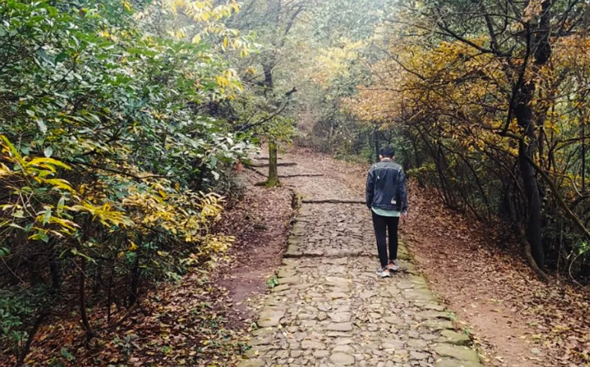

岩石不像金字塔一样耀眼，却和它一样坚不可摧。大二的小轩，就是那个平淡不懈怠的“平凡少年”。

@小轩，浙江，工业机器人专业

## 精彩人生，始于规划
**有目标的人在奔跑，没目标的人在流浪。**

高考时，小轩梦想专业是金融或会计学，但为了方便就业，最终他报考了更有专业性浙江机电职业技术学院：“相当于专科里的清华北大”。

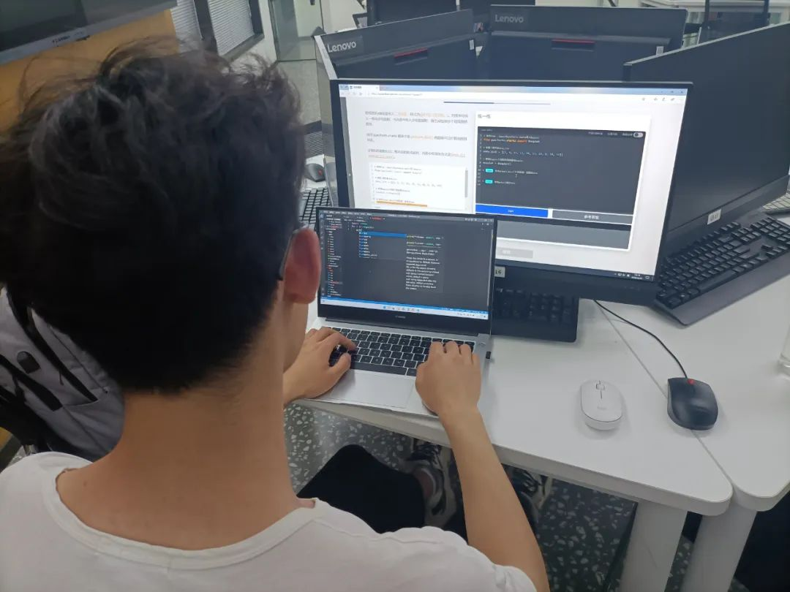

**高学历和硬技能，哪个更重要？** 这个问题热度不断，却没有终极答案。

在小轩看来，两者并不冲突。

刚升入大二，在同龄人还在探索校园乐趣时，小轩已经对未来有了清晰的目标——创业！

**“未来还是想自己做一番事业，但肯定需要时间去沉淀。”**

有了未来蓝图，小轩的规划也更加清晰。 **利用专业课学习技能知识，挤出课余时间探索兴趣领域。**

“想象一下自己未来想要的生活状态，都需要现在学习来打基础，一步一个脚印，迈向那个目标。”

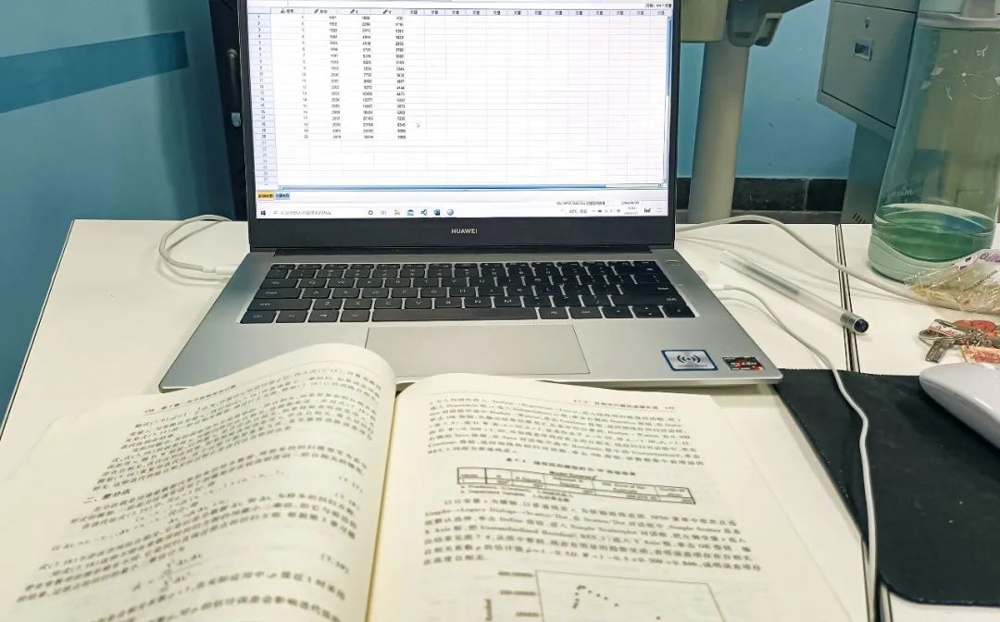

他了解商业模式课程，观察企业运作方式；备考初级会计师，熟悉如何看财务报表；学习金融理论，锻炼投资思维…

**“人生也是要做定位的，规划决定人生走向，你的未来就藏在规划里。”**

## 脚踏实地，成于行动
确定了方向，小轩开始按部就班学习积累。教学楼、图书馆和实训室是小轩最常去的地方。

“有一天误打误撞了解到 Python，发现可以用代码解决好多办公问题，对工作肯定有帮助。”这是小轩对 Python 的初步了解。

学习 Python 之后，小轩对各种代码实现的功能产生了强烈的兴趣，学习热情也一发不可收拾。

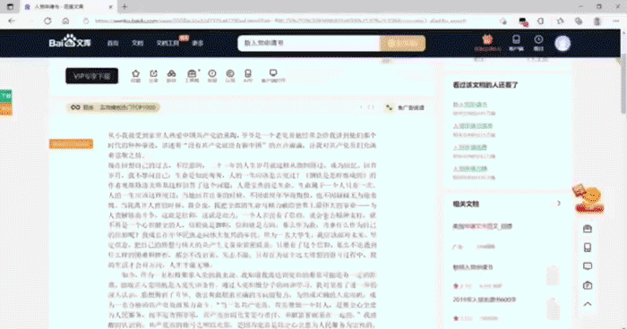

“我们专业对标的编程语言不多，一般就是C、C++或者C#，我现在学Python，也可以作为以后学这些语言的基础。”

“而且最近学的机械视觉课程，里面也涉及到Python的一些脚本，看到熟悉的知识领域，觉得很开心！”

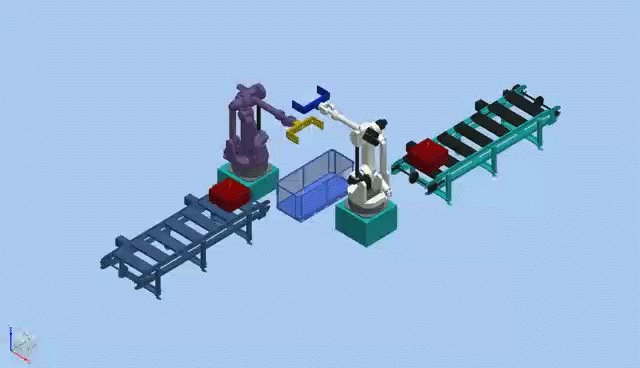

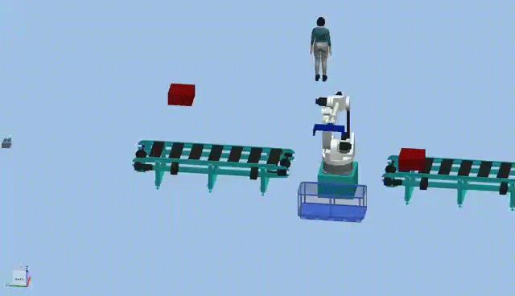

（专业课中的机械臂和仿真生产线)

热爱 Python 的小轩，最大的烦恼就是遇见报错。

**“编程世界真的给我带来喜怒哀乐！**  每当代码一遍遍报错的时候，我的内心是很烦躁的，好在有视频的指导，老师的帮助，让我不会迷茫太久。”

“但每次程序运行成功的时候，给我带来的成就感和喜悦也是很强烈的！”

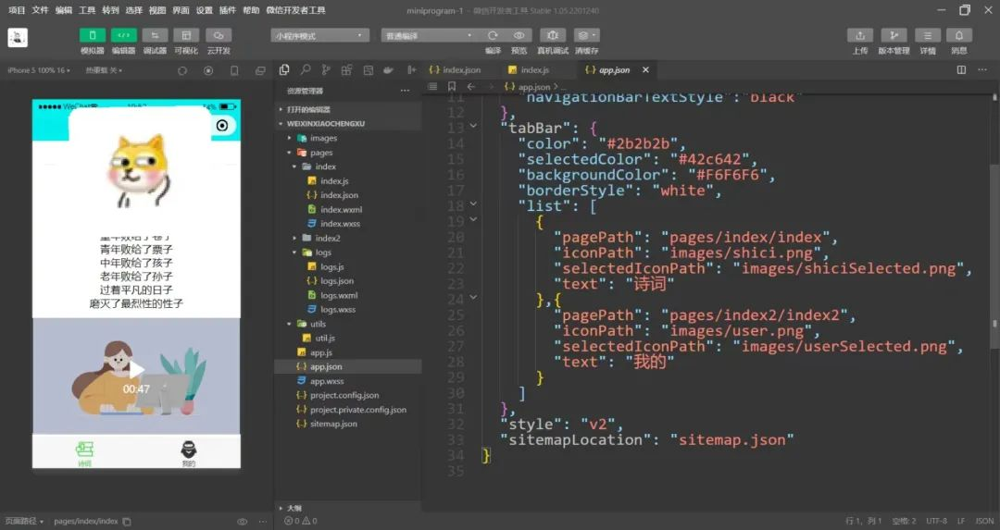

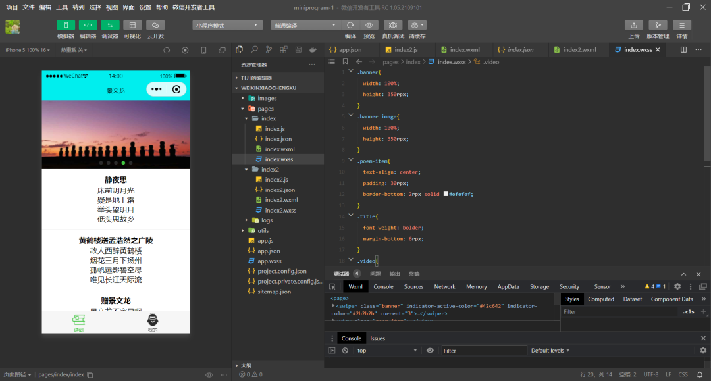

小轩的编程技能逐渐熟练，做完课内项目后，他开始主动寻求锻炼的机会，每当身边有人遇到烦恼，他都摩拳擦掌，跃跃欲试图片

用爬虫帮同学解决课题素材的苦恼，假期写代码用12306抢票、节日给亲友自动发送祝福……

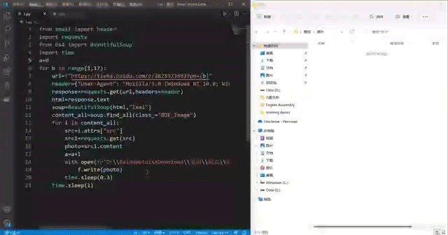

甚至连幼儿园的大侄子也不“放过”——寒假回家，**小轩用 Python 安排了十以内加减法的习题，让侄子练习。**

“当时给侄子弄了个左边习题，右边答案的小练习，放假的时候让他做一做，等他上一年级了再给他准备些更难的”

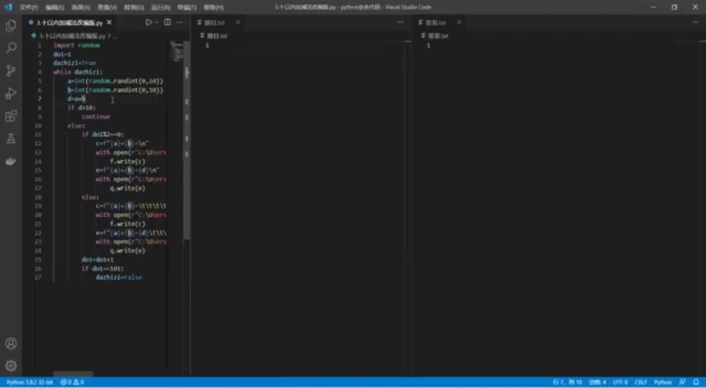

“我虽然不是计算机专业的，但 **流沙团队｜AI悦创** 让我对 Python 产生了兴趣，有时候做一个项目，不知不觉一下午就过去了。”

**“生命的平凡不能决定你的未来，而真正决定未来的，是你此时此刻的状态。是流沙团队｜AI悦创给了我此刻不断学习的动力。”**

没有行动，理想再美也只是远方的风景。小轩的梦想，在他的一步步行动里越来越近。

## 厚积薄发，终于坚持
去年暑假，小轩和同学一起参与了校园数学建模竞赛。

抽到的题要做相关分析，而两个男孩当时才大一，还没有系统学习如何用 Matlab 进行数据处理，庞大的杂乱数据用 Excel 也无法解决。

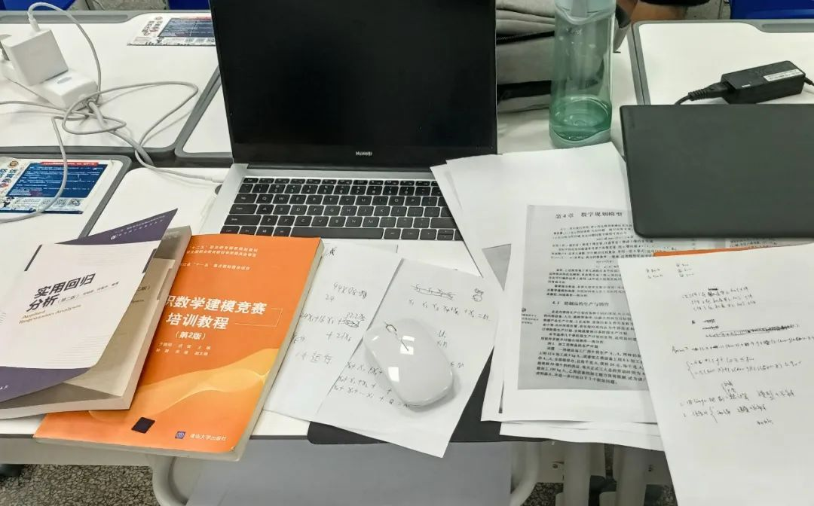

大家正一筹莫展时， **小轩想到自己学过的 Python 数据分析有类似的案例** ，他找到代码，用最快的方法攻克了竞赛的难题。

“那道题特别多的因变量，密密麻麻的，然后要画折线图，幸好当时用 Python 做出了那个图。 **学习永远不会亏待你。”**

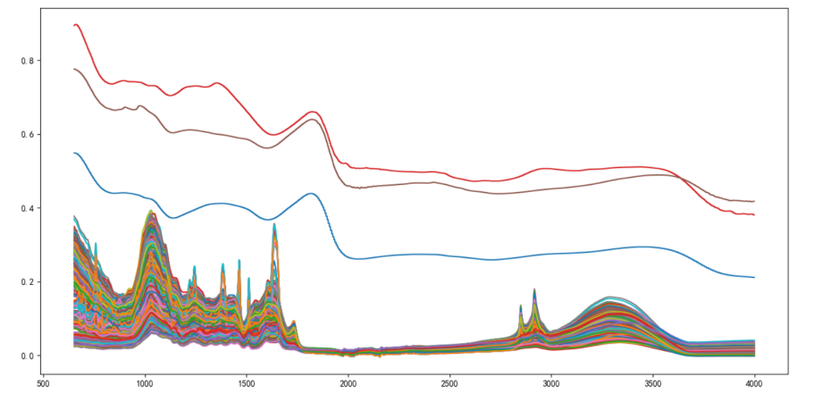
“在大学期间除了专业课，我接触时间最长的就是 **流沙团队｜AI悦创** 的 Python 课了。我从不爱学习，到现在一天不学习就很难受。

（小轩在流沙团队｜AI悦创获得的学习证书)

**不是所有人都擅长学习，但所有人都可以坚持学习。**

小轩常说自己很“笨”，有些知识需要看很多遍才能学懂，“重复学习”貌似是一个“笨办法”，但总能温故而知新，让他的编程基础日益牢固。

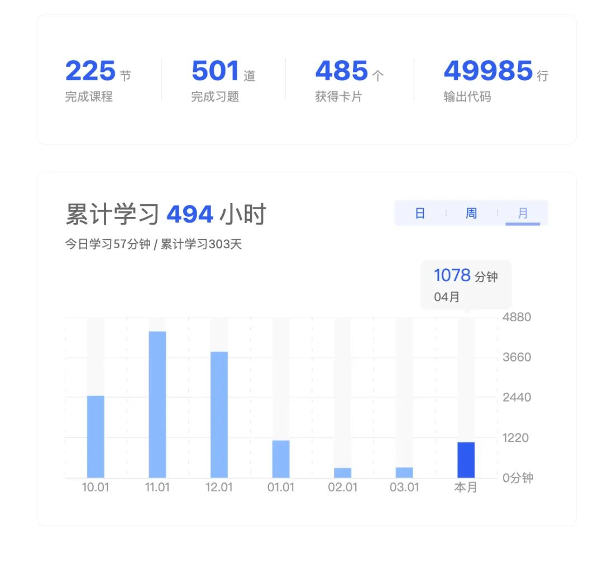
不知不觉，小轩已经和流沙团队·AI悦创共同度过了 494 个小时，仅仅在流沙团队·AI悦创输出的代码就有近5万行。

他说，在流沙团队·AI悦创学到的，不只是如何用 Python 写代码，更多的是思维逻辑的锻炼、自查错误和解决问题的能力。

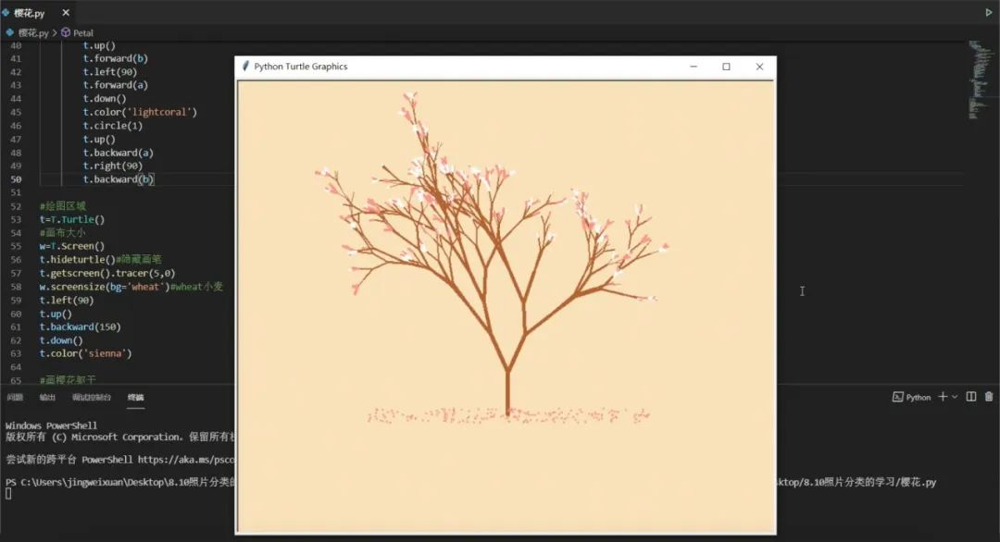

小轩用 Python 的 Turtle 画樱花

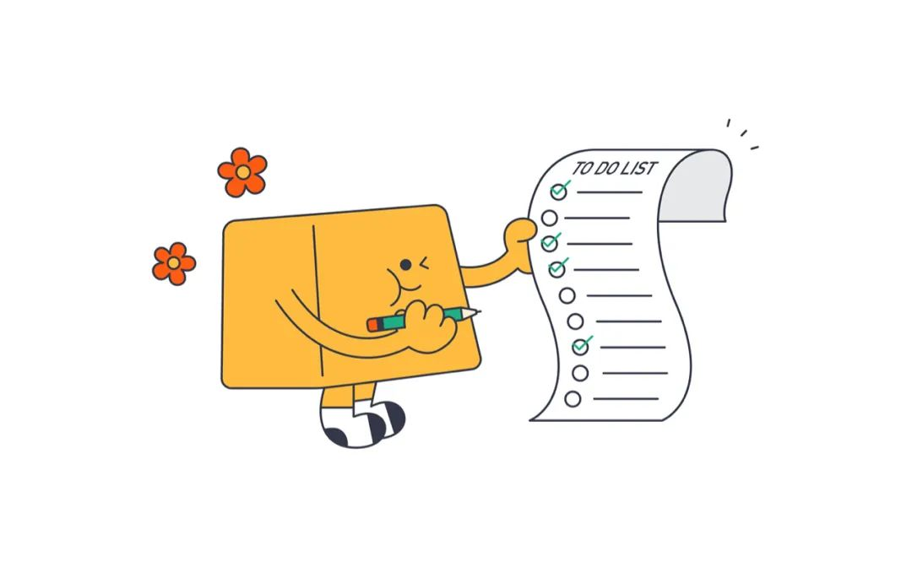

欢迎关注我公众号：AI悦创，有更多更好玩的等你发现！

::: details 公众号：AI悦创【二维码】

:::

::: info AI悦创·编程一对一

AI悦创·推出辅导班啦，包括「Python 语言辅导班、C++ 辅导班、java 辅导班、算法/数据结构辅导班、少儿编程、pygame 游戏开发」，全部都是一对一教学：一对一辅导 + 一对一答疑 + 布置作业 + 项目实践等。当然，还有线下线上摄影课程、Photoshop、Premiere 一对一教学、QQ、微信在线，随时响应！微信：Jiabcdefh

C++ 信息奥赛题解，长期更新！长期招收一对一中小学信息奥赛集训，莆田、厦门地区有机会线下上门，其他地区线上。微信：Jiabcdefh

方法一：[QQ](http://wpa.qq.com/msgrd?v=3&uin=1432803776&site=qq&menu=yes)

方法二：微信：Jiabcdefh

:::

