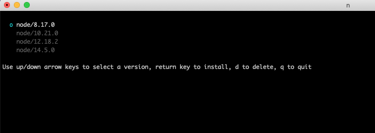
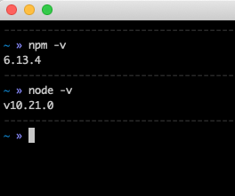
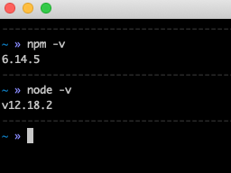

node 开发中，经常遇到版本不匹配的问题，导致编译失败，卸载该版本重新安装的成本又太高，因此我们需要多版本管理的工具。

## 工具 n / nvm
n 相比于 nvm 更容易安装 node，因此选用 n 作为多 node 版本的管理工具

## 安装

- 在具有 node 的环境可以直接使用以下命令安装

```cmd
npm install -g n
```

- 如果没有 npm 可以使用 brew 进行安装

```cmd
brew install n
```

## 使用

- 安装最新的版本

```cmd
sudo n latest
```

分别 `sudo n 12.18.2`、`sudo n 8.17.0`、`sudo n 10.21.0 `之后，查看所有的 node 版本。终端输入 `n`



## 版本切换

- 查看当前版本



按 `n` 之后，选择相应版本并切换，可以看到版本已经切换



欢迎关注我公众号：AI悦创，有更多更好玩的等你发现！

::: details 公众号：AI悦创【二维码】


:::

::: info AI悦创·编程一对一

AI悦创·推出辅导班啦，包括「Python 语言辅导班、C++ 辅导班、java 辅导班、算法/数据结构辅导班、少儿编程、pygame 游戏开发」，全部都是一对一教学：一对一辅导 + 一对一答疑 + 布置作业 + 项目实践等。当然，还有线下线上摄影课程、Photoshop、Premiere 一对一教学、QQ、微信在线，随时响应！微信：Jiabcdefh

C++ 信息奥赛题解，长期更新！长期招收一对一中小学信息奥赛集训，莆田、厦门地区有机会线下上门，其他地区线上。微信：Jiabcdefh

方法一：[QQ](http://wpa.qq.com/msgrd?v=3&uin=1432803776&site=qq&menu=yes)

方法二：微信：Jiabcdefh

:::


