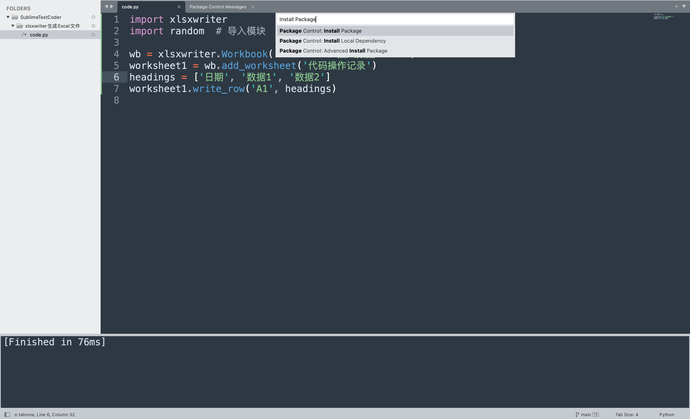
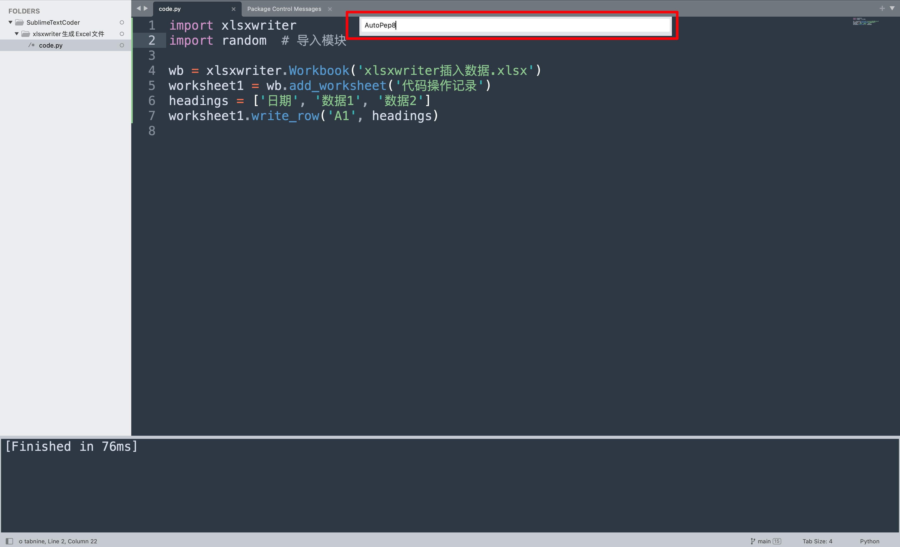
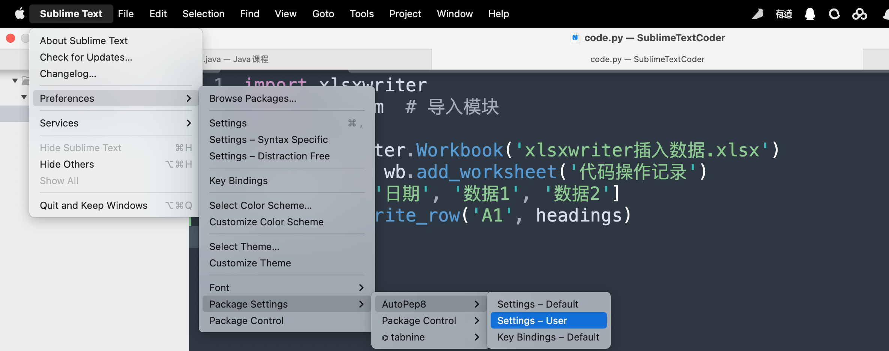
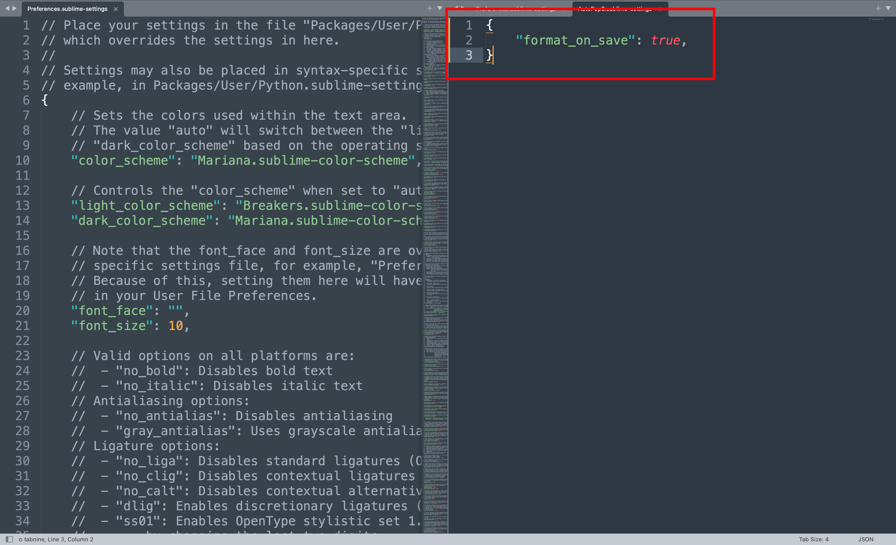

你好，我是悦创。

在 SublimeText3 里写 Python 代码时总是提示 pep8 的警告，sublime 有个插件，autoPEP8 插件就可以。 

网站：[https://packagecontrol.io/packages/AutoPEP8](https://packagecontrol.io/packages/AutoPEP8)


## 1. 安装

按住快捷键：

- **Windows：ctrl + alt + p**

- **MacOS：Command + Option + P**

输入：`Install Package`



输入：AutoPep8，即可。下图是我已经安装了，所以没有显示出来。



安装完成后，接下来我们来设置。

## 2. 设置





```cmd
{
	"format_on_save": true,
}
```

这样就成功了。

欢迎关注我公众号：AI悦创，有更多更好玩的等你发现！

::: details 公众号：AI悦创【二维码】


:::

::: info AI悦创·编程一对一

AI悦创·推出辅导班啦，包括「Python 语言辅导班、C++ 辅导班、java 辅导班、算法/数据结构辅导班、少儿编程、pygame 游戏开发」，全部都是一对一教学：一对一辅导 + 一对一答疑 + 布置作业 + 项目实践等。当然，还有线下线上摄影课程、Photoshop、Premiere 一对一教学、QQ、微信在线，随时响应！微信：Jiabcdefh

C++ 信息奥赛题解，长期更新！长期招收一对一中小学信息奥赛集训，莆田、厦门地区有机会线下上门，其他地区线上。微信：Jiabcdefh

方法一：[QQ](http://wpa.qq.com/msgrd?v=3&uin=1432803776&site=qq&menu=yes)

方法二：微信：Jiabcdefh

:::


