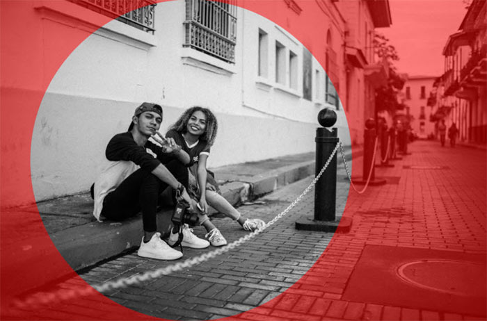

ps 把图片由方形或者矩形制作成圆形的方法有多种，常见的方法是利用椭圆选框工具，绘制出选区，然后建立图层，删除多余的透明区域后，保存为 png 透明背景格式即可，下面通过截图简单说明操作步骤。

1、打开图片之后，右键单击左侧菜单栏上的【矩形选框工具】，弹出的下拉菜单里面，点击选中【椭圆选框工具】，

2、接下来开始绘制圆形区域，如果想要正圆，可以按住 Shift 键，如果想要移动圆形选框的位置，加按【空格键】后，鼠标拖拉选框移动即可，全程不要松开鼠标左键，

3、位置调整好了之后，松开【空格键】，正圆和位置都调整好了之后，先松开鼠标，再松开 Shift，

4、圆形选区建立之后，下一步是建立新的图层，可以在选区范围内单击右键，下拉菜单里面，点击选择【通过拷贝的图层】，或者使用快捷键 Ctrl+J，

5、新建的选区图层，有大面积的透明区域，这些地方需要裁剪掉，

6、点击上端菜单栏上的【图像】，弹出的菜单里面，继续点击【裁切】，弹出的界面上，默认是基于【透明像素】，裁切的位置是【顶、底、左、右】，点击确定，

7、裁切完成之后的效果如下，保存为 png 格式的图片即可。

圆形图片的透明部分，保存为 png 或 gif 格式后，显示的时候就是透明的，但保存为 jpg 就为白色了，如有疑问，可以在下方留言。

欢迎关注我公众号：AI悦创，有更多更好玩的等你发现！

::: details 公众号：AI悦创【二维码】

:::

::: info AI悦创·编程一对一

AI悦创·推出辅导班啦，包括「Python 语言辅导班、C++ 辅导班、java 辅导班、算法/数据结构辅导班、少儿编程、pygame 游戏开发」，全部都是一对一教学：一对一辅导 + 一对一答疑 + 布置作业 + 项目实践等。当然，还有线下线上摄影课程、Photoshop、Premiere 一对一教学、QQ、微信在线，随时响应！微信：Jiabcdefh

C++ 信息奥赛题解，长期更新！长期招收一对一中小学信息奥赛集训，莆田、厦门地区有机会线下上门，其他地区线上。微信：Jiabcdefh

方法一：[QQ](http://wpa.qq.com/msgrd?v=3&uin=1432803776&site=qq&menu=yes)

方法二：微信：Jiabcdefh

:::

