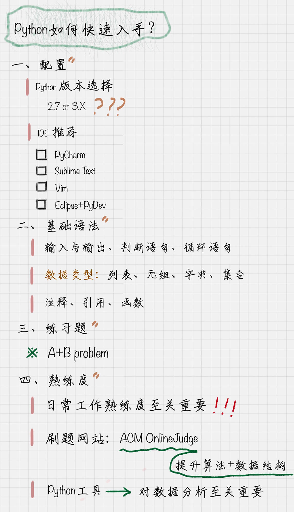

你好，我是悦创。

环境配置好后，我们就来快速学习几个 Python 必会的基础语法。我假设你是 Python 零基础，但已经有一些其他编程语言的基础。下面我们一一来看。

## 1. 输入与输出

```python
name = input("What's your name?")
sum1 = 100+100
print ('hello,', name)
print ('sum = ', sum1)
```


### 2.2 判断语句：if … else …

```python
if score >= 90:
    print('Excellent')
else:
    if score < 60:
        print('Fail')
    else:
        print('Good Job')
```

if … else … 是经典的判断语句，需要注意的是在 if expression 后面有个冒号，同样在 else 后面也存在冒号。

另外需要注意的是，Python 不像其他语言一样使用 `{}` 或者 begin…end 来分隔代码块，而是采用代码缩进和冒号的方式来区分代码之间的层次关系。所以**代码缩进在 Python 中是一种语法**，如果代码缩进不统一，比如有的是 tab 有的是空格，会怎样呢？会产生错误或者异常。相同层次的代码一定要采用相同层次的缩进。

### 2.3 循环语句：for … in

::: code-tabs

@tab Code

```python
sum = 0
for number in range(11):
    sum = sum + number
print sum
```

@tab 运行结果

```python
55
```

:::

for 循环是一种迭代循环机制，迭代即重复相同的逻辑操作。如果规定循环的次数，我们可以使用 range 函数，它在 for 循环中比较常用。`range(11)` 代表从 0 到 10，不包括 11，也相当于 `range(0,11)`，range 里面还可以增加步长，比如 `range(1,11,2)` 代表的是`[1,3,5,7,9]`。

### 2.4 循环语句: while

::: code-tabs

@tab Code

```python
sum = 0
number = 1
while number < 11:
       sum = sum + number
       number = number + 1
print sum
```

@tab 运行结果

```python
55
```

:::

1 到 10 的求和也可以用 while 循环来写，这里 while 控制了循环的次数。while 循环是条件循环，在 while 循环中对于变量的计算方式更加灵活。因此 while 循环适合循环次数不确定的循环，而 for 循环的条件相对确定，适合固定次数的循环。


### 2.5 数据类型：列表、元组、字典、集合

#### 2.5.1 列表：[]

::: code-tabs

@tab Code

```python
lists = ['a','b','c']
lists.append('d')
print lists
print len(lists)
lists.insert(0,'mm')
lists.pop()
print lists
```

@tab 运行结果

```python
['a', 'b', 'c', 'd']
4
['mm', 'a', 'b', 'c']
```

:::

列表是 Python 中常用的数据结构，相当于数组，具有增删改查的功能，我们可以使用 `len()` 函数获得 lists 中元素的个数；使用 `append()` 在尾部添加元素，使用 `insert()` 在列表中插入元素，使用 `pop()` 删除尾部的元素。

#### 2.5.2 元组 (tuple)

::: code-tabs

@tab Code

```python
tuples = ('tupleA','tupleB')
print tuples[0]
```

@tab 运行结果

```python
tupleA
```

:::

元组 tuple 和 list 非常类似，但是 tuple 一旦初始化就不能修改。因为不能修改所以没有 `append()`, `insert()` 这样的方法，可以像访问数组一样进行访问，比如 `tuples[0]`，但不能赋值。

#### 2.5.3 字典 {dictionary}

::: code-tabs

@tab Code

```python
# -*- coding: utf-8 -*
#定义一个dictionary
score = {'guanyu':95,'zhangfei':96}
#添加一个元素
score['zhaoyun'] = 98
print score
#删除一个元素
score.pop('zhangfei')
#查看key是否存在
print 'guanyu' in score
#查看一个key对应的值
print score.get('guanyu')
print score.get('yase',99)
```

@tab 运行结果

```python
{'guanyu': 95, 'zhaoyun': 98, 'zhangfei': 96}
True
95
99
```

:::

字典其实就是 `{key, value}`，多次对同一个 key 放入 value，后面的值会把前面的值冲掉，同样字典也有增删改查。增加字典的元素相当于赋值，比如 `score['zhaoyun'] = 98`，删除一个元素使用 pop，查询使用 get，如果查询的值不存在，我们也可以给一个默认值，比如 `score.get('yase', 99)`。

#### 2.5.4 集合：set

::: code-tabs

@tab Code

```python
s = set(['a', 'b', 'c'])
s.add('d')
s.remove('b')
print s
print 'c' in s
```

@tab 运行结果

```python
set(['a', 'c', 'd'])
True
```

:::

集合 set 和字典 dictory 类似，不过它只是 key 的集合，不存储 value。同样可以增删查，增加使用 add，删除使用 remove，查询看某个元素是否在这个集合里，使用 in。


#### 2.5.5 注释：#

注释在 python 中使用 `#`，如果注释中有中文，一般会在代码前添加 `# -*- coding: utf-8 -*`。

如果是多行注释，使用三个单引号，或者三个双引号，比如：

```python
# -*- coding: utf-8 -*
'''
这是多行注释，用三个单引号
这是多行注释，用三个单引号 
这是多行注释，用三个单引号
'''
```

#### 2.5.6 引用模块 / 包：import

```python
# 导入一个模块
import model_name
# 导入多个模块
import module_name1,module_name2
# 导入包中指定模块 
from package_name import moudule_name
# 导入包中所有模块 
from package_name import *
```

Python 语言中 import 的使用很简单，直接使用 `import module_name` 语句导入即可。这里 import 的本质是什么呢？import 的本质是路径搜索。import 引用可以是模块 module，或者包 package。

针对 module，实际上是引用一个 `.py` 文件。而针对 package，可以采用 `from … import …` 的方式，这里实际上是从一个目录中引用模块，这时目录结构中必须带有一个 `__init__.py` 文件。

#### 2.5.7 函数：def

::: code-tabs

@tab Code

```python
def addone(score):
   return score + 1
print addone(99)
```

@tab 运行结果

```python
100
```

:::

函数代码块以 def 关键词开头，后接函数标识符名称和圆括号，在圆括号里是传进来的参数，然后通过 return 进行函数结果得反馈。

#### 2.5.8 A+B Problem

上面的讲的这些基础语法，我们可以用 sumlime text 编辑器运行 Python 代码。另外，告诉你一个相当高效的方法，你可以充分利用一个刷题进阶的网址：[https://pintia.cn/problem-sets/91827364500/exam/problems/type/7](https://pintia.cn/problem-sets/91827364500/exam/problems/type/7)，这是一个 OnlineJudge。

什么是 OnlineJudge 呢？它实际上是一个在线答题系统，做题后你可以在后台提交代码，然后 OnlineJudge 会告诉你运行的结果，如果结果正确就反馈：Accepted，如果错误就反馈：Wrong Answer。

不要小看这样的题目，也会存在编译错误、内存溢出、运行超时等等情况。所以题目对编码的质量要求还是挺高的。下面我就给你讲讲这道 A+B 的题目，你可以自己做练习，然后在后台提交答案。

#### 2.5.9 题目：A+B

输入格式：有一系列的整数对 A 和 B，以空格分开。

输出格式：对于每个整数对 A 和 B，需要给出 A 和 B 的和。

输入输出样例：

```python
INPUT
1 5
OUTPUT
6
```

针对这道题，我给出了下面的答案：

```python
while True:
    try:
        line = raw_input()
        a = line.split()
        print(int(a[0]) + int(a[1]))
    except:
        break
```

当然每个人可以有不同的解法，官方也有 Python 的答案，这里给你介绍这个 OnlineJudge 是因为：

1. 可以在线得到反馈，提交代码后，系统会告诉你对错。而且你能看到每道题的正确率，和大家提交后反馈的状态；
2. 有社区论坛可以进行交流学习；
3. 对算法和数据结构的提升大有好处，当然对数据挖掘算法的灵活运用和整个编程基础的提升都会有很大的帮助。

## 3. 总结

现在我们知道，Python 毫无疑问是数据分析中最主流的语言。今天我们学习了这么多 Python 的基础语法，你是不是体会到了它的简洁。如果你有其他编程语言基础，相信你会非常容易地转换成 Python 语法的。那到此，Python 我们也就算入门了。有没有什么方法可以在此基础上快速提升 Python 编程水平呢？给你分享下我的想法。

在日常工作中，我们解决的问题都不属于高难度的问题，大部分人做的都是开发工作而非科研项目。所以我们要提升的主要是熟练度，而通往熟练度的唯一路径就是练习、练习、再练习！

如果你是第一次使用 Python，不用担心，最好的方式就是直接做题。把我上面的例子都跑一遍，自己在做题中体会。

如果你想提升自己的编程基础，尤其是算法和数据结构相关的能力，因为这个在后面的开发中都会用到。那么 ACM Online Judge 是非常好的选择，勇敢地打开这扇大门，把它当作你进阶的好工具。

你可以从 Accepted 比率高的题目入手，你做对的题目数越多，你的排名也会越来越往前，这意味着你的编程能力，包括算法和数据结构的能力都有了提升。另外这种在社区中跟大家一起学习，还能排名，就像游戏一样，让学习更有趣味，从此不再孤独。



我在文章中多次强调练习的作用，这样可以增加你对数据分析相关内容的熟练度。所以我给你出了两道练习题，你可以思考下如何来做，欢迎把答案放到评论下面，我也会和你一起在评论区进行讨论。

1. 如果我想在 Python 中引用 `scikit-learn` 库该如何引用？
2. 求 `1+3+5+7+…+99` 的求和，用 Python 该如何写？

欢迎你把今天的内容分享给身边的朋友，和他一起掌握 Python 这门功能强大的语言。


欢迎关注我公众号：AI悦创，有更多更好玩的等你发现！

::: details 公众号：AI悦创【二维码】


:::

::: info AI悦创·编程一对一

AI悦创·推出辅导班啦，包括「Python 语言辅导班、C++ 辅导班、java 辅导班、算法/数据结构辅导班、少儿编程、pygame 游戏开发」，全部都是一对一教学：一对一辅导 + 一对一答疑 + 布置作业 + 项目实践等。当然，还有线下线上摄影课程、Photoshop、Premiere 一对一教学、QQ、微信在线，随时响应！微信：Jiabcdefh

C++ 信息奥赛题解，长期更新！长期招收一对一中小学信息奥赛集训，莆田、厦门地区有机会线下上门，其他地区线上。微信：Jiabcdefh

方法一：[QQ](http://wpa.qq.com/msgrd?v=3&uin=1432803776&site=qq&menu=yes)

方法二：微信：Jiabcdefh

:::


