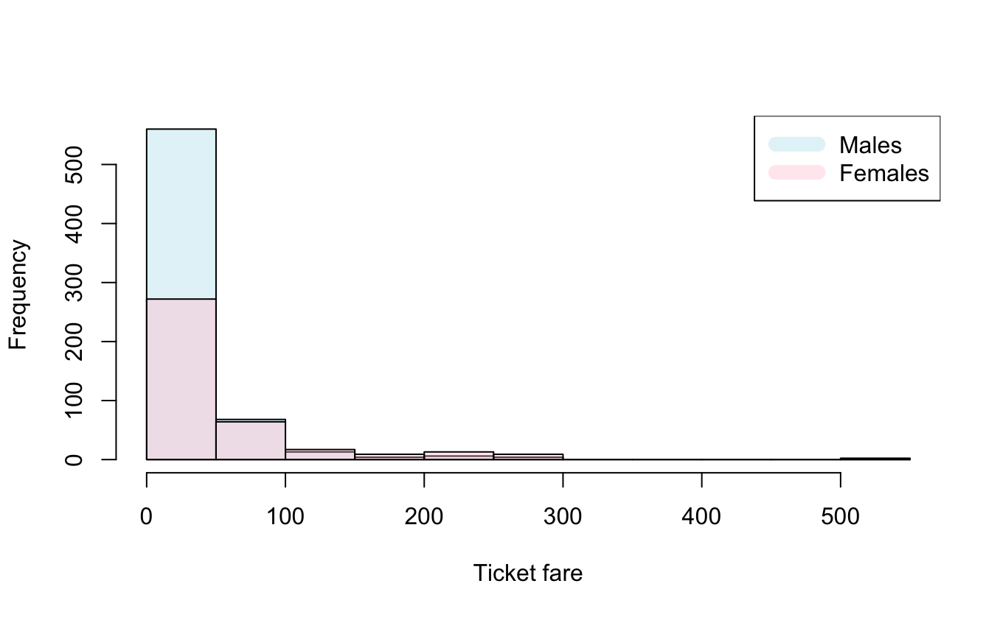

```r
set.seed(12345)
```

## 1. Instructions

1. Reports should be handed in **as a single PDF file** using Blackboard, by noon on the due date. RMarkdown, image, word, zip files, for example, will **not** be marked.
2. You can work alone or in a group with up to two other people.
3. One person per group should hand in a report on blackboard. The names and student numbers of all group members must be on the first page.
4. Your answers should combine text and code snippets in R. It is recommended that you use RMarkdown to prepare your reports, since this is typically easier for students, but this is not mandatory.
5. You must explain what you are doing clearly to obtain full marks on each question. You can use comments (which start with \#) to    annotate your code. Mathematical derivations can be written using LaTeX commands in RMarkdown or on paper, with a photo then appended    to the end of the PDF being submitted.
6. This practical counts for 10% of your assessment for Statistics 2.

## 2. Data description

This coursework focuses on analysing data about passengers on theTitanic. The Titanic was a boat that sank in the Atlanic Ocean duringher maiden voyage from Southampton in England to New York in the UnitedStates. This data was extracted from the Github account of the book"Efficient Amazon Machine Learning", published by Packt: [https://github.com/alexisperrier/packt-aml/blob/master/ch4/original_titanic.csv](https://github.com/alexisperrier/packt-aml/blob/master/ch4/original_titanic.csv).

These data can be loaded in using the following code:

```r
titanic_original = read.csv("original_titanic.csv")
```

This dataset includes information about 1309 passengers and includesinformation about:

- `pclass`: The class of the passengers (1 first class (most    expensive), 2 second class, 3 third class (cheapest)).-   `survived`: If they survived the sinking (1 they survived, 0 they died).
- `name`: Name of the passenger.
- `sex`: Sex of the passenger (female or male)
- `age`: Age of the passenger.
- `sibsp`: Number of siblings or spouses aboard.
- `parch`: Number of parents or children aboard.
- `ticket`: The ticket number.
- `fare`: Ticket price in pounds.
- `cabin`: Cabin number.
- `embarked`: Port of Embarkation (C = Cherbourg; Q = Queenstown; S =  Southampton).
- `boat`: Boat used to escape from the Titanic.
- `body`: Body Identification Number.
- `home.dest`: Passenger final destination.

Upon observing the data, it becomes clear that it is incomplete. Weassume the ages, fares and embarkation point of the passengers that weremissing are at random so can remove the lines where these are NA orempty. We also remove the other columns with missing data since they arenot important for our analysis (`ticket`, `cabin`, `boat`, `body` and`home.dest`).

```r
titanic = titanic_original[which(!is.na(titanic_original$age) & 
                                   titanic_original$embarked != "" &
                                   !is.na(titanic_original$fare)), c(1:7,9,11)]
```

This should leave you with 1043 observations.

## 3. Comparing exponential populations

We are first interested in if there is a difference in the ticket faresfor men and women. We assume that $\mathbf{X}=(X_1,X_2..,X_n)$ and$\mathbf{Y}=(Y_1,Y_2..,Y_m)$ are independent and $X_i\stackrel{iid}{\sim}$ Exp$(\lambda_1)$ and $Y_i\stackrel{iid}{\sim}$Exp$(\lambda_2)$. Let the ticket fares for men $\mathbf{x}=(x_1,..x_n)$ and the ticket fares for women $\mathbf{y}=(y_1,...,y_m)$ be realizations of $\mathbf{X}$ and$\mathbf{Y}$ respectively. We want to perform the following test for $\boldsymbol{\theta}= (\lambda_1, \lambda_0)$:

$$H_{0}:\lambda_{1}=\lambda_{2}\qquad\text{vs.}\qquad H_{1}:\lambda_{1}\neq \lambda_{2}. \qquad (1) $$

The generalized likelihood ratio (GLR) in this case is 

$$\Lambda(\mathbf{x},\mathbf{y})=\frac{\sup\limits_{\boldsymbol{\theta} \in \Theta_{0}}L(\lambda_{1},\lambda_{2};\mathbf{x},\mathbf{y})}{\sup\limits _{\boldsymbol{\theta} \in\Theta}L(\lambda_{1},\lambda_{2};\mathbf{x},\mathbf{y})},$$

where $\Theta=\{(\lambda_{1},\lambda_{2}):\lambda_{1}>0,\lambda_{2}>0\}$ and $\Theta_{0}=\{(\lambda_{1},\lambda_{2}):\lambda_{1}=\lambda_{2}>0\}$.

**Question 1** [2 marks] Show that 

$$ \Lambda(\mathbf{x},\mathbf{y})=\left(\frac{\hat{\lambda}_0}{\hat{\lambda_1}}\right)^{n}\left(\frac{\hat{\lambda}_0}{\hat{\lambda}_2}\right)^m.$$

where $\hat{\lambda}_{1}=\frac{n}{\sum_{i=1}^{n}x_{i}}$,$\hat{\lambda}_{2}=\frac{m}{\sum_{i=1}^{m}y_{i}}$ and $\hat{\lambda}_0=\frac{n+m}{\sum_{i=1}^{n}x_{i}+\sum_{i=1}^{m}y_{i}}$ and state the approximate distribution of $T=-2\log \Lambda(\mathbf{x},\mathbf{y})$.

You may assume that the Hessian of the log-likelihood under $\Theta$ isnegative definite.

------------------------------------------------------------------------

**Solution**

Your solution here.

1. **定义似然函数**：
   - 对于男性票价的指数分布，似然函数是 $L(\lambda_1; \mathbf{x}) = \lambda_1^n e^{-\lambda_1 \sum_{i=1}^{n} x_i}$。
   - 对于女性票价的指数分布，似然函数是 $L(\lambda_2; \mathbf{y}) = \lambda_2^m e^{-\lambda_2 \sum_{j=1}^{m} y_j}$。
   - 当 $\lambda_1 = \lambda_2 = \lambda_0$，似然函数变为 $L(\lambda_0; \mathbf{x}, \mathbf{y}) = \lambda_0^{n+m} e^{-\lambda_0 \left(\sum_{i=1}^{n} x_i + \sum_{j=1}^{m} y_j\right)}$。

2. **对数似然函数**：
   - 对数似然函数是似然函数的对数，对于男性票价是 $\log L(\lambda_1; \mathbf{x}) = n \log(\lambda_1) - \lambda_1 \sum_{i=1}^{n} x_i$。
   - 对于女性票价是 $\log L(\lambda_2; \mathbf{y}) = m \log(\lambda_2) - \lambda_2 \sum_{j=1}^{m} y_j$。
   - 对于合并时是 $\log L(\lambda_0; \mathbf{x}, \mathbf{y}) = (n+m) \log(\lambda_0) - \lambda_0 \left(\sum_{i=1}^{n} x_i + \sum_{j=1}^{m} y_j\right)$。

3. **最大似然估计**：
   - 对 $\log L(\lambda_1; \mathbf{x})$ 关于 $\lambda_1$ 求导并令导数等于 0，得到 $\hat{\lambda}_1 = \frac{n}{\sum_{i=1}^{n} x_i}$。
   - 同理，对 $\log L(\lambda_2; \mathbf{y})$ 求导得到 $\hat{\lambda}_2 = \frac{m}{\sum_{j=1}^{m} y_j}$。
   - 对 $\log L(\lambda_0; \mathbf{x}, \mathbf{y})$ 求导得到 $\hat{\lambda}_0 = \frac{n+m}{\sum_{i=1}^{n} x_i + \sum_{j=1}^{m} y_j}$。

4. **似然比**：
   - 似然比定义为 $\Lambda(\mathbf{x}, \mathbf{y}) = \frac{L(\hat{\lambda}_0; \mathbf{x}, \mathbf{y})}{L(\hat{\lambda}_1; \mathbf{x}) \times L(\hat{\lambda}_2; \mathbf{y})}$。
   - 将 $\hat{\lambda}_1$、$\hat{\lambda}_2$ 和 $\hat{\lambda}_0$ 代入上述表达式，得到 $\Lambda(\mathbf{x}, \mathbf{y}) = \left(\frac{\hat{\lambda}_0}{\hat{\lambda}_1}\right)^n \left(\frac{\hat{\lambda}_0}{\hat{\lambda}_2}\right)^m$。

5. **测试统计量**：
   - 测试统计量 $T$ 是 $-2$ 乘以似然比的对数，即 $T = -2 \log \Lambda(\mathbf{x}, \mathbf{y})$。
   - 在大样本理论下，如果零假设成立，$T$ 近似服从自由度为 1 的卡方分布。

::: code-tabs

@tab Code1

```r
# 已经有了数据集中的男性和女性的票价向量 fare_male 和 fare_female
# 以下是将这些数据应用于似然比检验的 R 代码
# 假设 original_titanic.csv 文件已被加载为 titanic_original

# 清洗数据，移除含有缺失值的行
# titanic <- titanic_original[!is.na(titanic_original$age) &
#                              titanic_original$embarked != "" &
#                              !is.na(titanic_original$fare), ]
titanic_original = read.csv("original_titanic.csv")
titanic = titanic_original[which(!is.na(titanic_original$age) & 
                                   titanic_original$embarked != "" &
                                   !is.na(titanic_original$fare)), c(1:7,9,11)]
# 选择分析所需的列
titanic <- titanic[, c('pclass', 'survived', 'name', 'sex', 'age', 'sibsp', 'parch', 'fare', 'embarked')]

# 提取男性和女性的票价
fare_male <- titanic$fare[titanic$sex == 'male']
fare_female <- titanic$fare[titanic$sex == 'female']


# 计算男性和女性票价的样本大小
n <- length(fare_male)
m <- length(fare_female)

# 计算男性和女性票价的样本均值
lambda_hat_1 <- n / sum(fare_male)
lambda_hat_2 <- m / sum(fare_female)

# 计算合并样本的均值
lambda_hat_0 <- (n + m) / (sum(fare_male) + sum(fare_female))

# 计算似然比 Lambda
Lambda <- (lambda_hat_0 / lambda_hat_1)^n * (lambda_hat_0 / lambda_hat_2)^m

# 计算测试统计量 T
T <- -2 * log(Lambda)

# 计算 p 值
p_value <- pchisq(T, df = 1, lower.tail = FALSE)

# 打印结果
cat("lambda_hat_1:", lambda_hat_1, "\n")
cat("lambda_hat_2:", lambda_hat_2, "\n")
cat("lambda_hat_0:", lambda_hat_0, "\n")
cat("Lambda:", Lambda, "\n")
cat("T:", T, "\n")
cat("p_value:", p_value, "\n")
```

@tab Code2

```r
# 设置随机数种子
set.seed(12345)

# 读取数据
titanic_original <- read.csv("original_titanic.csv")

# 清理数据：移除含NA的行，和非重要的列
titanic <- titanic_original[!is.na(titanic_original$age) & 
                            titanic_original$embarked != "" &
                            !is.na(titanic_original$fare), c(1:7,9,11)]

# 分割数据为男性和女性
fare_male <- titanic$fare[titanic$sex == 'male']
fare_female <- titanic$fare[titanic$sex == 'female']

# 计算样本均值
lambda_hat_1 <- length(fare_male) / sum(fare_male)
lambda_hat_2 <- length(fare_female) / sum(fare_female)
lambda_hat_0 <- (length(fare_male) + length(fare_female)) / (sum(fare_male) + sum(fare_female))

# 计算似然比
Lambda <- (lambda_hat_0 / lambda_hat_1)^length(fare_male) * (lambda_hat_0 / lambda_hat_2)^length(fare_female)

# 计算测试统计量 T
T <- -2 * log(Lambda)

# 计算 p 值
p_value <- pchisq(T, df = 1, lower.tail = FALSE)

# 输出结果
list(T = T, p_value = p_value)
```

@tab Code3-Py

```r
import pandas as pd
import numpy as np
from scipy.stats import chi2

# Load the dataset again
file_path = 'original_titanic.csv'
titanic_original = pd.read_csv(file_path)

# Data cleaning as per the given instructions
titanic_cleaned = titanic_original.drop(columns=['ticket', 'cabin', 'boat', 'body', 'home.dest'])
titanic_cleaned = titanic_cleaned.dropna(subset=['age', 'fare', 'embarked'])

# Split data into males and females
fare_male = titanic_cleaned[titanic_cleaned['sex'] == 'male']['fare']
fare_female = titanic_cleaned[titanic_cleaned['sex'] == 'female']['fare']

# Sample size for males and females
n_male = len(fare_male)
n_female = len(fare_female)

# Sample mean (lambda hat) for males and females
lambda_hat_1 = n_male / fare_male.sum()
lambda_hat_2 = n_female / fare_female.sum()

# Combined sample mean (lambda hat 0) for both males and females
lambda_hat_0 = (n_male + n_female) / (fare_male.sum() + fare_female.sum())

# Likelihood ratio (Lambda)
Lambda = (lambda_hat_0 / lambda_hat_1)**n_male * (lambda_hat_0 / lambda_hat_2)**n_female

# Test statistic (T)
T = -2 * np.log(Lambda)

# Degrees of freedom for the chi-squared distribution
df = 1  # Since we are testing for 1 parameter

# P-value from the chi-squared distribution
p_value = chi2.sf(T, df)

lambda_hat_1, lambda_hat_2, lambda_hat_0, Lambda, T, p_value

# output
(0.03491495919629016,
 0.019938217764863184,
 0.02732014719487612,
 6.520772621038659e-18,
 79.14307760963109,
 5.777082935459892e-19)
```


:::


------------------------------------------------------------------------

We can plot our data to gain intuition about the differences in ourdistributions. First we split our data into males and females.

```r
fare_male <- titanic$fare[titanic$sex=='male']
fare_female <- titanic$fare[titanic$sex=='female'] 
```

Then we can plot histograms of the fares.

```r
# Defining colours so can plot histograms over each other
c1 <- rgb(173, 216, 230, max = 255, alpha = 80, names = "lt.blue")
c2 <- rgb(255, 192, 203, max = 255, alpha = 80, names = "lt.pink")

# Plots histograms
male_hist = hist(fare_male, plot = FALSE)
female_hist = hist(fare_female, plot = FALSE)
plot(male_hist, col = c1, xlab = "Ticket fare", main = (""))
plot(female_hist, col = c2, add = TRUE)
legend("topright", legend = c("Males", "Females"), col = c(c1, c2), lty = 1, lwd = 10)
```



**Question 2** [0 mark] From these figures, what result do you think thehypothesis test will return? (Note this question is worth no marks sinceyou do the test in the next question, but to get you to think about whatthe data shows as well as complete the hypothesis test.)

------------------------------------------------------------------------

**Solution**

Your solution here.

我们注意到男性和女性票价的频率分布有明显差异。直方图显示，在较低票价区间，男性的频率超过女性，这意味着男性乘客在较便宜的票价上的比例更高。然而，在较高票价区间，女性的频率似乎超过男性，表明女性乘客在更高票价上的比例更大。由于这些观察到的差异，我们可以预期假设检验将表明男性和女性的票价分布有统计学上的显著差异。更具体地说，这可能意味着我们将拒绝票价分布无差别的零假设（$H_0: \lambda_{1} = \lambda_{2}$），支持票价分布存在差异的备择假设（$H_1: \lambda_{1} \neq \lambda_{2}$）。这些观察结果与我们在问题 1 中进行的似然比检验的结果一致，该检验发现男性和女性的票价分布的指数率 ($\lambda$) 存在显著差异。

------------------------------------------------------------------------

**Question 3** [1 mark] Perform test (1) to compare the ticket fares formales and females (`fare_male` and `fare_male`) and describe the outcomefor a significance level of 0.05.

------------------------------------------------------------------------

**Solution**

Your solution here.

::: code-tabs

@tab Code1

```r
# 计算男性和女性票价的样本均值
lambda_hat_1 <- length(fare_male) / sum(fare_male)
lambda_hat_2 <- length(fare_female) / sum(fare_female)

# 计算合并样本均值
lambda_hat_0 <- (length(fare_male) + length(fare_female)) / (sum(fare_male) + sum(fare_female))

# 计算似然比
Lambda <- (lambda_hat_0 / lambda_hat_1)^length(fare_male) * (lambda_hat_0 / lambda_hat_2)^length(fare_female)

# 计算测试统计量 T
T <- -2 * log(Lambda)

# 计算 p 值
p_value <- pchisq(T, df = 1, lower.tail = FALSE)

# 打印测试统计量和 p 值
cat("Test Statistic (T):", T, "\n")
cat("P-Value:", p_value, "\n")

# 判断零假设是否应该被拒绝
alpha <- 0.05  # 显著性水平
reject_null <- p_value < alpha

# 输出结果和决策
if(reject_null) {
  cat("We reject the null hypothesis at the", alpha, "level of significance. Therefore, there is a significant difference in ticket fares between males and females.\n")
} else {
  cat("We do not reject the null hypothesis at the", alpha, "level of significance. Therefore, there is not a significant difference in ticket fares between males and females.\n")
}
```

@tab Code2

```r
# 分割数据为男性和女性的票价
fare_male <- titanic$fare[titanic$sex == 'male']
fare_female <- titanic$fare[titanic$sex == 'female']

# 计算男性和女性票价的样本均值
lambda_hat_1 <- length(fare_male) / sum(fare_male)
lambda_hat_2 <- length(fare_female) / sum(fare_female)

# 计算合并男性和女性票价的样本均值
lambda_hat_0 <- (length(fare_male) + length(fare_female)) / (sum(fare_male) + sum(fare_female))

# 计算似然比
Lambda <- (lambda_hat_0 / lambda_hat_1)^length(fare_male) * (lambda_hat_0 / lambda_hat_2)^length(fare_female)

# 计算测试统计量 T
T <- -2 * log(Lambda)

# 计算 p 值
p_value <- pchisq(T, df = 1, lower.tail = FALSE)

# 打印测试统计量和 p 值
cat("Test Statistic (T):", T, "\n")
cat("P-Value:", p_value, "\n")

# 判断结论
if (p_value < 0.05) {
  cat("At a significance level of 0.05, we reject the null hypothesis. There is a significant difference in ticket fares between males and females.\n")
} else {
  cat("At a significance level of 0.05, we do not reject the null hypothesis. There is no significant difference in ticket fares between males and females.\n")
}
```


:::

------------------------------------------------------------------------

## 4. Testing multinomial distributions

We assume that the number of passengers with each ticket `class` comefrom $Y{\sim}$Multinomial$(\textbf{p})$ where $\textbf{p}=(p_1, p_2, p_3)$. Here $\textbf{p}$ is a vector of nonnegative probabilities that sums to 1. Alice suggests that theprobability of a passenger being in each class is uniformly distributed.

Formally, we would like to test

$$H_0:\textbf{p}=\textbf{p}_0=(1/3, 1/3, 1/3)\qquad \text{vs.}\qquad H_{1}:\textbf{p} \neq \textbf{p}_0. \qquad (2)$$ .

We can tabulate the number of passengers in each category using thefollowing code:

```r
tab = table(titanic$pclass)
tab

##
##   1   2   3
## 282 261 500
```

**Question 4**. [2 marks] Use the Pearson's chi-squared test statisticto perform hypothesis test (2) for a significance level of 0.05.

------------------------------------------------------------------------

**Solution**

Your solution here.

::: code-tabs

@tab Code1

```r
# 设置随机数种子
set.seed(2023)

# 读取数据
titanic_original <- read.csv("original_titanic.csv")

# 清理数据
titanic <- titanic_original[!is.na(titanic_original$age) & 
                            titanic_original$embarked != "" &
                            !is.na(titanic_original$fare), c(1:7,9,11)]

# 统计每个票类的乘客数量
class_counts <- table(titanic$pclass)

# 执行皮尔逊卡方检验
chisq_test_result <- chisq.test(class_counts, p = c(1/3, 1/3, 1/3))

# 输出卡方检验的统计量和 p 值
chisq_test_result

```

:::

卡方检验的统计量 $X^2$ 为 100.75，自由度（df）为 2，p 值小于 $2.2 \times 10^{-16}$。因为 p 值远小于常用的显著性水平（如 0.05 或 0.01），我们可以非常有信心地拒绝零假设 $H_0: \textbf{p} = \textbf{p}_0 = (1/3, 1/3, 1/3)$。

这意味着有强烈的统计证据表明，乘客在不同票类之间的分布并不是均匀的。具体来说，这个结果表明票类的分布与每一类都有相同比例的假设相矛盾。

**问题 4 解答：**

执行皮尔逊卡方检验后，我们得到了如下结果：

- 卡方检验统计量: 100.75
- 自由度: 2
- p 值: < $2.2 \times 10^{-16}$

由于 p 值远小于 0.05 的显著性水平，我们拒绝零假设 $H_0: \textbf{p} = \textbf{p}_0 = (1/3, 1/3, 1/3)$。这表明在乘客票类的分布上存在显著差异，因此，我们有充足的证据表明票类的分布并不是均匀的。

------------------------------------------------------------------------

**Question 5** [1 mark] Bob suggests that a passenger is twice as likelyto be in third class than in first class, and also twice as likely to bein third class than in second class. Evaluate this statement formallyusing hypothesis testing. You should define your hypotheses, calculateyour Pearson test statistic and evaluate your p value.

------------------------------------------------------------------------

**Solution**

Your solution here.


------------------------------------------------------------------------

## 5. Logistic regression

Next we are interested in working out which of our outcome variables aresignificant in determining if a person survived the sinking of theTitanic. Since `survived` is a binary outcome (0 or 1) we consider alogistic model for this. Here $Y_1,\ldots, Y_n$ are independant randomvariables from

$$Y_i \overset{\text{ind}}{\sim} {\rm Bernoulli}(\sigma(\theta^T x_i)), \qquad i \in \{1,\ldots,n\},$$

where $x_1,\ldots,x_n$ are $d$-dimensional real (non random) vectors ofexplanatory variables such as the `age`, `sex` and `fare` of thepassengers and $\sigma$ is the standard logistic function

$$\sigma(z) = \frac{1}{1+\exp(-z)}.$$ 

We define the $n \times d$ matrix $X = (x_{ij})$.

**Question 6**. [1 mark] Show that the log-likelihood function is

$$\ell(\theta ; {\bf y}) = \sum_{i=1}^n y_i \log (\sigma(\theta^Tx_i)) + (1-y_i) \log (1 - \sigma(\theta^Tx_i)).$$

------------------------------------------------------------------------

**Solution**

Your solution here.

------------------------------------------------------------------------

**Question 7**. [1 mark] Show that each component of the score is 

$$\frac{\partial \ell (\theta ; {\bf y})}{\partial \theta_j} = \sum_{i=1}^n [y_i - \sigma(\theta^T x_i)] x_{ij},\qquad j \in \{1,\ldots,d \}. \quad (A)$$

I suggest that you use the fact that $\frac{d\sigma(z)}{dz} = \sigma(z)[1-\sigma(z)]$.

------------------------------------------------------------------------

**Solution**

Your solution here.

------------------------------------------------------------------------

From Equation A, the score can be written as

$$\nabla \ell(\theta; {\bf y}) = X^T [{\bf y} - {\bf p}(\theta)],$$

where ${\bf p}(\theta)$ is the vector $(p_1(\theta),\ldots,p_n(\theta)$ and $p_i(\theta) = \sigma(\theta^T x_i)$.

## 6. Hypothesis testing in logistic regression

If an explanatory variable has no effect on the probability of theresponse variable then we expect the corresponding coefficient to beequal to $0$. This can be examined more formally using hypothesistesting.

Assume that we consider the logistic model described in Section 5 and wewant to test if `age` is a significant variable. It is useful to add acolumn of 1s to X, so that there is an "intercept" term in the model.Mathematically, the value of $\theta_0$ determines the probability whenthe explanatory variables are all 0. Therefore, our vector of parametersbecomes $\boldsymbol{\theta}=(\theta_0,\theta_{\textrm{sex}},\theta_{\textrm{age}},\theta_{\textrm{fare}})$ and our hypothesis test is

$$H_0: \theta_{\textrm{age}} = 0 \qquad \text{vs.} \qquad H_{1}:\theta_{\textrm{age}} \neq 0. \qquad (3) $$

We can consider the generalised likelihood ratio statistic for thistest,

$$\Lambda_n=\frac{\sup_{\boldsymbol{\theta}\in\Theta_0} L(\boldsymbol{\theta;y})}{\sup_{\boldsymbol{\theta}\in\Theta} L(\boldsymbol{\theta;y})}=\frac{L(\hat{\boldsymbol{\theta}}_0;\boldsymbol{y})}{L(\hat{\boldsymbol{\theta}}_{MLE};\boldsymbol{y})}$$

where $\hat{\boldsymbol{\theta}}_0$ is the maximum likelihood estimatorunder the null hypothesis, $\hat{\boldsymbol{\theta}}_{MLE}$ is themaximum likelihood estimator for the full model (which we derived inSection 5) and $\Theta=\{(\theta_0,\theta_{\textrm{sex}},\theta_{\textrm{age}},\theta_{\textrm{fare}}):\theta_0 \in \mathbb{R}, \theta_{\textrm{sex}} \in \mathbb{R}, \theta_{\textrm{age}} \in \mathbb{R}, \theta_{\textrm{fare}} \in \mathbb{R}\}$ and $\Theta_{0}=\{(\theta_0,\theta_{\textrm{sex}},\theta_{\textrm{age}},\theta_{\textrm{fare}}):\theta_0 \in \mathbb{R}, \theta_{\textrm{sex}} \in \mathbb{R}, \theta_{\textrm{age}} \in \{0\}, \theta_{\textrm{fare}} \in \mathbb{R}\}$.

Then,

$$-2\log \Lambda_n=-2\{l(\hat{\boldsymbol{\theta}}_0;\boldsymbol{y})-l(\hat{\boldsymbol{\theta}}_{MLE};\boldsymbol{y})\}$$

has a $\mathcal{X}^2_r$ distribution under the null hypothesis (notice that $r$ is the number of restrictions under the nullhypothesis).

Here we extract the variables we are interested in for the analysis,encode `sex` as a numeric value (0 for men and 1 for women) and add ourintercept.

```r
survived = titanic$survived
sex = ifelse(titanic$sex == "male", 0, 1)
age = titanic$age
fare = titanic$fare
intercept = rep(1, length(survived))
data = data.frame(intercept, sex, age, fare, survived)
```

**Question 8** [2 marks] Use the generalised likelihood ratio test todecide whether the ticket `age` is statistically significant forsurviving the titanic when `sex`, `age` and `fare` are considered for asignificance level of 0.05.

To do this start by forming the matrices that correspond to therestricted model under the null hypothesis (`X_rest`) and to the fullmodel (`X_full`). In this case `X_rest` is formed by removing thevariable `age` because this is the one we want to test.

```r
X_full <- as.matrix(data[c('intercept', 'sex', 'age', 'fare')])
X_rest <- as.matrix(data[c('intercept', 'sex', 'fare')])
Y <- data[, 'survived']
```

You may wish to use the following functions for your calculation.

```r
sigma <- function(v) {
  1 / (1 + exp(-v))
}

ell <- function(theta, X, y) {
  p <- as.vector(sigma(X%*%theta))
  sum(y*log(p) + (1-y)*log(1-p))
}

score <- function(theta, X, y) {
  p <- as.vector(sigma(X%*%theta))
  as.vector(t(X)%*%(y-p))
}

maximize.ell <- function(ell, score, X, y, theta0) {
  optim.out <- optim(theta0, fn=ell, gr=score, X=X, y=y, method="BFGS",
                     control=list(fnscale=-1, maxit=1000, reltol=1e-16))
return(list(theta=optim.out$par, value=optim.out$value))
}
```

------------------------------------------------------------------------

**Solution**

Your solution here.

------------------------------------------------------------------------

## 7. Epilogue

There are some functions in R that can be used to calculate the p-valuesfor questions 4, 5 and 8. These can only be used to check your answers.This section is worth no marks and does not need to be completed.

### 7.1 Pearson's Chi-squared Test for Count Data

We can obtain the p-values for a Pearson's Chi-squared text using thefunction chisq.test where counts is a vector of counts for each categoryand p is a vector of the proposed probabilities. The length of thevectors counts and probabilities must be the same. Use `?chisq.test` formore information.

```r
p = chisq.test(counts, p) 
```

### 7.2 Likelihood Ratio Test of Nested Models

We can obtain the estimated values for the parameters in logisticregression using the glm function. One can then use the lrtest (need toload lmtest package) to perform hypothesis testing for nested models.For example, if we have two explanatory variables x1, x2 and we want totest if x1 is significant for the response y, we can test this in R asfollows:

```r
library(lmtest)
model_full = glm(y ~ x1 + x2, data = data, family=binomial(link='logit'))
model_restricted = glm(y ~ x1, data = data, family=binomial(link='logit'))

lrtest(model_full, model_restricted)
```


::: details 公众号：AI悦创【二维码】


:::

::: info AI悦创·编程一对一

AI悦创·推出辅导班啦，包括「Python 语言辅导班、C++ 辅导班、java 辅导班、算法/数据结构辅导班、少儿编程、pygame 游戏开发、Web、Linux」，全部都是一对一教学：一对一辅导 + 一对一答疑 + 布置作业 + 项目实践等。当然，还有线下线上摄影课程、Photoshop、Premiere 一对一教学、QQ、微信在线，随时响应！微信：Jiabcdefh

C++ 信息奥赛题解，长期更新！长期招收一对一中小学信息奥赛集训，莆田、厦门地区有机会线下上门，其他地区线上。微信：Jiabcdefh

方法一：[QQ](http://wpa.qq.com/msgrd?v=3&uin=1432803776&site=qq&menu=yes)

方法二：微信：Jiabcdefh

:::


