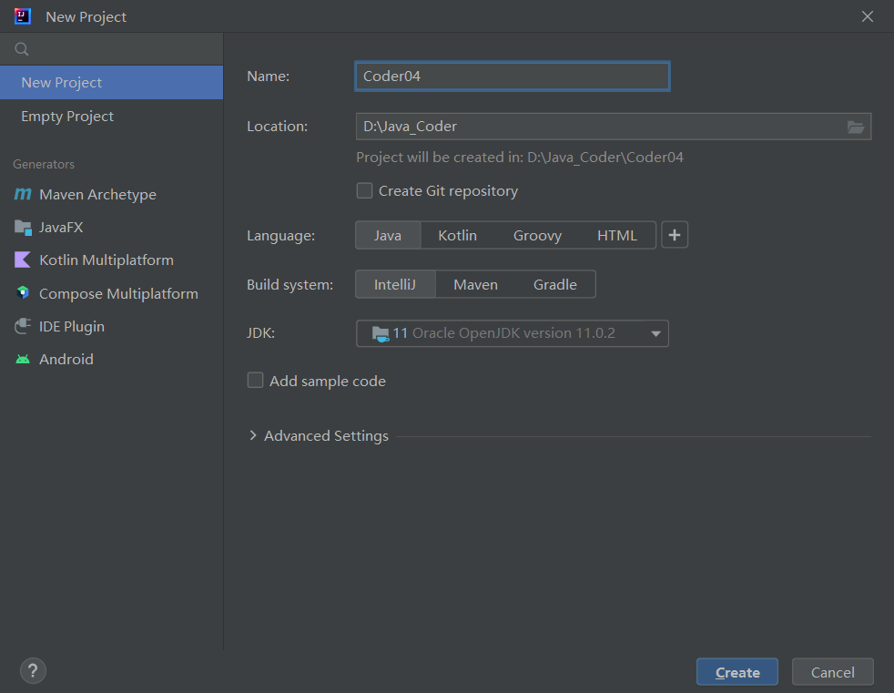
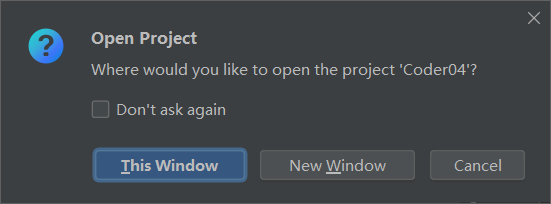
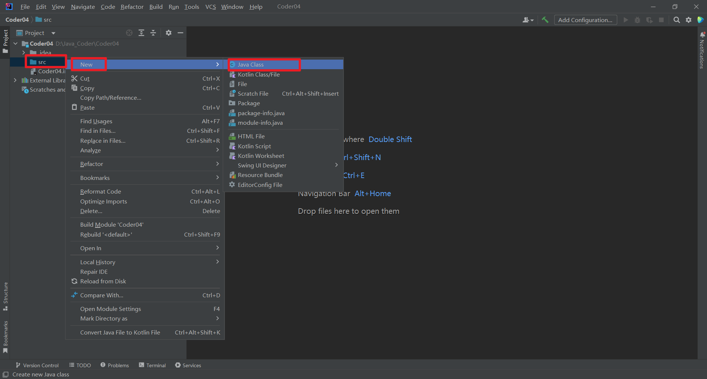
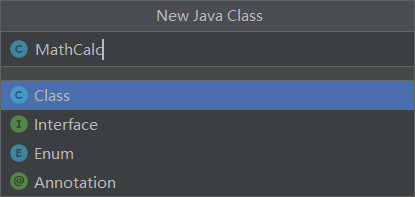
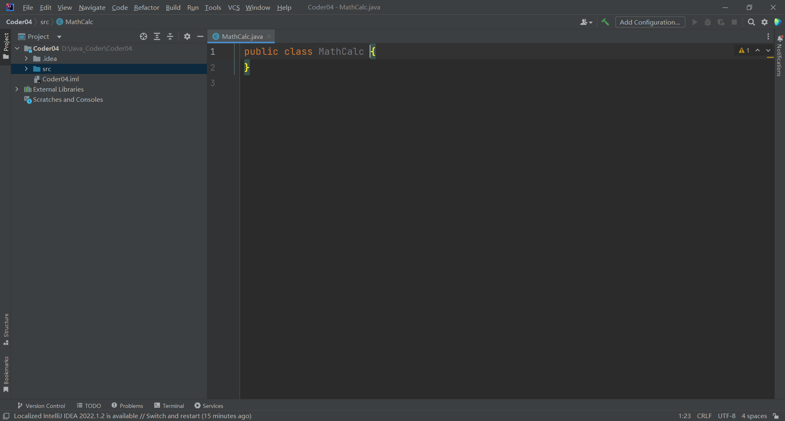

## 1. 本节知识点

- 计算加减乘除
- 基本数据类型——int
- 关键字（key word）和标示符（Identifier）
- 用变量解决问题

## 2. 创建新项目







> 我选择的是 This Window


## 3. 新建 class








## 4. 编写代码

计算加减乘除的程序（例程 MathCalc）

- 字面值（literalvalue）写几就是几
- 加减乘除运算符

**如何方便的计算类似** `y=a*x+b*x*x+c*x*x*x` **这样的公式?**

### 4.1 MathCalc.java

```java
public class MathCalc {
    public static void main(String[] args) {
        System.out.println("5+6"); // 双引号是个字符串 5+6
        System.out.println(5 + 6);  // 11
        System.out.println(5 - 6); // -1
        System.out.println(5 * 6);  // 30
        System.out.println(5 / 6.0);  // 后面带你解析，为什么加 .0 // 0.8333333333333334
        System.out.println((1 + 2 - 3) * 4 / 5.0);  // 0.0
        System.out.println((1 + 2 + 3) * 4 / 5.0);  // 4.8
    }
}
```
那实现一些比较复杂（长）的代码呢？
```java
public class MathCalc {
    public static void main(String[] args) {
        System.out.println(2 * 5 + 2 * 5 * 5 + 3 * 5 * 5 * 5);  // 435
    }
}
```
**Q：上面的代码确实可以实现，但是不方便我们修改呀。比如：我们要把其中的 5 换成其他数字呢？——显然不是非常方便。**

**显然，我要修改至少 6 个 5，这显然劝退我了。**

**为了解决这个问题，我们该怎么办呢？**

### 4.2 基本数据类型——int【Variable.java】

```java
public class Variable {
    public static void main(String[] args) {
        int a = 3;
        int b = 5;
        int c = 7;
        int x = 9;
        int y = a * x + b * x * x + c * x * x * x;
        System.out.println(y);  // 5535
    }
}
```
**现在我们修改 9 就很方便了，直接修改 x 即可。**
```java
public class Variable {
    public static void main(String[] args) {
        int a = 3;
        int b = 5;
        int c = 7;
        int x = 1;
        int y = a * x + b * x * x + c * x * x * x;
        System.out.println(y);  // 15
    }
}
```
**知识点解析一波：**
Java 中所有的数据都有类型，类型决定了存储的形式和占用的存储空间。举个例子：

- 微博
- 博客
- 连载小说

int 用来表示一个整数，取值范围在 `-2^31~2^31-1`。计算出来是 `-2147483648~2147483647`。

## 5. 关键字（key word）和标示符（Identifier）

### 5.1 标示符

- 由大小写英文字符，数字和下划线(`_`)组成的，区分大小写的，不以数字开头的文字。
- 可以用作 Java 中的各种东西的名字，比如类名，方法名等。
- 标示符是区分大小写的。

**关键字是 Java 语法的保留字，不能用来做名字。**

**我们接触到的关键字：**

- **public**
- **class**
- **static**
- **void**
- **int**

## 6. 用变量解决问题

**例程 Variable1**

- 变量（variable）
- 如何创建变量
- 如何给变量一个值
- 如何使用变量

### 6.1 例程 Variable1

::: code-tabs

@tab 创建变量的多种方法

```java
public class Variable1 {
    public static void main(String[] args) {
        // 方法一
        int a = 1;
        System.out.println(a);
        // 方法二
        int b;
        b = 10;
        System.out.println(b);
//        System.out.println(b=101);
    }
}
```

@tab 创建变量的实际例子

```java
public class Variable {
    public static void main(String[] args) {
        int a;
        a = 100;

        int p, y;
        p = 1;
        y = 9;

        int l = 1, c = 11;

        // 添加的输出语句
        System.out.println("a 的值是：" + a);
        System.out.println("p 的值是：" + p);
        System.out.println("y 的值是：" + y);
        System.out.println("l 的值是：" + l);
        System.out.println("c 的值是：" + c);
    }
}

// 运行此程序将会产生以下输出：
a 的值是：100
p 的值是：1
y 的值是：9
l 的值是：1
c 的值是：11
```

:::

> 注意，`+` 运算符在这里被用于连接（或串联）字符串和整数，生成一个新的字符串。

## 小技巧

1. 快捷输入 `public static void main(String[] args)`，在 IDE 中使用：psvm 既可以快速输入；

欢迎关注我公众号：AI悦创，有更多更好玩的等你发现！

::: details 公众号：AI悦创【二维码】


:::

::: info AI悦创·编程一对一

AI悦创·推出辅导班啦，包括「Python 语言辅导班、C++ 辅导班、java 辅导班、算法/数据结构辅导班、少儿编程、pygame 游戏开发」，全部都是一对一教学：一对一辅导 + 一对一答疑 + 布置作业 + 项目实践等。当然，还有线下线上摄影课程、Photoshop、Premiere 一对一教学、QQ、微信在线，随时响应！微信：Jiabcdefh

C++ 信息奥赛题解，长期更新！长期招收一对一中小学信息奥赛集训，莆田、厦门地区有机会线下上门，其他地区线上。微信：Jiabcdefh

方法一：[QQ](http://wpa.qq.com/msgrd?v=3&uin=1432803776&site=qq&menu=yes)

方法二：微信：Jiabcdefh

:::


