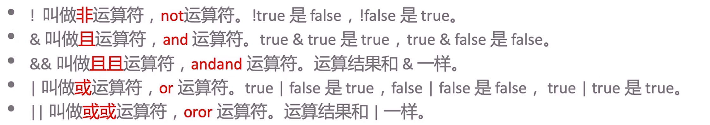

你好，我是悦创。
## 1. 布尔运算符



这里强调一点，根据一个具有实际开发十几年经验的前辈所得来的经验，能用 **且且、或或** 运算符，尽量使用 **且且、或或** ，具体原因先看如下代码：

```java
/*
 * project = 'Java_Coder', file_name = '笔记', author = 'AI悦创'
 * time = '2020/5/8 下午6:15', product_name = IntelliJ IDEA, 公众号：AI悦创
 * code is far away from bugs with the god animal protecting
 *    I love animals. They taste delicious.
 */

public class notes {
	public static void main(String[] args){
		boolean a = true;
		boolean b = false;
		
		System.out.println(a & b); // & 且 （and）
		System.out.println(a && b); // && 且且 （andand）
		System.out.println(a | b); // | 或 （or）
		System.out.println(a || b); // | 或或 （oror）
		// 对比
		System.out.println(a || (10 / 0 > 1));
		System.out.println(a | (10 / 0 > 1));
	}
}
```
上面的代码，我们一部分一部分拿出来讲解。

### 1.1 第一部分

```java
public class notes {
	public static void main(String[] args){
		boolean a = true;
		boolean b = false;
		
		System.out.println(a & b); // & 且 （and）
		System.out.println(a && b); // && 且且 （andand）
	}
}
```
**a & b （a and b）的运行逻辑是这样的：**

1. 它会先查看 **a** 值的真假，如果 **a** 是假的，那程序就不会继续判断 b 的真假——返回：**false**；
2. 如果 **a** 是真的，则会继续判断 **b** 的真假，如果 **b** 的值为真则返回：**true**，反之为：**false**；
3. 关于 `&&` 看如下代码，分析规律：

::: code-tabs

@tab demo1

```java
public class demo {
    public static void main(String[] args) {
        System.out.println((10/0 > 1) & true);  // 如果第一个判断就是错误的，后面是否错误还是正确已然没有继续判断的意义了。
//        System.out.println((10/0 > 1) && true);
    }
}

// 输出：
Exception in thread "main" java.lang.ArithmeticException: / by zero
	at demo.main(demo.java:4)
```
@tab demo2

```java
public class demo {
    public static void main(String[] args) {
        System.out.println(false && 10/0 > 1);  // false, 没有报错，显然 Java 没有后面的代码进行运行
    }
}
```

@tab demo3

```java
public class demo {
    public static void main(String[] args) {
        System.out.println(false & 10/0 > 1); // 报错了，Java 对后面的代码也进行了运行
        /*报错内容：
        * Exception in thread "main" java.lang.ArithmeticException: / by zero
	at demo.main(demo.java:7)*/
    }
}
```

:::

### 1.2 第二部分

```java
/*
 * project = 'Java_Coder', file_name = '笔记', author = 'AI悦创'
 * time = '2020/5/8 下午6:15', product_name = IntelliJ IDEA, 公众号：AI悦创
 * code is far away from bugs with the god animal protecting
 *    I love animals. They taste delicious.
 */
public class notes {
	public static void main(String[] args){
		boolean a = true;
		boolean b = false;
		
		System.out.println(a | b); // | 或 （or）
		System.out.println(a || b); // | 或或 （oror）
	}
}
```
**a | b （a or b）的运行逻辑是这样的：**

1. 它会先判断 **a** 是真是假，如果 **a** 是真的则会继续判断 **b** 的真假，**b** 为真返回结果回——**true**，**b** 为假返回的也是——**true**；
2. 如果 **a** 是假的，也会继续判断 **b** 的真假，如果 **b** 为真，则返回——**true**，反之为——**false**；

**a || b （a oror b）的运行逻辑是这样的：**

1. 它会先判断 **a** 的真假，与上面其实类似，但是多了一个一个功能，就是：如果 **a** 为真，程序就不会再判断 **b** 的真假，其实也就是做了进一步优化。（上面的 `a|b` 虽然对结果没有影响，但还要多运行计算就有点浪费运行资源了）
> 综上：实际开发中多用 `||`、`&&`


### 1.3 第三部分
这样第三部分的代码就是为了让大家更加清晰的了解到，运行结果会出现一个警告（提示），代码如下：
```java
public class notes {
	public static void main(String[] args){
		boolean a = true;

		// 对比
		System.out.println(a || (10 / 0 > 1));
		System.out.println(a | (10 / 0 > 1));
	}
}
```
我们可以把上面的代码，分开运行为了更好观察输出结果：
```java
public class notes {
	public static void main(String[] args){
		boolean a = true;

		// 对比
		System.out.println(a | (10 / 0 > 1));
	}
}
```
运行结果：
```java
Exception in thread "main" java.lang.ArithmeticException: / by zero
	at BigNumber.main(BigNumber.java:14)
```
接下来我们再来看看，下面代码：
```java
public class BigNumber {
	public static void main(String[] args){
		boolean a = true;
		
		// 对比
		System.out.println(a || (10 / 0 > 1));
	}
}
```
运行结果：
```java
true
```
通过这个例子，你就了解了 **或或、且且** 的具体特点了。

### 1.4 回顾

这回来看这个 andand 就知道了，如果 a 是 false，就不会继续判断 b 位置得真假。
```java
/*
 * project = 'code005', file_name = 'BigNumber', author = 'AI悦创'
 * time = '2020/5/8 10:10', product_name = IntelliJ IDEA, 公众号：AI悦创
 * code is far away from bugs with the god animal protecting
 *    I love animals. They taste delicious.
 */

public class BigNumber {
	public static void main(String[] args){
		boolean a = false;
		
		// 对比
		System.out.println(a && (10 / 0 > 1));
	}
}
```
运行结果：
```java
false
```
如果 a 为真则继续判断，代码如下：
```java
public class BigNumber {
	public static void main(String[] args){
		boolean a = true;
		boolean b = false;
		
		// 对比
		System.out.println(a && (10 / 0 > 1));
		System.out.println("Is runing");
	}
}
```
运行结果：
```java
Exception in thread "main" java.lang.ArithmeticException: / by zero
	at BigNumber.main(BigNumber.java:14)
```
如果这个输出后面还有程序运行，则不会输出：
```java
public class BigNumber {
	public static void main(String[] args){
		boolean a = true;
		boolean b = false;
		
		// 对比
		System.out.println(a && (10 / 0 > 1));
		System.out.println("Is runing");
	}
}
```
运行结果：
```java
Exception in thread "main" java.lang.ArithmeticException: / by zero
	at BigNumber.main(BigNumber.java:14)
```
欢迎关注我公众号：AI悦创，有更多更好玩的等你发现！

::: details 公众号：AI悦创【二维码】


:::

::: info AI悦创·编程一对一

AI悦创·推出辅导班啦，包括「Python 语言辅导班、C++ 辅导班、java 辅导班、算法/数据结构辅导班、少儿编程、pygame 游戏开发」，全部都是一对一教学：一对一辅导 + 一对一答疑 + 布置作业 + 项目实践等。当然，还有线下线上摄影课程、Photoshop、Premiere 一对一教学、QQ、微信在线，随时响应！微信：Jiabcdefh

C++ 信息奥赛题解，长期更新！长期招收一对一中小学信息奥赛集训，莆田、厦门地区有机会线下上门，其他地区线上。微信：Jiabcdefh

方法一：[QQ](http://wpa.qq.com/msgrd?v=3&uin=1432803776&site=qq&menu=yes)

方法二：微信：Jiabcdefh

:::


