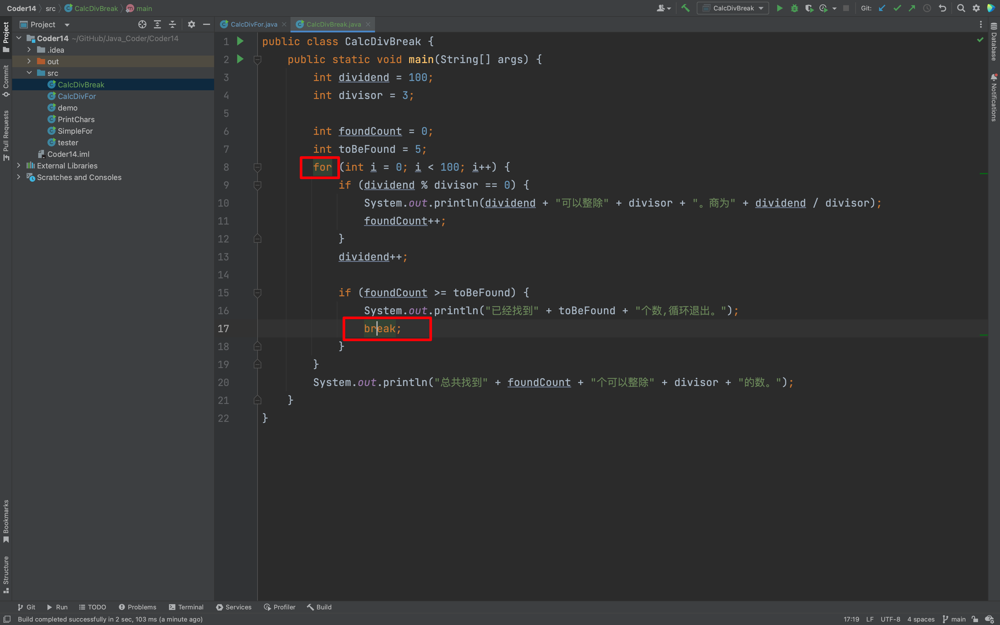

## 0. 目录

- 简化输出连续 26 个字符的程序
- 简化并增强找整除数的程序
- break 语句
- continue 语句

## 1. 简化输出连续 26 个字符的程序

### 1.1 for 语句

- 让程序在满足某条件时，重复执行某个代码块。for 是 Java 中的关键字
- for 语句语法和简单的示例程
- 初始语句在 for 循环开始前执行一次，以后不再执行；循环体条件表达式在每次循环体执行前会执行，如果为 true，则执行循环体，否则循环结束；循环体后语句会在每次循环执行后被执行；

::: code-tabs

@tab 语法

```java
for (初始语句; 循环体条件表达式; 循环体后语句) {
    for 循环体
}
```
@tab 代码

```java
public class SimpleFor {
    public static void main(String[] args) {
        for (int i = 0; i < 10; i++) {
            System.out.println("i的值是：" + i);
        }
    }
}
```

@tab 输出
```java
i的值是：0
i的值是：1
i的值是：2
i的值是：3
i的值是：4
i的值是：5
i的值是：6
i的值是：7
i的值是：8
i的值是：9
```

:::

### 1.2 使用 for 简化输出连续 26 个字符的程序

::: code-tabs

@tab PrintChars1

```java
public class PrintChars {
    public static void main(String[] args) {
        char ch = '我';
        int startNum = ch;
        for (int i = 0; i < 26; i++) {
            int newNum = startNum + i;
            System.out.println(newNum + "\t" + ((char) newNum));
        }
    }
}
```
@tab PrintChars2

```java
public class PrintChars {
    public static void main(String[] args) {
        char ch = 'A';
        int startNum = ch;
        for (int i = 0; i < 26; i++) {
            int newNum = startNum + i;
            System.out.println(newNum + "\t" + ((char) newNum));
        }
    }
}
```

:::

## 2. 简化并增强找整除数的程序

### 2.1 简化和增强找整除数的程序

- 使用 for 语句让程序简洁
- 增加新功能，输出最多10个可以整除的数
- 条件布尔表达式可以用 for 语句外部的变量
- 循环体执行后的语句可以有多个表达式，用逗号分开

#### 2.1.1 使用 for 语句让程序简洁

```java
public class CalcDivFor {
    public static void main(String[] args) {
        int divided = 100;
        int divisor = 3;

        for (int i = 0; i < 100; i++) {
            if (divided % divisor == 0) {
                System.out.println(divided + "可以整除" + divisor + "。商为" + divided / divisor);
            }
            divided++;

        }

    }
}
```

#### 2.1.2 增加新功能，输出最多10个可以整除的数

```java
public class CalcDivFor {
    public static void main(String[] args) {
        int divided = 100;
        int divisor = 3;

        int found = 0;
        for (int i = 0; i < 100 && found < 10; i++) {
            if (divided % divisor == 0) {
                System.out.println(divided + "可以整除" + divisor + "。商为" + divided / divisor);
                found++;
            }
            divided++;
        }


    }
}
```
#### 2.1.3 条件布尔表达式可以用 for 语句外部的变量

其实，上面的代码 found 使用的就是 for 外面的变量。

#### 2.1.4 循环体执行后的语句可以有多个表达式，用逗号分开

```java
public class CalcDivFor {
    public static void main(String[] args) {
        int divided = 100;
        int divisor = 3;

        int found = 0;
        for (int i = 0; i < 100 && found < 10; i++, divided++) {
            if (divided % divisor == 0) {
                System.out.println(divided + "可以整除" + divisor + "。商为" + divided / divisor);
                found++; // 前 ++ 和 后 ++ 影响都不大，前 ++ 与 后 ++，其实是在运行的那行才会体现区别
            }
        }
    }
}
```
当然，强调一点，上面把 `divided++`写入，其实不是一个好的方式，还是推荐单独写出来。
```java
public class demo {
    public static void main(String[] args) {
        int divided = 100;
        int divisor = 3;

        int found = 0;
//        下面这样写可以吗？
//        不行，逻辑出错，found 需要在可以取整的时候自增，现在这样编写，意味着不管能不能整除都可以自增
        for (int i = 0; i < 100 && found < 10; i++, found++) {
            if (divided % divisor == 0) {
                System.out.println(divided + "可以整除" + divisor + "。商为" + divided / divisor);
            }
            divided++;
        }


    }
}
```

## 3. Break 语句

### 3.1 结束循环

- break 语句可以结束循环
- 在求整除程序中使用 break 提前结束循环
```java
public class CalcDivBreak {
    public static void main(String[] args) {
        int dividend = 100;
        int divisor = 3;

        int foundCount = 0;
        int toBeFound = 5;
        for (int i = 0; i < 100; i++) {
            if (dividend % divisor == 0) {
                System.out.println(dividend + "可以整除" + divisor + "。商为" + dividend / divisor);
                foundCount++;
            }
            dividend++;

            if (foundCount >= toBeFound) {
                System.out.println("已经找到" + toBeFound + "个数,循环退出。");
                break;
            }
        }
        System.out.println("总共找到" + foundCount + "个可以整除" + divisor + "的数。");
    }
}
```
如果，你有时候不知道 break 出哪个循环，可以直接光标点击，即可看见跳出的是哪个循环。



## 4. continue 语句

### 4.1 跳过不符合条件的循环

- continue 语句可以结束当次循环的执行，开始下一次循环体的执行

::: code-tabs

@tab CalcDivBreakAndContinue

```java
public class CalcDivBreakAndContinue {
    public static void main(String[] args) {
        int dividend = 10;
        int divisor = 21;

        int foundCount = 0;
        int toBeFound = 5;
        for (int i = 0; i < 200; i++, dividend++) {
            if (divisor > dividend) {
                System.out.println("跳过" + dividend + ", 因为它比除数" + divisor + "小。");
                continue;
            }
            if (dividend % divisor == 0) {
                System.out.println(dividend + "可以整除" + divisor + "。商为" + dividend / divisor);
                foundCount++;
            }

            if (foundCount >= toBeFound) {
                break;
            }
        }
        System.out.println("总共找到" + foundCount + "个可以整除" + divisor + "的数。");
    }
}
```
@tab 补充代码 CalcDivForWithLimit
```java
public class CalcDivForWithLimit {
    public static void main(String[] args) {
        int dividend = 100;
        int divisor = 3;

        int foundCount = 0;
        int toBeFound = 5;
        for (int i = 0; i < 100 && toBeFound > foundCount; i++) {
            if (dividend % divisor == 0) {
                System.out.println(dividend + "可以整除" + divisor + "。商为" + dividend / divisor);
                foundCount++;
            }
            dividend++;
        }
        System.out.println("总共找到" + foundCount + "个可以整除" + divisor + "的数。");
    }
}
```
@tab CalcDivForWithLimit2

```java
public class CalcDivForWithLimit2 {
    public static void main(String[] args) {
        int dividend = 100;
        int divisor = 3;

        int foundCount = 0;
        int toBeFound = 5;
        for (int i = 0; i < 100 && toBeFound > foundCount; i++, foundCount++) {
            if (dividend % divisor == 0) {
                System.out.println(dividend + "可以整除" + divisor + "。商为" + dividend / divisor);
            }
            dividend++;
        }
        System.out.println("总共找到" + foundCount + "个可以整除" + divisor + "的数。");
    }
}
```

:::


## 5. for 循环嵌套

### 5.1 基本结构

```java
for (初始化表达式1; 条件表达式1; 更新表达式1) {
    for (初始化表达式2; 条件表达式2; 更新表达式2) {
        // 内层循环的循环体
    }
}
```

### 5.2 例子：打印一个 5x5 的星号矩阵

```java
public class Main {
    public static void main(String[] args) {
        // 外层循环控制行数
        for (int i = 0; i < 5; i++) {
            // 内层循环控制列数
            for (int j = 0; j < 5; j++) {
                System.out.print("* "); // 打印星号
            }
            System.out.println(); // 换行
        }
    }
}
```

**解释**：

1. **外层循环**（`for (int i = 0; i < 5; i++)`）：控制行数，循环 5 次。
2. **内层循环**（`for (int j = 0; j < 5; j++)`）：每次外层循环执行时，内层循环会执行5次，打印5个星号。
3. **`System.out.print("\* ")`**：在同一行打印星号。
4. **`System.out.println()`**：每次外层循环结束后，换行，开始打印新的一行。

**输出结果**：

```java
* * * * * 
* * * * * 
* * * * * 
* * * * * 
* * * * *
```

### 5.3 直角三角形（右上角）

输出像下面这样的三角形：

```java
*
**
***
****
*****
```

代码实现：

```java
public class RightAngleTriangle {
    public static void main(String[] args) {
        int height = 5; // 三角形的高度

        for (int i = 1; i <= height; i++) {
            for (int j = 1; j <= i; j++) {
                System.out.print("*");
            }
            System.out.println(); // 换行
        }
    }
}
```

### 5.4 直角三角形（右下角）

输出像下面这样的三角形：

```java
*****
****
***
**
*
```

代码实现：

```java
public class RightAngleTriangleInverse {
    public static void main(String[] args) {
        int height = 5; // 三角形的高度

        for (int i = height; i >= 1; i--) {
            for (int j = 1; j <= i; j++) {
                System.out.print("*");
            }
            System.out.println(); // 换行
        }
    }
}
```

### 5.5 等腰三角形

输出像下面这样的等腰三角形：

```java
    *
   ***
  *****
 *******
*********
```

代码实现：

```java
public class IsoscelesTriangle {
    public static void main(String[] args) {
        int height = 5; // 三角形的高度

        for (int i = 1; i <= height; i++) {
            // 打印空格
            for (int j = i; j < height; j++) {
                System.out.print(" ");
            }

            // 打印星号
            for (int k = 1; k <= (2 * i - 1); k++) {
                System.out.print("*");
            }

            System.out.println(); // 换行
        }
    }
}
```

### 5.6 倒等腰三角形

输出像下面这样的倒等腰三角形：

```java
*********
 *******
  *****
   ***
    *
```

代码实现：

```java
public class InvertedIsoscelesTriangle {
    public static void main(String[] args) {
        int height = 5; // 三角形的高度

        for (int i = height; i >= 1; i--) {
            // 打印空格
            for (int j = height; j > i; j--) {
                System.out.print(" ");
            }

            // 打印星号
            for (int k = 1; k <= (2 * i - 1); k++) {
                System.out.print("*");
            }

            System.out.println(); // 换行
        }
    }
}
```


::: details

**九九乘法表**

输出效果如下：

```java
1*1=1	
1*2=2	2*2=4	
1*3=3	2*3=6	3*3=9	
1*4=4	2*4=8	3*4=12	4*4=16	
1*5=5	2*5=10	3*5=15	4*5=20	5*5=25	
1*6=6	2*6=12	3*6=18	4*6=24	5*6=30	6*6=36	
1*7=7	2*7=14	3*7=21	4*7=28	5*7=35	6*7=42	7*7=49	
1*8=8	2*8=16	3*8=24	4*8=32	5*8=40	6*8=48	7*8=56	8*8=64	
1*9=9	2*9=18	3*9=27	4*9=36	5*9=45	6*9=54	7*9=63	8*9=72	9*9=81	
```

代码如下：

```java
public class MultiplicationTable {
    public static void main(String[] args) {
        // 外层循环：控制行
        for (int i = 1; i <= 9; i++) {
            // 内层循环：控制列
            for (int j = 1; j <= i; j++) {
                // 打印乘法表的一项，格式为“j*i=结果”
                System.out.print(j + "*" + i + "=" + (i * j) + "\t");
            }
            // 换行
            System.out.println();
        }
    }
}
```

:::

## 6. for-each 循环

Java 的 `for-each` 循环是一种简化的循环结构，专门用于遍历数组或实现了 `Iterable` 接口的集合（如 `ArrayList`、`HashSet` 等）。相比于传统的 `for` 循环，它更简洁，不需要手动管理索引。

### 6.1 语法

```java
for (类型 变量名 : 集合或数组) {
    // 循环体代码
}
```

- **`类型`**：循环中每个元素的类型。
- **`变量名`**：当前遍历的元素变量名。
- **`集合或数组`**：需要遍历的数组或集合。

### 6.2 使用场景和示例

#### 6.2.1 遍历数组

::: code-tabs

@tab Code

```java
public class ForEachExample {
    public static void main(String[] args) {
        int[] numbers = {1, 2, 3, 4, 5};

        // 使用 for-each 遍历数组
        for (int number : numbers) {
            System.out.println(number);
        }
    }
}
```

@tab 输出：

```
1
2
3
4
5
```

:::

#### 6.2.2 遍历集合

::: code-tabs

@tab Code

```java
import java.util.ArrayList;

public class ForEachExample {
    public static void main(String[] args) {
        ArrayList<String> names = new ArrayList<>();
        names.add("Alice");
        names.add("Bob");
        names.add("Charlie");

        // 使用 for-each 遍历集合
        for (String name : names) {
            System.out.println(name);
        }
    }
}
```

@tab 输出：

```
Alice
Bob
Charlie
```

:::

### 6.3 特点

1. 更简洁：
    - 不需要显式获取集合的大小或数组的长度。
    - 无需处理索引变量。
2. 只读遍历：
    - `for-each` 循环只能访问集合中的元素，不能修改集合内容。
    - 如果需要修改或获取索引，应该使用传统的 `for` 循环。

### 6.4 注意事项

1. **不支持反向遍历**：
    - `for-each` 不能从后往前遍历。需要使用普通的 `for` 循环或集合的其他方法（如 `ListIterator`）。
2. **适用于实现了 `Iterable` 接口的对象**：
    - 自定义类如果想支持 `for-each`，需要实现 `Iterable` 接口，并提供一个 `Iterator`。
3. **不能跳过元素**：
    - 在 `for-each` 中无法通过条件跳过某些元素。可以用 `if` 语句实现跳过逻辑，但仍会遍历所有元素。


### 6.5 与普通 `for` 循环对比

| **特性**              | **for-each 循环** | **普通 for 循环** |
| --------------------- | ----------------- | ----------------- |
| 是否简洁              | 是                | 需要显式管理索引  |
| 是否支持索引访问      | 否                | 是                |
| 是否支持反向遍历      | 否                | 是                |
| 是否可以修改集合/数组 | 否（只读）        | 可以              |
| 是否适用于 `Iterable` | 是                | 否                |


### 6.6 总结

`for-each` 循环非常适合用来快速、简洁地遍历集合或数组，尤其是在不需要索引、不需要修改集合的场景下。如果需要更复杂的操作，例如反向遍历、跳过元素或修改集合内容，仍需使用普通的 `for` 循环或其他迭代方式。


欢迎关注我公众号：AI悦创，有更多更好玩的等你发现！

::: details 公众号：AI悦创【二维码】


:::

::: info AI悦创·编程一对一

AI悦创·推出辅导班啦，包括「Python 语言辅导班、C++ 辅导班、java 辅导班、算法/数据结构辅导班、少儿编程、pygame 游戏开发」，全部都是一对一教学：一对一辅导 + 一对一答疑 + 布置作业 + 项目实践等。当然，还有线下线上摄影课程、Photoshop、Premiere 一对一教学、QQ、微信在线，随时响应！微信：Jiabcdefh

C++ 信息奥赛题解，长期更新！长期招收一对一中小学信息奥赛集训，莆田、厦门地区有机会线下上门，其他地区线上。微信：Jiabcdefh

方法一：[QQ](http://wpa.qq.com/msgrd?v=3&uin=1432803776&site=qq&menu=yes)

方法二：微信：Jiabcdefh

:::


