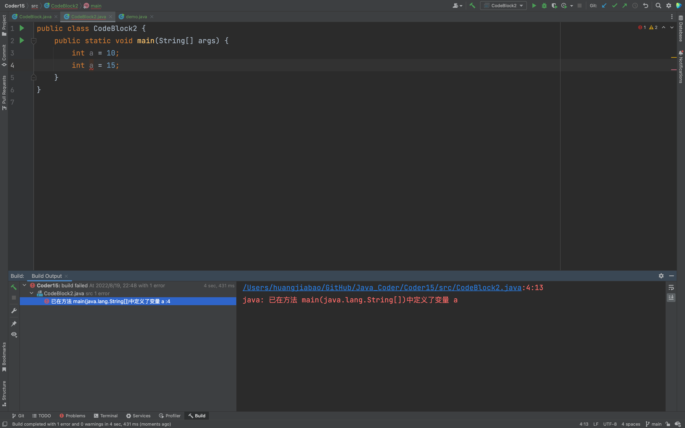
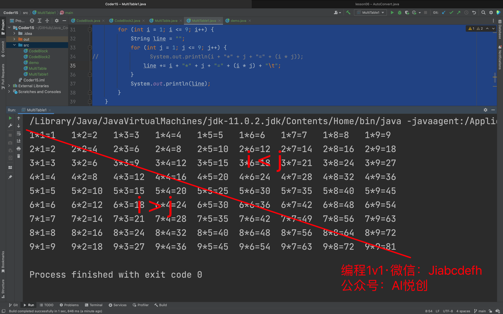
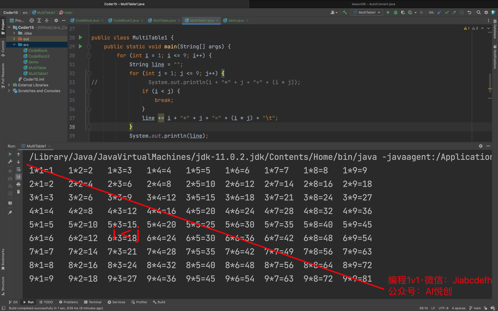

## 0. 目录

- 大括号括起来的就是代码块
- 变量的作用域
- 理解作用域和命名空间
- for 循环嵌套

## 1. 大括号括起来的就是代码块

- 代码块的示例
- 有名字的代码块—— if-else 代码块，for 循环代码块，main 方法代码块
- 代码块也叫体，比如 for 循环体，main 方法体
- 代码块以嵌套

先看一个基本代码，后续演示会用到：
```java
public class demo {
    public static void main(String[] args) {
        int a = 1;
        int a = 2;
    }
}
// 输出：
java: 已在方法 main(java.lang.String[])中定义了变量 a
```
```java
public class CodeBlock {
    public static void main(String[] args) {
        int outer = 100;

        {
            int inner = 10;
            System.out.println("outer变量的值是" + outer + "。inner变量的值是" + inner + "。");
            //  上面的 outer 用的就是代码快外部的变量。inner 同时也是代码块里面的变量，它也是肯定可以使用的。
        }
        // 如果我们在这行使用 inner，是显然不行的。我写在此行的下面:
        // System.out.println(inner);
        // 就是说 inner 这个变量，出了上面的代码块就消失了，不可见了。随着代码块结束，它的生命周期就结束了。
        // 所以说 inner 的可见性就是在代码的内部。
        // -----------------------------------
        int a1 = 1;
        {
            int a2 = a1 + 1;
            {
                int a3 = a2 + 1;
                System.out.println("a3 = " + a3);
            }  //  到这行代码块结束的时候，a3 的生命周期就已经结束了。也就是可以重新声明 a3 了。
            // int a3 = 100;
            {
                int a3 = a2 + 10;
                System.out.println("a3 = " + a3);
            }
            System.out.println("a2 = " + a2);
        }
    }
}
// 输出
outer变量的值是100。inner变量的值是10。
a3 = 3
a3 = 12
a2 = 2
```
上面代码的例子里呢，没有具体的语句，它只是用大括号括起来了，作为一个代码块来存在。它并不是 for 循环体或者是 if...else... 这种有具体名字的某个体。
这个代码比较简单，我主要讲解一下代码块和这个代码块里面，变量的作用域。

简单来说，就一个原则：**代码块内部的代码，可以访问代码块外部的变量。但是，反过来则不可以。同时，一个代码块结束的时候，它内部的变量就已经消失了，就不可以再使用了。**

这个代码块，无论是什么代码块，都是遵循这个原则的。

## 2. 变量的作用域

### 2.1 代码块里创建和使用变量

- 代码块里使用外层代码块的变量
- 代码块里创建变量
- 不能在外层代码块里使用内层代码块的变量。是否可以使用变量，也称作变量在某个代码块的可见性。也就是说，外层代码块创建的变量对内层代码块可见。内层代码块中创建的变量对外层代码块不可见。 
- 内层命名空间不可以重复定义外层代码块的变量，但是可以使用外层代码块的变量
- 代码块无论嵌套多少层，都遵守上述变量可见性的

## 3. 理解作用域和命名空间

### 3.1 作用域和命名空间

- 同一个命名空间中的变量不可以重名
- 为了避免变量名冲突，所以必须有命名空间
```java
public class CodeBlock2 {
    public static void main(String[] args) {
        int a = 10;
        int a = 15;
    }
}
// java: 已在方法 main(java.lang.String[])中定义了变量 a
```


## 4. for 循环嵌套

### 4.1 计算乘法表

- 两个数相乘，外层循环代表乘数，内层是被乘数。
- 循环嵌套，变量名不可以重复。 
- 使用 break 语句让输出的乘法表更简洁。
- 使用 String 变量，做 String 的加法。
```java
public class MultiTable {
    public static void main(String[] args) {
        for (int i = 1; i <= 9; i++) {
            for (int j = 1; j <= 9; j++) {
                System.out.println(i + "*" + j + "=" + (i * j));
            }
        }
    }
}
```
输出：
```java
/Library/Java/JavaVirtualMachines/jdk-11.0.2.jdk/Contents/Home/bin/java -javaagent:/Applications/IntelliJ IDEA.app/Contents/lib/idea_rt.jar=58239:/Applications/IntelliJ IDEA.app/Contents/bin -Dfile.encoding=UTF-8 -classpath /Users/huangjiabao/GitHub/Java_Coder/Coder15/out/production/Coder15 MultiTable1
1*1=1
1*2=2
1*3=3
1*4=4
1*5=5
1*6=6
1*7=7
1*8=8
1*9=9
2*1=2
2*2=4
2*3=6
2*4=8
2*5=10
2*6=12
2*7=14
2*8=16
2*9=18
3*1=3
3*2=6
3*3=9
3*4=12
3*5=15
3*6=18
3*7=21
3*8=24
3*9=27
4*1=4
4*2=8
4*3=12
4*4=16
4*5=20
4*6=24
4*7=28
4*8=32
4*9=36
5*1=5
5*2=10
5*3=15
5*4=20
5*5=25
5*6=30
5*7=35
5*8=40
5*9=45
6*1=6
6*2=12
6*3=18
6*4=24
6*5=30
6*6=36
6*7=42
6*8=48
6*9=54
7*1=7
7*2=14
7*3=21
7*4=28
7*5=35
7*6=42
7*7=49
7*8=56
7*9=63
8*1=8
8*2=16
8*3=24
8*4=32
8*5=40
8*6=48
8*7=56
8*8=64
8*9=72
9*1=9
9*2=18
9*3=27
9*4=36
9*5=45
9*6=54
9*7=63
9*8=72
9*9=81

Process finished with exit code 0
```
输出排版和结果有重复的，怎么修改呢？
```java
public class MultiTable {
    public static void main(String[] args) {
        for (int i = 1; i <= 9; i++) {
            String line = "";
            for (int j = 1; j <= 9; j++) {
//                System.out.println(i + "*" + j + "=" + (i * j));
                line += i + "*" + j + "=" + (i * j) + "\t";
            }
            System.out.println(line);
        }
    }
}
```
输出：
```java
/Library/Java/JavaVirtualMachines/jdk-11.0.2.jdk/Contents/Home/bin/java -javaagent:/Applications/IntelliJ IDEA.app/Contents/lib/idea_rt.jar=63986:/Applications/IntelliJ IDEA.app/Contents/bin -Dfile.encoding=UTF-8 -classpath /Users/huangjiabao/GitHub/Java_Coder/Coder15/out/production/Coder15 MultiTable1
1*1=1	1*2=2	1*3=3	1*4=4	1*5=5	1*6=6	1*7=7	1*8=8	1*9=9	
2*1=2	2*2=4	2*3=6	2*4=8	2*5=10	2*6=12	2*7=14	2*8=16	2*9=18	
3*1=3	3*2=6	3*3=9	3*4=12	3*5=15	3*6=18	3*7=21	3*8=24	3*9=27	
4*1=4	4*2=8	4*3=12	4*4=16	4*5=20	4*6=24	4*7=28	4*8=32	4*9=36	
5*1=5	5*2=10	5*3=15	5*4=20	5*5=25	5*6=30	5*7=35	5*8=40	5*9=45	
6*1=6	6*2=12	6*3=18	6*4=24	6*5=30	6*6=36	6*7=42	6*8=48	6*9=54	
7*1=7	7*2=14	7*3=21	7*4=28	7*5=35	7*6=42	7*7=49	7*8=56	7*9=63	
8*1=8	8*2=16	8*3=24	8*4=32	8*5=40	8*6=48	8*7=56	8*8=64	8*9=72	
9*1=9	9*2=18	9*3=27	9*4=36	9*5=45	9*6=54	9*7=63	9*8=72	9*9=81	

Process finished with exit code 0
```
上面的代码只是解决了排版问题，那接下来如何去掉重复的呢？
```java
public class MultiTable {
    public static void main(String[] args) {
        for (int i = 1; i <= 9; i++) {
            String line = "";
            for (int j = 1; j <= i; j++) {
//                System.out.println(i + "*" + j + "=" + (i * j));
                line += i + "*" + j + "=" + (i * j) + "\t";
            }
            System.out.println(line);
        }
    }
}
```
输出：
```java
/Library/Java/JavaVirtualMachines/jdk-11.0.2.jdk/Contents/Home/bin/java -javaagent:/Applications/IntelliJ IDEA.app/Contents/lib/idea_rt.jar=64194:/Applications/IntelliJ IDEA.app/Contents/bin -Dfile.encoding=UTF-8 -classpath /Users/huangjiabao/GitHub/Java_Coder/Coder15/out/production/Coder15 MultiTable1
1*1=1	
2*1=2	2*2=4	
3*1=3	3*2=6	3*3=9	
4*1=4	4*2=8	4*3=12	4*4=16	
5*1=5	5*2=10	5*3=15	5*4=20	5*5=25	
6*1=6	6*2=12	6*3=18	6*4=24	6*5=30	6*6=36	
7*1=7	7*2=14	7*3=21	7*4=28	7*5=35	7*6=42	7*7=49	
8*1=8	8*2=16	8*3=24	8*4=32	8*5=40	8*6=48	8*7=56	8*8=64	
9*1=9	9*2=18	9*3=27	9*4=36	9*5=45	9*6=54	9*7=63	9*8=72	9*9=81	

Process finished with exit code 0
```
有没有发现结果的顺序反了？`2*1` ？调换 i 与 j 的位置即可。
```java
public class MultiTable {
    public static void main(String[] args) {
        for (int i = 1; i <= 9; i++) {
            String line = "";
            for (int j = 1; j <= i; j++) {
//                System.out.println(i + "*" + j + "=" + (i * j));
//                line += i + "*" + j + "=" + (i * j) + "\t";
                line += j + "*" + i + "=" + (i * j) + "\t";
            }
            System.out.println(line);
        }
    }
}
```
输出：
```java
/Library/Java/JavaVirtualMachines/jdk-11.0.2.jdk/Contents/Home/bin/java -javaagent:/Applications/IntelliJ IDEA.app/Contents/lib/idea_rt.jar=65209:/Applications/IntelliJ IDEA.app/Contents/bin -Dfile.encoding=UTF-8 -classpath /Users/huangjiabao/GitHub/Java_Coder/Coder15/out/production/Coder15 MultiTable1
1*1=1	
1*2=2	2*2=4	
1*3=3	2*3=6	3*3=9	
1*4=4	2*4=8	3*4=12	4*4=16	
1*5=5	2*5=10	3*5=15	4*5=20	5*5=25	
1*6=6	2*6=12	3*6=18	4*6=24	5*6=30	6*6=36	
1*7=7	2*7=14	3*7=21	4*7=28	5*7=35	6*7=42	7*7=49	
1*8=8	2*8=16	3*8=24	4*8=32	5*8=40	6*8=48	7*8=56	8*8=64	
1*9=9	2*9=18	3*9=27	4*9=36	5*9=45	6*9=54	7*9=63	8*9=72	9*9=81	

Process finished with exit code 0
```
下面的代码也可以实现。
```java
public class MultiTable {

    public static void main(String[] args) {
        for (int i = 1; i <= 9; i++) {
            String line = "";
            for (int j = 1; j <= 9; j++) {
                if (i < j) {
                    break;
                }
                line = line + j + "*" + i + "=" + (j * i) + "\t";
            }
            System.out.println(line);
        }
    }
}
```
```java
1*1=1	
1*2=2	2*2=4	
1*3=3	2*3=6	3*3=9	
1*4=4	2*4=8	3*4=12	4*4=16	
1*5=5	2*5=10	3*5=15	4*5=20	5*5=25	
1*6=6	2*6=12	3*6=18	4*6=24	5*6=30	6*6=36	
1*7=7	2*7=14	3*7=21	4*7=28	5*7=35	6*7=42	7*7=49	
1*8=8	2*8=16	3*8=24	4*8=32	5*8=40	6*8=48	7*8=56	8*8=64	
1*9=9	2*9=18	3*9=27	4*9=36	5*9=45	6*9=54	7*9=63	8*9=72	9*9=81	
```
**解析：**
```java
1*1=1	1*2=2	1*3=3	1*4=4	1*5=5	1*6=6	1*7=7	1*8=8	1*9=9	
2*1=2	2*2=4	2*3=6	2*4=8	2*5=10	2*6=12	2*7=14	2*8=16	2*9=18	
3*1=3	3*2=6	3*3=9	3*4=12	3*5=15	3*6=18	3*7=21	3*8=24	3*9=27	
4*1=4	4*2=8	4*3=12	4*4=16	4*5=20	4*6=24	4*7=28	4*8=32	4*9=36	
5*1=5	5*2=10	5*3=15	5*4=20	5*5=25	5*6=30	5*7=35	5*8=40	5*9=45	
6*1=6	6*2=12	6*3=18	6*4=24	6*5=30	6*6=36	6*7=42	6*8=48	6*9=54	
7*1=7	7*2=14	7*3=21	7*4=28	7*5=35	7*6=42	7*7=49	7*8=56	7*9=63	
8*1=8	8*2=16	8*3=24	8*4=32	8*5=40	8*6=48	8*7=56	8*8=64	8*9=72	
9*1=9	9*2=18	9*3=27	9*4=36	9*5=45	9*6=54	9*7=63	9*8=72	9*9=81	
```





欢迎关注我公众号：AI悦创，有更多更好玩的等你发现！

::: details 公众号：AI悦创【二维码】


:::

::: info AI悦创·编程一对一

AI悦创·推出辅导班啦，包括「Python 语言辅导班、C++ 辅导班、java 辅导班、算法/数据结构辅导班、少儿编程、pygame 游戏开发」，全部都是一对一教学：一对一辅导 + 一对一答疑 + 布置作业 + 项目实践等。当然，还有线下线上摄影课程、Photoshop、Premiere 一对一教学、QQ、微信在线，随时响应！微信：Jiabcdefh

C++ 信息奥赛题解，长期更新！长期招收一对一中小学信息奥赛集训，莆田、厦门地区有机会线下上门，其他地区线上。微信：Jiabcdefh

方法一：[QQ](http://wpa.qq.com/msgrd?v=3&uin=1432803776&site=qq&menu=yes)

方法二：微信：Jiabcdefh

:::


