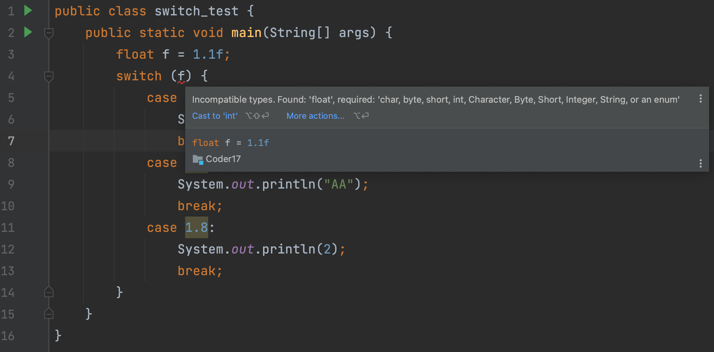

## 0. 目录

- 将阿拉伯数字转换为中文数字
- 使用 switch 语句简化程序
- switch 语法中的 break
- switch 语句语法点总结
## 1. 将阿拉伯数字转换为中文数字

- 使用 if 可以完成，但是略显不够整洁
- 能够根据两个值相比较，进入某个代码块最适合这个情况
```java
public class IfElseNum {
    public static void main(String[] args) {

        int n = 1;

        String ret = n + "对应的汉字是";
        if (n == 0) {
            ret = ret + "零";
        } else if (n == 1) {
            ret = ret + "壹";
        } else if (n == 2) {
            ret = ret + "贰";
        } else if (n == 3) {
            ret = ret + "叁";
        } else if (n == 4) {
            ret = ret + "肆";
        } else if (n == 5) {
            ret = ret + "伍";
        } else if (n == 6) {
            ret = ret + "陆";
        } else if (n == 7) {
            ret = ret + "柒";
        } else if (n == 8) {
            ret = ret + "捌";
        } else if (n == 9) {
            ret = ret + "玖";
        } else {
            System.out.println("错误的值" + n + "。值需要在大于等于1，小于等于9。");
        }

        System.out.println(ret);
    }
}
```
```java
1对应的汉字是壹
```

## 2. 使用 switch 语句简化程序

- switch 语句的语法

```java
switch (用于比较的 int 值){
    case 目标值 1，对应一个 if else(xxx):
        匹配后可以执行的语句
    case 目标值 2，不可以与别的 case 字句重复:
        匹配后可以执行的语句
    default （对应最后的 else，可选:
        default 语句
}
```


- switch 里的 case 子句中也可以有任意合法的语句，比如 if-else，for 循环等
```java
public class IfElseSwitch {
    public static void main(String[] args) {

        int n = 2;

        String ret = n + "对应的汉字是";

        switch (n) {
            case 1:
                ret = ret + "壹";
                break;
            case 2:
                ret = ret + "贰";
                break;
            case 3:
                ret = ret + "叁";
                break;
            case 4:
                ret = ret + "肆";
                break;
            case 5:
                ret = ret + "伍";
                break;
            case 6:
                ret = ret + "陆";
                break;
            case 7:
                ret = ret + "柒";
                break;
            case 8:
                ret = ret + "捌";
                break;
            case 9:
                ret = ret + "玖";
                break;
            default:
                System.out.println("错误的值" + n + "。值需要大于等于1，小于等于9。");
        }
        System.out.println(ret);
    }
}
```
case 不是一个代码块，所以在 switch 里面不能出现重名的变量。这是 switch 比较让人困扰的一个点，switch 中的 case 虽然是不同的 case，但是不能重新重名的变量。——因为，他都在 switch 代码块。

**如果代码中没有 break 会怎么样？**

```java
public class IfElseSwitch {
    public static void main(String[] args) {

        int n = 2;

        String ret = n + "对应的汉字是";

        switch (n) {
            case 1:
                ret = ret + "壹";
//                break;
            case 2:
                ret = ret + "贰";
//                break;
            case 3:
                ret = ret + "叁";
//                break;
            case 4:
                ret = ret + "肆";
//                break;
            case 5:
                ret = ret + "伍";
//                break;
            case 6:
                ret = ret + "陆";
//                break;
            case 7:
                ret = ret + "柒";
//                break;
            case 8:
                ret = ret + "捌";
//                break;
            case 9:
                ret = ret + "玖";
//                break;
            default:
                System.out.println("错误的值" + n + "。值需要大于等于1，小于等于9。");
        }
        System.out.println(ret);
    }
}
```
```java
错误的值2。值需要大于等于1，小于等于9。
2对应的汉字是贰叁肆伍陆柒捌玖
```
这也是 switch 的特点，case 匹配到一个符合的，它就会顺着 case 一直执行。直到遇到 break。
总结：break; 语句"不是必须的"。如果不写，如果一旦 case 相应的值成功，但内部没有 break 语句，那么将会无条件(不再进行 case 匹配)的继续向下执行其它 case 中的语句，直到遇到 break; 语句或者到达 switch 语句结束。
## 3. switch 语法中的 break

- switch 语句如果没有遇到 break，会一直执行下去。
- 如果我们的例子没有 break 会怎么样
- 没有 break 的情况也有用武之地
## 4. switch 语句语法点总结

- switch 语句中用于比较的值，必须是 int 类型「当然，大家对于 switch 支持其它的类型呼声很高，一开始 switch 就是支持 int。这个取决于你用的 java 的版本。」
```java
public class switch_test {
    public static void main(String[] args) {
//        int i = 0;
        String s = "AA";
        switch (s) {
            case "0":
                System.out.println(0);
                break;
            case "AA":
                System.out.println("AA");
                break;
            case "D":
                System.out.println(2);
                break;
        }
    }
}
```


> Incompatible types. Found: "float', required: 'char, byte, short, int, Character, Byte, Short, Integer, String, or an enum'
> 不兼容的类型。Found: "float'， required: 'char, byte, short, int, Character, byte, short, Integer, String，或enum'

- switch 语句适用于有固定多个目标值匹配，然后执行不同的逻辑的情况
- 必须使用 break 语句显示的结束一个 case 子句，否则 switch 语句会从第一个 match 的 case 语句开始执行直到遇到 break 语句或者 switch 语句结束
- default 子句是可选的，如果所有的 case 语句都没有匹配上，才会执行 default 中的代码
- 不能在不同的 case 里，声明相同的变量。这个和你在相同的代码块里，声明相同的变量的结果是一样的。「会报：变量名重复的错误」


## 5. 练习

::: tabs

@tab 1. 水果价格计算器

编写一个程序，根据用户输入的水果名称（如 "apple"、"banana" 等），通过 `switch` 语句输出相应的单价。如果输入的水果名称不在清单中，提示用户 "未知水果"。

**要求：**

- 支持 "apple" (3元)，"banana" (2元)，"orange" (4元)，"grape" (5元)。
- 默认情况输出 "未知水果"。

```java
import java.util.Scanner;

public class FruitPrice {
    public static void main(String[] args) {
        Scanner scanner = new Scanner(System.in);
        System.out.print("请输入水果名称：");
        String fruit = scanner.nextLine();

        switch (fruit.toLowerCase()) {
            case "apple":
                System.out.println("苹果的价格是 3 元");
                break;
            case "banana":
                System.out.println("香蕉的价格是 2 元");
                break;
            case "orange":
                System.out.println("橙子的价格是 4 元");
                break;
            case "grape":
                System.out.println("葡萄的价格是 5 元");
                break;
            default:
                System.out.println("未知水果");
        }
    }
}
```

@tab 2. 月份天数计算器

根据用户输入的月份（整数 1 到 12），通过 `switch` 输出该月份的天数。

**要求：**

- 闰年处理（如 2 月在闰年为 29 天，否则为 28 天）。
- 提示：可以用嵌套 `if` 或其他方法判断是否是闰年。

```java
import java.util.Scanner;

public class MonthDays {
    public static void main(String[] args) {
        Scanner scanner = new Scanner(System.in);
        System.out.print("请输入年份：");
        int year = scanner.nextInt();
        System.out.print("请输入月份（1-12）：");
        int month = scanner.nextInt();

        int days;
        switch (month) {
            case 1: case 3: case 5: case 7: case 8: case 10: case 12:
                days = 31;
                break;
            case 4: case 6: case 9: case 11:
                days = 30;
                break;
            case 2:
                days = (year % 4 == 0 && year % 100 != 0 || year % 400 == 0) ? 29 : 28;
                break;
            default:
                System.out.println("非法月份！");
                return;
        }
        System.out.println(month + " 月有 " + days + " 天");
    }
}
```


@tab 3. 语言问候

根据用户输入的语言代号（如 "en"、"zh"、"es"、"fr" 等），通过 `switch` 输出相应的问候语：

- "en" 输出 "Hello"
- "zh" 输出 "你好"
- "es" 输出 "Hola"
- "fr" 输出 "Bonjour"
- 默认情况输出 "Unknown language"

**要求：**

- 使用字符串作为 `switch` 的表达式。

```java
import java.util.Scanner;

public class LanguageGreeting {
    public static void main(String[] args) {
        Scanner scanner = new Scanner(System.in);
        System.out.print("请输入语言代号（如 en, zh, es, fr）：");
        String lang = scanner.nextLine();

        switch (lang) {
            case "en":
                System.out.println("Hello");
                break;
            case "zh":
                System.out.println("你好");
                break;
            case "es":
                System.out.println("Hola");
                break;
            case "fr":
                System.out.println("Bonjour");
                break;
            default:
                System.out.println("Unknown language");
        }
    }
}
```


@tab 4. 简易四则运算器

编写一个程序，根据用户输入的运算符（`+`、`-`、`*`、`/`），通过 `switch` 语句执行相应的运算。

**要求：**

- 用户输入两个数字和一个运算符，程序输出结果。
- 如果输入非法运算符，输出 "非法运算符"。

```java
import java.util.Scanner;

public class SimpleCalculator {
    public static void main(String[] args) {
        Scanner scanner = new Scanner(System.in);
        System.out.print("请输入第一个数字：");
        double num1 = scanner.nextDouble();
        System.out.print("请输入运算符（+ - * /）：");
        char operator = scanner.next().charAt(0);
        System.out.print("请输入第二个数字：");
        double num2 = scanner.nextDouble();

        switch (operator) {
            case '+':
                System.out.println("结果是：" + (num1 + num2));
                break;
            case '-':
                System.out.println("结果是：" + (num1 - num2));
                break;
            case '*':
                System.out.println("结果是：" + (num1 * num2));
                break;
            case '/':
                if (num2 != 0) {
                    System.out.println("结果是：" + (num1 / num2));
                } else {
                    System.out.println("错误：除数不能为零！");
                }
                break;
            default:
                System.out.println("非法运算符！");
        }
    }
}
```


@tab 5. 游戏角色选择

设计一个简单的游戏角色选择系统。用户可以选择以下角色：

- 1: 战士
- 2: 法师
- 3: 牧师
- 其他数字：未知角色

**要求：**

- 根据用户输入的数字，通过 `switch` 输出角色描述，如 "战士：擅长近战"、"法师：擅长远程法术"。

```java
import java.util.Scanner;

public class CharacterSelection {
    public static void main(String[] args) {
        Scanner scanner = new Scanner(System.in);
        System.out.print("选择你的角色（1: 战士, 2: 法师, 3: 牧师）：");
        int choice = scanner.nextInt();

        switch (choice) {
            case 1:
                System.out.println("战士：擅长近战");
                break;
            case 2:
                System.out.println("法师：擅长远程法术");
                break;
            case 3:
                System.out.println("牧师：擅长治疗");
                break;
            default:
                System.out.println("未知角色");
        }
    }
}
```


@tab 6. 星座查询

根据用户输入的生日月份和日期，输出对应的星座（如白羊座、金牛座等）。

**要求：**

- 使用 `switch` 处理每个月。
- 不同星座分段的逻辑可以用嵌套 `if` 实现，例如：
    - 3月21日到4月19日是白羊座。
    - 4月20日到5月20日是金牛座。
- 输出格式为："您的星座是：白羊座"。

```java
import java.util.Scanner;

public class ZodiacSign {
    public static void main(String[] args) {
        Scanner scanner = new Scanner(System.in);
        System.out.print("请输入月份（1-12）：");
        int month = scanner.nextInt();
        System.out.print("请输入日期（1-31）：");
        int day = scanner.nextInt();

        String zodiac = "";
        switch (month) {
            case 1:
                zodiac = (day <= 19) ? "摩羯座" : "水瓶座";
                break;
            case 2:
                zodiac = (day <= 18) ? "水瓶座" : "双鱼座";
                break;
            case 3:
                zodiac = (day <= 20) ? "双鱼座" : "白羊座";
                break;
            case 4:
                zodiac = (day <= 19) ? "白羊座" : "金牛座";
                break;
            case 5:
                zodiac = (day <= 20) ? "金牛座" : "双子座";
                break;
            case 6:
                zodiac = (day <= 21) ? "双子座" : "巨蟹座";
                break;
            case 7:
                zodiac = (day <= 22) ? "巨蟹座" : "狮子座";
                break;
            case 8:
                zodiac = (day <= 22) ? "狮子座" : "处女座";
                break;
            case 9:
                zodiac = (day <= 22) ? "处女座" : "天秤座";
                break;
            case 10:
                zodiac = (day <= 23) ? "天秤座" : "天蝎座";
                break;
            case 11:
                zodiac = (day <= 21) ? "天蝎座" : "射手座";
                break;
            case 12:
                zodiac = (day <= 21) ? "射手座" : "摩羯座";
                break;
            default:
                System.out.println("非法月份！");
                return;
        }
        System.out.println("您的星座是：" + zodiac);
    }
}
```

@tab 7. 银行账户管理系统

实现一个银行账户管理系统，根据用户输入的操作类型（如查询余额、存款、取款、转账等），执行相应的操作。

**功能需求：**

1. 查询余额：显示当前余额。
2. 存款：用户输入金额后，余额增加。
3. 取款：用户输入金额后，余额减少。如果余额不足，提示“余额不足”。
4. 转账：用户输入转账金额，余额减少，同时输出“成功转账 xxx 元”。

**要求：**

- 使用 `switch` 实现功能选择。
- 初始余额设定为 `1000`。
- 如果输入的操作类型非法，提示“无效操作”。

```java
import java.util.Scanner;

public class BankAccount {
    public static void main(String[] args) {
        Scanner scanner = new Scanner(System.in);
        double balance = 1000; // 初始余额
        boolean running = true;

        while (running) {
            System.out.println("\n选择操作：");
            System.out.println("1: 查询余额");
            System.out.println("2: 存款");
            System.out.println("3: 取款");
            System.out.println("4: 转账");
            System.out.println("5: 退出");
            System.out.print("请输入选项：");
            int choice = scanner.nextInt();

            switch (choice) {
                case 1: // 查询余额
                    System.out.println("当前余额：" + balance + " 元");
                    break;
                case 2: // 存款
                    System.out.print("请输入存款金额：");
                    double deposit = scanner.nextDouble();
                    balance += deposit;
                    System.out.println("存款成功！当前余额：" + balance + " 元");
                    break;
                case 3: // 取款
                    System.out.print("请输入取款金额：");
                    double withdrawal = scanner.nextDouble();
                    if (withdrawal > balance) {
                        System.out.println("余额不足！");
                    } else {
                        balance -= withdrawal;
                        System.out.println("取款成功！当前余额：" + balance + " 元");
                    }
                    break;
                case 4: // 转账
                    System.out.print("请输入转账金额：");
                    double transfer = scanner.nextDouble();
                    if (transfer > balance) {
                        System.out.println("余额不足！");
                    } else {
                        balance -= transfer;
                        System.out.println("成功转账 " + transfer + " 元！当前余额：" + balance + " 元");
                    }
                    break;
                case 5: // 退出
                    running = false;
                    System.out.println("退出系统，再见！");
                    break;
                default:
                    System.out.println("无效操作！");
            }
        }
    }
}
```


@tab 8. 多边形判断器

根据用户输入的边数（3 到 10），输出对应的多边形名称：

- 3: 三角形
- 4: 四边形
- 5: 五边形
- ...
- 10: 十边形

**要求：**

1. 边数超过 10 或小于 3，输出“无法识别的多边形”。
2. 增加一个附加功能：如果用户输入边数为 4，还需要进一步询问是否为正方形或矩形，并输出相应的形状。

```java
import java.util.Scanner;

public class PolygonIdentifier {
    public static void main(String[] args) {
        Scanner scanner = new Scanner(System.in);
        System.out.print("请输入多边形的边数（3-10）：");
        int sides = scanner.nextInt();

        switch (sides) {
            case 3:
                System.out.println("三角形");
                break;
            case 4:
                System.out.println("四边形");
                System.out.print("请输入具体类型（正方形/矩形）：");
                String shape = scanner.next();
                System.out.println("这是一个 " + shape);
                break;
            case 5:
                System.out.println("五边形");
                break;
            case 6:
                System.out.println("六边形");
                break;
            case 7:
                System.out.println("七边形");
                break;
            case 8:
                System.out.println("八边形");
                break;
            case 9:
                System.out.println("九边形");
                break;
            case 10:
                System.out.println("十边形");
                break;
            default:
                System.out.println("无法识别的多边形");
        }
    }
}
```


@tab 9. 迷宫游戏方向控制

编写一个迷宫游戏的方向控制程序，用户输入方向字符（如 `w`、`a`、`s`、`d`），通过 `switch` 控制角色移动。

1. `w`：向上移动。
2. `a`：向左移动。
3. `s`：向下移动。
4. `d`：向右移动。

**要求：**

- 记录当前角色的坐标，初始坐标为 `(0, 0)`。
- 每次移动后打印当前坐标。
- 非法输入提示“非法方向”。
- 如果角色超出迷宫范围（假设范围是 -5 到 5），提示“超出边界”。

```java
import java.util.Scanner;

public class MazeGame {
    public static void main(String[] args) {
        Scanner scanner = new Scanner(System.in);
        int x = 0, y = 0; // 初始坐标
        boolean running = true;

        while (running) {
            System.out.print("请输入方向（w: 上, a: 左, s: 下, d: 右, q: 退出）：");
            char direction = scanner.next().charAt(0);

            switch (direction) {
                case 'w':
                    y++;
                    break;
                case 'a':
                    x--;
                    break;
                case 's':
                    y--;
                    break;
                case 'd':
                    x++;
                    break;
                case 'q':
                    running = false;
                    System.out.println("游戏结束！");
                    break;
                default:
                    System.out.println("非法方向！");
                    continue;
            }

            if (x < -5 || x > 5 || y < -5 || y > 5) {
                System.out.println("超出边界！");
                running = false;
            } else {
                System.out.println("当前位置：(" + x + ", " + y + ")");
            }
        }
    }
}
```


@tab 10. 餐厅菜单点餐系统

实现一个餐厅菜单系统，用户可以根据输入的编号选择菜品，并计算总价。

**菜单示例：**

1. 牛肉面 - 15 元
2. 炒饭 - 12 元
3. 鸡排饭 - 18 元
4. 退出点餐

**要求：**

1. 使用 `switch` 实现菜单选择。
2. 用户可以连续点餐，输入编号后价格累加。
3. 输入 `4` 时退出点餐，并显示总价。

```java
import java.util.Scanner;

public class RestaurantMenu {
    public static void main(String[] args) {
        Scanner scanner = new Scanner(System.in);
        double total = 0; // 总价
        boolean ordering = true;

        while (ordering) {
            System.out.println("\n菜单：");
            System.out.println("1: 牛肉面 - 15 元");
            System.out.println("2: 炒饭 - 12 元");
            System.out.println("3: 鸡排饭 - 18 元");
            System.out.println("4: 退出点餐");
            System.out.print("请输入编号：");
            int choice = scanner.nextInt();

            switch (choice) {
                case 1:
                    total += 15;
                    System.out.println("已点牛肉面，当前总价：" + total + " 元");
                    break;
                case 2:
                    total += 12;
                    System.out.println("已点炒饭，当前总价：" + total + " 元");
                    break;
                case 3:
                    total += 18;
                    System.out.println("已点鸡排饭，当前总价：" + total + " 元");
                    break;
                case 4:
                    ordering = false;
                    System.out.println("点餐结束，总价：" + total + " 元");
                    break;
                default:
                    System.out.println("无效选择！");
            }
        }
    }
}
```


@tab 11. 函数计算器

根据用户输入的数学函数类型（如 sin、cos、tan 等），计算相应的函数值。

**要求：**

1. 用户输入一个操作符（如 `sin`、`cos`、`tan` 等）和角度值（单位：度）。
2. 使用 `switch` 调用相应的数学函数，输出结果。
3. 非法操作符提示“未知函数”。
4. 注意处理 `tan(90)` 等可能导致数学错误的输入。

```java
import java.util.Scanner;

public class FunctionCalculator {
    public static void main(String[] args) {
        Scanner scanner = new Scanner(System.in);
        System.out.print("请输入函数类型（sin, cos, tan）：");
        String function = scanner.next();
        System.out.print("请输入角度（单位：度）：");
        double angle = scanner.nextDouble();
        double radians = Math.toRadians(angle); // 将角度转换为弧度

        switch (function) {
            case "sin":
                System.out.println("sin(" + angle + ") = " + Math.sin(radians));
                break;
            case "cos":
                System.out.println("cos(" + angle + ") = " + Math.cos(radians));
                break;
            case "tan":
                if (angle % 180 == 90) {
                    System.out.println("tan(" + angle + ") 无定义");
                } else {
                    System.out.println("tan(" + angle + ") = " + Math.tan(radians));
                }
                break;
            default:
                System.out.println("未知函数！");
        }
    }
}
```


@tab 12. 复杂日历计算器

编写一个日历计算器，根据用户输入的日期和操作类型，输出结果。

- 输入格式：`年-月-日 操作`（如 `2024-02-28 +1`）。
- 操作类型：
    - `+1`：计算输入日期的下一天。
    - `-1`：计算输入日期的前一天。
    - `+7`：计算输入日期的下一周。
    - `-7`：计算输入日期的前一周。

**要求：**

1. 判断是否为闰年。
2. 根据月份判断日期是否有效。
3. 非法日期或非法操作时，输出“错误输入”。

```java
import java.util.Scanner;
import java.time.LocalDate;
import java.time.format.DateTimeFormatter;
import java.time.format.DateTimeParseException;

public class DateCalculator {
    public static void main(String[] args) {
        Scanner scanner = new Scanner(System.in);
        System.out.println("请输入日期和操作（格式：YYYY-MM-DD 操作类型，如 2024-02-28 +1）：");
        String input = scanner.nextLine();
        
        try {
            String[] parts = input.split(" ");
            if (parts.length != 2) {
                System.out.println("输入格式错误！");
                return;
            }
            
            String dateString = parts[0];
            String operation = parts[1];
            
            // 解析输入的日期
            LocalDate date = LocalDate.parse(dateString, DateTimeFormatter.ISO_LOCAL_DATE);
            
            // 处理操作类型
            switch (operation) {
                case "+1":
                    date = date.plusDays(1);
                    break;
                case "-1":
                    date = date.minusDays(1);
                    break;
                case "+7":
                    date = date.plusWeeks(1);
                    break;
                case "-7":
                    date = date.minusWeeks(1);
                    break;
                default:
                    System.out.println("未知操作类型！");
                    return;
            }
            
            System.out.println("计算后的日期是：" + date);
        } catch (DateTimeParseException e) {
            System.out.println("输入的日期格式不正确，请确保为 YYYY-MM-DD！");
        } catch (Exception e) {
            System.out.println("发生错误：" + e.getMessage());
        }
    }
}
```


@tab 13. 文件类型解析器

根据用户输入的文件后缀名（如 `.jpg`、`.txt`、`.pdf` 等），输出文件类型描述：

- `.jpg`、`.png`：图片文件。
- `.txt`：文本文件。
- `.pdf`：文档文件。
- `.exe`：可执行文件。
- `.zip`、`.rar`：压缩文件。
- 其他：未知文件类型。

**要求：**

1. 使用 `switch` 实现。
2. 要求区分大小写（如 `.JPG` 和 `.jpg`）。

```java
import java.util.Scanner;

public class FileTypeParser {
    public static void main(String[] args) {
        Scanner scanner = new Scanner(System.in);
        System.out.print("请输入文件后缀名（如 .jpg, .txt, .pdf）：");
        String fileExtension = scanner.next();

        switch (fileExtension.toLowerCase()) { // 转为小写处理
            case ".jpg":
            case ".png":
                System.out.println("图片文件");
                break;
            case ".txt":
                System.out.println("文本文件");
                break;
            case ".pdf":
                System.out.println("文档文件");
                break;
            case ".exe":
                System.out.println("可执行文件");
                break;
            case ".zip":
            case ".rar":
                System.out.println("压缩文件");
                break;
            default:
                System.out.println("未知文件类型");
        }
    }
}
```


@tab 14. 多级菜单

实现一个多级菜单系统，用户可以选择主菜单的一个选项，然后进入对应的子菜单。例如：

1. 主菜单：
    - 1: 游戏
    - 2: 设置
    - 3: 帮助
2. 子菜单：
    - 游戏 -> 1: 开始游戏 2: 加载存档 3: 返回主菜单
    - 设置 -> 1: 音量调节 2: 分辨率调节 3: 返回主菜单
    - 帮助 -> 1: 游戏说明 2: 技术支持 3: 返回主菜单

**要求：**

- 使用 `switch` 实现主菜单和子菜单。
- 通过嵌套 `switch` 处理用户选择。
- 输入非法选项时提示“无效选项”。

```java
import java.util.Scanner;

public class MultiLevelMenu {
    public static void main(String[] args) {
        Scanner scanner = new Scanner(System.in);
        boolean running = true;

        while (running) {
            System.out.println("\n主菜单：");
            System.out.println("1: 游戏");
            System.out.println("2: 设置");
            System.out.println("3: 帮助");
            System.out.println("4: 退出");
            System.out.print("请输入选项：");
            int mainChoice = scanner.nextInt();

            switch (mainChoice) {
                case 1: // 游戏菜单
                    while (true) {
                        System.out.println("\n游戏菜单：");
                        System.out.println("1: 开始游戏");
                        System.out.println("2: 加载存档");
                        System.out.println("3: 返回主菜单");
                        System.out.print("请输入选项：");
                        int gameChoice = scanner.nextInt();

                        switch (gameChoice) {
                            case 1:
                                System.out.println("正在开始新游戏...");
                                break;
                            case 2:
                                System.out.println("正在加载存档...");
                                break;
                            case 3:
                                System.out.println("返回主菜单...");
                                break;
                            default:
                                System.out.println("无效选项！");
                        }
                        if (gameChoice == 3) break;
                    }
                    break;

                case 2: // 设置菜单
                    while (true) {
                        System.out.println("\n设置菜单：");
                        System.out.println("1: 音量调节");
                        System.out.println("2: 分辨率调节");
                        System.out.println("3: 返回主菜单");
                        System.out.print("请输入选项：");
                        int settingsChoice = scanner.nextInt();

                        switch (settingsChoice) {
                            case 1:
                                System.out.println("正在调节音量...");
                                break;
                            case 2:
                                System.out.println("正在调整分辨率...");
                                break;
                            case 3:
                                System.out.println("返回主菜单...");
                                break;
                            default:
                                System.out.println("无效选项！");
                        }
                        if (settingsChoice == 3) break;
                    }
                    break;

                case 3: // 帮助菜单
                    while (true) {
                        System.out.println("\n帮助菜单：");
                        System.out.println("1: 游戏说明");
                        System.out.println("2: 技术支持");
                        System.out.println("3: 返回主菜单");
                        System.out.print("请输入选项：");
                        int helpChoice = scanner.nextInt();

                        switch (helpChoice) {
                            case 1:
                                System.out.println("这是游戏的说明文档...");
                                break;
                            case 2:
                                System.out.println("联系技术支持邮箱：support@example.com");
                                break;
                            case 3:
                                System.out.println("返回主菜单...");
                                break;
                            default:
                                System.out.println("无效选项！");
                        }
                        if (helpChoice == 3) break;
                    }
                    break;

                case 4: // 退出
                    System.out.println("退出系统，再见！");
                    running = false;
                    break;

                default:
                    System.out.println("无效选项！");
            }
        }
    }
}
```


:::


欢迎关注我公众号：AI悦创，有更多更好玩的等你发现！

::: details 公众号：AI悦创【二维码】


:::

::: info AI悦创·编程一对一

AI悦创·推出辅导班啦，包括「Python 语言辅导班、C++ 辅导班、java 辅导班、算法/数据结构辅导班、少儿编程、pygame 游戏开发」，全部都是一对一教学：一对一辅导 + 一对一答疑 + 布置作业 + 项目实践等。当然，还有线下线上摄影课程、Photoshop、Premiere 一对一教学、QQ、微信在线，随时响应！微信：Jiabcdefh

C++ 信息奥赛题解，长期更新！长期招收一对一中小学信息奥赛集训，莆田、厦门地区有机会线下上门，其他地区线上。微信：Jiabcdefh

方法一：[QQ](http://wpa.qq.com/msgrd?v=3&uin=1432803776&site=qq&menu=yes)

方法二：微信：Jiabcdefh

:::


