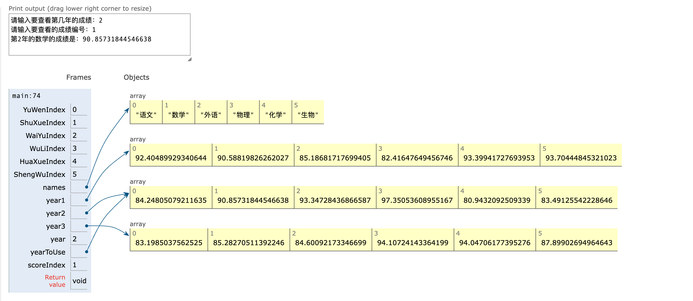
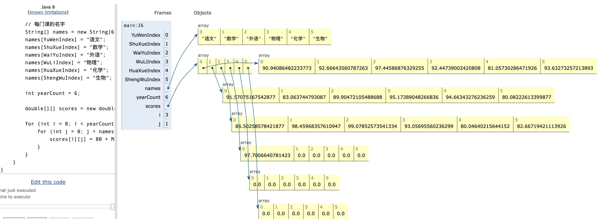

## 0. 目录

- 如果要存储多年的成绩怎么办？
- 多维数组
- 用多维数组存储多年的成绩

## 1. 如果要存储多年的成绩怎么办？

- **为每年创建一个数组？**
- **这种行为和为每一门成绩创建一个变量很像！**
```java
import java.util.Scanner;

public class OneYearOneArray {
    public static void main(String[] args) {
        // 声明六个变量， 分别代表六门科目的成绩
        int YuWenIndex = 0;
        int ShuXueIndex = 1;
        int WaiYuIndex = 2;
        int WuLiIndex = 3;
        int HuaXueIndex = 4;
        int ShengWuIndex = 5;

        // 每门课的名字
        String[] names = new String[6];
        names[YuWenIndex] = "语文";
        names[ShuXueIndex] = "数学";
        names[WaiYuIndex] = "外语";
        names[WuLiIndex] = "物理";
        names[HuaXueIndex] = "化学";
        names[ShengWuIndex] = "生物";

        // 每门课的成绩
        double[] year1 = new double[6];

        // 用随机数给成绩赋值
        for (int i = 0; i < 6; i++) {
            year1[i] = 80 + Math.random() * 20;
        }

        // 每门课的成绩
        double[] year2 = new double[6];

        // 用随机数给成绩赋值
        for (int i = 0; i < 6; i++) {
            year2[i] = 80 + Math.random() * 20;
        }

        // 每门课的成绩
        double[] year3 = new double[6];

        // 用随机数给成绩赋值
        for (int i = 0; i < 6; i++) {
            year3[i] = 80 + Math.random() * 20;
        }

        double[] yearToUse;

        Scanner scanner = new Scanner(System.in);
        System.out.println("请输入要查看第几年的成绩：");
        int year = scanner.nextInt();

        switch (year) {
            case 1:
                yearToUse = year1;
                break;
            case 2:
                yearToUse = year2;
                break;
            case 3:
                yearToUse = year3;
                break;
            default:
                System.out.println("输入的年份不对，将查看的是最新一年的成绩");
                yearToUse = year3;
                break;

        }

        System.out.println("请输入要查看的成绩编号：");

        int scoreIndex = scanner.nextInt();

        System.out.println("第" + year + "年的" + names[scoreIndex] + "的成绩是：" + yearToUse[scoreIndex]);

    }
}
```

## 2. 多维数组

### 2.0 多维数组的基础操作

::: tabs

@tab 1. 二维数组的声明

二维数组需要指定数据类型和大小，可以在声明时指定维度，也可以不指定。

```java
public class TwoArray {
    public static void main(String[] args) {
        // 方法一：指定大小
        int[][] array1 = new int[3][4]; // 一个 3 行 4 列的二维数组

        // 方式 2: 不指定列数
        int[][] array2 = new int[3][]; // 每一行可以有不同的列数

        // 方式 3: 声明并初始化
        int[][] array3 = {
                {1, 2, 3},
                {4, 5, 6},
                {7, 8, 9}
        };
    }
}
```

@tab 2. 访问和修改数组元素

可以通过行号和列号访问或修改二维数组的元素，索引从 `0` 开始。

```java
public class TwoArray {
    public static void main(String[] args) {
        // 方法一：指定大小
        int[][] array = new int[3][4]; // 一个 3 行 4 列的二维数组

        // 修改元素
        array[0][0] = 10; // 将第一行第一列的元素设为 10
        array[2][3] = 20; // 将第三行第四列的元素设为 20

        // 访问元素
        System.out.println(array[0][0]); // 输出: 10
        System.out.println(array[2][3]); // 输出: 20
        System.out.println(array[0][1]); // 未赋值，默认 0
    }
}
```

@tab 3. 遍历二维数组

可以使用嵌套的 `for` 循环来遍历二维数组。

```java
public class TwoArray {
    public static void main(String[] args) {
        int[][] array = {
                {1, 2, 3},
                {4, 5, 6},
                {7, 8, 9}
        };
        // 遍历二维数组
        for (int i = 0; i < array.length; i++) { // 遍历行
            for (int j = 0; j < array[i].length; j++) { // 遍历列
                System.out.print(array[i][j] + " ");
            }
            System.out.println(); // 换行
        }
    }
}
```

输出：

```java
1 2 3 
4 5 6 
7 8 9 
```

@tab 4. 动态分配二维数组

Java 的二维数组可以按需动态分配每一行的列数。

```java
public class TwoArray {
    public static void main(String[] args) {
        int[][] array = new int[3][]; // 声明 3 行但未指定列数

        // 动态分配每一行的列数
        array[0] = new int[2]; // 第一行有 2 列
        array[1] = new int[3]; // 第二行有 3 列
        array[2] = new int[4]; // 第三行有 4 列

        // 赋值和访问
        array[0][0] = 10;
        array[1][2] = 20;

        System.out.println(array[0][0]); // 输出: 10
        System.out.println(array[1][2]); // 输出: 20
    }
}
```

@tab 5. 增强 for 循环遍历

增强型 `for` 循环简化了二维数组的遍历。

```java
public class TwoArray {
    public static void main(String[] args) {
        int[][] array = {
                {1, 2, 3},
                {4, 5, 6},
                {7, 8, 9}
        };

        // 使用增强 for 循环
        for (int[] row : array) { // 遍历每一行
            for (int value : row) { // 遍历行中的每个元素
                System.out.print(value + " ");
            }
            System.out.println(); // 换行
        }

    }
}
```

@tab 6. 二维数组的长度

- `array.length` 获取行数。
- `array[i].length` 获取第 `i` 行的列数。

```java
public class TwoArray {
    public static void main(String[] args) {
        int[][] array = {
                {1, 2, 3},
                {4, 5, 6, 7},
                {8, 9}
        };

        System.out.println("行数: " + array.length);       // 输出: 3
        System.out.println("第一行列数: " + array[0].length); // 输出: 3
        System.out.println("第二行列数: " + array[1].length); // 输出: 4
    }
}
```

@tab 7. 常见问题与注意事项

- **越界错误：** 访问不存在的索引会抛出 `ArrayIndexOutOfBoundsException`。

- **不规则数组：** 二维数组中的每一行可以有不同的列数。

- **默认值：** 声明但未初始化的二维数组元素默认值为类型的默认值（如 `int` 为 0，`double` 为 0.0，`boolean` 为 `false`，引用类型为 `null`）。

```java
int[][] array = new int[2][3];
System.out.println(array[0][0]); // 输出: 0 (默认值)
```


:::

### 2.1 创建一个二维数组，二维数组是一维数组的自然延伸

- `double[][] scores = new double[3][6]`
- `double[][] scores = new double[3][6]`

一维数组就是一个中括号，二维数组就是两个中括号，三维数组就是三个括号。

::: code-tabs

@tab Code1

```java
import java.util.Scanner;

public class OneArrayForAll {
    public static void main(String[] args) {

        // 声明六个变量， 分别代表六门科目的成绩
        int YuWenIndex = 0;
        int ShuXueIndex = 1;
        int WaiYuIndex = 2;
        int WuLiIndex = 3;
        int HuaXueIndex = 4;
        int ShengWuIndex = 5;

        // 每门课的名字
        String[] names = new String[6];
        names[YuWenIndex] = "语文";
        names[ShuXueIndex] = "数学";
        names[WaiYuIndex] = "外语";
        names[WuLiIndex] = "物理";
        names[HuaXueIndex] = "化学";
        names[ShengWuIndex] = "生物";

        Scanner scanner = new Scanner(System.in);

        System.out.println("请输入共有多少年的成绩：");

        int yearCount = scanner.nextInt();

        double[][] scores = new double[yearCount][names.length];

        for (int i = 0; i < yearCount; i++) {
            for (int j = 0; j < names.length; j++) {
                scores[i][j] = 80 + Math.random() * 20;
            }
        }

        System.out.println("请问要查看第几年的成绩？");

        int yearToUse = scanner.nextInt() - 1; // 优化用户体验

        System.out.println("请问要查看第几科的成绩？");

        int scoreToUse = scanner.nextInt() - 1;

        System.out.println("第" + (yearToUse + 1) + "年的第" + (scoreToUse + 1) + "门的成绩是：" + scores[yearToUse][+scoreToUse]);

    }
}
```
@tab Code2

```java
public class OneArrayForAll {
    public static void main(String[] args) {
        // 声明六个变量， 分别代表六门科目的成绩
        int YuWenIndex = 0;
        int ShuXueIndex = 1;
        int WaiYuIndex = 2;
        int WuLiIndex = 3;
        int HuaXueIndex = 4;
        int ShengWuIndex = 5;

        // 每门课的名字
        String[] names = new String[6];
        names[YuWenIndex] = "语文";
        names[ShuXueIndex] = "数学";
        names[WaiYuIndex] = "外语";
        names[WuLiIndex] = "物理";
        names[HuaXueIndex] = "化学";
        names[ShengWuIndex] = "生物";

        int yearCount = 6;

        double[][] scores = new double[yearCount][names.length];

        for (int i = 0; i < yearCount; i++) {
            for (int j = 0; j < names.length; j++) {
                scores[i][j] = 80 + Math.random() * 20;
            }
        }
    }
}
```

:::



::: code-tabs

@tab Code

```java
/**
 * @ClassName: MultiDimensionArray
 * @Description: TODO
 * @Author: AI悦创
 * @Date: 2022/10/9 10:52
 * @Version: V1.0
 * @Blog: https://www.bornforthis.cn
 */
public class MultiDimensionArray {
    public static void main(String[] args) {
        // 创建一个double类型的二维数组
        double[][] multiDimensionArr = new double[3][5];

        // 循环查看每个数组元素的值，在给数组元素赋值前，数组元素的值其实都是每种类型的初始值。
        for (int i = 0; i < multiDimensionArr.length; i++) {
            for (int j = 0; j < multiDimensionArr[i].length; j++) {
                System.out.println("multiDimensionArr[" + i + "][" + j + "]=" + multiDimensionArr[i][j]);
            }
        }

        // 其实第一维的数组，每个元素都是一个下一维度的属于的变量。在这里我们可以改变这个变量的值
        // 也就是让它指向一个新的变量。
        multiDimensionArr[2] = new double[100];

        // 检查每个的数组的长度，发现最后一个的长度不一样了，因为它指向了新的数组。
        for (int i = 0; i < multiDimensionArr.length; i++) {
            System.out.println("multiDimensionArr[" + i + "].length=" + multiDimensionArr[i].length);
        }

    }
}
```
@tab 输出：
```java
/Library/Java/JavaVirtualMachines/jdk-11.0.2.jdk/Contents/Home/bin/java -javaagent:/Applications/IntelliJ IDEA.app/Contents/lib/idea_rt.jar=60118:/Applications/IntelliJ IDEA.app/Contents/bin -Dfile.encoding=UTF-8 -classpath /Users/huangjiabao/GitHub/Java_Coder/Coder20/out/production/Coder20 MultiDimensionArray
multiDimensionArr[0][0]=0.0
multiDimensionArr[0][1]=0.0
multiDimensionArr[0][2]=0.0
multiDimensionArr[0][3]=0.0
multiDimensionArr[0][4]=0.0
multiDimensionArr[1][0]=0.0
multiDimensionArr[1][1]=0.0
multiDimensionArr[1][2]=0.0
multiDimensionArr[1][3]=0.0
multiDimensionArr[1][4]=0.0
multiDimensionArr[2][0]=0.0
multiDimensionArr[2][1]=0.0
multiDimensionArr[2][2]=0.0
multiDimensionArr[2][3]=0.0
multiDimensionArr[2][4]=0.0
multiDimensionArr[0].length=5
multiDimensionArr[1].length=5
multiDimensionArr[2].length=100

Process finished with exit code 0
```
:::

欢迎关注我公众号：AI悦创，有更多更好玩的等你发现！

::: details 公众号：AI悦创【二维码】


:::

::: info AI悦创·编程一对一

AI悦创·推出辅导班啦，包括「Python 语言辅导班、C++ 辅导班、java 辅导班、算法/数据结构辅导班、少儿编程、pygame 游戏开发」，全部都是一对一教学：一对一辅导 + 一对一答疑 + 布置作业 + 项目实践等。当然，还有线下线上摄影课程、Photoshop、Premiere 一对一教学、QQ、微信在线，随时响应！微信：Jiabcdefh

C++ 信息奥赛题解，长期更新！长期招收一对一中小学信息奥赛集训，莆田、厦门地区有机会线下上门，其他地区线上。微信：Jiabcdefh

方法一：[QQ](http://wpa.qq.com/msgrd?v=3&uin=1432803776&site=qq&menu=yes)

方法二：微信：Jiabcdefh

:::


