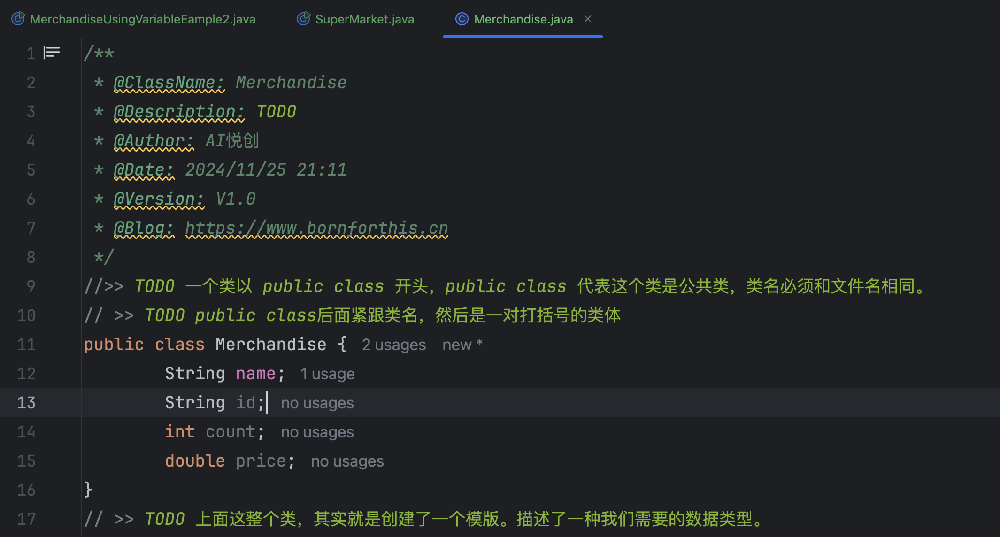

## 0. 目录

- 用变量表示商品
- 用类来表示商品

## 1. 用变量表示商品

- 商品有标识、名字、数量、价格这几个属性；
- 多个商品怎么办？重复，又是重复！

```java
public class MerchandiseUsingVariable {

    public static void main(String[] args) {

        // 用四个变量描述商品1
        String m1Name = "茉莉花茶包 20 包";
        String m1Id = "000099518";
        int m1Count = 1000;
        double m1Price = 99.9;

        // 再用四个变量描述商品2
        String m2Name = "可口可乐 330ml";
        String m2Id = "000099519";
        int m2Count = 1000;
        double m2Price = 3.0;

        // 卖出一个商品1
        int m1ToSold = 1;
        System.out.println("感谢购买" + m1ToSold + "个" + m1Name + "。商品单价为" +
                m1Price + "。消费总价为" + m1Price * m1ToSold + "。");
        m1Count -= m1ToSold;
        System.out.println(m1Id + "剩余的库存数量为" + m1Count);

        // 卖出3个商品2
        int m2ToSold = 3;
        System.out.println("感谢购买" + m2ToSold + "个" + m2Name + "。商品单价为" +
                m2Price + "。消费总价为" + m2Price * m2ToSold + "。");
        m2Count -= m2ToSold;
        System.out.println(m2Id + "剩余的库存数量为" + m2Count);

    }

}
```

这就是，我们每卖出一个商品，就要写这么多东西。——为什么不用数组？——因为，数组的数据类型必须一致。商品的每个元素类型都不一致。

在 Java 里，一堆这样的数据应该怎么样呢？——用类来表示。

## 2. 用类来表示商品

### 2.1 重新认识类（class）真正的用途

- 是用来描述同一类事物的；
- 可以在内部定义任意数量的、不同类型的变量，作为这一类事物的属性。这种属性叫做成员变量 （member variable）；
- 有类名，类名必须和文件名一样；
- 就好像文件路径+文件名不能重复一样，一个 Java 程序中相同名字的类只能有一个；

```java
/**
 * @ClassName: Merchandise
 * @Description: TODO
 * @Author: AI悦创
 * @Date: 2024/11/25 21:11
 * @Version: V1.0
 * @Blog: https://bornforthis.cn
 */

// >> TODO 一个类以 public class 开头，public class 代表这个类是公共类，类名必须和文件名相同。
// >> TODO public class后面紧跟类名，然后是一对打括号的类体
public class Merchandise {
    // >> TODO 类体中可以定义描述这个类的属性的变量。我们称之为成员变量（member variable）
    // >> TODO 每个成员变量的定义以;结束
    String name;
    String id;
    int count;  // 库存
    double price;

}

// >> TODO 上面这整个类，其实就是创建了一个模版。描述了一种我们需要的数据类型。
```

TODO 来高亮，IDE 本身的功能，后面需要关注的语法点，我都会用此方法显示。




### 2.2 看例程：定类的语法

```java
public class MerchandiseUsingVariableEample2 {
    public static void main(String[] args) {
        String m1Name = "茉莉花茶叶20包";
        int m1Count = 20;
    }
}
```


欢迎关注我公众号：AI悦创，有更多更好玩的等你发现！

::: details 公众号：AI悦创【二维码】


:::

::: info AI悦创·编程一对一

AI悦创·推出辅导班啦，包括「Python 语言辅导班、C++ 辅导班、java 辅导班、算法/数据结构辅导班、少儿编程、pygame 游戏开发」，全部都是一对一教学：一对一辅导 + 一对一答疑 + 布置作业 + 项目实践等。当然，还有线下线上摄影课程、Photoshop、Premiere 一对一教学、QQ、微信在线，随时响应！微信：Jiabcdefh

C++ 信息奥赛题解，长期更新！长期招收一对一中小学信息奥赛集训，莆田、厦门地区有机会线下上门，其他地区线上。微信：Jiabcdefh

方法一：[QQ](http://wpa.qq.com/msgrd?v=3&uin=1432803776&site=qq&menu=yes)

方法二：微信：Jiabcdefh

:::


