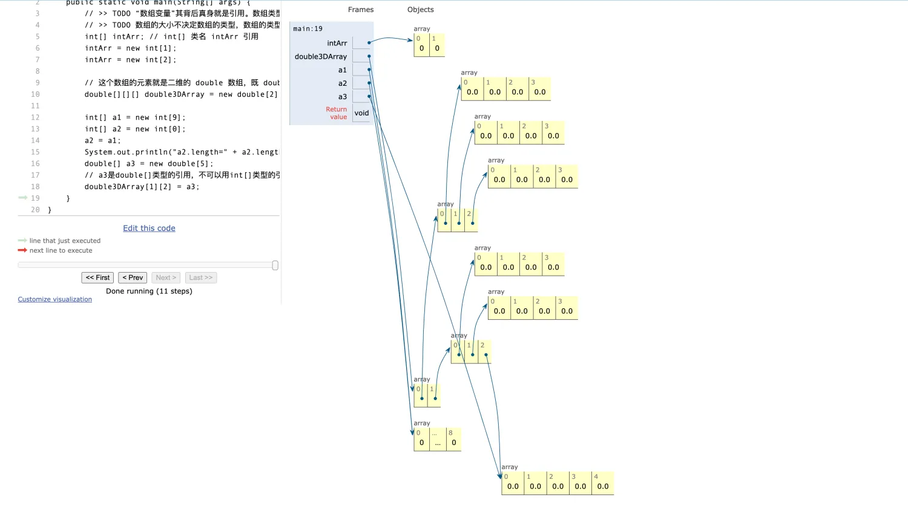
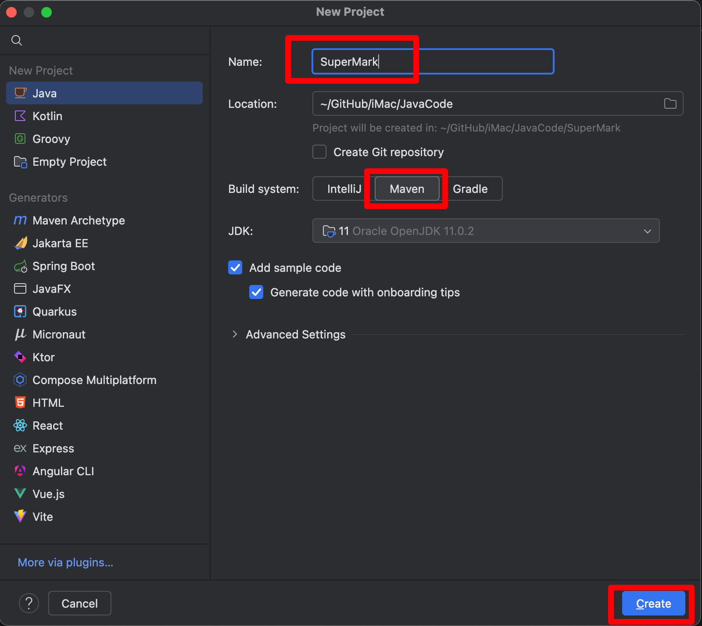

## 1. 数组是一种特殊的类

- 数组的类名就是类型带上中括号

- 同一类型的数组，每个数组对象的大小可以不一样。也就是每个数组对象占用的内存可以不一样，这点和类的对象不同。

    - 「我们可以创建每个长度不同的数组，但是类型都是 int，长度可以不一样」 

    - 「对象是通过类来创建的，类里面定义的成员变量，其实是就是对象可以使用的数据。每一个成员变量都是固定的数据类型的（引用类型或基础数据类型）。每种类型占用的大小都是固定的，也就是说：你创建一个类的对象，它占用多少内存，它是固定的，它不会变化。」

- 可以用引用指向类型相同大小不同的数组，因为它们属于同一种类型

::: code-tabs

@tab ArrayIsClass.java

```java
public class ArrayIsClass {
    public static void main(String[] args) {
        // >> TODO “数组变量”其背后真身就是引用。数组类型就是一种特殊的类。
        // >> TODO 数组的大小不决定数组的类型，数组的类型是只是由元素类型决定的。
        int[] intArr; // int[] 类名 intArr 引用
        intArr = new int[1];
        intArr = new int[2];

        // 这个数组的元素就是二维的 double 数组，既 double[][]
        double[][][] double3DArray = new double[2][3][4];

        int[] a1 = new int[9];
        int[] a2 = new int[0];
        a2 = a1;
        System.out.println("a2.length=" + a2.length);
        double[] a3 = new double[5];
        // a3是double[]类型的引用，不可以用int[]类型的引用赋值。
        double3DArray[1][2] = a3;
//        a3 = a1; // java: 不兼容的类型: int[]无法转换为double[]
    }
}
```

:::




## 2. 引用的数组

可以把类名当成自定义类型，定义引用的数组，甚至多维数组：

::: code-tabs

@tab Merchandise.java

```java
public class Merchandise {
    String name;
    String id;
    int count;
    double price;

}
```

@tab RefArray.java

```java
public class RefArray {

    public static void main(String[] args) {
        Merchandise[] merchandises = new Merchandise[9];
        merchandises[0] = new Merchandise();
        merchandises[1] = new Merchandise();
        merchandises[0].name = "笔记本";
        System.out.println(merchandises[0].name);

        System.out.println(merchandises[2]);
    }
}
```

:::

## 3. 如何批量添加商品数据？

::: code-tabs

@tab Merchandise.java

```java
public class Merchandise {
    String name;
    String id;
    int count;
    double price;
}
```

@tab RefArray.java

```java
public class RefArray {
    public static void main(String[] args) {
        // 创建一个包含9个商品的数组
        Merchandise[] merchandises = new Merchandise[9];

        // 为第一个商品赋值
        merchandises[0] = new Merchandise();
        merchandises[0].name = "笔记本";
        merchandises[0].id = "1997";
        merchandises[0].count = 99999;
        merchandises[0].price = 1000;

        // 为数组的其他商品赋值
        for (int i = 1; i < merchandises.length; i++) {
            merchandises[i] = new Merchandise();
            merchandises[i].name = "商品" + (i + 1);
            merchandises[i].id = String.valueOf(1000 + i);
            merchandises[i].count = (i + 1) * 1000;
            merchandises[i].price = 100 + (i * 50);
        }

        // 批量输出所有商品信息，不使用 toString() 方法
        for (int i = 0; i < merchandises.length; i++) {
            // 手动提取并输出商品的各个属性
            System.out.println("商品名称: " + merchandises[i].name 
                               + ", 商品ID: " + merchandises[i].id 
                               + ", 库存数量: " + merchandises[i].count 
                               + ", 价格: " + merchandises[i].price);
        }
    }
}
```

:::

## 4. 更优雅的输出

上面的输出太过繁琐，我们使用重写 `toString()` 方法，方便输出商品信息。

::: code-tabs

@tab Merchandise.java

```java
public class Merchandise {
    String name;
    String id;
    int count;
    double price;

    // 重写toString()方法，方便输出商品信息
    @Override
    public String toString() {
        return "商品名称: " + name + ", 商品ID: " + id + ", 库存数量: " + count + ", 价格: " + price;
    }
}
```

@tab RefArray.java

```java
public class RefArray {
    public static void main(String[] args) {
        // 创建一个包含9个商品的数组
        Merchandise[] merchandises = new Merchandise[9];

        // 为第一个商品赋值
        merchandises[0] = new Merchandise();
        merchandises[0].name = "笔记本";
        merchandises[0].id = "1997";
        merchandises[0].count = 99999;
        merchandises[0].price = 1000;

        // 为数组的其他商品赋值
        for (int i = 1; i < merchandises.length; i++) {
            merchandises[i] = new Merchandise();
            merchandises[i].name = "商品" + (i + 1);
            merchandises[i].id = String.valueOf(1000 + i);
            merchandises[i].count = (i + 1) * 1000;
            merchandises[i].price = 100 + (i * 50);
        }

        // 批量输出所有商品信息
        for (int i = 0; i < merchandises.length; i++) {
            System.out.println(merchandises[i]);
        }
    }
}
```


:::

## 5. 使用 Faker 库「待修复」

::: tabs

@tab 1. 新建项目



@tab 2. 项目结构

```java
(base) ➜  SuperMark git:(main) ✗ tree .
.
├── pom.xml
└── src
    ├── main
    │   ├── java
    │   │   └── org
    │   │       └── example
    │   │           └── Main.java
    │   └── resources
    └── test
        └── java

9 directories, 2 files
```

@tab 3. 编辑 pom.xml

```java
<?xml version="1.0" encoding="UTF-8"?>
<project xmlns="http://maven.apache.org/POM/4.0.0"
         xmlns:xsi="http://www.w3.org/2001/XMLSchema-instance"
         xsi:schemaLocation="http://maven.apache.org/POM/4.0.0 http://maven.apache.org/xsd/maven-4.0.0.xsd">
    <modelVersion>4.0.0</modelVersion>

    <groupId>org.example</groupId>
    <artifactId>SuperMark</artifactId>
    <version>1.0-SNAPSHOT</version>

    <properties>
        <maven.compiler.source>11</maven.compiler.source>
        <maven.compiler.target>11</maven.compiler.target>
        <project.build.sourceEncoding>UTF-8</project.build.sourceEncoding>
    </properties>

    <!-- 添加依赖部分 -->
    <dependencies>
        <!-- Faker 依赖 -->
        <dependency>
            <groupId>com.github.javafaker</groupId>
            <artifactId>javafaker</artifactId>
            <version>1.0.2</version>
        </dependency>
    </dependencies>

</project>
```

@tab 4. 编写代码

- 删掉 Main.java 后新建代码

```java
package org.example;

/**
 * @ClassName: Merchandise
 * @Description: TODO
 * @Author: AI悦创
 * @Date: 2024/11/28 22:32
 * @Version: V1.0
 * @Blog: https://bornforthis.cn
 */
public class Merchandise {
    String name;
    String id;
    int count;
    double price;
}
```

:::


欢迎关注我公众号：AI悦创，有更多更好玩的等你发现！

::: details 公众号：AI悦创【二维码】


:::

::: info AI悦创·编程一对一

AI悦创·推出辅导班啦，包括「Python 语言辅导班、C++ 辅导班、java 辅导班、算法/数据结构辅导班、少儿编程、pygame 游戏开发」，全部都是一对一教学：一对一辅导 + 一对一答疑 + 布置作业 + 项目实践等。当然，还有线下线上摄影课程、Photoshop、Premiere 一对一教学、QQ、微信在线，随时响应！微信：Jiabcdefh

C++ 信息奥赛题解，长期更新！长期招收一对一中小学信息奥赛集训，莆田、厦门地区有机会线下上门，其他地区线上。微信：Jiabcdefh

方法一：[QQ](http://wpa.qq.com/msgrd?v=3&uin=1432803776&site=qq&menu=yes)

方法二：微信：Jiabcdefh

:::


