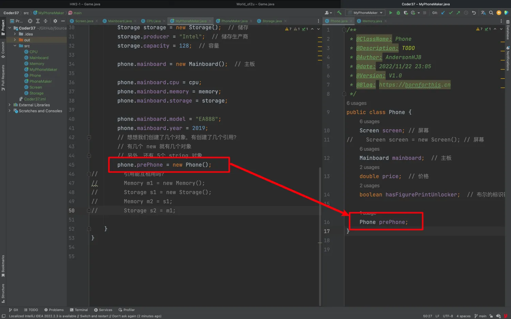
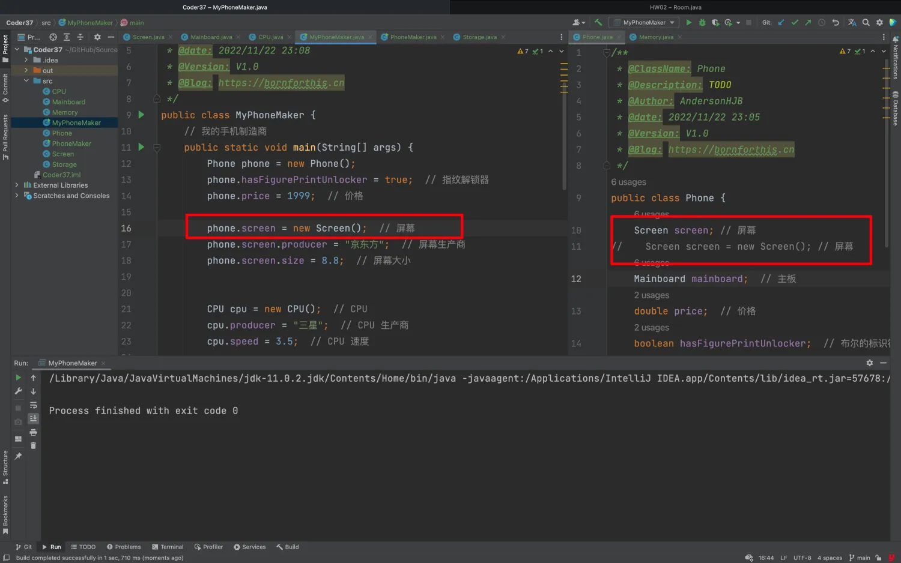

## 1. 类就是一种自定义类型

- 在类定义中可以使用类，创建类的引用
- 在类定义中，甚至可以使用类自己的类创建引用
- 引用类型的缺省值是 null。一个类定义中如果有引用，创建出来的实例，其缺省值是 null

::: code-tabs

@tab Phone.java

```java
/**
 * @ClassName: Phone
 * @Description: TODO
 * @Author: AndersonHJB
 * @date: 2022/11/22 23:05
 * @Version: V1.0
 * @Blog: https://bornforthis.cn
 */
public class Phone {
    Screen screen; // 屏幕
    Mainboard mainboard;  // 主板
    double price;  // 价格
    boolean hasFigurePrintUnlocker;  // 布尔的标识符

    Phone prePhone;
}
```

@tab Screen.java

```java
public class Screen {
    double size; // 屏幕的大小
    String producer;  // 生产厂商
}
```

@tab Mainboard.java

```java
public class Mainboard {
    // 主板
    CPU cpu;
    Memory memory;  // 内存
    Storage storage;  // 存储
    String model;  // 型号
    // 上市年份
    int year;
}
```

:::

**除了 String 是我们 Java 自带的类，其他的类都是我们自己创建的类。CPU、Memory、Storage。**

::: code-tabs

@tab CPU.java

```java
public class CPU {
    double speed;
    String producer;  // 生产商
}
```

@tab Memory.java

```java
public class Memory {
    long capacity;
    String producer;
}
```

@tab Storage.java

```java
public class Storage {
    long capacity;
    String producer;
}
```

:::

接下来，我们用一个类来把上面串联起来。构成我们自己的手机：

```java
/**
 * @ClassName: MyPhoneMaker
 * @Description: TODO
 * @Author: AndersonHJB
 * @date: 2022/11/22 23:08
 * @Version: V1.0
 * @Blog: https://bornforthis.cn
 */
public class MyPhoneMaker {
    // 我的手机制造商
    public static void main(String[] args) {
        Phone phone = new Phone();
        phone.hasFigurePrintUnlocker = true;  // 指纹解锁器
        phone.price = 1999;  // 价格

        phone.screen = new Screen();  // 屏幕
        phone.screen.producer = "京东方";  // 屏幕生产商
        phone.screen.size = 8.8;  // 屏幕大小


        CPU cpu = new CPU();  // CPU
        cpu.producer = "三星";  // CPU 生产商
        cpu.speed = 3.5;  // CPU 速度

        Memory memory = new Memory();  // 内存
        memory.producer = "三星";  // 内存生产商
//        memory.producer = new String("三星");  // 内存生产商，这么写没啥意义，因为双引号 Java就会自动识别字符串
        memory.capacity = 4;  // 容量

        Storage storage = new Storage();  // 储存
        storage.producer = "Intel";  // 储存生产商
        storage.capacity = 128;  // 容量

        phone.mainboard = new Mainboard();  // 主板

        phone.mainboard.cpu = cpu;
        phone.mainboard.memory = memory;
        phone.mainboard.storage = storage;

        phone.mainboard.model = "EA888";
        phone.mainboard.year = 2019;
        // 想想我们创建了几个对象，有创建了几个引用？
        // 有几个 new 就有几个对象
        // 另外，还有 5个 string 对象
        phone.prePhone = new Phone();
//        引用能互相用吗？
//        Memory m1 = new Memory();
//        Storage s1 = new Storage();
//        Memory m2 = s1;
//        Storage s2 = m1;

    }
}
```

在自己类型内，使用自己的的类型：

```java {16}
/**
 * @ClassName: Phone
 * @Description: TODO
 * @Author: AndersonHJB
 * @date: 2022/11/22 23:05
 * @Version: V1.0
 * @Blog: https://bornforthis.cn
 */
public class Phone {
    Screen screen; // 屏幕
//    Screen screen = new Screen(); // 屏幕
    Mainboard mainboard;  // 主板
    double price;  // 价格
    boolean hasFigurePrintUnlocker;  // 布尔的标识符

    Phone prePhone;
}
```

::: tabs

@tab img1



@tab img2



:::


## 2. 小试牛刀

### 2.1 初级

:::: tabs

@tab 练习题 1：类的定义与引用

根据以下描述完成代码：

1. 定义一个类 `Battery`，包含以下成员：

    - `capacity` (电池容量)：`double` 类型
    - `producer` (生产商)：`String` 类型

2. 修改 `Phone` 类，使其包含一个 `Battery` 类型的引用 `battery`。

3. 在 `MyPhoneMaker` 的 `main` 方法中，为 `Phone` 添加一个电池，并设置其 `capacity` 为 5000mAh，`producer` 为 "松下"。

    ::: code-tabs

    @tab 1. 定义 Battery 类

    ```java
    public class Battery {
        double capacity; // 电池容量
        String producer; // 电池生产商
    }
    ```

    @tab 2. 修改 Phone 类

    ```java {7}
    public class Phone {
        Screen screen; // 屏幕
        Mainboard mainboard;  // 主板
        double price;  // 价格
        boolean hasFigurePrintUnlocker;  // 布尔的标识符
        Phone prePhone; // 前代手机
        Battery battery; // 电池
    }
    ```

    @tab 3. 修改 MyPhoneMaker 类

    ```java
    public class MyPhoneMaker {
        public static void main(String[] args) {
            Phone phone = new Phone();
            phone.hasFigurePrintUnlocker = true; 
            phone.price = 1999;
    
            phone.screen = new Screen();
            phone.screen.producer = "京东方";
            phone.screen.size = 8.8;
    
            phone.battery = new Battery();  // 添加电池
            phone.battery.capacity = 5000; // 电池容量
            phone.battery.producer = "松下"; // 电池生产商
    
            System.out.println("电池生产商：" + phone.battery.producer);
            System.out.println("电池容量：" + phone.battery.capacity + "mAh");
        }
    }
    ```

    

    :::


@tab 练习题 2：对象关系与赋值

假设我们希望复用 `Phone` 的部分组件，完成以下任务：

1. 在 `MyPhoneMaker` 的 `main` 方法中，为 `phone.prePhone` 初始化一个新的 `Phone` 对象。

2. 使 `phone.prePhone` 的屏幕 `screen` 与当前 `phone` 的屏幕指向同一个对象（即它们共用一个屏幕对象）。

3. 分别打印 `phone` 和 `phone.prePhone` 的屏幕生产商，观察输出结果。

    ::: code-tabs

    @tab 1. 修改 MyPhoneMaker 类

    ```java
    public class MyPhoneMaker {
        public static void main(String[] args) {
            Phone phone = new Phone();
            phone.screen = new Screen();
            phone.screen.producer = "京东方";
            phone.screen.size = 8.8;
    
            // 初始化 prePhone 并共用屏幕
            phone.prePhone = new Phone();
            phone.prePhone.screen = phone.screen;
    
            // 打印屏幕生产商
            System.out.println("当前手机屏幕生产商：" + phone.screen.producer);
            System.out.println("前代手机屏幕生产商：" + phone.prePhone.screen.producer);
        }
    }
    ```

    @tab 输出结果

    ```java
    当前手机屏幕生产商：京东方
    前代手机屏幕生产商：京东方
    ```

    :::

    > **分析：** 因为 `phone` 和 `phone.prePhone` 的屏幕引用指向同一个对象，修改一个的属性会同时影响另一个。

    ::: code-tabs

    @tab MyPhoneMaker.java

    ```java {20}
    /*
     * @Time    : 2024/12/11 17:59
     * @Author  : AI悦创
     * @FileName: MyPhoneMaker.java
     * @Software: IntelliJ IDEA
     * @Blog    : https://bornforthis.cn/
     * Code is far away from bugs with the god animal protecting
     * I love animals. They taste delicious.
     */
    public class MyPhoneMaker {
        public static void main(String[] args) {
            Phone phone = new Phone();
            phone.screen = new Screen();
            phone.screen.producer = "京东方";
            phone.screen.size = 8.8;
    
            // 初始化 prePhone 并共用屏幕
            phone.prePhone = new Phone();
            phone.prePhone.screen = phone.screen;
            phone.prePhone.screen.producer = "Bornforthis";
    
            // 打印屏幕生产商
            System.out.println("当前手机屏幕生产商：" + phone.screen.producer);
            System.out.println("前代手机屏幕生产商：" + phone.prePhone.screen.producer);
        }
    }
    ```

    @tab 输出结果：

    ```java
    当前手机屏幕生产商：Bornforthis
    前代手机屏幕生产商：Bornforthis
    ```

    :::

    

    

@tab 练习题 3：引用计数分析

假设在 `main` 方法中，我们需要计算程序中创建的对象数和引用数。

1. 通过阅读代码，回答以下问题：
    - 程序中创建了几个对象？
    - 程序中有几个引用变量？
2. 修改 `main` 方法，在屏幕的大小发生变化时，验证是否会影响 `phone.prePhone` 的屏幕属性值。

#### 答案

1. **对象和引用计数分析：**

    - **对象数：**
        - `Phone` 对象：2 个（`phone` 和 `phone.prePhone`）。
        - `Screen` 对象：1 个（共享）。
        - 其他对象（如 `Mainboard`、`CPU` 等）：未初始化，不计入。
        - **总对象数：3 个**。

    - **引用变量数：**
        - `phone.screen`，`phone.prePhone.screen` 等共有多个引用，单独计算。
        - **总引用变量数：6 个（包括 `phone`、`prePhone` 和其他对象的成员引用）。**

2. 修改代码并验证：

    ::: code-tabs

    @tab MyPhoneMaker

    ```java
    public class MyPhoneMaker {
        public static void main(String[] args) {
            Phone phone = new Phone();
            phone.screen = new Screen();
            phone.screen.producer = "京东方";
            phone.screen.size = 8.8;
    
            phone.prePhone = new Phone();
            phone.prePhone.screen = phone.screen;
    
            // 修改屏幕大小
            phone.screen.size = 6.5;
    
            // 打印结果
            System.out.println("当前手机屏幕大小：" + phone.screen.size);
            System.out.println("前代手机屏幕大小：" + phone.prePhone.screen.size);
        }
    }
    ```

    @tab 输出结果：

    ```java
    当前手机屏幕大小：6.5
    前代手机屏幕大小：6.5
    ```

    :::

    **分析：** `phone.screen` 和 `phone.prePhone.screen` 指向同一对象，因此修改其中一个会同时影响另一个。

::::


### 2.2 中级

:::: tabs

@tab 题目 1：多代手机对比

**要求：**

设计一个程序，模拟手机制造商的产品迭代。具体要求如下：

1. 在 `Phone` 类中添加一个 `String model` 字段，用于记录手机型号。
2. 定义一个方法 `comparePrice(Phone other)`，用于比较两部手机的价格，返回价格差。
3. 在 `MyPhoneMaker` 类中：
    - 创建一个当前手机对象 `currentPhone` 和一个前代手机对象 `previousPhone`。
    - 分别设置它们的型号、价格及主要配置。
    - 调用 `comparePrice` 方法，打印价格差，并根据价格差输出是否值得购买当前手机。

**示例输出：**

```java
当前手机型号：X200
前代手机型号：X100
价格差：500元
推荐购买当前手机！
```

- **答案：**

    ::: code-tabs

    @tab Phone.java

    ```java {3, 7-9}
    // 定义 Phone 类
    public class Phone {
        String model; // 手机型号
        double price; // 手机价格
    
        // 比较价格的方法
        public double comparePrice(Phone other) {
            return this.price - other.price;
        }
    }
    ```

    @tab MyPhoneMaker.java

    ```java
    // MyPhoneMaker 类
    public class MyPhoneMaker {
        public static void main(String[] args) {
            // 创建当前手机和前代手机
            Phone currentPhone = new Phone();
            currentPhone.model = "X200";
            currentPhone.price = 2999;
    
            Phone previousPhone = new Phone();
            previousPhone.model = "X100";
            previousPhone.price = 2499;
    
            // 比较价格差
            double priceDifference = currentPhone.comparePrice(previousPhone);
            System.out.println("当前手机型号：" + currentPhone.model);
            System.out.println("前代手机型号：" + previousPhone.model);
            System.out.println("价格差：" + priceDifference + "元");
    
            // 判断是否推荐购买
            if (priceDifference > 0) {
                System.out.println("推荐购买当前手机！");
            } else {
                System.out.println("前代手机性价比更高！");
            }
        }
    }
    ```

    @tab 运行结果

    ```java
    当前手机型号：X200
    前代手机型号：X100
    价格差：500元
    推荐购买当前手机！
    ```

    :::


@tab 题目 2：手机工厂自动化

**要求：**

模拟一个手机工厂，自动批量生产手机。

1. 定义一个工厂类 `PhoneFactory`，包含以下方法：
    - `producePhone(String model, double price)`：接收型号和价格，创建并返回一个 `Phone` 对象，屏幕和主板属性可随机生成（例如屏幕大小随机在 5.0 到 7.0 英寸之间）。
    - `upgradePhone(Phone phone)`：对现有手机对象进行升级，例如：
        - 屏幕大小增加 1 英寸；
        - 价格提高 20%；
        - 添加一个新字段 `is5GEnabled`，并将其设置为 `true`。
2. 在 `MyPhoneMaker` 类中，调用 `PhoneFactory` 的方法：
    - 批量生产 3 部手机，并打印它们的详细信息。
    - 升级其中一部手机，打印升级后的信息。

**示例输出：**

```java
生产的手机型号：M1
屏幕大小：6.3 英寸
价格：1999 元

升级后：
屏幕大小：7.3 英寸
价格：2398.8 元
支持 5G：是
```

- **答案：**

    ::: code-tabs

    @tab Phone.java

    ```java
    // Phone 类定义
    class Phone {
        String model; // 手机型号
        double price; // 手机价格
        Screen screen; // 屏幕
        boolean is5GEnabled; // 是否支持 5G
    }
    ```

    @tab Screen.java

    ```java
    // Screen 类定义
    class Screen {
        double size; // 屏幕大小
        String producer; // 屏幕生产商
    }
    ```

    @tab PhoneFactory.java

    ```java
    /*
     * @Time    : 2024/12/15 17:39
     * @Author  : AI悦创
     * @FileName: PhoneFactory.java
     * @Software: IntelliJ IDEA
     * @Version: V1.0
     * @Blog    : https://bornforthis.cn/
     * Code is far away from bugs with the god animal protecting
     * I love animals. They taste delicious.
     */
    
    import java.util.Random;
    
    // PhoneFactory 工厂类
    class PhoneFactory {
        Random random = new Random();
    
        // 生产手机
        public Phone producePhone(String model, double price) {
            Phone phone = new Phone();
            phone.model = model;
            phone.price = price;
    
            // 随机生成屏幕信息
            phone.screen = new Screen();
            phone.screen.size = 5.0 + random.nextDouble() * 2.0; // 随机屏幕大小：5.0 到 7.0 英寸
            phone.screen.producer = random.nextBoolean() ? "京东方" : "三星"; // 随机屏幕生产商
    
            return phone;
        }
    
        // 升级手机
        public void upgradePhone(Phone phone) {
            phone.screen.size += 1.0; // 屏幕大小增加 1 英寸
            phone.price *= 1.2; // 价格提高 20%
            phone.is5GEnabled = true; // 启用 5G
        }
    }
    ```

    @tab MyPhoneMaker.java

    ```java
    // MyPhoneMaker 类
    public class MyPhoneMaker {
        public static void main(String[] args) {
            PhoneFactory factory = new PhoneFactory();
    
            // 批量生产手机
            Phone phone1 = factory.producePhone("M1", 1999);
            Phone phone2 = factory.producePhone("M2", 2499);
            Phone phone3 = factory.producePhone("M3", 2999);
    
            // 打印生产的手机信息
            printPhoneDetails(phone1);
            printPhoneDetails(phone2);
            printPhoneDetails(phone3);
    
            // 升级一部手机
            factory.upgradePhone(phone1);
            System.out.println("\n升级后的手机信息：");
            printPhoneDetails(phone1);
        }
    
        // 打印手机详细信息
        public static void printPhoneDetails(Phone phone) {
            System.out.println("手机型号：" + phone.model);
            System.out.println("屏幕大小：" + phone.screen.size + " 英寸");
            System.out.println("屏幕生产商：" + phone.screen.producer);
            System.out.println("价格：" + phone.price + " 元");
            System.out.println("支持 5G：" + (phone.is5GEnabled ? "是" : "否"));
            System.out.println();
        }
    }
    ```

    @tab all-Phone

    ```java
    /**
     * @ClassName: Phone
     * @Description: TODO
     * @Author: AndersonHJB
     * @date: 2022/11/22 23:05
     * @Version: V1.0
     * @Blog: https://bornforthis.cn
     */
    public class Phone {
        String model; // 手机型号
    
        Screen screen; // 屏幕
        Mainboard mainboard;  // 主板
        double price;  // 价格
        boolean hasFigurePrintUnlocker;  // 布尔的标识符
        boolean is5GEnabled; // 是否支持 5G
    
        Phone prePhone;
    
        // 比较价格的方法
        public double comparePrice(Phone other) {
            return this.price - other.price;
        }
    }
    ```

    @tab all-Screen

    ```java
    /*
     * @Time    : 2024/12/15 17:21
     * @Author  : AI悦创
     * @FileName: Screen.java
     * @Software: IntelliJ IDEA
     * @Version: V1.0
     * @Blog    : https://bornforthis.cn/
     * Code is far away from bugs with the god animal protecting
     * I love animals. They taste delicious.
     */
    public class Screen {
        double size; // 屏幕的大小
        String producer;  // 生产厂商
    }
    ```

    @tab all-MyPhoneMaker

    ```java
    /*
     * @Time    : 2024/12/15 17:22
     * @Author  : AI悦创
     * @FileName: MyPhoneMaker.java
     * @Software: IntelliJ IDEA
     * @Version: V1.0
     * @Blog    : https://bornforthis.cn/
     * Code is far away from bugs with the god animal protecting
     * I love animals. They taste delicious.
     */
    public class MyPhoneMaker {
        // 我的手机制造商
        public static void main(String[] args) {
            // 创建当前手机和前代手机
            Phone currentPhone = new Phone();
            currentPhone.model = "X200";
            currentPhone.price = 2999;
    
            Phone previousPhone = new Phone();
            previousPhone.model = "X100";
            previousPhone.price = 2499;
    
            // 比较价格差
            double priceDifference = currentPhone.comparePrice(previousPhone);
            System.out.println("当前手机型号：" + currentPhone.model);
            System.out.println("前代手机型号：" + previousPhone.model);
            System.out.println("价格差：" + priceDifference + "元");
    
            // 判断是否推荐购买
            if (priceDifference > 0) {
                System.out.println("推荐购买当前手机！");
            } else {
                System.out.println("前代手机性价比更高！");
    
    
            }
    
            PhoneFactory factory = new PhoneFactory();
            // 批量生产手机
            Phone phone1 = factory.producePhone("M1", 1999);
            Phone phone2 = factory.producePhone("M2", 2499);
            Phone phone3 = factory.producePhone("M3", 2999);
    
            // 打印生产的手机信息
            printPhoneDetails(phone1);
            printPhoneDetails(phone2);
            printPhoneDetails(phone3);
    
            // 升级一部手机
            factory.upgradePhone(phone1);
            System.out.println("\n升级后的手机信息：");
            printPhoneDetails(phone1);
        }
    
        private static void printPhoneDetails(Phone phone) {
            System.out.println("手机型号：" + phone.model);
            System.out.println("屏幕大小：" + phone.screen.size + " 英寸");
            System.out.println("屏幕生产商：" + phone.screen.producer);
            System.out.println("价格：" + phone.price + " 元");
            System.out.println("支持 5G：" + (phone.is5GEnabled ? "是" : "否"));
            System.out.println();
    
        }
    }
    ```

    @tab 运行结果

    ```java
    手机型号：M1
    屏幕大小：6.3 英寸
    屏幕生产商：京东方
    价格：1999 元
    支持 5G：否
    
    手机型号：M2
    屏幕大小：5.7 英寸
    屏幕生产商：三星
    价格：2499 元
    支持 5G：否
    
    手机型号：M3
    屏幕大小：6.9 英寸
    屏幕生产商：京东方
    价格：2999 元
    支持 5G：否
    
    升级后的手机信息：
    手机型号：M1
    屏幕大小：7.3 英寸
    屏幕生产商：京东方
    价格：2398.8 元
    支持 5G：是
    ```

    :::

    ::: code-tabs

    @tab MyPhoneMaker-循环

    ```java {38-48}
    /*
     * @Time    : 2024/12/15 17:22
     * @Author  : AI悦创
     * @FileName: MyPhoneMaker.java
     * @Software: IntelliJ IDEA
     * @Version: V1.0
     * @Blog    : https://bornforthis.cn/
     * Code is far away from bugs with the god animal protecting
     * I love animals. They taste delicious.
     */
    public class MyPhoneMaker {
        // 我的手机制造商
        public static void main(String[] args) {
            // 创建当前手机和前代手机
            Phone currentPhone = new Phone();
            currentPhone.model = "X200";
            currentPhone.price = 2999;
    
            Phone previousPhone = new Phone();
            previousPhone.model = "X100";
            previousPhone.price = 2499;
    
            // 比较价格差
            double priceDifference = currentPhone.comparePrice(previousPhone);
            System.out.println("当前手机型号：" + currentPhone.model);
            System.out.println("前代手机型号：" + previousPhone.model);
            System.out.println("价格差：" + priceDifference + "元");
    
            // 判断是否推荐购买
            if (priceDifference > 0) {
                System.out.println("推荐购买当前手机！");
            } else {
                System.out.println("前代手机性价比更高！");
    
    
            }
    
            PhoneFactory factory = new PhoneFactory();
            for (int i = 0; i < 10; i++) {
                // 批量生产手机
                Phone phone = factory.producePhone("M" + i, 1999 + i);
                // 打印生产的手机信息
                printPhoneDetails(phone);
                // 升级一部手机
                factory.upgradePhone(phone);
                System.out.println("\n升级后的手机信息：");
                printPhoneDetails(phone);
            }
    
    
        }
    
        private static void printPhoneDetails(Phone phone) {
            System.out.println("手机型号：" + phone.model);
            System.out.println("屏幕大小：" + phone.screen.size + " 英寸");
            System.out.println("屏幕生产商：" + phone.screen.producer);
            System.out.println("价格：" + phone.price + " 元");
            System.out.println("支持 5G：" + (phone.is5GEnabled ? "是" : "否"));
            System.out.println();
    
        }
    }
    ```

    @tab MyPhoneMaker-提取逻辑到独立方法

    ```java {49-52, 57-63}
    /*
     * @Time    : 2024/12/15 17:22
     * @Author  : AI悦创
     * @FileName: MyPhoneMaker.java
     * @Software: IntelliJ IDEA
     * @Version: V1.0
     * @Blog    : https://bornforthis.cn/
     * Code is far away from bugs with the god animal protecting
     * I love animals. They taste delicious.
     */
    
    /**
     * @ClassName: MyPhoneMaker
     * @Description: TODO
     * @Author: AndersonHJB
     * @date: 2022/11/22 23:08
     * @Version: V1.0
     * @Blog: https://bornforthis.cn
     */
    public class MyPhoneMaker {
    
    
        // 我的手机制造商
        public static void main(String[] args) {
            // 创建当前手机和前代手机
            Phone currentPhone = new Phone();
            currentPhone.model = "X200";
            currentPhone.price = 2999;
    
            Phone previousPhone = new Phone();
            previousPhone.model = "X100";
            previousPhone.price = 2499;
    
            // 比较价格差
            double priceDifference = currentPhone.comparePrice(previousPhone);
            System.out.println("当前手机型号：" + currentPhone.model);
            System.out.println("前代手机型号：" + previousPhone.model);
            System.out.println("价格差：" + priceDifference + "元");
    
            // 判断是否推荐购买
            if (priceDifference > 0) {
                System.out.println("推荐购买当前手机！");
            } else {
                System.out.println("前代手机性价比更高！");
    
    
            }
    
            PhoneFactory factory = new PhoneFactory(); // 假设有 Factory 类
            for (int i = 0; i < 10; i++) {
                processPhone(factory, i); // 调用方法并传递参数
            }
    
    
        }
    
        private static void processPhone(PhoneFactory factory, int i) {
            Phone phone = factory.producePhone("M" + i, 1999 + i);
            printPhoneDetails(phone);
            factory.upgradePhone(phone);
            System.out.println("\n升级后的手机信息：");
            printPhoneDetails(phone);
        }
    
        private static void printPhoneDetails(Phone phone) {
            System.out.println("手机型号：" + phone.model);
            System.out.println("屏幕大小：" + phone.screen.size + " 英寸");
            System.out.println("屏幕生产商：" + phone.screen.producer);
            System.out.println("价格：" + phone.price + " 元");
            System.out.println("支持 5G：" + (phone.is5GEnabled ? "是" : "否"));
            System.out.println();
    
        }
    }
    ```

    @tab Stream: 不需要显式的循环变量「选学」

    ```java
    IntStream.range(0, 10).forEach(i -> {
        Phone phone = factory.producePhone("M" + i, 1999 + i);
        printPhoneDetails(phone);
        factory.upgradePhone(phone);
        System.out.println("\n升级后的手机信息：");
        printPhoneDetails(phone);
    });
    ```

    

    

    :::

@tab 题目 3：手机配置存储与读取「选作」

**要求：**

模拟一个简单的配置管理器，保存和读取手机的配置信息。

1. 定义一个类 `PhoneConfigManager`，实现以下功能：
    - `saveConfig(Phone phone, String filename)`：将手机的配置信息保存到本地文件中（格式不限，如 JSON 或文本格式）。
    - `loadConfig(String filename)`：从本地文件读取配置，创建并返回一个 `Phone` 对象。
2. 在 `MyPhoneMaker` 类中：
    - 创建一部手机，并设置详细配置。
    - 调用 `saveConfig` 将手机配置保存到文件。
    - 调用 `loadConfig` 读取配置，并创建一个新的手机对象，验证读取结果是否与原配置一致。

**示例输出：**

```java
保存成功：PhoneConfig.txt
读取配置：
屏幕大小：6.5 英寸
生产商：京东方
主板型号：EA888
价格：1999 元
```

**答案：**

```java
import java.io.*;

// Phone 类
class Phone implements Serializable {
    String model; // 手机型号
    double price; // 手机价格
    Screen screen; // 屏幕
}

// Screen 类
class Screen implements Serializable {
    double size; // 屏幕大小
    String producer; // 屏幕生产商
}

// 配置管理类
class PhoneConfigManager {
    // 保存配置到文件
    public void saveConfig(Phone phone, String filename) {
        try (ObjectOutputStream oos = new ObjectOutputStream(new FileOutputStream(filename))) {
            oos.writeObject(phone);
            System.out.println("配置已保存到文件：" + filename);
        } catch (IOException e) {
            System.err.println("保存失败：" + e.getMessage());
        }
    }

    // 从文件加载配置
    public Phone loadConfig(String filename) {
        try (ObjectInputStream ois = new ObjectInputStream(new FileInputStream(filename))) {
            return (Phone) ois.readObject();
        } catch (IOException | ClassNotFoundException e) {
            System.err.println("加载失败：" + e.getMessage());
            return null;
        }
    }
}

// MyPhoneMaker 类
public class MyPhoneMaker {
    public static void main(String[] args) {
        PhoneConfigManager manager = new PhoneConfigManager();

        // 创建手机并设置配置
        Phone phone = new Phone();
        phone.model = "X500";
        phone.price = 3499;
        phone.screen = new Screen();
        phone.screen.size = 6.5;
        phone.screen.producer = "京东方";

        // 保存到文件
        String filename = "PhoneConfig.dat";
        manager.saveConfig(phone, filename);

        // 从文件加载配置
        Phone loadedPhone = manager.loadConfig(filename);
        if (loadedPhone != null) {
            System.out.println("\n读取的手机配置信息：");
            System.out.println("手机型号：" + loadedPhone.model);
            System.out.println("屏幕大小：" + loadedPhone.screen.size + " 英寸");
            System.out.println("屏幕生产商：" + loadedPhone.screen.producer);
            System.out.println("价格：" + loadedPhone.price + " 元");
        }
    }
}
```

**运行结果：**

```java
配置已保存到文件：PhoneConfig.dat

读取的手机配置信息：
手机型号：X500
屏幕大小：6.5 英寸
屏幕生产商：京东方
价格：3499 元
```


::::


欢迎关注我公众号：AI悦创，有更多更好玩的等你发现！

::: details 公众号：AI悦创【二维码】


:::

::: info AI悦创·编程一对一

AI悦创·推出辅导班啦，包括「Python 语言辅导班、C++ 辅导班、java 辅导班、算法/数据结构辅导班、少儿编程、pygame 游戏开发」，全部都是一对一教学：一对一辅导 + 一对一答疑 + 布置作业 + 项目实践等。当然，还有线下线上摄影课程、Photoshop、Premiere 一对一教学、QQ、微信在线，随时响应！微信：Jiabcdefh

C++ 信息奥赛题解，长期更新！长期招收一对一中小学信息奥赛集训，莆田、厦门地区有机会线下上门，其他地区线上。微信：Jiabcdefh

方法一：[QQ](http://wpa.qq.com/msgrd?v=3&uin=1432803776&site=qq&menu=yes)

方法二：微信：Jiabcdefh

:::


