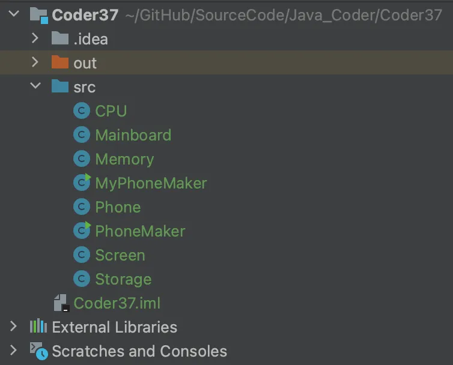
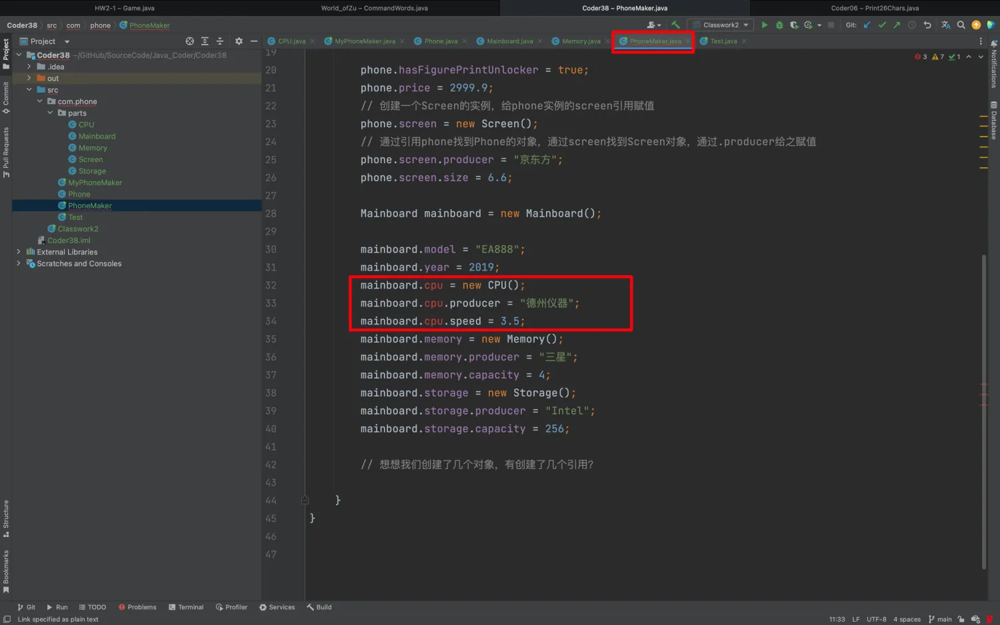
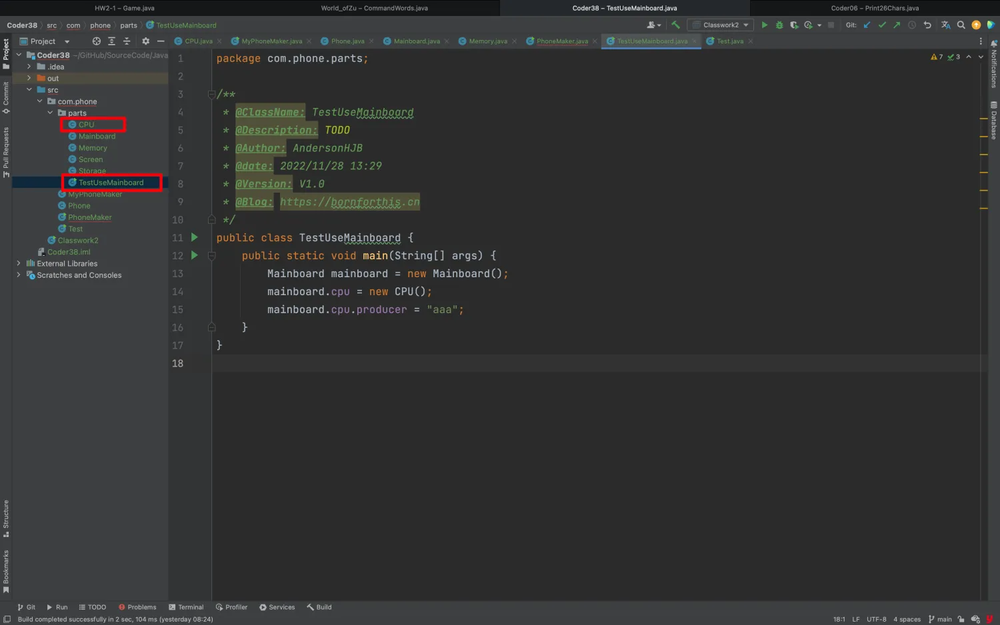
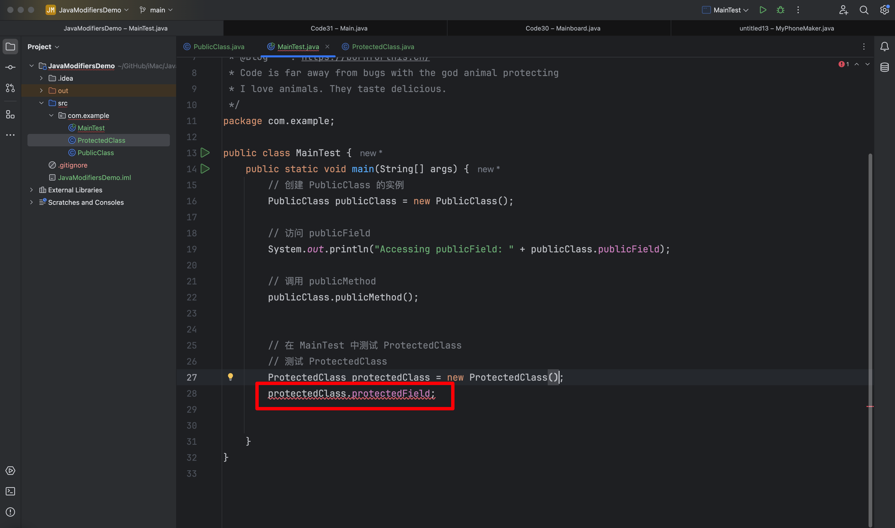

## 0. 目录

- 类多太混乱？用 package 管理
- 类使用太繁琐怎么办？用 import
- 属性访问修饰符：public
- 类的全限定名


## 1. 类多太混乱？用 package 管理

- 为了避免类在一起混乱，可以把类放在文件夹里。这时就需要用 package 语句告诉 Java 这个类在哪个 package 里。 package 语句要和源文件的目录完全对应，大小写要一致。
- package 读作包。一般来说，类都会在包里，而不会直接放在根目录；
- 不同的包里可以有相同名字的类；
- 一个类只能有一个 package 语句，如果有 package 语句，**则必须是类的第一行有效代码**；

上一节课，我们创建了很多类，放在了 src 的目录下，咋眼一看有可能会比较乱，接下来我们看看怎么组织。



代码应该也是有层级关系的，比如：Phone 的 CPU & Storage 等这些零件，其实不应该和 phone 是平级的，应该是有个层级关系的。

那 Java 中怎么做到这一点呢？


## 2. **类使用太繁琐怎么办？用 import**

### 2.1 知识点

- 当使用另一个包里类的时候，需要带上包名；
- 每次使用都带包名很繁琐，可以在使用的类的上面使用 import 语句，一次性解决问题，就可以直接使用类了。就好像我们之前用过的 Scanner 类；
- import 语句可以有多个；
- 如果需要 import 一个包中的很多类，可以使用 `*` 通配符；

如果没有 import 时，我们使用 Scanner 类需要如下实现：

::: code-tabs

@tab 正常使用

```java
import java.util.Scanner;

public class Main {
    public static void main(String[] args) {
        Scanner scanner = new Scanner(System.in);
    }
}
```

@tab 不使用 import 时

```java
public class Main {
    public static void main(String[] args) {
        java.util.Scanner scanner = new java.util.Scanner(System.in);
    }
}
```

:::

### 2.2 创建具体项目

::: code-tabs

@tab Tree

```bash
(base) ➜  Code30 tree .
.
├── Code30.iml
└── src
    └── com
        └── phone
            ├── MyPhone.java
            ├── Phone.java
            ├── PhoneMaker.java
            └── parts
                ├── CPU.java
                ├── Mainboard.java
                ├── Memory.java
                ├── Screen.java
                └── Storage.java

5 directories, 9 files
```

@tab CPU

```java
/*
 * @Time    : 2024/12/13 10:41
 * @Author  : AI悦创
 * @FileName: CPU.java
 * @Software: IntelliJ IDEA
 * @Version: V1.0
 * @Blog    : https://bornforthis.cn/
 * Code is far away from bugs with the god animal protecting
 * I love animals. They taste delicious.
 */
package com.phone.parts;

public class CPU {
    public double speed;
    public String producer;
}
```

@tab Mainboard

```java
/*
 * @Time    : 2024/12/13 10:42
 * @Author  : AI悦创
 * @FileName: Mainboard.java
 * @Software: IntelliJ IDEA
 * @Version: V1.0
 * @Blog    : https://bornforthis.cn/
 * Code is far away from bugs with the god animal protecting
 * I love animals. They taste delicious.
 */
package com.phone.parts;

public class Mainboard {
    public CPU cpu;
    public Memory memory;
    public Storage storage;
    public String model;
    // 上市年份
    public int year;
}
```

@tab Memory

```java
/*
 * @Time    : 2024/12/13 10:45
 * @Author  : AI悦创
 * @FileName: Memory.java
 * @Software: IntelliJ IDEA
 * @Version: V1.0
 * @Blog    : https://bornforthis.cn/
 * Code is far away from bugs with the god animal protecting
 * I love animals. They taste delicious.
 */
package com.phone.parts;

public class Memory {
    public long capacity;
    public String producer;
}
```

@tab Screen

```java
/*
 * @Time    : 2024/12/13 10:47
 * @Author  : AI悦创
 * @FileName: Screen.java
 * @Software: IntelliJ IDEA
 * @Version: V1.0
 * @Blog    : https://bornforthis.cn/
 * Code is far away from bugs with the god animal protecting
 * I love animals. They taste delicious.
 */
package com.phone.parts;

public class Screen {
    public double size;
    public String producer;
}
```

@tab Storage

```java
/*
 * @Time    : 2024/12/13 10:49
 * @Author  : AI悦创
 * @FileName: Storage.java
 * @Software: IntelliJ IDEA
 * @Version: V1.0
 * @Blog    : https://bornforthis.cn/
 * Code is far away from bugs with the god animal protecting
 * I love animals. They taste delicious.
 */
package com.phone.parts;

public class Storage {
    public long capacity;
    public String producer;
}
```

@tab MyPhone

```java
/*
 * @Time    : 2024/12/13 10:34
 * @Author  : AI悦创
 * @FileName: MyPhone.java
 * @Software: IntelliJ IDEA
 * @Version: V1.0
 * @Blog    : https://bornforthis.cn/
 * Code is far away from bugs with the god animal protecting
 * I love animals. They taste delicious.
 */
package com.phone;
import com.phone.parts.*;

public class MyPhone {
    Memory memory;
    Storage storage;
}
```

@tab Phone

```java
/*
 * @Time    : 2024/12/13 10:35
 * @Author  : AI悦创
 * @FileName: Phone.java
 * @Software: IntelliJ IDEA
 * @Version: V1.0
 * @Blog    : https://bornforthis.cn/
 * Code is far away from bugs with the god animal protecting
 * I love animals. They taste delicious.
 */
package com.phone;

//用到什么导入什么
import com.phone.parts.Mainboard;
import com.phone.parts.Screen;

public class Phone {
    Screen screen;
    Mainboard mainboard;
    double price;
    boolean hasFigurePrintUnlocker;
}
```

@tab PhoneMaker

```java
/*
 * @Time    : 2024/12/13 10:37
 * @Author  : AI悦创
 * @FileName: PhoneMaker.java
 * @Software: IntelliJ IDEA
 * @Version: V1.0
 * @Blog    : https://bornforthis.cn/
 * Code is far away from bugs with the god animal protecting
 * I love animals. They taste delicious.
 */
package com.phone;
//import com.phone.parts.CPU;
//import com.phone.parts.Memory;
//import com.phone.parts.Screen;
//import com.phone.parts.Mainboard;
//import com.phone.parts.Storage;
import com.phone.parts.*;

public class PhoneMaker {
    public static void main(String[] args) {
        // 创建一个 Phone 的实例
        Phone phone = new Phone();

        // 可以设置断点查看实例内部状态

        phone.hasFigurePrintUnlocker = true;
        phone.price = 2999.9;
        // 创建一个 Screen 的实例，给 phone 实例的 screen 引用赋值
        phone.screen = new Screen();
        // 通过引用 phone 找到 Phone 的对象，通过 screen 找到 Screen 对象，通过 .producer 给之赋值
        phone.screen.producer = "京东方";
        phone.screen.size = 6.6;

        Mainboard mainboard = new Mainboard();

        mainboard.model = "EA888";
        mainboard.year = 2019;
        mainboard.cpu = new CPU();
        mainboard.cpu.producer = "德州仪器";
        mainboard.cpu.speed = 3.5;
        mainboard.memory = new Memory();
        mainboard.memory.producer = "三星";
        mainboard.memory.capacity = 4;
        mainboard.storage = new Storage();
        mainboard.storage.producer = "Intel";
        mainboard.storage.capacity = 256;

        // 想想我们创建了几个对象，有创建了几个引用？

    }
}
```

:::

### 2.3 注意点

**Java 只能直接看到同级别的类，其他级别是看不到的。**

下面这么写就会报错：

::: code-tabs

@tab Tree

```bash {10}
(base) ➜  Code30 tree .
.
├── Code30.iml
└── src
    └── com
        └── phone
            ├── MyPhone.java
            ├── Phone.java
            ├── PhoneMaker.java
            ├── Test.java
            └── parts
                ├── CPU.java
                ├── Mainboard.java
                ├── Memory.java
                ├── Screen.java
                └── Storage.java

5 directories, 10 files
```

@tab Test

```java
/*
 * @Time    : 2024/12/13 11:10
 * @Author  : AI悦创
 * @FileName: Test.java
 * @Software: IntelliJ IDEA
 * @Version: V1.0
 * @Blog    : https://bornforthis.cn/
 * Code is far away from bugs with the god animal protecting
 * I love animals. They taste delicious.
 */
package com.phone;

public class Test {
    public static void main(String[] args) {
        Memory memory;
    }
}
```

@tab 报错

```java
/Users/huangjiabao/IdeaProjects/Code30/src/com/phone/Test.java:15:9
java: 找不到符号
  符号:   类 Memory
  位置: 类 com.phone.Test
```

:::

**解决方法：**

::: code-tabs

@tab 方法一

```java {5}
package com.phone;

public class Test {
    public static void main(String[] args) {
        com.phone.parts.Memory memory;
    }
}
```

@tab 方法二

```java {3,7}
package com.phone;

import com.phone.parts.Memory;

public class Test {
    public static void main(String[] args) {
        Memory memory;
    }
}
```

:::

对于方法一每次写 `com.phone.parts.Memory memory` 这么长显然有点累，所以可以使用 import。

## 3. 属性访问修饰符

Java 语言提供了很多修饰符，主要分为以下两类：

- 访问修饰符
- 非访问修饰符

修饰符用来定义类、方法或者变量，通常放在语句的最前端。我们通过下面的例子来说明：

```java
public class ClassName {
   // ...
}
private boolean myFlag;
static final double weeks = 9.5;
protected static final int BOXWIDTH = 42;
public static void main(String[] arguments) {
   // 方法体
}
```


### 3.1 public

- 被 public 修饰的属性，可以被任意包中的类访问。「可以被任何地方访问，不受包或类的限制。」「对所有类可见。使用对象：类、接口、变量、方法」
- 没有访问修饰符的属性，称作缺省的访问修饰符，可以被本包内的其他类和自己的对象
- 访问修饰符是一种限制或者允许属性访问的修饰符

到这里的时候，你会发现我提供的代码里面多了 public 或者你自己操作少了 public。这个时候我们可以发现 CPU 等类代码没有问题，但是其他位置的代码出现了问题。

我直接操作上面提供的类：删除 Mainboard.java 中 CPU 前面的 public，这个文件自己本身没有问题。

```java
package com.phone.parts;

public class Mainboard {
    CPU cpu;
    public Memory memory;
    public Storage storage;
    public String model;
    // 上市年份
    public int year;
}
```


别的文件则出现了问题，原因也很简单，这两个类不在同一个包内。

- Mainboard：`package com.phone.parts;`
- PhoneMaker：`package com.phone;`



但是没有 public 的 CPU 可以被自己包内正常调用：

::: code-tabs

@tab Tree

```bash {17}
(base) ➜  Code30 tree .
.
├── Code30.iml
└── src
    └── com
        └── phone
            ├── MyPhone.java
            ├── Phone.java
            ├── PhoneMaker.java
            ├── Test.java
            └── parts
                ├── CPU.java
                ├── Mainboard.java
                ├── Memory.java
                ├── Screen.java
                ├── Storage.java
                └── TestUseMainboard.java

5 directories, 11 files
```

@tab TestUseMainboard

```java
/*
 * @Time    : 2024/12/13 11:37
 * @Author  : AI悦创
 * @FileName: TestUseMainboard.java
 * @Software: IntelliJ IDEA
 * @Version: V1.0
 * @Blog    : https://bornforthis.cn/
 * Code is far away from bugs with the god animal protecting
 * I love animals. They taste delicious.
 */
package com.phone.parts;

public class TestUseMainboard {
    public static void main(String[] args) {
        Mainboard mainboard = new Mainboard();
        mainboard.cpu = new CPU();
        mainboard.cpu.producer = "aaa";
    }
}

```

:::



::: tip

当然，添加 public 修饰符后，其他包也可以访问。

:::

### 3.2 protected

::: info 定义

在同一类内可见，使用对象：变量、方法。**注意：不能修饰类（外部类）**「可以被同一个包内的类以及其他包中的子类访问。」

:::


### 3.3 default 「无修饰符（默认）」

::: info 定义

如果未指定修饰符，则默认为包级访问权限，只能被同一个包内的类访问。「即默认，什么也不写: 在同一包内可见，不使用任何修饰符。使用对象：类、接口、变量、方法。」

:::


### 3.4 private

::: info 定义

在同一类内可见。使用对象：变量、方法。 **注意：不能修饰类（外部类）**「只能在当前类内访问。」

:::


### 3.5 总结表格

| 修饰符          | 当前类 | 同包类 | 子类（跨包） | 其它包 |
| --------------- | ------ | ------ | ------------ | ------ |
| public          | √      | √      | √            | √      |
| protected       | √      | √      | √            | x      |
| 默认「default」 | √      | √      | x            | x      |
| private         | √      | x      | x            | x      |

通过以上代码和表格，可以直观了解 Java 中访问修饰符的作用及限制。


### 3.6 代码示例

1. 项目名称：JavaModifiersDemo

2. 源码：[https://github.com/AndersonHJB/BornforthisData/tree/main/column/Java/chapter02/30/JavaModifiersDemo](https://github.com/AndersonHJB/BornforthisData/tree/main/column/Java/chapter02/30/JavaModifiersDemo)

3. 在里面创建以下结构：

    ```java
    (base) ➜  JavaModifiersDemo git:(main) ✗ tree .
    .
    ├── JavaModifiersDemo.iml
    └── src
        └── com
            └── example
                └── PublicClass.java
    
    4 directories, 2 files
    ```

4. 开始写第一个类 `PublicClass`。

:::: tabs 

@tab 1. PublicClass

```java
/*
 * @Time    : 2024/12/15 18:44
 * @Author  : AI悦创
 * @FileName: PublicClass.java
 * @Software: IntelliJ IDEA
 * @Version: V1.0
 * @Blog    : https://bornforthis.cn/
 * Code is far away from bugs with the god animal protecting
 * I love animals. They taste delicious.
 */
package com.example;

// 这是一个公共类，任何地方都可以访问
public class PublicClass {
    // 公共字段
    public String publicField = "I am public!";

    // 公共方法
    public void publicMethod() {
        System.out.println("This is a public method.");
    }
}
```

**讲解：**

1. **`package com.example;`**:
    - 声明类所属的包，这是为了组织代码，类似于文件夹结构。
    - 代码文件 `PublicClass.java` 位于 `src/com/example` 文件夹中。
2. **`public class PublicClass`**:
    - 类的修饰符是 `public`，意味着任何包的类都可以访问它。
3. **字段和方法**:
    - **`publicField`** 是一个公共字段，外部类可以直接访问。
    - **`publicMethod()`** 是一个公共方法，外部类也可以调用它。

**下一步：** 编译并运行 `PublicClass`，验证它的功能。

@tab 2. MainTest

编写一个测试类来验证 PublicClass 的访问。

**步骤**

- 在 `com.example` 包中，创建一个新的类 `MainTest.java`，测试 `PublicClass` 的功能。

- Tree

    ```bash
    (base) ➜  JavaModifiersDemo git:(main) ✗ tree .
    .
    ├── JavaModifiersDemo.iml
    └── src
        └── com
            └── example
                ├── MainTest.java
                └── PublicClass.java
    
    4 directories, 3 files
    ```

- MainTest.java

    ```java
    /*
     * @Time    : 2024/12/15 18:51
     * @Author  : AI悦创
     * @FileName: MainTest.java
     * @Software: IntelliJ IDEA
     * @Version: V1.0
     * @Blog    : https://bornforthis.cn/
     * Code is far away from bugs with the god animal protecting
     * I love animals. They taste delicious.
     */
    package com.example;
    
    public class MainTest {
        public static void main(String[] args) {
            // 创建 PublicClass 的实例
            PublicClass publicClass = new PublicClass();
    
            // 访问 publicField
            System.out.println("Accessing publicField: " + publicClass.publicField);
    
            // 调用 publicMethod
            publicClass.publicMethod();
        }
    }
    ```

**讲解**

1. **实例化 `PublicClass`**:
    - 使用 `new PublicClass()` 创建了一个对象，表示我们在内存中分配了这个类的空间。
2. **访问字段和方法**:
    - **`publicField`**：直接访问公共字段，输出 "I am public!"。
    - **`publicMethod()`**：调用公共方法，输出 "This is a public method."。

**输出结果：**

```java
Accessing publicField: I am public!
This is a public method.
```

@tab 3. 添加受保护的类成员

**步骤**

- 在 `PublicClass` 的同一个包中添加一个新的类 `ProtectedClass`。

- Tree：

    ```bash
    (base) ➜  JavaModifiersDemo git:(main) ✗ tree .
    .
    ├── JavaModifiersDemo.iml
    └── src
        └── com
            └── example
                ├── MainTest.java
                ├── ProtectedClass.java
                └── PublicClass.java
    
    4 directories, 4 files
    ```

- ProtectedClass.java

    ```java
    /*
     * @Time    : 2024/12/15 18:58
     * @Author  : AI悦创
     * @FileName: ProtectedClass.java
     * @Software: IntelliJ IDEA
     * @Version: V1.0
     * @Blog    : https://bornforthis.cn/
     * Code is far away from bugs with the god animal protecting
     * I love animals. They taste delicious.
     */
    package com.example;
    
    // 这是一个受保护的类，只能在同一个包中或子类中访问
    public class ProtectedClass {
        // 受保护字段
        protected String protectedField = "I am protected!";
    
        // 受保护方法
        protected void protectedMethod() {
            System.out.println("This is a protected method.");
        }
    }
    ```

**讲解**

1. `protected` 修饰符:
    - 字段和方法标记为 `protected`，意味着只能：
        - 在 **同一个包** 中访问。「在 **同一个包** 中，`protected` 修饰的字段和方法可以直接访问。」
        - 或者被 **子类继承** 并访问。

**测试代码**

在 `MainTest` 中添加以下代码来验证：

::: details 为什么 `protectedClass.protectedField;` 不行🙅

#### 1. 问题代码

```java {28}
/*
 * @Time    : 2024/12/15 18:51
 * @Author  : AI悦创
 * @FileName: MainTest.java
 * @Software: IntelliJ IDEA
 * @Version: V1.0
 * @Blog    : https://bornforthis.cn/
 * Code is far away from bugs with the god animal protecting
 * I love animals. They taste delicious.
 */
package com.example;

public class MainTest {
    public static void main(String[] args) {
        // 创建 PublicClass 的实例
        PublicClass publicClass = new PublicClass();

        // 访问 publicField
        System.out.println("Accessing publicField: " + publicClass.publicField);

        // 调用 publicMethod
        publicClass.publicMethod();


        // 在 MainTest 中测试 ProtectedClass
        // 测试 ProtectedClass
        ProtectedClass protectedClass = new ProtectedClass();
        protectedClass.protectedField;


    }
}
```



#### 2. 具体讲解

1. `protectedClass.protectedField;` 为什么不行？

    在 Java 中，写一行代码像：

    ```java
    protectedClass.protectedField;
    ```

    这样的语法**不完整**，因为在 Java 中，**单独访问变量**必须有一个实际操作，比如：

    - 赋值

        ```java
        protectedClass.protectedField = "New Value";
        ```

    - 输出

        ```java
        System.out.println(protectedClass.protectedField);
        ```

2. `System.out.println` 语法为什么可以？

    在这一行代码中：

    ```java
    System.out.println("Accessing protectedField: " + protectedClass.protectedField);
    ```

    `protectedClass.protectedField` 是表达式的一部分，它的值会被计算，然后传递给 `System.out.println` 方法。

    - **打印操作**：Java 知道这里需要获取 `protectedField` 的值，并将其打印出来。
    - **正确的语法**：在这种情况下，编译器认为代码是合法的，因为有一个上下文（方法调用）来**消费** `protectedClass.protectedField` 的值。

3. 总结：为什么这样不行？

    ```java
    protectedClass.protectedField;
    ```

    - 这段代码**没有操作**变量，只是单独访问字段的值，但却不做任何事情。
    - 在 Java 中，这样的代码会导致编译错误，因为它没有实际意义。

4. 正确的写法示例

    如果你想要正确访问 `protectedField`，必须对它做某种操作，例如：

    - 打印出来

        ```java
        System.out.println(protectedClass.protectedField);
        ```

    - 赋值操作

        ```java
        protectedClass.protectedField = "New Value";
        System.out.println(protectedClass.protectedField);
        ```

    - 用于表达式

        ```java
        String message = "The field value is: " + protectedClass.protectedField;
        System.out.println(message);
        ```

#### 3. Java 语法规则总结

在 Java 中，单独访问字段或变量时，必须有一个**明确的操作**（比如赋值、打印或参与表达式计算），否则会导致编译错误。

```java
protectedClass.protectedField; // 错误，语法不完整
System.out.println(protectedClass.protectedField); // 正确，访问字段值并打印
protectedClass.protectedField = "Test"; // 正确，赋值操作
```

#### 4. 类比说明

- **不完整的语法（错误）**：

    ```java
    int x;   // 变量声明
    x;       // 错误，单独访问变量
    ```

- **正确的语法**：

    ```java
    int x = 10;  
    System.out.println(x);  // 输出变量值
    x = 20;                // 给变量赋值
    ```

    

:::

```java {25-31}
/*
 * @Time    : 2024/12/15 18:51
 * @Author  : AI悦创
 * @FileName: MainTest.java
 * @Software: IntelliJ IDEA
 * @Version: V1.0
 * @Blog    : https://bornforthis.cn/
 * Code is far away from bugs with the god animal protecting
 * I love animals. They taste delicious.
 */
package com.example;

public class MainTest {
    public static void main(String[] args) {
        // 创建 PublicClass 的实例
        PublicClass publicClass = new PublicClass();

        // 访问 publicField
        System.out.println("Accessing publicField: " + publicClass.publicField);

        // 调用 publicMethod
        publicClass.publicMethod();


        // 在 MainTest 中测试 ProtectedClass
        // 测试 ProtectedClass
        ProtectedClass protectedClass = new ProtectedClass();

        // 在同一个包内，访问受保护字段和方法
        System.out.println("Accessing protectedField: " + protectedClass.protectedField);
        protectedClass.protectedMethod();


    }
}
```

输出：

```java {3-4}
Accessing publicField: I am public!
This is a public method.
Accessing protectedField: I am protected!
This is a protected method.
```

- 同包测试验证：`protectedField` 和 `protectedMethod()` 都可以在同一个包的 `MainTest` 类中访问。
- 在 **同一个包** 中，`protected` 成员行为与默认访问权限类似，都可以被直接访问。
- 当 `protected` 成员需要被访问时，跨包的子类也可以通过继承进行访问。

@tab 4. protected 继承访问

下面演示**继承中如何访问父类的 `protected` 成员**，自行新建一个 Project。

我们将创建以下结构：

1. **父类（SuperClass）**：包含一个 `protected` 字段和一个 `protected` 方法。

2. **子类（SubClass）**：继承父类，并访问父类的 `protected` 成员。

3. **测试类（MainTest）**：用来验证子类是否可以访问父类的 `protected` 成员。

    ```bash
    (base) ➜  Coder32 git:(main) ✗ tree .
    .
    ├── Coder32.iml
    └── src
        └── com
            └── example
                ├── MainTest.java
                ├── SuperClass.java
                └── subpackage
                    └── SubClass.java
    
    5 directories, 4 files
    ```

    

#### 1. 创建父类（SuperClass.java）

在 `com.example` 包下创建一个父类 `SuperClass`。

```java
package com.example;

// 父类，包含 protected 成员
public class SuperClass {
    // protected 字段
    protected String protectedField = "I am a protected field in SuperClass";

    // protected 方法
    protected void protectedMethod() {
        System.out.println("This is a protected method in SuperClass.");
    }
}
```

**讲解：**

- `protectedField` 和 `protectedMethod()` 被 `protected` 修饰。

- **访问规则**：`protected` 成员可以在**同一个包**或者**子类**中访问，即使子类在不同包中也能通过继承访问。

#### 2. 创建子类（SubClass.java）

在 `com.example.subpackage` 包下创建一个子类 `SubClass`，继承 `SuperClass`。

```java
package com.example.subpackage;

import com.example.SuperClass;

// SubClass 继承 SuperClass
public class SubClass extends SuperClass {
    public void accessProtectedMembers() {
        // 访问父类的 protected 字段
        System.out.println("Accessing protectedField: " + protectedField);

        // 调用父类的 protected 方法
        protectedMethod();
    }
}
```

**讲解**

1. **继承**：
    - `SubClass` 使用 `extends` 关键字继承了 `SuperClass`。
    - `SubClass` 可以直接访问 `SuperClass` 中的 `protected` 字段和方法。
2. **`protected` 的访问权限**：
    - 即使 `SubClass` 位于 `com.example.subpackage`（不同包），它仍然可以通过继承访问 `SuperClass` 的 `protected` 成员。

#### 3. 测试类（MainTest.java）

在 `com.example` 包下创建一个测试类 `MainTest`，用来验证继承后的访问。

```java
package com.example;

import com.example.subpackage.SubClass;

public class MainTest {
    public static void main(String[] args) {
        // 创建 SubClass 对象
        SubClass subClass = new SubClass();

        // 访问 protected 成员
        subClass.accessProtectedMembers();
    }
}
```

**讲解**

1. **对象创建**：
    - `SubClass` 是 `SuperClass` 的子类，我们在 `MainTest` 中创建 `SubClass` 的对象。
2. **调用方法**：
    - `accessProtectedMembers()` 是子类中的方法，它访问了父类的 `protected` 字段和方法。
3. **继承与访问**：
    - 父类的 `protected` 成员在子类中可以直接使用，体现了继承的特性。

#### 4. 编译和运行

##### 4.1 编译代码

在终端中导航到 `src` 目录，执行：

```java
javac com/example/*.java com/example/subpackage/*.java
```

运行测试类：

```java
java com.example.MainTest
```

#### 4.2 输出结果

```java
Accessing protectedField: I am a protected field in SuperClass
This is a protected method in SuperClass.
```

#### 5. 总结

1. **父类 `SuperClass`**：
    - 定义了 `protectedField` 和 `protectedMethod()`。
2. **子类 `SubClass`**：
    - 继承父类，并直接访问父类的 `protected` 成员。
3. **访问规则**：
    - 子类可以访问父类的 `protected` 成员，即使它们位于不同的包中。
4. **测试类 `MainTest`**：
    - 验证了子类通过继承访问父类的 `protected` 成员。


@tab 5. 字段&方法

在 Java 中，**字段（Field）** 是类中用来存储数据的**变量**，也称为**成员变量**或**实例变量**。

#### 1. 字段的特点

1. **字段是类的一部分**：它们定义在类的主体内，但不在方法或构造函数中。
2. **作用**：
    - 用于保存对象的状态（属性值）。
    - 每个对象都有一份自己的字段副本（对于实例字段）。
3. **访问修饰符**：字段可以使用 `public`、`protected`、`default`（不写修饰符）和 `private` 修饰符来控制访问权限。


#### 2. 字段的类型

1. **实例字段**：属于对象，必须通过对象访问。每个对象都有独立的实例字段。

    ```java
    public class Person {
        public String name; // 实例字段
        public int age;     // 实例字段
    }
    
    Person p1 = new Person();
    p1.name = "Alice";
    ```

2. **静态字段（类字段）**：使用 `static` 关键字声明，属于类本身，而不是某个特定的对象。

    ```java
    public class Person {
        public static int totalPersons = 0; // 静态字段
    }
    
    System.out.println(Person.totalPersons);
    ```


#### 3. 示例代码

```java
public class Example {
    // 公共实例字段
    public String publicField = "Public Field";

    // 受保护实例字段
    protected String protectedField = "Protected Field";

    // 私有实例字段
    private String privateField = "Private Field";

    // 静态字段（类字段）
    public static String staticField = "Static Field";

    // 方法：演示如何访问字段
    public void showFields() {
        System.out.println("publicField: " + publicField);
        System.out.println("protectedField: " + protectedField);
        System.out.println("privateField: " + privateField);
        System.out.println("staticField: " + staticField);
    }
}
```


#### 4. 运行结果

```java
public class Main {
    public static void main(String[] args) {
        Example example = new Example();
        example.showFields();

        // 直接访问公共字段
        System.out.println("Accessing publicField directly: " + example.publicField);

        // 访问静态字段
        System.out.println("Accessing staticField: " + Example.staticField);
    }
}
```

**输出**：

```
publicField: Public Field
protectedField: Protected Field
privateField: Private Field
staticField: Static Field
Accessing publicField directly: Public Field
Accessing staticField: Static Field
```


#### 5. 总结

1. **字段（Field）** 就是类中的变量，用于存储对象或类的状态。
2. **实例字段**：属于对象，需要通过对象访问。
3. **静态字段**：属于类，可以通过类名访问。
4. 字段可以使用不同的访问修饰符（`public`、`protected`、`private`、`default`）来控制访问权限。

@tab 6. 创建子类来测试 `protected`

**步骤：**

- 在 `com/example/subpackage` 创建一个子类 `SubClass`。

```java
/*
 * @Time    : 2024/12/18 08:58
 * @Author  : AI悦创
 * @FileName: SubClass.java
 * @Software: IntelliJ IDEA
 * @Version: V1.0
 * @Blog    : https://bornforthis.cn/
 * Code is far away from bugs with the god animal protecting
 * I love animals. They taste delicious.
 */
package com.example.subpackage;

import com.example.ProtectedClass;

// SubClass 继承 ProtectedClass
public class SubClass extends ProtectedClass {
    public void testProtectedAccess() {
        // 访问受保护的成员
        System.out.println("Accessing protectedField: " + protectedField);
        protectedMethod();
    }
}
```

**讲解：**

1. 继承：
    - 子类 `SubClass` 继承了 `ProtectedClass`。
    - 受保护的成员可以在子类中直接访问。

**测试代码：**

在 `MainTest` 中添加以下代码：

```java {3,9-11}
package com.example;

import com.example.subpackage.SubClass;

public class MainTest {
    public static void main(String[] args) {
        // ---snip---

        // 在 MainTest 中测试 SubClass
        SubClass subClass = new SubClass();
        subClass.testProtectedAccess();
    }
}
```

**运行结果：**

```java {5-6}
Accessing publicField: I am public!
This is a public method.
Accessing protectedField: I am protected!
This is a protected method.
Accessing protectedField: I am protected!
This is a protected method.
```

@tab 7. 添加默认访问权限（包访问）

在 `com/example` 中创建 `DefaultClass.java`：

```java
package com.example;

// 没有修饰符的类，默认访问权限
class DefaultClass {
    String defaultField = "I am default!";

    void defaultMethod() {
        System.out.println("This is a default method.");
    }
}
```

**测试代码**

在 `MainTest` 中添加以下代码：

```java {9-12}
package com.example;

import com.example.subpackage.SubClass;

public class MainTest {
    public static void main(String[] args) {
        // ---snip---

        // 在 MainTest 中测试 DefaultClass
        DefaultClass defaultClass = new DefaultClass();
        System.out.println(defaultClass.defaultField);
        defaultClass.defaultMethod();
    }
}
```

**输出结果：**

```java {7-8}
Accessing publicField: I am public!
This is a public method.
Accessing protectedField: I am protected!
This is a protected method.
Accessing protectedField: I am protected!
This is a protected method.
I am default!
This is a default method.
```

注意：`DefaultClass` 只能在 **同一个包中** 访问。如果尝试在其他包中访问，将会报错。

@tab 8. 添加私有成员

在 `PrivateExample.java` 中添加：

```java
package com.example;

public class PrivateExample {
    private String privateField = "I am private!";

    private void privateMethod() {
        System.out.println("This is a private method.");
    }

    public void accessPrivate() {
        System.out.println("Accessing privateField: " + privateField);
        privateMethod();
    }
}
```

**讲解**

1. **`private` 修饰符**:
    - 私有字段和方法只能在类内部访问。
    - 外部类无法直接访问 `privateField` 或 `privateMethod`。
2. **间接访问**:
    - 提供一个公共方法 `accessPrivate()` 来间接访问私有成员。

**测试代码**

在 `MainTest` 中添加以下代码：

```java
// 在 MainTest 中测试 PrivateExample
PrivateExample privateExample = new PrivateExample();
// System.out.println(privateExample.privateField);  // 会报错：java: privateField 在 com.example.PrivateExample 中是 private 访问控制
privateExample.accessPrivate();
```

运行后输出：

```java
Accessing privateField: I am private!
This is a private method.
```

@tab 9. 总结

我们通过逐步编写代码和测试，演示了：

- `public` 的全局访问。
- `protected` 的包内和子类访问。
- 默认访问权限的包内限制。
- `private` 的类内部限制。

::::

## 4. 类的全限定名「了解即可」

- `包名 + 类名 = 类的全限定名`。也可以简称为类的全名
- 同一个 Java 程序中全限定名字不可重复

```java
package com.bornforthis.test;

public class HelloWorld {

}
```

对于该类来说：全限定类名就是`包名.类名`,即 `com.bornforthis.test.HelloWorld;`非限定类名就是类名,即 `HelloWorld`。

PS：后期补充 Java 包命名规范等。


欢迎关注我公众号：AI悦创，有更多更好玩的等你发现！

::: details 公众号：AI悦创【二维码】


:::

::: info AI悦创·编程一对一

AI悦创·推出辅导班啦，包括「Python 语言辅导班、C++ 辅导班、java 辅导班、算法/数据结构辅导班、少儿编程、pygame 游戏开发」，全部都是一对一教学：一对一辅导 + 一对一答疑 + 布置作业 + 项目实践等。当然，还有线下线上摄影课程、Photoshop、Premiere 一对一教学、QQ、微信在线，随时响应！微信：Jiabcdefh

C++ 信息奥赛题解，长期更新！长期招收一对一中小学信息奥赛集训，莆田、厦门地区有机会线下上门，其他地区线上。微信：Jiabcdefh

方法一：[QQ](http://wpa.qq.com/msgrd?v=3&uin=1432803776&site=qq&menu=yes)

方法二：微信：Jiabcdefh

:::


