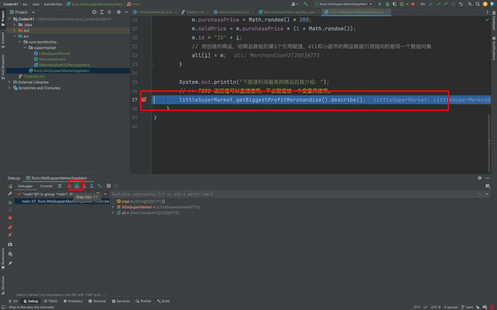
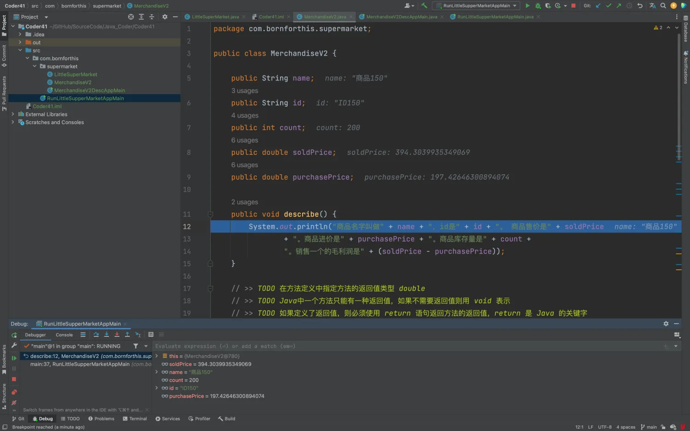
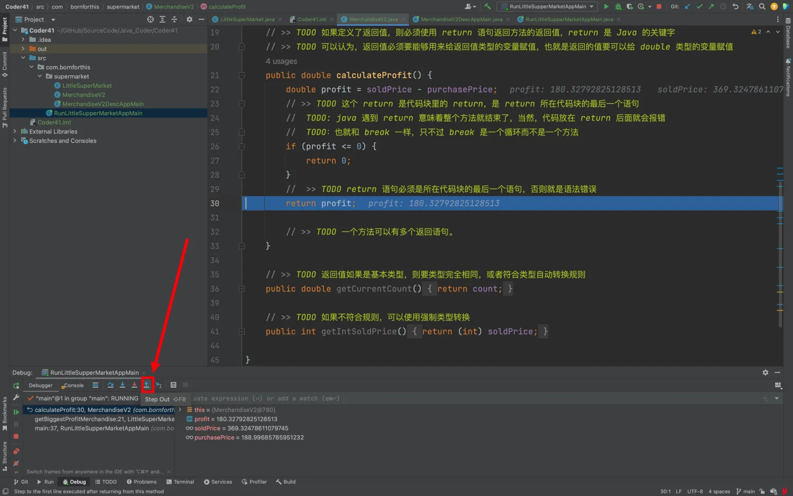

## 0. 让商品自己计算利润

- 看例程： 让商品自己计算利润的方法 
- 看例程：让超市找出利润最高的商品的方法 
- 看例程：商品的其它方法 
- 方法调用调试之 Step Into：进入被调用的方法内部继续调试

## 1. 看例程： 让商品自己计算利润的方法

既然，我们要计算利润，那就不能是直接编写方法输出在控制台就结束，而应该是计算完成后，返回这个计算值。这就是我们所说的返回值。

::: code-tabs

@tab MerchandiseV2

```java
package com.bornforthis.supermarket;

public class MerchandiseV2 {

    public String name;
    public String id;
    public int count;
    public double soldPrice;
    public double purchasePrice;

    public void describe() {
        System.out.println("商品名字叫做" + name + "，id是" + id + "。 商品售价是" + soldPrice
                + "。商品进价是" + purchasePrice + "。商品库存量是" + count +
                "。销售一个的毛利润是" + (soldPrice - purchasePrice));
    }

    // >> TODO 在方法定义中指定方法的返回值类型 double
    // >> TODO Java中一个方法只能有一种返回值，如果不需要返回值则用 void 表示
    // >> TODO 如果定义了返回值，则必须使用 return 语句返回方法的返回值，return 是 Java 的关键字
    // >> TODO 可以认为，返回值必须要能够用来给返回值类型的变量赋值，也就是返回的值要可以给 double 类型的变量赋值
    // >> TODO 举个例子：下面👇代码返回的 return profit、return 0 必须要能够给返回值类型变量赋值（public double calculateProfit()）中 double 就是返回值类型。那么返回 0 可以吗？——可以！返回 profit 是 double 类型——可以！
    public double calculateProfit() {
        double profit = soldPrice - purchasePrice;
        // >> TODO 这个 return 是代码块里的 return，是 return 所在代码块的最后一个语句
        if (profit <= 0) {
            return 0;
        }
        //  >> TODO return 语句必须是所在代码块的最后一个语句，否则就是语法错误
        return profit;

        // >> TODO 一个方法可以有多个返回语句。
    }

    // >> TODO 返回值如果是基本类型，则要类型完全相同，或者符合类型自动转换规则
    public double getCurrentCount() {
        return count;  // int 可以自动转换、返回给 double
    }

    // >> TODO 如果不符合规则，可以使用强制类型转换
    public int getIntSoldPrice() {
        return (int) soldPrice;  // double 不能直接给 int，所以需要强制转换。只要转换之后可以给 int 就行，不管是怎么来的。
    }
}
```

@tab MerchandiseV2DescAppMain

```java
package com.bornforthis.supermarket;

public class MerchandiseV2DescAppMain {
    public static void main(String[] args) {
        MerchandiseV2 merchandise = new MerchandiseV2();

        merchandise.name = "书桌";
        merchandise.soldPrice = 999.9;
        merchandise.purchasePrice = 500;
        merchandise.count = 40;
        merchandise.id = "DESK9527";

        merchandise.describe();
    }
}
```

:::

- 代码不能放在 return 后面，因为 return 后面，不能放任何其它代码的；

    ```java
    // 下面成立
    int a = 1;
    return 0;
    ```

    ```java
    // 下面不成立：Unreachable statement
    return 0;
    int a = 1;
    ```

- return 执行到时，整个方法就结束了；

    - 就类似 break 的一样，不过 return 的是方法而不是循环；
    - 适当的利用 return 有时会有意想不到的效果，比如：提前结束方法；

## 2. 看例程：让超市找出利润最高的商品的方法 

::: code-tabs

@tab LittleSuperMarket

```java
package com.bornforthis.supermarket;

public class LittleSuperMarket {
    public String superMarketName;
    public String address;
    public int parkingCount;
    public double incomingSum;
    public MerchandiseV2[] merchandises;
    public int[] merchandiseSold;

    // >> 返回值类型可以是类名，这时候实际返回的值就是这个类的引用
    public MerchandiseV2 getBiggestProfitMerchandise() {
        MerchandiseV2 curr = null;
        for (int i = 0; i < merchandises.length; i++) {
            MerchandiseV2 m = merchandises[i];
            if (curr == null) {
                curr = m;
                continue;
            }
            // >> 调用商品中定义的方法，不同的实例调用相同的方法，虽然代码相同，但是每个实例内部的数据不同，所以返回值也不同
            double currProfit = curr.calculateProfit();
            double newProfit = m.calculateProfit();
            if (currProfit < newProfit) {
                curr = m;
            }
        }
        return curr;
    }

    public MerchandiseV2 getBiggestProfitMerchindise2() {
        MerchandiseV2 curr = null;
        for (int i = 0; i < merchandises.length; i++) {
            MerchandiseV2 m = merchandises[i];
            if (curr == null) {
                curr = m;
            } else {
                if (curr.calculateProfit() < m.calculateProfit()) {
                    curr = m;
                }
            }
        }
        return curr;
    }
}
```

@tab 原本为改动「无需查看」

```java
package com.geekbang.supermarket;

public class LittleSuperMarket {
    public String superMarketName;
    public String address;
    public int parkingCount;
    public double incomingSum;
    public MerchandiseV2[] merchandises;
    public int[] merchandiseSold;

    // >> 返回值类型可以是类名，这时候实际返回的值就是这个类的引用
    public MerchandiseV2 getBiggestProfitMerchandise() {
        MerchandiseV2 curr = null;
        for (int i = 0; i < merchandises.length; i++) {
            MerchandiseV2 m = merchandises[i];
            if (curr == null) {
                curr = m;
                continue;
            }
            // >> 调用商品中定义的方法，不同的实例调用相同的方法，虽然代码相同，但是每个实例内部的数据不同，所以返回值也不同
            double currProfit = curr.calculateProfit();
            double newProfit = m.calculateProfit();
            if (currProfit < newProfit) {
                curr = m;
            }
        }
        return curr;
    }

    public MerchandiseV2 getBiggestProfitMerchindise2() {
        MerchandiseV2 curr = null;
        for (int i = 0; i < merchandises.length; i++) {
            MerchandiseV2 m = merchandises[i];
            if (curr == null) {
                curr = m;
            } else {
                if (curr.calculateProfit() < m.calculateProfit()) {
                    curr = m;
                }
            }
        }
        return curr;
    }
}
```

:::

## 3. 看例程：商品的其它方法 

```java {35-37}
package com.bornforthis;

import com.bornforthis.supermarket.LittleSuperMarket;
import com.bornforthis.supermarket.MerchandiseV2;

public class RunLittleSupperMarketAppMain {
    public static void main(String[] args) {
        // 创建一个小超市类
        LittleSuperMarket littleSuperMarket = new LittleSuperMarket();
        // 依次给超市的名字，地址，停车位赋值
        littleSuperMarket.superMarketName = "有家小超市";
        littleSuperMarket.address = "浦东新区世纪大道666号";
        littleSuperMarket.parkingCount = 100;
        // 给超市200种商品
        littleSuperMarket.merchandises = new MerchandiseV2[200];
        // 统计用的数组
        littleSuperMarket.merchandiseSold = new int[littleSuperMarket.merchandises.length];

        // 为了使用方便，创建一个商品数组引用，和littleSuperMarket.merchandises指向同一个数组对象
        MerchandiseV2[] all = littleSuperMarket.merchandises;

        // 遍历并给200种商品赋值
        for (int i = 0; i < all.length; i++) {
            // 创建并给商品的属性赋值
            MerchandiseV2 m = new MerchandiseV2();
            m.name = "商品" + i;
            m.count = 200;
            m.purchasePrice = Math.random() * 200;
            m.soldPrice = m.purchasePrice * (1 + Math.random());
            m.id = "ID" + i;
            // 用创建的商品，给商品数组的第i个引用赋值，all和小超市的商品数组引用指向的是同一个数组对象
            all[i] = m;
        }

        System.out.println("下面请利润最高的商品自我介绍：");
        // >> TODO 返回值可以直接使用，不必赋值给一个变量再使用。
        littleSuperMarket.getBiggestProfitMerchandise().describe();
    }
}
```

**思考🤔：**为什么 `littleSuperMarket.getBiggestProfitMerchandise().describe();` 可以连续调用？原因是什么？

因为：方法 `littleSuperMarket.getBiggestProfitMerchandise()` 的返回类型是 `MerchandiseV2` 所以是支持的。


## 4. 法调用调试之 Step Into：进入被调用的方法内部继续调试








欢迎关注我公众号：AI悦创，有更多更好玩的等你发现！

::: details 公众号：AI悦创【二维码】


:::

::: info AI悦创·编程一对一

AI悦创·推出辅导班啦，包括「Python 语言辅导班、C++ 辅导班、java 辅导班、算法/数据结构辅导班、少儿编程、pygame 游戏开发」，全部都是一对一教学：一对一辅导 + 一对一答疑 + 布置作业 + 项目实践等。当然，还有线下线上摄影课程、Photoshop、Premiere 一对一教学、QQ、微信在线，随时响应！微信：Jiabcdefh

C++ 信息奥赛题解，长期更新！长期招收一对一中小学信息奥赛集训，莆田、厦门地区有机会线下上门，其他地区线上。微信：Jiabcdefh

方法一：[QQ](http://wpa.qq.com/msgrd?v=3&uin=1432803776&site=qq&menu=yes)

方法二：微信：Jiabcdefh

:::


