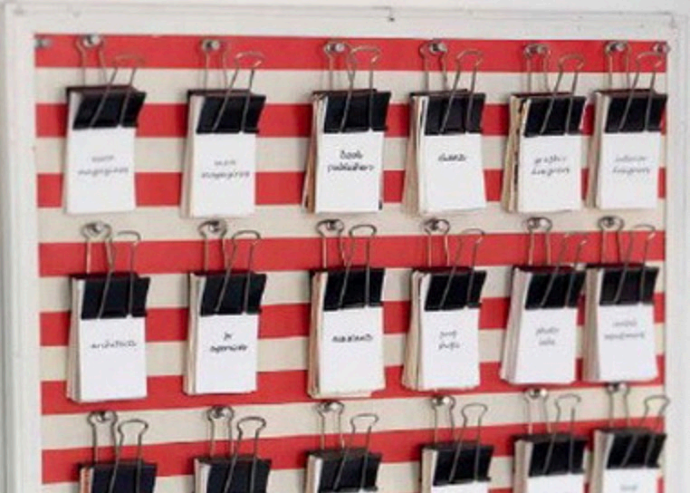

## 1. 分清参数、局部变量和实例的地盘



- 局部变量就是我们之前说的变量，是在方法体里创建的变量；
- 参数和局部变量都是演草纸，方法执行完就清除了；
- 对象是实体/实例，不是变量。对象创建出来后，被堆在一起，放在类似公告板的地方。方法里创建的对象是不会随着方法结束被清除的。所以对象的地盘不受限制，只要有引用指向一个对象，这个对象的数据就可以通过这个引用来访问；
- 看例程：理解局部变量，参数和实例；

## 2. 代码示例

学习输出自己的类别数据，谁调用就可以输出谁。

::: code-tabs

@tab RunLittleSupperMarketAppMainV2

```java {68-69}
/*
 * @Time    : 2025/1/9 20:45
 * @Author  : AI悦创
 * @FileName: RunLittleSupperMarketAppMainV2.java
 * @Software: IntelliJ IDEA
 * @Version: V1.0
 * @Blog    : https://bornforthis.cn/
 * Code is far away from bugs with the god animal protecting
 * I love animals. They taste delicious.
 */
package com.bornforthis;

import com.bornforthis.supermarket.LittleSuperMarket;
import com.bornforthis.supermarket.MerchandiseV2;

public class RunLittleSupperMarketAppMainV2 {
    public static void main(String[] args) {
        // 创建一个小超市类
        LittleSuperMarket littleSuperMarket = new LittleSuperMarket();
        // 依次给超市的名字，地址，停车位赋值
        littleSuperMarket.superMarketName = "有家小超市";
        littleSuperMarket.address = "浦东新区世纪大道666号";
        littleSuperMarket.parkingCount = 100;
        // 给超市200种商品
        littleSuperMarket.merchandises = new MerchandiseV2[3];
        // 统计用的数组
        littleSuperMarket.merchandiseSold = new int[littleSuperMarket.merchandises.length];

        // 为了使用方便，创建一个商品数组引用，和littleSuperMarket.merchandises指向同一个数组对象
        MerchandiseV2[] all = littleSuperMarket.merchandises;

        MerchandiseV2 giftNoodle = new MerchandiseV2();
        giftNoodle.name = "赠品-面条";
        giftNoodle.count = 2000;
        giftNoodle.purchasePrice = 5;
        giftNoodle.soldPrice = 0.05;
        giftNoodle.id = "GIFT001";

        MerchandiseV2 giftBowl = new MerchandiseV2();
        giftBowl.name = "赠品-碗";
        giftBowl.count = 2000;
        giftBowl.purchasePrice = 8;
        giftBowl.soldPrice = 0.08;
        giftBowl.id = "GIFT002";

        // 遍历并给200种商品赋值
        for (int i = 0; i < all.length; i++) {
            // 创建并给商品的属性赋值
            MerchandiseV2 m = new MerchandiseV2();
            m.name = "商品" + i;
            m.count = 200;
            m.purchasePrice = (i + 1) * 100;
            m.soldPrice = m.purchasePrice * (1 + Math.random());
            m.id = "ID" + i;
            m.gift = giftNoodle;
            // 用创建的商品，给商品数组的第i个引用赋值，all和小超市的商品数组引用指向的是同一个数组对象
            all[i] = m;
            m.describe();
        }

        int index = 0;

        MerchandiseV2 m = littleSuperMarket.merchandises[index];

        // >> TODO 方法的代码可以影响方法之外的数据。我们可以通过指向同一个对象的引用，操作这个对象里的属性
        MerchandiseV2 paramRef = littleSuperMarket.merchandises[2];

        m.gift = giftBowl;
        m.changeToTheSameGift(paramRef);
    }
}
```

@tab MerchandiseV2

```java {127-131}
/*
 * @Time    : 2025/1/9 20:46
 * @Author  : AI悦创
 * @FileName: MerchandiseV2.java
 * @Software: IntelliJ IDEA
 * @Version: V1.0
 * @Blog    : https://bornforthis.cn/
 * Code is far away from bugs with the god animal protecting
 * I love animals. They taste delicious.
 */
package com.bornforthis.supermarket;


public class MerchandiseV2 {

    public String name;
    public String id;
    public int count;
    public double soldPrice;
    public double purchasePrice;

    // describe方法变了一下
    public void describe() {
        System.out.println("商品名字叫做" + name + "，id是" + id + "。 商品售价是" + soldPrice
                + "。商品进价是" + purchasePrice + "。赠品是" + gift.name + "。价值" + gift.purchasePrice);
    }

    public double calculateProfit() {
        double profit = soldPrice - purchasePrice;
        if (profit <= 0) {
            return 0;
        }
        return profit;
    }

    // >> TODO 参数是定义在方法名字后面的括号里的
    // >> TODO 参数定义的规范和变量一样，都是类型名字加标识符，这里的标识符我们叫做参数名。
    // >> TODO 方法体中的代码可以使用参数
    // >> TODO 参数的值在调用方法的时候需要给出，有的资料叫做实参（实际参数）
    // >> TODO 对应的，方法定义这里的参数，叫做形参（形式参数）
    public double buy(int countToBuy) {
        if (count < countToBuy) {
            System.out.println("商品库存不够");
            return -1;
        }

        System.out.println("商品单价为" + purchasePrice);

        int fullPriceCount = countToBuy / 2 + countToBuy % 2;
        int halfPriceCount = countToBuy - fullPriceCount;
        double totalCost = purchasePrice * fullPriceCount + halfPriceCount * purchasePrice / 2;

        count -= countToBuy;

        return totalCost;
    }

    // >> TODO 一个方法可以有多个参数，多个参数之间用逗号隔开
    public double buyAndPrintLeft(int countToBuy, boolean printLeft) {
        if (count < countToBuy) {
            System.out.println("商品库存不够");
            if (printLeft) {
                System.out.println("商品剩余库存为" + count);
            }
            return -1;
        }

        System.out.println("商品单价为" + purchasePrice);

        int fullPriceCount = countToBuy / 2 + countToBuy % 2;
        int halfPriceCount = countToBuy - fullPriceCount;
        double totalCost = purchasePrice * fullPriceCount + halfPriceCount * purchasePrice / 2;

        count -= countToBuy;

        if (printLeft) {
            System.out.println("商品剩余库存为：" + printLeft);
        }

        return totalCost;
    }

    // >> TODO 参数可以是任何类型，包括自定义类型，甚至是自己的类型都没问题
    public boolean totalValueBiggerThan(MerchandiseV2 merchandiseV2) {
        return count * purchasePrice > merchandiseV2.purchasePrice * merchandiseV2.count;
    }

    // >> TODO 参数可以是任何类型，包括自定义类型，甚至是自己的类型都没问题
    public boolean isTheBiggestTotalValueOne(LittleSuperMarket littleSuperMarket) {
        double totalValue = count * purchasePrice;
        for (int i = 0; i < littleSuperMarket.merchandises.length; i++) {
            MerchandiseV2 m = littleSuperMarket.merchandises[i];
            double newTotalValue = m.count * m.purchasePrice;
            if (totalValue < newTotalValue) {
                // >> TODO 执行到return的时候，方法直接结束，不管是不是在循环中，是在第几层循环中。
                return false;
            }
        }
        return true;
    }

    // ---------------------------15. 分清参数、局部变量和实例变量地盘 新增加的内容---------------------------

    public MerchandiseV2 gift;

    public double getSoldPrice() {
        return soldPrice;
    }

    public String getName() {
        return name;
    }

    public MerchandiseV2 getGiftAndHowCanOutsideChangeIt() {
        return gift;
    }


    public void willOutsideValueChangeIfParameterValueChangeHereRef(MerchandiseV2 m2) {
        m2 = gift;
    }

    public void willOutsideValueChangeIfParameterValueChangeHerePrime(int intVal) {
        intVal = 99999999;
    }

    public void changeToTheSameGift(MerchandiseV2 m2) {
        System.out.println(gift);
        System.out.println(gift.name);
//        m2.gift = gift;
    }

}
```

@tab LittleSuperMarket

```java
/*
 * @Time    : 2025/1/9 20:47
 * @Author  : AI悦创
 * @FileName: LittleSuperMarket.java
 * @Software: IntelliJ IDEA
 * @Version: V1.0
 * @Blog    : https://bornforthis.cn/
 * Code is far away from bugs with the god animal protecting
 * I love animals. They taste delicious.
 */
package com.bornforthis.supermarket;

public class LittleSuperMarket {
    public String superMarketName;
    public String address;
    public int parkingCount;
    public double incomingSum;
    public MerchandiseV2[] merchandises;
    public int[] merchandiseSold;

    public MerchandiseV2 getBiggestProfitMerchandise() {
        MerchandiseV2 curr = null;
        for (int i = 0; i < merchandises.length; i++) {
            MerchandiseV2 m = merchandises[i];
            // 这个逻辑有问题吗？相同的利润怎么判断？
            if (curr == null || curr.calculateProfit() < m.calculateProfit()) {
                curr = m;
            }
        }
        return curr;
    }
}
```


:::

原本：方法内的变量不能修改（形参）不能修改外部的实参。现在就是要改变这个情况，查看下面的代码：

::: code-tabs

@tab RunLittleSupperMarketAppMainV2

```java
package com.geekbang;

import com.geekbang.supermarket.LittleSuperMarket;
import com.geekbang.supermarket.MerchandiseV2;

public class RunLittleSupperMarketAppMainV2 {
    public static void main(String[] args) {
        // 创建一个小超市类
        LittleSuperMarket littleSuperMarket = new LittleSuperMarket();
        // 依次给超市的名字，地址，停车位赋值
        littleSuperMarket.superMarketName = "有家小超市";
        littleSuperMarket.address = "浦东新区世纪大道666号";
        littleSuperMarket.parkingCount = 100;
        // 给超市200种商品
        littleSuperMarket.merchandises = new MerchandiseV2[3];
        // 统计用的数组
        littleSuperMarket.merchandiseSold = new int[littleSuperMarket.merchandises.length];

        // 为了使用方便，创建一个商品数组引用，和littleSuperMarket.merchandises指向同一个数组对象
        MerchandiseV2[] all = littleSuperMarket.merchandises;

        MerchandiseV2 giftNoodle = new MerchandiseV2();
        giftNoodle.name = "赠品-面条";
        giftNoodle.count = 2000;
        giftNoodle.purchasePrice = 5;
        giftNoodle.soldPrice = 0.05;
        giftNoodle.id = "GIFT001";

        MerchandiseV2 giftBowl = new MerchandiseV2();
        giftBowl.name = "赠品-碗";
        giftBowl.count = 2000;
        giftBowl.purchasePrice = 8;
        giftBowl.soldPrice = 0.08;
        giftBowl.id = "GIFT002";

        // 遍历并给200种商品赋值
        for (int i = 0; i < all.length; i++) {
            // 创建并给商品的属性赋值
            MerchandiseV2 m = new MerchandiseV2();
            m.name = "商品" + i;
            m.count = 200;
            m.purchasePrice = (i + 1) * 100;
            m.soldPrice = m.purchasePrice * (1 + Math.random());
            m.id = "ID" + i;
            m.gift = giftNoodle;
            // 用创建的商品，给商品数组的第i个引用赋值，all和小超市的商品数组引用指向的是同一个数组对象
            all[i] = m;
            m.describe();
        }

        int index = 0;

        MerchandiseV2 m = littleSuperMarket.merchandises[index];

        // >> TODO 方法的代码可以影响方法之外的数据。我们可以通过指向同一个对象的引用，操作这个对象里的属性
        MerchandiseV2 paramRef = littleSuperMarket.merchandises[2];

        m.gift = giftBowl;
        System.out.println("gift变换大法执行前");
        m.describe();
        paramRef.describe();
        m.changeToTheSameGift(paramRef);
        System.out.println("gift变换大法执行后");
        paramRef.describe();

        // ------ 返回值 -------

        // >> TODO 给返回值赋值，并不会影响用来充当返回值的变量

        MerchandiseV2 giftOfM;

        // >> TODO 可以通过返回值，操作同一个对象

        System.out.println("获取m的赠品，并修改这个赠品对象的采购价格");
        System.out.println("修改前");
        m.describe();
        giftOfM = m.getGiftAndHowCanOutsideChangeIt();
        giftOfM.purchasePrice = giftOfM.purchasePrice * 10;
        System.out.println("修改后");
        m.describe();
    }
}
```

@tab MerchandiseV2

```java
package com.geekbang.supermarket;

public class MerchandiseV2 {

    public String name;
    public String id;
    public int count;
    public double soldPrice;
    public double purchasePrice;

    // describe方法变了一下
    public void describe() {
        System.out.println("商品名字叫做" + name + "，id是" + id + "。 商品售价是" + soldPrice
            + "。商品进价是" + purchasePrice + "。赠品是" + gift.name + "。价值" + gift.purchasePrice);
    }

    public double calculateProfit() {
        double profit = soldPrice - purchasePrice;
        if (profit <= 0) {
            return 0;
        }
        return profit;
    }

    // >> TODO 参数是定义在方法名字后面的括号里的
    // >> TODO 参数定义的规范和变量一样，都是类型名字加标识符，这里的标识符我们叫做参数名。
    // >> TODO 方法体中的代码可以使用参数
    // >> TODO 参数的值在调用方法的时候需要给出，有的资料叫做实参（实际参数）
    // >> TODO 对应的，方法定义这里的参数，叫做形参（形式参数）
    public double buy(int countToBuy) {
        if (count < countToBuy) {
            System.out.println("商品库存不够");
            return -1;
        }

        System.out.println("商品单价为" + purchasePrice);

        int fullPriceCount = countToBuy / 2 + countToBuy % 2;
        int halfPriceCount = countToBuy - fullPriceCount;
        double totalCost = purchasePrice * fullPriceCount + halfPriceCount * purchasePrice / 2;

        count -= countToBuy;

        return totalCost;
    }

    // >> TODO 一个方法可以有多个参数，多个参数之间用逗号隔开
    public double buyAndPrintLeft(int countToBuy, boolean printLeft) {
        if (count < countToBuy) {
            System.out.println("商品库存不够");
            if (printLeft) {
                System.out.println("商品剩余库存为" + count);
            }
            return -1;
        }

        System.out.println("商品单价为" + purchasePrice);

        int fullPriceCount = countToBuy / 2 + countToBuy % 2;
        int halfPriceCount = countToBuy - fullPriceCount;
        double totalCost = purchasePrice * fullPriceCount + halfPriceCount * purchasePrice / 2;

        count -= countToBuy;

        if (printLeft) {
            System.out.println("商品剩余库存为：" + printLeft);
        }

        return totalCost;
    }

    // >> TODO 参数可以是任何类型，包括自定义类型，甚至是自己的类型都没问题
    public boolean totalValueBiggerThan(MerchandiseV2 merchandiseV2) {
        return count * purchasePrice > merchandiseV2.purchasePrice * merchandiseV2.count;
    }

    // >> TODO 参数可以是任何类型，包括自定义类型，甚至是自己的类型都没问题
    public boolean isTheBiggestTotalValueOne(LittleSuperMarket littleSuperMarket) {
        double totalValue = count * purchasePrice;
        for (int i = 0; i < littleSuperMarket.merchandises.length; i++) {
            MerchandiseV2 m = littleSuperMarket.merchandises[i];
            double newTotalValue = m.count * m.purchasePrice;
            if (totalValue < newTotalValue) {
                // >> TODO 执行到return的时候，方法直接结束，不管是不是在循环中，是在第几层循环中。
                return false;
            }
        }
        return true;
    }

    // ---------------------------15. 分清参数、局部变量和实例变量地盘 新增加的内容---------------------------

    public MerchandiseV2 gift;

    public double getSoldPrice() {
        return soldPrice;
    }

    public String getName() {
        return name;
    }

    public MerchandiseV2 getGiftAndHowCanOutsideChangeIt() {
        return gift;
    }


    public void willOutsideValueChangeIfParameterValueChangeHereRef(MerchandiseV2 m2) {
        m2 = gift;
    }

    public void willOutsideValueChangeIfParameterValueChangeHerePrime(int intVal) {
        intVal = 99999999;
    }

    public void changeToTheSameGift(MerchandiseV2 m2) {
        m2.gift = gift;
    }

}
```

@tab LittleSuperMarket

```java
package com.geekbang.supermarket;

public class LittleSuperMarket {
    public String superMarketName;
    public String address;
    public int parkingCount;
    public double incomingSum;
    public MerchandiseV2[] merchandises;
    public int[] merchandiseSold;

    public MerchandiseV2 getBiggestProfitMerchandise() {
        MerchandiseV2 curr = null;
        for (int i = 0; i < merchandises.length; i++) {
            MerchandiseV2 m = merchandises[i];
            // 这个逻辑有问题吗？相同的利润怎么判断？
            if (curr == null || curr.calculateProfit() < m.calculateProfit()) {
                curr = m;
            }
        }
        return curr;
    }
}
```


:::


欢迎关注我公众号：AI悦创，有更多更好玩的等你发现！

::: details 公众号：AI悦创【二维码】


:::

::: info AI悦创·编程一对一

AI悦创·推出辅导班啦，包括「Python 语言辅导班、C++ 辅导班、java 辅导班、算法/数据结构辅导班、少儿编程、pygame 游戏开发」，全部都是一对一教学：一对一辅导 + 一对一答疑 + 布置作业 + 项目实践等。当然，还有线下线上摄影课程、Photoshop、Premiere 一对一教学、QQ、微信在线，随时响应！微信：Jiabcdefh

C++ 信息奥赛题解，长期更新！长期招收一对一中小学信息奥赛集训，莆田、厦门地区有机会线下上门，其他地区线上。微信：Jiabcdefh

方法一：[QQ](http://wpa.qq.com/msgrd?v=3&uin=1432803776&site=qq&menu=yes)

方法二：微信：Jiabcdefh

:::


