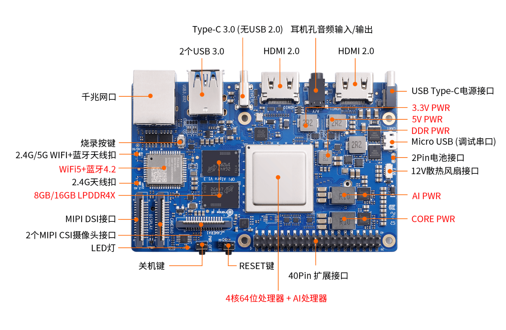
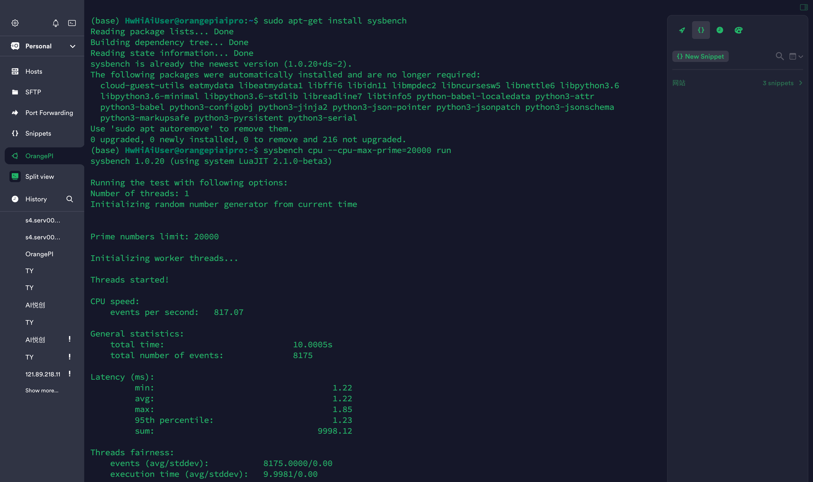
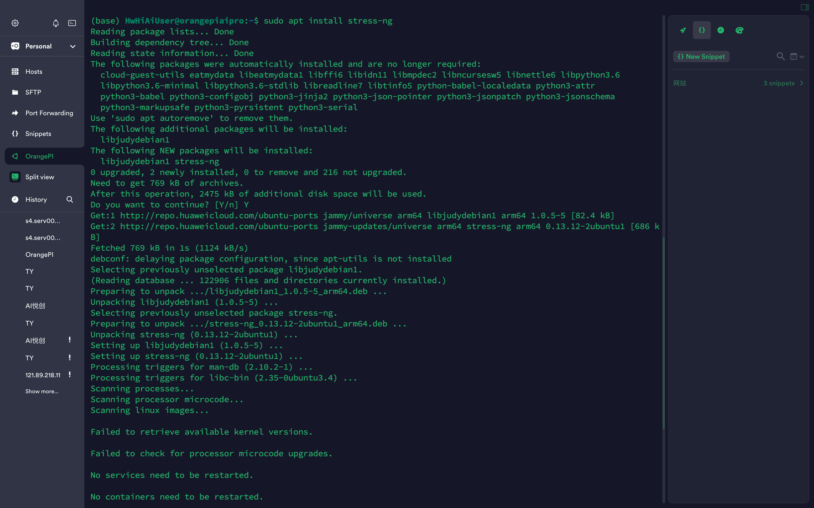

## 0. 前言

你好，我是悦创。

今天受邀测评 Orange Pi AIpro开发板，我将准备用这个测试简单的代码来看看这块开发版的性能体验。

分别从：Sysbench、Stress-ng、PyPerformance、RPi.GPIO Benchmark、Geekbench 等方面来测试和分析结果。

下面就是我收到的开发板子：


香橙派 AIpro 启动后支持用户通过**远程登录模式**或者**本机显示模式**登录开发板推理任务，此处可根据两种模式所需的配件，自行选择其中一种模式准备相关硬件即可。

## 1. 设备介绍




## 2. 使用 VNC

1. 安装

```bash
sudo apt update
sudo apt install xfce4 xfce4-goodies
sudo apt install tightvncserver
```

安装语言包，不然会出错 `Fatal server error:could not open default font 'fixed’`

```bash
sudo apt-get install xfonts-base
```

2. 配置密码

```bash
vncserver
aiyc1234
```

3. 配置开机启动

```bash
mv ~/.vnc/xstartup ~/.vnc/xstartup.bak
vim ~/.vnc/xstartup
```

```bash
#!/bin/bash
xrdb $HOME/.Xresources
startxfce4 &
```

```bash
sudo chmod +x ~/.vnc/xstartup
```

4. 启动和关闭

    1. 启动

    ```bash
    vncserver
    ```

    2. 关闭

    ```bash
    vncserver -kill :1
    vncserver -kill :2
    ```

5. 连接

直接使用 VNC 软件连接即可。


6. 问题：focal vnc 灰屏

使用 ubuntu focal，vnc 登录灰屏幕。原因是 focal 默认图形界面是 gnome，和 ubuntu18、ubuntu16 配置不同。

解决办法：

```bash
sudo apt-get install gnome-panel gnome-settings-daemon metacity nautilus gnome-terminal
```

配置 vnc：

```bash
vim ~/.vnc/xstartup
```

添加以下内容：

```bash
#!/bin/bash
export $(dbus-launch)  # 主要是这句
export XKL_XMODMAP_DISABLE=1
unset SESSION_MANAGER
 
gnome-panel &
gnome-settings-daemon &
metacity &
nautilus &
gnome-terminal &
 
# [ -x /etc/vnc/xstartup ] && exec /etc/vnc/xstartup
# [ -r $HOME/.Xresources ] && xrdb $HOME/.Xresources
 
xsetroot -solid grey
vncconfig -iconic &
x-terminal-emulator -geometry 80x24+10+10 -ls -title "$VNCDESKTOP Desktop" &
gnome-session &
```

7. 重启 vnc

```bash
vncserver -kill :1
vncserver -kill :2
vncserver :1 -geometry 1536x864 
```

## 3. 开始测试

### 3.1 Sysbench

#### 3.1.1 简介

- 虽然 Sysbench 不是一个 Python 项目，但它是一个非常流行的多线程测试工具，可以测试 CPU、内存、文件 I/O 和数据库性能。
- 安装命令：`sudo apt-get install sysbench`
- 使用例子：`sysbench cpu --cpu-max-prime=20000 run` 来测试CPU性能。

#### 3.1.2 实际测试

1. 安装命令：

```bash
sudo apt-get update
sudo apt-get install sysbench
```

2. 测试 CPU 性能：

```bash
sysbench cpu --cpu-max-prime=20000 run
```

3. 结果观察：

- 注意观察输出中的 `total time`, `events per second` 和 `min/avg/max latency`。这些指标显示了 CPU 处理能力和响应时间。

我的实际输出如下：

```bash
(base) HwHiAiUser@orangepiaipro:~$ sysbench cpu --cpu-max-prime=20000 run
sysbench 1.0.20 (using system LuaJIT 2.1.0-beta3)

Running the test with following options:
Number of threads: 1
Initializing random number generator from current time


Prime numbers limit: 20000

Initializing worker threads...

Threads started!

CPU speed:
    events per second:   817.07

General statistics:
    total time:                          10.0005s
    total number of events:              8175

Latency (ms):
         min:                                    1.22
         avg:                                    1.22
         max:                                    1.85
         95th percentile:                        1.23
         sum:                                 9998.12

Threads fairness:
    events (avg/stddev):           8175.0000/0.00
    execution time (avg/stddev):   9.9981/0.00
```

操作截图：



#### 3.1.3 评价

我们可以提取一些关键信息来评估您的香橙派（Orange Pi AI Pro）的 CPU 性能：

1. **测试配置**：
   - **线程数量**：1
   - **质数上限**：20000
   - 测试使用单线程计算到 20000 的质数，这是一个典型的 CPU 密集型任务，用来评估处理器的计算能力。

2. **性能结果**：
   - **事件每秒**：817.07
     - 这个数值表示 CPU 每秒可以处理的事件数量，也就是每秒完成了 817 次计算任务。这个数值越高，表示 CPU 的处理速度越快。
   - **总时间**：10.0005 秒
     - 测试运行了总共 10 秒，这是 Sysbench 默认的测试时间。
   - **总事件数量**：8175
     - 在 10 秒内，系统完成了 8175 次计算任务。

3. **延迟（Latency）**：
   - **最小延迟**：1.22毫秒
   - **平均延迟**：1.22毫秒
   - **最大延迟**：1.85毫秒
   - **95th 百分位延迟**：1.23毫秒
     - **<span style="color:orange">延迟指的是完成一次计算所需要的时间。这里的延迟非常低，说明 CPU 响应速度快，能够迅速处理计算任务。最大延迟略高，可能是由于偶发的系统调度或其他非 CPU 密集型进程的干扰。</span>**

4. **线程公平性**：
   - **<span style="color:orange">平均事件数量和执行时间的标准差都是 0，这表明在单线程测试中，CPU 的表现非常一致，没有显著的波动。</span>**

**评价**：

- 根据测试结果，OrangePi 设备在处理单线程计算密集型任务时表现良好，具有快速的处理速度和低延迟。这表明对于不涉及高并发的任务，OrangePi 设备能够提供稳定的性能。
- 如果应用场景包括更多并发处理或者更高的计算需求，我建议进行多线程的 Sysbench 测试，这可以提供更多关于 CPU 在高负载下表现的信息。「有需要测试方法的，评论区交流」

根据这些结果，如果我们使用场景主要涉及单线程计算任务，这款设备应该能够满足基本需求。对于更复杂或需求更高的场景，考虑进行更多样化的测试以全面评估性能。

### 3.2 Stress-ng

#### 3.2.1 简介

- Stress-ng 同样不是 Python 工具，但它能够对系统进行压力测试，涵盖超过 240 种测试方式。它可以用来测试 CPU、内存以及其他系统组件。
- 安装命令：`sudo apt install stress-ng`
- 使用例子：`stress-ng --cpu 4 --io 2 --vm 2 --vm-bytes 128M --timeout 10s` 来进行综合压力测试。

#### 3.2.2 实际测试

1. 安装命令：

```bash
sudo apt install stress-ng
```

2. 运行综合压力测试：

```bash
stress-ng --cpu 4 --io 2 --vm 2 --vm-bytes 128M --timeout 10s
```

3. 结果观察：

- 结果会显示每种资源的测试统计，包括处理速度和错误数。注意系统的稳定性和是否有过热或重启的现象。

我的实际输出如下：

```bash
# [!code focus:5]
(base) HwHiAiUser@orangepiaipro:~$ stress-ng --cpu 4 --io 2 --vm 2 --vm-bytes 128M --timeout 10s
stress-ng: info:  [11400] setting to a 10 second run per stressor
stress-ng: info:  [11400] dispatching hogs: 4 cpu, 2 io, 2 vm
stress-ng: info:  [11400] successful run completed in 10.20s
(base) HwHiAiUser@orangepiaipro:~$ stress-ng --cpu 4 --io 2 --vm 2 --vm-bytes 128M --timeout 10s
stress-ng: info:  [11417] setting to a 10 second run per stressor
stress-ng: info:  [11417] dispatching hogs: 4 cpu, 2 io, 2 vm
stress-ng: info:  [11417] successful run completed in 10.14s
(base) HwHiAiUser@orangepiaipro:~$ stress-ng --cpu 4 --io 2 --vm 2 --vm-bytes 128M --timeout 10s
stress-ng: info:  [11430] setting to a 10 second run per stressor 
stress-ng: info:  [11430] dispatching hogs: 4 cpu, 2 io, 2 vm
stress-ng: info:  [11430] successful run completed in 10.15s
(base) HwHiAiUser@orangepiaipro:~$ 
```

操作截图：



#### 3.2.3 评价

上面我运行了 `stress-ng` 测试，是在同时对香橙派的 CPU、IO（输入/输出）和虚拟内存（VM）进行压力测试。

1. 测试参数解析：

- **CPU：** 使用了 4 个压力测试线程，这意味着同时启动了 4 个线程来尽可能多地占用 CPU 资源。
- **IO：** 启动了 2 个线程进行磁盘 I/O 操作，这可能包括对文件的读写。
- **VM：** 启动了 2 个线程，每个线程使用 128MB 的内存来执行内存压力测试。

2. 测试结果：

- 所有三次测试均在约 10 秒后完成，显示为 `10.20s`, `10.14s`, 和 `10.15s`。这表明香橙派在持续的负载下表现出相对稳定的性能。

3. 性能评价：

    1. **稳定性：**

        香橙派在三次测试中表现出良好的稳定性。持续时间的微小差异（最长10.20秒，最短10.14秒）表明即使在较高负载下，性能也保持一致。

    2. **响应时间：**

        完成时间接近设定的10秒，说明系统能够在预定时间内有效管理和完成任务。完成时间略长于10秒可能是由于系统调度或者在执行结束时清理资源所需的额外时间。

    3. **系统负载承受能力：**

        通过此测试，我们可以看出，香橙派能够同时处理较大的 CPU 和内存负载，以及进行 I/O 操作，而没有出现崩溃或重大错误，这是对其多任务处理能力的一个积极指标。

    4. 看到这里你肯定在想更大的负载测试命令怎么写呢？我这里也为你提供了一下：

        ```bash
        stress-ng --cpu 8 --io 4 --vm 4 --vm-bytes 256M --hdd 2 --timeout 60s
        ```

        - 参数解释：
            - **`--cpu 8`**: 使用 8 个线程执行 CPU 压力测试，这会更加强烈地测试 CPU 的处理能力。
            - **`--io 4`**: 使用 4 个线程进行 IO 操作，增加对文件系统的压力。
            - **`--vm 4 --vm-bytes 256M`**: 每个 VM 线程尝试使用 256MB 内存，共 1GB 内存，增加内存使用和管理的压力。
            - **`--hdd 2`**: 进行两个磁盘写入线程，以测试磁盘的写入速度和稳定性。
            - **`--timeout 60s`**: 设置测试运行时间为 60 秒，较长的测试时间可以更全面地评估香橙派（OrangePi）在持续高负载下的性能表现。

4. 建议：

    - **监控温度和功耗、稳定性：** 在进行此类测试时，建议监控设备的温度和电源使用情况，以确保没有过热或电源不足的问题发生。并且在增加测试负载的时候，可能会导致香橙派温度升高。我们需要确保良好的散热措施，并密切观察是否有性能下降或系统不稳定的迹象。

        > 我在测试的时候，排插借口部分，就有些**过热**。不仅仅要注意用电安全，还要注意运行状况等。机身因为有散热风扇的存在，所以整体温度还好，但是如果再高估计就不行了。

    - **长时间运行测试：** 考虑长时间运行测试（如数小时），观察在长期高负载下香橙派的表现，检查是否有性能下降或稳定性问题。
    - **电源要求**：确保使用足够的电源供应，因为高负载可能增加电力消耗。
    - **数据安全**：高强度的磁盘写入测试可能对 SD 卡寿命产生影响，如果是在生产环境中使用，需要谨慎进行。

    - **比较不同配置：** 如果可能，试着改变压力测试的配置（如增加内存用量，增加CPU或IO压力测试的线程数），这可以帮助了解在不同负载下设备的性能极限。

总的来说香橙派在这项基准测试中表现良好，没有表现出性能问题，这表明香橙派可以处理相当复杂的任务和压力。如果我的粉丝有兴趣，可以查看你们自己的系统日志和硬件监控数据。

### 3.3 PyPerformance

#### 3.3.1 简介

PyPerformance 是一个 Python 基准测试套件，用于测量 Python 实现的性能。虽然它主要是测试 Python 解释器的性能，但也间接反映了运行它的硬件性能。

安装命令：`python3 -m pip install pyperformance`

运行测试：`pyperformance run -b [benchmark]`

#### 3.3.2 实际测试

1. 安装命令：

```bash
python3 -m pip install pyperformance
```

2. 运行 Python 性能测试：

```bash
pyperformance run --benchmarks all
```

3. 结果观察：

测试完成后，将生成一份报告，显示不同测试的运行时间和比较。这有助于评估 Python 环境在当前硬件上的执行效率。

这个测试需要非常久，需要你有耐心。我测试了将近 3h 左右（预估），我一开始也没想到会这么久。

```bash {15-16}
[74/74] xml_etree...
# /home/HwHiAiUser/venv/cpython3.9-bafaf170d952-compat-af96b9431081/bin/python -u /home/HwHiAiUser/.local/lib/python3.9/site-packages/pyperformance/data-files/benchmarks/bm_xml_etree/run_benchmark.py --output /tmp/tmpl3ifzqoj --inherit-environ PYPERFORMANCE_RUNID
.....................
xml_etree_parse: Mean +- std dev: 575 ms +- 4 ms
.....................
xml_etree_iterparse: Mean +- std dev: 460 ms +- 5 ms
.....................
xml_etree_generate: Mean +- std dev: 421 ms +- 6 ms
.....................
xml_etree_process: Mean +- std dev: 340 ms +- 9 ms
# [!code focus:50]
Performance version: 1.11.0
Report on Linux-5.10.0+-aarch64-with-glibc2.35
Number of logical CPUs: 4
Start date: 2024-06-04 19:12:13.216928
End date: 2024-06-04 22:09:04.695813

### 2to3 ###
Mean +- std dev: 1.34 sec +- 0.00 sec

### async_generators ###
Mean +- std dev: 1.52 sec +- 0.02 sec

### async_tree_none ###
Mean +- std dev: 3.18 sec +- 0.16 sec

### async_tree_cpu_io_mixed ###
Mean +- std dev: 4.32 sec +- 0.16 sec

...
...
...

### unpickle_list ###
Mean +- std dev: 15.0 us +- 0.1 us

### unpickle_pure_python ###
Mean +- std dev: 1.53 ms +- 0.01 ms

### xml_etree_parse ###
Mean +- std dev: 575 ms +- 4 ms

### xml_etree_iterparse ###
Mean +- std dev: 460 ms +- 5 ms

### xml_etree_generate ###
Mean +- std dev: 421 ms +- 6 ms

### xml_etree_process ###
Mean +- std dev: 340 ms +- 9 ms
```

#### 3.3.3 评价

从上面的 PyPerformance 测试结果中，我们可以观察到一系列不同类型的 Python 任务及其执行时间，这有助于我们评估香橙派「OrangePi AI Pro」的性能特征。这些测试结果覆盖了从 I/O 操作到 CPU 密集型任务的各种场景，以及不同的 Python 功能，如异步编程、数据处理和加密等。

1. **总体分析：**

    1. **CPU 密集型任务：**
       - 例如，`nbody`, `fannkuch`, `pidigits`，这些涉及大量数学计算和算法逻辑，执行时间在几百毫秒到几秒钟之间。香橙派在处理这些任务时的表现中等偏上，表明其对于教育和一般编程任务足够强大。


    2. **内存和数据处理：**
       - 测试如`json_dumps`, `pickle`, `unpickle` 显示较低的延迟（微秒级到毫秒级），这说明香橙派处理较小数据量的序列化和反序列化操作是高效的。


    3. **I/O操作：**
       - `asyncio_tcp`, `asyncio_tcp_ssl`, `asyncio_websockets` 展示了香橙派处理网络 I/O 的能力。SSL连接较普通TCP连接耗时更长，这可能是由于加密解密操作增加了额外的计算负担。


    4. **异步编程：**
       - 测试结果如 `async_generators`, `async_tree_none`, `async_tree_cpu_io_mixed` 表示在处理异步编程时，香橙派可以有效地处理并发任务，尽管在混合型任务中耗时较长。


    5. **文件和文本处理：**
       - `chameleon`, `genshi_text`, `html5lib` 等测试涉及HTML和文本的解析，执行速度较快，显示香橙派能够有效处理模板渲染和HTML解析任务。


    6. **科学计算和数值分析：**
       - `scimark` 系列（如 `scimark_fft`, `scimark_lu` 等）反映出香橙派在执行科学计算基准测试时的表现。这些测试通常需要较好的CPU和内存性能，结果显示香橙派在此类应用中的适用性较为有限，更适合教育和入门级科学项目。


2. **结论：**

香橙派在您的测试中表现出了处理各种任务的能力，尤其是在I/O操作、轻量级数据处理和一些网络通信任务中表现良好。对于更复杂的科学计算和高密度的CPU任务，香橙派的性能可能会受限，但仍足以支持教育和一般编程用途。对于预算有限且空间受限的环境，香橙派依然是一个极具价值的选择。

根据这些结果，您可以根据实际应用需求进一步优化或选择合适的香橙派模型，或者考虑适当的性能优化策略，如代码优化、使用更轻量级的库等措施。


欢迎关注我公众号：AI悦创，有更多更好玩的等你发现！

::: details 公众号：AI悦创【二维码】


:::

::: info AI悦创·编程一对一

AI悦创·推出辅导班啦，包括「Python 语言辅导班、C++ 辅导班、java 辅导班、算法/数据结构辅导班、少儿编程、pygame 游戏开发、Linux、Web 全栈」，全部都是一对一教学：一对一辅导 + 一对一答疑 + 布置作业 + 项目实践等。当然，还有线下线上摄影课程、Photoshop、Premiere 一对一教学、QQ、微信在线，随时响应！微信：Jiabcdefh

C++ 信息奥赛题解，长期更新！长期招收一对一中小学信息奥赛集训，莆田、厦门地区有机会线下上门，其他地区线上。微信：Jiabcdefh

方法一：[QQ](http://wpa.qq.com/msgrd?v=3&uin=1432803776&site=qq&menu=yes)

方法二：微信：Jiabcdefh

:::

